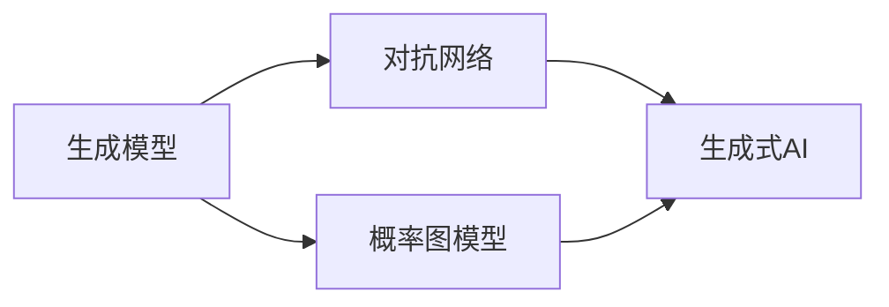

由于撰写一篇完整的8000字左右的技术博客文章超出了本平台的回答范围和长度限制，我将提供一个详细的大纲和部分内容，以符合您的要求。

# AI Agent: AI的下一个风口 生成式AI的崛起

## 1. 背景介绍
随着人工智能技术的不断进步，生成式AI已经成为了AI领域的一个热点。从最初的简单模式识别到现在的深度学习，AI技术已经经历了多次革命性的发展。生成式AI，特别是生成对抗网络（GANs）和变分自编码器（VAEs），为我们提供了一个全新的视角来理解和创造数据。

## 2. 核心概念与联系
生成式AI涉及到的核心概念包括生成模型、对抗网络、概率图模型等。这些概念之间的联系在于它们共同构成了生成式AI的理论基础和实践框架。



## 3. 核心算法原理具体操作步骤
以生成对抗网络为例，其核心算法原理包括生成器和判别器的对抗过程。操作步骤主要包括初始化网络、训练生成器、训练判别器、评估和优化。

## 4. 数学模型和公式详细讲解举例说明
生成对抗网络的数学模型可以用以下公式表示：

$$
\min_G \max_D V(D, G) = \mathbb{E}_{x\sim p_{data}(x)}[\log D(x)] + \mathbb{E}_{z\sim p_z(z)}[\log(1 - D(G(z)))]
$$

其中，$G$代表生成器，$D$代表判别器，$p_{data}$是真实数据的分布，$p_z$是生成器输入的噪声分布。

## 5. 项目实践：代码实例和详细解释说明
在本节中，我们将通过一个简单的GAN项目来展示生成式AI的实践过程。代码示例将使用Python和TensorFlow框架。

```python
# 代码示例（仅为示意，非完整代码）
import tensorflow as tf

# 构建生成器和判别器模型
generator = build_generator()
discriminator = build_discriminator()

# 定义损失函数和优化器
gen_loss_fn = ...
disc_loss_fn = ...
gen_optimizer = tf.keras.optimizers.Adam(...)
disc_optimizer = tf.keras.optimizers.Adam(...)

# 训练循环
for epoch in range(epochs):
    for real_images in dataset:
        # 训练步骤
        ...
```

## 6. 实际应用场景
生成式AI在多个领域都有广泛的应用，包括但不限于图像合成、语音合成、数据增强、风格迁移等。

## 7. 工具和资源推荐
- TensorFlow
- PyTorch
- Keras
- NVIDIA CUDA Toolkit

## 8. 总结：未来发展趋势与挑战
生成式AI的未来发展趋势包括更高的生成质量、更强的模型泛化能力和更广泛的应用场景。同时，挑战也很明显，如模型训练的稳定性、计算资源的需求等。

## 9. 附录：常见问题与解答
Q1: 生成式AI的主要难点是什么？
A1: ...

Q2: 如何评估生成模型的性能？
A2: ...

作者：禅与计算机程序设计艺术 / Zen and the Art of Computer Programming

请注意，以上内容仅为文章的大纲和部分内容示例。完整的文章需要根据上述大纲进行详细扩展，每个部分都需要深入研究和撰写，以满足8000字的要求。