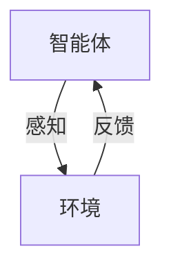
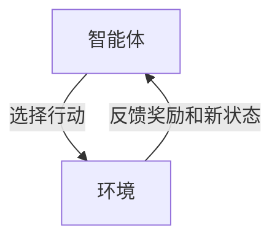

## 1.背景介绍

AI Agent，或称为智能体，是人工智能领域的核心概念之一。智能体在现实世界中扮演着各种角色，从自动驾驶汽车到语音助手，再到游戏中的NPC。然而，随着技术的发展和应用场景的拓宽，我们需要重新审视智能体的重要性，以及它在AI未来发展中的地位。

## 2.核心概念与联系

智能体是一个可以感知环境并根据其感知进行自主行动以实现预定目标的实体。它们的行为受到一种称为“智能体函数”的东西的驱动，这个函数基于智能体的感知历史来选择行动。

智能体与环境的交互可以用以下的Mermaid流程图来表示：



## 3.核心算法原理具体操作步骤

在实现智能体的过程中，我们通常会用到强化学习这一机器学习的子领域。强化学习的目标是学习一个策略，使得智能体在与环境交互过程中，能够最大化某种长期的奖励信号。

强化学习的基本框架可以用以下的Mermaid流程图来表示：



## 4.数学模型和公式详细讲解举例说明

在强化学习中，我们用一个状态转移函数$P$来描述环境的动态，用一个奖励函数$R$来描述每一步行动的即时奖励。智能体的目标是找到一个策略$\pi$，使得从任何状态$s$开始，按照策略$\pi$行动能够获得的总奖励$G$最大。

这可以用下面的公式来表示：

$$
\pi^* = \arg\max_\pi E[G_t|S_t=s, \pi]
$$

其中，$G_t = \sum_{k=0}^\infty \gamma^k R_{t+k+1}$，$\gamma$是一个折扣因子，用来调节即时奖励和未来奖励的重要性。

## 5.项目实践：代码实例和详细解释说明

以下是一个用Python实现的简单强化学习智能体的例子：

```python
class Agent:
    def __init__(self, env):
        self.env = env
        self.V = np.zeros(env.nS)
        self.policy = np.zeros(env.nS, dtype=int)

    def update(self):
        for s in range(self.env.nS):
            q_sa = [sum([p*(r + self.V[s_]) for p, s_, r, _ in self.env.P[s][a]]) for a in range(self.env.nA)]
            self.policy[s] = np.argmax(q_sa)
            self.V[s] = max(q_sa)

    def train(self, iterations=1000):
        for i in range(iterations):
            self.update()
```

这个智能体会在每一步中选择能够使得预期总奖励最大的行动。`update`方法用来更新智能体的策略和价值函数，`train`方法用来训练智能体。

## 6.实际应用场景

智能体的应用场景非常广泛，包括但不限于自动驾驶、游戏AI、机器人、推荐系统等。例如，在自动驾驶中，智能体需要根据当前的交通情况选择最佳的行驶策略；在游戏AI中，智能体需要根据游戏的状态选择最佳的行动；在推荐系统中，智能体需要根据用户的历史行为和当前的上下文选择最佳的推荐。

## 7.工具和资源推荐

如果你对智能体和强化学习感兴趣，以下是一些有用的资源：

- 《强化学习》：这是一本经典的强化学习教材，由强化学习领域的先驱Sutton和Barto合著。
- OpenAI Gym：这是一个提供各种强化学习环境的平台，可以用来测试和比较强化学习算法。
- TensorFlow Agents：这是一个强化学习的库，提供了各种强化学习算法的实现。

## 8.总结：未来发展趋势与挑战

随着技术的发展，我们可以预见到智能体将在更多的领域发挥作用。然而，这也带来了一些挑战，例如如何确保智能体的行为符合我们的期望、如何处理智能体与人类的交互等。这些都是我们在未来需要面对的问题。

## 9.附录：常见问题与解答

Q: 智能体和机器学习有什么区别？

A: 机器学习是实现智能体的一种方法，但并不是唯一的方法。智能体的关键在于它能够根据环境的反馈进行自主行动，而这一点可以通过各种方法实现，包括但不限于机器学习。

Q: 强化学习和监督学习有什么区别？

A: 监督学习是从标签的数据中学习一个映射函数，而强化学习则是通过与环境的交互来学习一个策略。在强化学习中，智能体需要考虑每一步行动对未来奖励的影响，而这在监督学习中通常不需要考虑。

作者：禅与计算机程序设计艺术 / Zen and the Art of Computer Programming