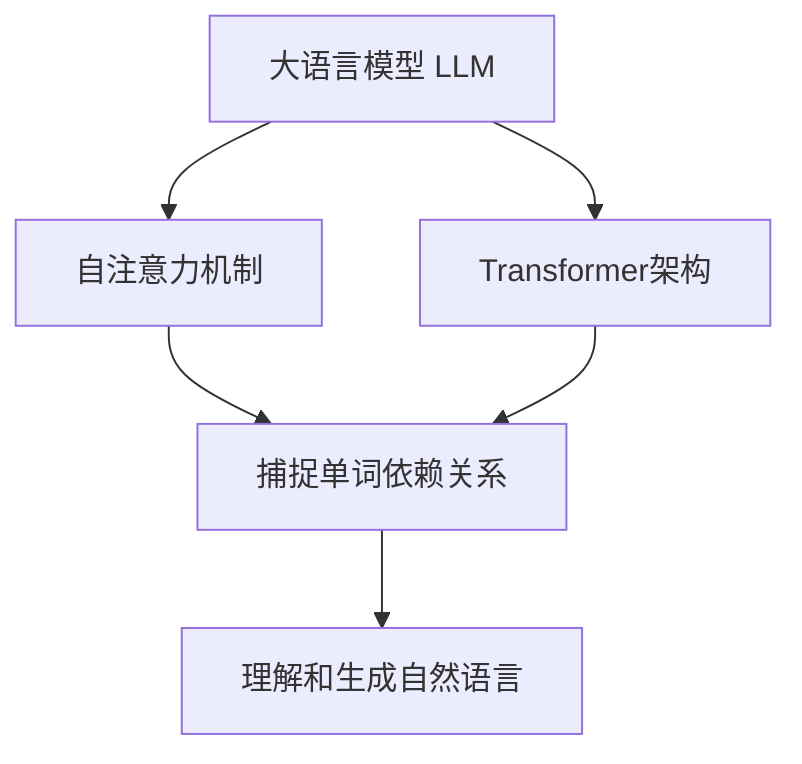
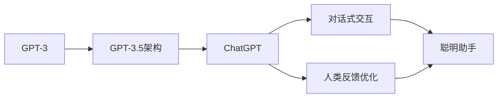
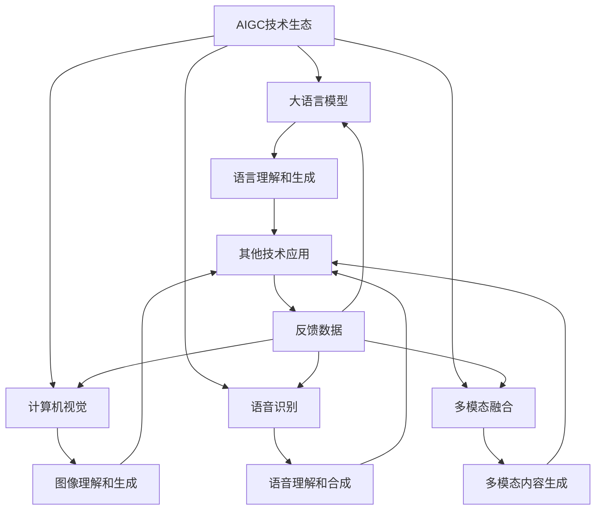
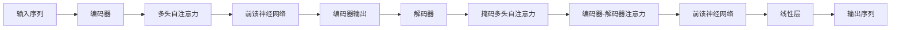

# AIGC从入门到实战：白也诗无敌，飘然思不群：ChatGPT，博学、"聪明"的好助手

## 1.背景介绍

### 1.1 人工智能的崛起

人工智能(Artificial Intelligence, AI)作为一门新兴的交叉学科,已经成为当代科技发展的核心驱动力。近年来,AI技术在各个领域的应用日益广泛,给人类社会带来了巨大的变革。其中,以大语言模型(Large Language Model, LLM)为代表的人工智能生成式内容(AIGC)技术,正在引领着人工智能的新浪潮。

### 1.2 AIGC的兴起

AIGC是指利用人工智能技术生成文本、图像、音频、视频等各种形式的内容。作为人工智能技术的一个重要分支,AIGC已经在内容创作、营销、教育、娱乐等多个领域展现出了巨大的潜力。其中,以ChatGPT为代表的大语言模型,正在引领着AIGC技术的发展,成为了人工智能时代的"聪明"助手。

### 1.3 ChatGPT的崛起

ChatGPT是一款由OpenAI公司开发的基于GPT-3.5架构的对话式人工智能助手。自2022年11月推出以来,ChatGPT凭借其强大的自然语言处理能力、广博的知识储备和出色的交互体验,迅速在全球范围内引起了热议。它不仅可以回答各种问题、撰写文章、编写代码,甚至还能进行创意写作和辩论,被誉为"博学、聪明"的AI助手。

## 2.核心概念与联系

### 2.1 大语言模型(LLM)

大语言模型是AIGC技术的核心,它是一种基于深度学习的自然语言处理(NLP)模型。通过在海量文本数据上进行训练,LLM可以学习到人类语言的语法、语义和上下文信息,从而具备理解和生成自然语言的能力。

LLM的核心思想是利用自注意力(Self-Attention)机制和transformer架构,捕捉输入序列中单词之间的长距离依赖关系,从而更好地理解和生成上下文相关的自然语言。

### 2.2 GPT系列模型

GPT(Generative Pre-trained Transformer)是OpenAI公司开发的一系列大语言模型,其中GPT-3是目前最大的语言模型之一,拥有1750亿个参数。GPT系列模型采用了自回归(Autoregressive)的生成方式,通过预测下一个单词的概率分布,逐步生成自然语言序列。

ChatGPT是基于GPT-3.5架构训练而成的对话式人工智能助手,它不仅继承了GPT-3强大的语言生成能力,还通过对话式交互和人类反馈进行了进一步优化,使其更加"聪明"、更贴近人类交互方式。

### 2.3 AIGC技术生态

AIGC技术生态是一个由多种技术和应用组成的复杂系统。除了大语言模型之外,AIGC技术还包括计算机视觉、语音识别、多模态融合等多个领域。这些技术相互融合、相互促进,共同推动了AIGC技术的发展。

在AIGC技术生态中,大语言模型扮演着核心角色,为其他技术提供语言理解和生成的能力。同时,其他技术也为大语言模型提供了新的应用场景和数据来源,促进了模型的进一步发展。

## 3.核心算法原理具体操作步骤

### 3.1 transformer架构

transformer是大语言模型的核心架构,它完全基于注意力机制(Attention Mechanism)构建,不依赖于循环神经网络(RNN)和卷积神经网络(CNN)。transformer架构主要由编码器(Encoder)和解码器(Decoder)两部分组成。

1. **编码器(Encoder)**
   - 将输入序列(如文本)映射为一系列连续的向量表示
   - 利用多头自注意力机制捕捉输入序列中单词之间的依赖关系
   - 通过前馈神经网络进一步加工向量表示

2. **解码器(Decoder)**
   - 基于编码器的输出,生成目标序列(如翻译、摘要等)
   - 利用掩码多头自注意力机制捕捉已生成序列中单词的依赖关系
   - 利用编码器-解码器注意力机制关联输入序列和输出序列
   - 通过前馈神经网络和线性层生成下一个单词

### 3.2 自注意力机制

自注意力机制是transformer架构的核心,它允许模型在计算每个单词的表示时,关注输入序列中的所有其他单词,捕捉它们之间的依赖关系。

1. **计算查询(Query)、键(Key)和值(Value)向量**
   - 将输入序列中的每个单词映射为查询、键和值向量

2. **计算注意力分数**
   - 通过查询和键向量的点积,计算查询与每个键的相关性分数

3. **计算加权和**
   - 根据注意力分数,对值向量进行加权求和,得到注意力输出

4. **多头注意力**
   - 将注意力机制应用于不同的线性投影,捕捉不同的依赖关系
   - 将多个注意力输出进行拼接,形成最终的注意力表示

$$
\begin{aligned}
\text{Attention}(Q, K, V) &= \text{softmax}\left(\frac{QK^T}{\sqrt{d_k}}\right)V \\
\text{MultiHead}(Q, K, V) &= \text{Concat}(head_1, \ldots, head_h)W^O\\
\text{where}\ head_i &= \text{Attention}(QW_i^Q, KW_i^K, VW_i^V)
\end{aligned}
$$

其中$Q$、$K$、$V$分别表示查询、键和值向量,$d_k$是缩放因子,用于防止点积的值过大导致梯度饱和。$W_i^Q$、$W_i^K$、$W_i^V$和$W^O$是可学习的线性投影参数。

### 3.3 自回归语言模型

自回归语言模型是大语言模型生成自然语言序列的核心算法。它通过预测下一个单词的概率分布,逐步生成整个序列。

1. **输入编码**
   - 将输入序列(如上文)编码为向量表示

2. **序列生成**
   - 初始化解码器的起始状态
   - 对于每一个时间步:
     - 根据当前解码器状态和输入编码,计算下一个单词的概率分布
     - 从概率分布中采样一个单词,作为解码器的输入
     - 更新解码器状态

3. **结束生成**
   - 当生成特殊的结束符号或达到最大长度时,停止生成

$$
P(y_1, \ldots, y_T|x) = \prod_{t=1}^T P(y_t|y_1, \ldots, y_{t-1}, x)
$$

其中$x$表示输入序列,$y_1, \ldots, y_T$表示生成的目标序列。自回归语言模型通过最大化上式的对数似然,学习生成序列的条件概率分布。

## 4.数学模型和公式详细讲解举例说明

### 4.1 transformer模型

transformer模型是基于注意力机制构建的序列到序列(Seq2Seq)模型,主要用于机器翻译、文本摘要等任务。它包括编码器(Encoder)和解码器(Decoder)两个主要部分。

#### 4.1.1 编码器(Encoder)

编码器的主要作用是将输入序列$X=(x_1, x_2, \ldots, x_n)$映射为一系列连续的向量表示$\mathbf{H}=(\mathbf{h}_1, \mathbf{h}_2, \ldots, \mathbf{h}_n)$,其中$\mathbf{h}_i$是第$i$个单词的向量表示。

编码器由多个相同的层组成,每一层包括两个子层:多头自注意力机制(Multi-Head Attention)和前馈神经网络(Feed-Forward Neural Network)。

1. **多头自注意力机制**

   多头自注意力机制用于捕捉输入序列中单词之间的依赖关系。对于每个单词$x_i$,计算其与其他所有单词的注意力分数,并根据这些分数对其他单词的表示进行加权求和,得到$x_i$的注意力表示$\mathbf{z}_i$。

   $$
   \mathbf{z}_i = \text{Attention}(x_i, X, X) = \sum_{j=1}^n \alpha_{ij}(x_i, x_j)\mathbf{v}_j
   $$

   其中$\alpha_{ij}$是$x_i$对$x_j$的注意力分数,通过计算$x_i$和$x_j$的相似性得到;$\mathbf{v}_j$是$x_j$的值向量表示。

   为了捕捉不同的依赖关系,transformer使用了多头注意力机制,将注意力机制应用于不同的线性投影,然后将多个注意力输出进行拼接。

2. **前馈神经网络**

   前馈神经网络用于对注意力表示进行进一步加工和非线性变换,得到每个单词的最终编码表示$\mathbf{h}_i$。

   $$
   \mathbf{h}_i = \text{FFN}(\mathbf{z}_i) = \max(0, \mathbf{z}_iW_1 + b_1)W_2 + b_2
   $$

   其中$W_1$、$W_2$、$b_1$、$b_2$是可学习的参数,FFN是两层全连接网络,中间使用ReLU激活函数。

编码器的输出$\mathbf{H}=(\mathbf{h}_1, \mathbf{h}_2, \ldots, \mathbf{h}_n)$将被送入解码器进行序列生成。

#### 4.1.2 解码器(Decoder)

解码器的主要作用是基于编码器的输出$\mathbf{H}$和目标序列的部分前缀$Y_{\text{prefix}}=(y_1, y_2, \ldots, y_m)$,生成完整的目标序列$Y=(y_1, y_2, \ldots, y_T)$。

解码器也由多个相同的层组成,每一层包括三个子层:掩码多头自注意力机制(Masked Multi-Head Attention)、编码器-解码器注意力机制(Encoder-Decoder Attention)和前馈神经网络。

1. **掩码多头自注意力机制**

   掩码多头自注意力机制用于捕捉已生成序列中单词的依赖关系。与编码器的自注意力机制不同,它引入了掩码机制,确保每个单词的表示只依赖于该单词之前的单词,而不依赖于未来的单词。

   $$
   \mathbf{s}_i = \text{MaskedAttention}(y_i, Y_{\text{prefix}}, Y_{\text{prefix}})
   $$

2. **编码器-解码器注意力机制**

   编码器-解码器注