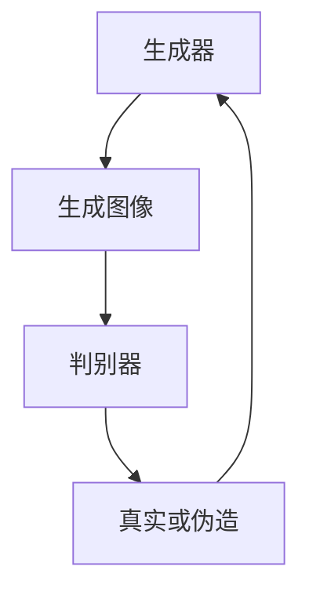

# AIGC从入门到实战：绘制美丽小姐姐的提示词写作技巧

## 1.背景介绍

在人工智能生成内容（AIGC）领域，生成美丽的图像尤其是绘制美丽小姐姐的图像，已经成为一个热门话题。无论是艺术家、设计师还是普通用户，都希望通过简单的提示词生成高质量的图像。本文将深入探讨如何编写有效的提示词，以便在AIGC系统中生成令人满意的美丽小姐姐图像。

## 2.核心概念与联系

### 2.1 AIGC简介

AIGC（Artificial Intelligence Generated Content）是指利用人工智能技术生成各种形式的内容，包括文本、图像、音频和视频。AIGC的核心技术包括深度学习、生成对抗网络（GANs）和变分自编码器（VAEs）等。

### 2.2 提示词的重要性

提示词是用户与AIGC系统交互的主要方式。有效的提示词可以显著提高生成内容的质量和相关性。提示词的编写需要考虑语义、上下文和目标图像的特征。

### 2.3 生成对抗网络（GANs）

GANs是AIGC中最常用的技术之一。它由生成器和判别器两个神经网络组成，生成器负责生成图像，判别器负责判断图像的真实性。两者通过对抗训练不断提升生成图像的质量。



## 3.核心算法原理具体操作步骤

### 3.1 数据预处理

在生成美丽小姐姐图像之前，需要对数据进行预处理。包括图像的归一化、数据增强和标签处理。

### 3.2 模型训练

使用预处理后的数据训练GANs模型。训练过程中需要调整超参数，如学习率、批量大小等，以获得最佳效果。

### 3.3 提示词编写

编写提示词时，需要考虑以下几点：
- 语义清晰：提示词应明确描述目标图像的特征。
- 上下文相关：提示词应与目标图像的上下文相关。
- 细节描述：提示词应包含足够的细节，以便生成高质量的图像。

### 3.4 图像生成

使用编写的提示词输入到训练好的GANs模型中，生成美丽小姐姐的图像。

## 4.数学模型和公式详细讲解举例说明

### 4.1 生成对抗网络的数学模型

GANs的目标是通过生成器 $G$ 和判别器 $D$ 的对抗训练，使生成器生成的图像尽可能接近真实图像。其损失函数定义如下：

$$
\min_G \max_D V(D, G) = \mathbb{E}_{x \sim p_{data}(x)}[\log D(x)] + \mathbb{E}_{z \sim p_z(z)}[\log(1 - D(G(z)))]
$$

其中，$x$ 是真实图像，$z$ 是随机噪声，$G(z)$ 是生成图像，$D(x)$ 是判别器对真实图像的判断，$D(G(z))$ 是判别器对生成图像的判断。

### 4.2 提示词的向量化表示

提示词需要转换为向量表示，以便输入到模型中。常用的方法是使用词嵌入（Word Embedding）技术，如Word2Vec或GloVe。

$$
\text{Embedding}(w) = \mathbf{v}_w
$$

其中，$w$ 是提示词，$\mathbf{v}_w$ 是其对应的向量表示。

## 5.项目实践：代码实例和详细解释说明

### 5.1 数据预处理代码示例

```python
import tensorflow as tf
from tensorflow.keras.preprocessing.image import ImageDataGenerator

# 数据增强
datagen = ImageDataGenerator(
    rescale=1./255,
    rotation_range=20,
    width_shift_range=0.2,
    height_shift_range=0.2,
    shear_range=0.2,
    zoom_range=0.2,
    horizontal_flip=True,
    fill_mode='nearest'
)

# 加载数据
train_data = datagen.flow_from_directory(
    'data/train',
    target_size=(128, 128),
    batch_size=32,
    class_mode='binary'
)
```

### 5.2 模型训练代码示例

```python
from tensorflow.keras.models import Sequential
from tensorflow.keras.layers import Dense, Conv2D, Flatten

# 构建生成器
generator = Sequential([
    Dense(128, activation='relu', input_dim=100),
    Dense(256, activation='relu'),
    Dense(512, activation='relu'),
    Dense(1024, activation='relu'),
    Dense(128*128*3, activation='tanh'),
    Reshape((128, 128, 3))
])

# 构建判别器
discriminator = Sequential([
    Conv2D(64, (3, 3), activation='relu', input_shape=(128, 128, 3)),
    Flatten(),
    Dense(1, activation='sigmoid')
])

# 编译模型
discriminator.compile(optimizer='adam', loss='binary_crossentropy')
discriminator.trainable = False

# 构建GANs
gan = Sequential([generator, discriminator])
gan.compile(optimizer='adam', loss='binary_crossentropy')

# 训练模型
for epoch in range(epochs):
    for batch in range(batches):
        noise = np.random.normal(0, 1, (batch_size, 100))
        generated_images = generator.predict(noise)
        real_images = train_data.next()
        labels_real = np.ones((batch_size, 1))
        labels_fake = np.zeros((batch_size, 1))
        
        d_loss_real = discriminator.train_on_batch(real_images, labels_real)
        d_loss_fake = discriminator.train_on_batch(generated_images, labels_fake)
        
        noise = np.random.normal(0, 1, (batch_size, 100))
        g_loss = gan.train_on_batch(noise, labels_real)
        
    print(f'Epoch {epoch+1}/{epochs}, D Loss Real: {d_loss_real}, D Loss Fake: {d_loss_fake}, G Loss: {g_loss}')
```

### 5.3 提示词编写示例

```python
prompt = "A beautiful young lady with long flowing hair, wearing a red dress, standing in a garden with blooming flowers."
```

### 5.4 图像生成代码示例

```python
import numpy as np
from PIL import Image

# 生成图像
noise = np.random.normal(0, 1, (1, 100))
generated_image = generator.predict(noise)
generated_image = (generated_image * 127.5 + 127.5).astype(np.uint8)

# 显示图像
Image.fromarray(generated_image[0]).show()
```

## 6.实际应用场景

### 6.1 艺术创作

AIGC技术可以帮助艺术家快速生成灵感图像，进行艺术创作。

### 6.2 游戏设计

在游戏设计中，AIGC可以用于生成角色形象、场景和道具，提升游戏的视觉效果。

### 6.3 广告和营销

广告和营销领域可以利用AIGC生成吸引人的图像，提高广告效果和用户参与度。

## 7.工具和资源推荐

### 7.1 开源框架

- TensorFlow
- PyTorch
- Keras

### 7.2 数据集

- CelebA
- FFHQ
- Anime Faces Dataset

### 7.3 在线资源

- GitHub
- Kaggle
- Papers with Code

## 8.总结：未来发展趋势与挑战

AIGC技术在生成美丽小姐姐图像方面展现了巨大的潜力。然而，未来仍面临一些挑战，如生成图像的真实性、细节处理和多样性。随着技术的不断进步，AIGC将在更多领域得到应用，并带来更多创新和可能性。

## 9.附录：常见问题与解答

### 9.1 如何选择合适的提示词？

选择提示词时，应考虑目标图像的特征和上下文。提示词应尽量具体，包含足够的细节。

### 9.2 如何提高生成图像的质量？

提高生成图像质量的方法包括：使用更大的数据集、调整模型超参数、增加模型复杂度和进行更多的训练迭代。

### 9.3 如何处理生成图像中的瑕疵？

可以使用图像后处理技术，如图像修复和增强，来处理生成图像中的瑕疵。

---

作者：禅与计算机程序设计艺术 / Zen and the Art of Computer Programming