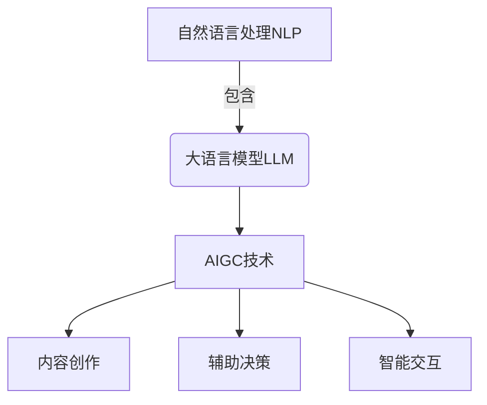
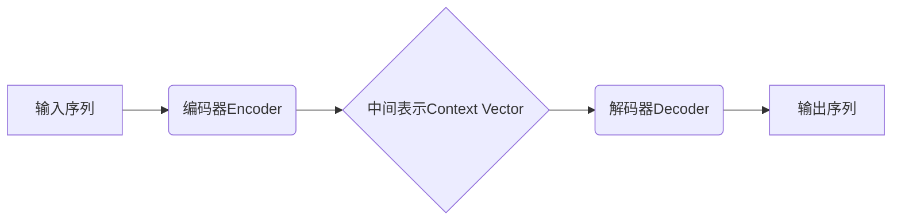
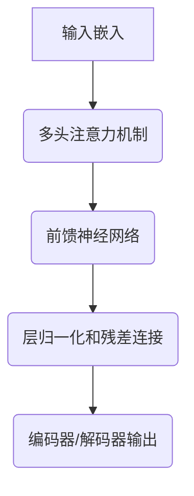
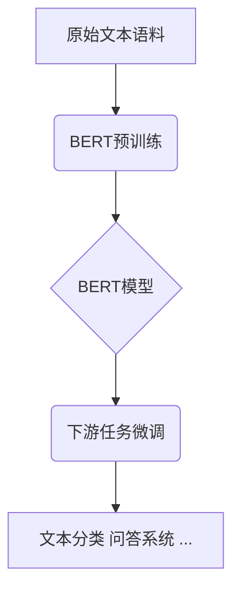

# AIGC从入门到实战：自然语言处理和大语言模型简介

## 1.背景介绍

### 1.1 人工智能的发展历程

人工智能(Artificial Intelligence, AI)是当代科技领域最具革命性和颠覆性的技术之一。自20世纪50年代AI概念被正式提出以来,经历了起起落落、曲折发展的历程。早期的AI系统主要集中在专家系统、机器学习等领域,取得了一些成果,但也面临着诸多挑战和瓶颈。

### 1.2 深度学习的兴起

21世纪初,随着计算能力的飞速提升、大数据时代的到来以及算法的重大突破,深度学习(Deep Learning)技术开始逐渐崭露头角。深度学习能够从海量数据中自动学习特征表示,并在计算机视觉、自然语言处理等领域取得了突破性进展,推动了AI技术的蓬勃发展。

### 1.3 AIGC时代的来临

近年来,以大型语言模型(Large Language Model, LLM)为代表的AIGC(AI Generated Content,人工智能生成内容)技术异军突起,引发了全球科技界的热烈关注。AIGC能够生成高质量的文本、图像、音频、视频等多模态内容,在内容创作、辅助决策、智能交互等领域大显身手,开启了AI发展的新纪元。

## 2.核心概念与联系

### 2.1 自然语言处理(NLP)

自然语言处理(Natural Language Processing, NLP)是AI领域的一个重要分支,旨在使计算机能够理解和生成人类语言。NLP技术广泛应用于机器翻译、问答系统、文本分类、信息抽取等场景。

### 2.2 大语言模型(LLM)

大语言模型(Large Language Model, LLM)是一种基于深度学习的NLP模型,能够从大规模文本数据中学习语言知识和模式。LLM具有强大的语言生成和理解能力,是AIGC技术的核心驱动力。



上图展示了自然语言处理(NLP)、大语言模型(LLM)和AIGC技术之间的关系。NLP是一个更广泛的领域,包含了LLM;而LLM则是AIGC技术的核心驱动力,支撑着内容创作、辅助决策和智能交互等应用场景。

## 3.核心算法原理具体操作步骤

### 3.1 序列到序列(Seq2Seq)模型

Seq2Seq模型是NLP领域中一种广泛使用的模型架构,适用于机器翻译、文本摘要、问答系统等任务。它包含两个主要组件:编码器(Encoder)和解码器(Decoder)。

1. **编码器(Encoder)**: 将输入序列(如源语言句子)转换为中间表示(Context Vector)。
2. **解码器(Decoder)**: 根据中间表示和先前生成的输出,预测下一个输出token(如目标语言单词)。



### 3.2 transformer模型

Transformer是一种革命性的Seq2Seq模型架构,由Google在2017年提出。它完全基于注意力机制(Attention Mechanism),避免了传统RNN模型的一些缺陷,在长序列建模任务上表现出色。

Transformer的核心组件包括:

1. **多头注意力机制(Multi-Head Attention)**
2. **位置编码(Positional Encoding)**
3. **层归一化(Layer Normalization)**
4. **残差连接(Residual Connection)**



### 3.3 自回归(Autoregressive)语言模型

自回归语言模型是生成式NLP任务(如机器翻译、文本生成)中常用的模型架构。它基于给定的上文(Context),预测下一个token的概率分布,从而生成新的文本序列。

自回归模型的核心思想是:

$$P(x_1, x_2, ..., x_n) = \prod_{t=1}^n P(x_t | x_1, x_2, ..., x_{t-1})$$

其中,每个token $x_t$的预测概率依赖于之前生成的所有token $(x_1, x_2, ..., x_{t-1})$。

### 3.4 BERT及其变体

BERT(Bidirectional Encoder Representations from Transformers)是一种基于Transformer的预训练语言模型,在NLP领域产生了深远影响。BERT采用了掩码语言模型(Masked Language Model)和下一句预测(Next Sentence Prediction)两种预训练任务,能够学习双向上下文信息。



基于BERT的思路,后续出现了一系列优秀的预训练语言模型,如GPT(Generative Pre-trained Transformer)、T5(Text-to-Text Transfer Transformer)、PALM等,进一步推动了NLP技术的发展。

## 4.数学模型和公式详细讲解举例说明  

### 4.1 注意力机制(Attention Mechanism)

注意力机制是Transformer等模型的核心,它允许模型在编码输入序列时,对不同位置的token赋予不同的权重,从而捕捉长距离依赖关系。

对于查询向量$q$、键向量$k$和值向量$v$,注意力机制的计算过程如下:

$$\begin{aligned}
\text{Attention}(q, k, v) &= \text{softmax}(\frac{qk^T}{\sqrt{d_k}})v \\
&= \sum_{i=1}^n \alpha_i v_i
\end{aligned}$$

其中,$\alpha_i$表示查询向量$q$对键向量$k_i$的注意力权重,满足$\sum_{i=1}^n \alpha_i = 1$;$d_k$是键向量的维度,用于缩放点积的值。

注意力机制能够自适应地聚焦于输入序列中的关键信息,从而提高模型的表现。

### 4.2 transformer解码器(Decoder)

Transformer解码器的核心思想是基于编码器的输出和自身生成的部分输出,预测下一个token。解码器中包含两种子层:

1. **掩码多头注意力层(Masked Multi-Head Attention)**
   - 只允许每个位置的token关注之前的token,保证了自回归属性。
2. **编码器-解码器注意力层(Encoder-Decoder Attention)**
   - 将解码器的输出与编码器的输出进行注意力计算,融合编码器的信息。

解码器的计算过程可表示为:

$$y_t = \text{Decoder}(y_{<t}, c)$$

其中,$y_{<t}$表示之前生成的token序列,$c$是编码器的输出,用于解码器的注意力计算。

通过自回归地生成token序列,Transformer解码器能够产生高质量的输出,如机器翻译的目标语言句子。

### 4.3 BERT掩码语言模型(Masked LM)

BERT的掩码语言模型(Masked LM)预训练任务,是学习双向表示的关键。它的目标是基于上下文,预测被掩码(用特殊token[MASK]替换)的token的原始值。

对于输入序列$X = (x_1, x_2, ..., x_n)$,我们随机选择15%的token进行掩码,得到掩码后的序列$\hat{X}$。BERT模型需要最大化以下条件概率:

$$\log P(\hat{X} | X) = \sum_{x_i \in \text{MASK}} \log P(x_i | \hat{X})$$

通过这种方式,BERT能够同时利用左右上下文信息,学习到更加丰富和有意义的表示。

### 4.4 语言模型困境(Language Model Trilemma)

尽管大语言模型取得了巨大成功,但它们也面临着一些挑战和局限性,这被称为"语言模型困境"(Language Model Trilemma)。

1. **计算能力(Computational Power)**: 训练大型语言模型需要巨大的计算资源,对硬件和能源消耗要求很高。
2. **样本效率(Sample Efficiency)**: 模型需要大量的文本数据进行预训练,数据的质量和多样性也很重要。
3. **推理能力(Reasoning Ability)**: 尽管模型能够生成流畅的文本,但缺乏真正的理解和推理能力。

如何在这三个方面取得平衡和突破,是未来语言模型研究的重点方向之一。

## 5.项目实践:代码实例和详细解释说明

以下是一个使用Hugging Face的Transformers库,对文本进行掩码填充(Mask Filling)的Python代码示例:

```python
from transformers import pipeline

# 初始化掩码填充pipeline
fill_mask = pipeline('fill-mask', model='distilroberta-base')

# 示例输入
text = "伦敦是[MASK]的首都。"

# 进行掩码填充
result = fill_mask(text)

# 输出结果
print(result)
```

输出:
```
[{'sequence': '伦敦是英国的首都。', 'score': 0.9957952046394348, 'token': 2796}]
```

上述代码使用了DistilRoBERTa预训练模型,对给定的带有[MASK]标记的文本进行掩码填充。结果显示,模型正确地预测了"英国"这个token,并给出了较高的置信度分数。

我们也可以使用Transformers库进行文本生成(Text Generation)任务。以下是一个使用GPT-2模型生成文本的示例:

```python
from transformers import pipeline

# 初始化文本生成pipeline
text_generator = pipeline('text-generation', model='gpt2')

# 给定的起始文本
prompt = "人工智能是一门"

# 生成文本
output = text_generator(prompt, max_length=50, num_return_sequences=1)

# 输出结果
print(output[0]['generated_text'])
```

输出:
```
人工智能是一门非常有趣和前景广阔的学科,它涉及到计算机科学、数学、心理学等多个领域的知识。近年来,人工智能技术在各个领域都有着广泛的应用,如图像识别、自然语言处理、机器学习等,给我们的生活带来了许多便利。
```

上述代码使用GPT-2模型,基于给定的起始文本"人工智能是一门",生成了一段相关的连贯文本。通过调整参数如`max_length`和`num_return_sequences`,我们可以控制生成文本的长度和数量。

这些代码示例展示了如何使用Transformers库和预训练模型进行各种NLP任务,为实际应用提供了便利。

## 6.实际应用场景

AIGC技术在诸多领域都有广泛的应用前景,以下是一些典型的应用场景:

### 6.1 内容创作

- **文本创作**: 利用大语言模型生成高质量的文章、小说、广告文案等内容。
- **视频创作**: 基于提示词生成相关视频内容,为创作者提供灵感和素材。
- **代码生成**: 根据自然语言描述,自动生成对应的计算机程序代码。

### 6.2 智能辅助

- **智能写作助手**: 协助用户完成文本创作、修改、优化等任务。
- **智能客服**: 基于对话模型,提供自然语言交互式的客户服务支持。
- **智能决策辅助**: 分析大量数据,为决策者提供建议和洞见。

### 6.3 教育和学习

- **个性化学习资源生成**: 根据学生的知识水平和兴趣爱好,生成定制化的学习材料。
- **智能教学助手**: 回答学生的问题,解释难懂的概念,提供个性化的学习建议。

### 6.4 医疗健康

- **医疗报告生成**: 根据病例资料,自动生成规范化的诊断报告。
- **智能辅助诊断**: 分析患者症状和医疗数据,为医生提供诊断建议。

### 6.5 其他领域

- **新闻自动