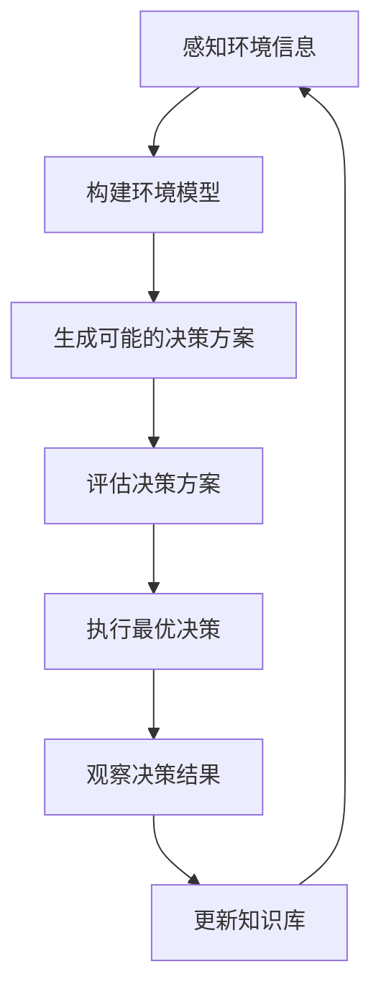

# AI人工智能 Agent：公共交通调度中智能体的应用

## 1.背景介绍

### 1.1 公共交通系统的重要性

现代社会中,公共交通系统扮演着至关重要的角色。它不仅为大众提供了便利的出行方式,也是城市可持续发展的关键因素之一。有效的公共交通系统可以缓解交通拥堵、减少空气污染、节省能源并提高生活质量。然而,随着城市人口的不断增长和出行需求的日益复杂,传统的公共交通调度方式已经无法满足日益增长的需求。

### 1.2 公共交通调度的挑战

公共交通调度是一项极具挑战的任务,需要平衡多种因素,包括乘客需求、车辆调度、线路规划、实时交通状况等。传统的调度方法通常依赖人工经验和简单的规则,难以处理复杂的动态环境和大量数据。此外,公共交通系统还面临着不确定性、突发事件和乘客行为的变化等问题,这些都增加了调度的难度。

### 1.3 人工智能在公共交通调度中的应用

人工智能(AI)技术为解决公共交通调度问题提供了新的机遇。智能体(Agent)作为人工智能的重要组成部分,具有感知环境、决策行动和学习能力,可以有效地处理复杂的动态环境和大量数据。通过将智能体应用于公共交通调度,我们可以实现更加智能化、实时化和个性化的调度策略,从而提高公共交通系统的效率和乘客体验。

## 2.核心概念与联系

### 2.1 智能体(Agent)

智能体是人工智能系统中的一个重要概念,它是一个感知环境、决策行动并与环境交互的自主实体。智能体通常具有以下几个关键特征:

1. **感知能力(Perception)**:智能体可以通过传感器获取环境信息,如交通状况、乘客需求等。
2. **决策能力(Decision Making)**:智能体可以基于感知到的环境信息和内部知识,做出相应的决策和行动计划。
3. **行动能力(Action)**:智能体可以根据决策执行相应的行动,如调度车辆、规划线路等。
4. **学习能力(Learning)**:智能体可以通过与环境的交互,不断优化决策策略和知识库,提高系统性能。

在公共交通调度中,智能体可以扮演调度决策中心的角色,感知实时交通状况和乘客需求,并做出相应的调度决策和行动计划。

### 2.2 多智能体系统(Multi-Agent System)

在复杂的公共交通系统中,单个智能体可能无法处理所有的决策问题。因此,我们需要引入多智能体系统(Multi-Agent System,MAS)的概念。多智能体系统由多个智能体组成,每个智能体负责特定的任务或决策,并通过协作和协调来实现整体目标。

在公共交通调度中,我们可以将系统分解为多个子系统,如车辆调度、线路规划、乘客服务等,每个子系统由一个或多个智能体组成。这些智能体需要相互协作,共享信息和资源,以实现整体的调度优化。

### 2.3 智能体与传统方法的区别

与传统的规则based或优化based的调度方法相比,基于智能体的方法具有以下优势:

1. **处理复杂动态环境**:智能体可以感知复杂的动态环境,并做出相应的决策和行动。
2. **学习和自适应能力**:智能体可以通过与环境的交互不断学习和优化决策策略,具有自适应能力。
3. **分布式决策**:多智能体系统可以实现分布式决策,提高系统的鲁棒性和可扩展性。
4. **个性化服务**:智能体可以根据个人偏好和需求提供个性化的调度服务。

然而,基于智能体的方法也面临一些挑战,如智能体之间的协调、决策的实时性和可解释性等,需要进一步的研究和探索。

## 3.核心算法原理具体操作步骤

在公共交通调度中,智能体需要根据实时的环境信息做出调度决策。这个过程可以概括为以下几个步骤:

### 3.1 感知环境信息

智能体首先需要通过各种传感器获取实时的环境信息,包括:

- 交通状况(拥堵情况、事故等)
- 车辆位置和状态(载客量、燃料等)
- 乘客需求(上车/下车位置、目的地等)
- 天气和其他外部条件

这些信息将作为智能体决策的输入。

### 3.2 构建环境模型

基于获取的环境信息,智能体需要构建一个环境模型,用于表示当前的交通状况和乘客需求。常用的环境模型包括:

- 交通网络模型(节点、边、权重等)
- 乘客需求模型(OD矩阵、时间分布等)
- 车辆模型(容量、速度、燃料等)

这些模型可以帮助智能体更好地理解和表示复杂的环境。

### 3.3 生成可能的决策方案

根据环境模型,智能体需要生成一系列可能的决策方案,如:

- 车辆调度方案(哪些车辆服务哪些乘客)
- 线路规划方案(车辆行驶路线)
- 时刻表调整方案(发车时间、频率等)

这些方案需要考虑多个目标,如缩短乘客等待时间、提高车辆利用率、减少运营成本等。

### 3.4 评估决策方案

对于每个可能的决策方案,智能体需要评估其性能和质量,通常使用一个评估函数(或多个评估指标)。评估函数可以包括:

- 乘客满意度(等待时间、拥挤程度等)
- 运营效率(车辆利用率、总行驶里程等)
- 成本和收益(燃料成本、票收等)

评估函数的设计对于获得高质量的决策方案至关重要。

### 3.5 执行最优决策

通过评估,智能体可以选择一个最优的决策方案执行。这个过程可能需要权衡不同的目标和约束,使用多目标优化或其他决策技术。

执行决策可能涉及向车辆、乘客和其他子系统发送指令,如调度命令、路线调整等。

### 3.6 观察决策结果

在执行决策后,智能体需要观察决策的实际结果,如乘客满意度、车辆利用率等。这些结果将作为反馈,用于评估当前决策策略的有效性。

### 3.7 更新知识库

根据决策结果的反馈,智能体可以更新其内部的知识库,包括:

- 优化决策策略参数
- 调整环境模型和评估函数
- 学习新的决策规则或模式

这个过程使得智能体可以不断改进其决策能力,适应环境的变化。

整个过程是一个闭环的反馈控制系统,智能体通过不断感知、决策、执行和学习,来优化公共交通调度的效果。

## 4.数学模型和公式详细讲解举例说明

在公共交通调度中,数学模型和公式扮演着重要的角色,可以帮助我们更好地理解和优化调度问题。下面我们将介绍一些常用的数学模型和公式。

### 4.1 交通网络模型

交通网络模型是表示公共交通系统的一种常用方法。它将城市的道路网络抽象为一个由节点(Node)和边(Edge)组成的图(Graph)结构。节点可以代表站点、路口或其他重要位置,而边则代表道路或公交线路。

我们可以使用邻接矩阵(Adjacency Matrix)或邻接表(Adjacency List)来表示交通网络。对于一个有 $n$ 个节点的网络,邻接矩阵 $A$ 是一个 $n \times n$ 的矩阵,其中 $A_{ij}$ 表示从节点 $i$ 到节点 $j$ 的边的权重(如距离或行驶时间)。如果没有直接的边相连,则 $A_{ij} = \infty$。

$$
A = \begin{bmatrix}
0 & w_{12} & w_{13} & \cdots & w_{1n} \\
w_{21} & 0 & w_{23} & \cdots & w_{2n} \\
\vdots & \vdots & \ddots & \ddots & \vdots \\
w_{n1} & w_{n2} & \cdots & \cdots & 0
\end{bmatrix}
$$

基于交通网络模型,我们可以使用图论算法(如最短路径算法、最小生成树算法等)来解决诸如线路规划、车辆调度等问题。

### 4.2 乘客需求模型

乘客需求模型描述了乘客的出行需求,通常使用起点(Origin)和终点(Destination)矩阵(OD矩阵)来表示。对于一个有 $n$ 个站点的网络,OD矩阵 $D$ 是一个 $n \times n$ 的矩阵,其中 $D_{ij}$ 表示从节点 $i$ 到节点 $j$ 的乘客需求量。

$$
D = \begin{bmatrix}
0 & d_{12} & d_{13} & \cdots & d_{1n} \\
d_{21} & 0 & d_{23} & \cdots & d_{2n} \\
\vdots & \vdots & \ddots & \ddots & \vdots \\
d_{n1} & d_{n2} & \cdots & \cdots & 0
\end{bmatrix}
$$

除了OD矩阵,乘客需求模型还可以包括乘客到达的时间分布、乘客偏好(如舒适度、价格等)等信息。这些信息对于评估调度方案的质量和满足乘客需求至关重要。

### 4.3 车辆调度模型

车辆调度模型描述了如何将有限的车辆资源分配给不同的乘客需求。这通常可以建模为一个整数规划(Integer Programming)问题,目标是最小化总成本或最大化乘客满意度,同时满足一系列约束条件。

设有 $m$ 辆车和 $n$ 个乘客需求,我们定义决策变量 $x_{ij}$ 表示车辆 $i$ 是否被分配给需求 $j$ (1表示分配,0表示不分配)。目标函数可以是最小化总行驶距离:

$$
\min \sum_{i=1}^{m} \sum_{j=1}^{n} d_{ij} x_{ij}
$$

其中 $d_{ij}$ 是车辆 $i$ 服务需求 $j$ 的行驶距离。

约束条件可以包括:

- 每个需求只能被分配给一辆车:
  $$\sum_{i=1}^{m} x_{ij} = 1, \quad \forall j$$
- 每辆车的载客量不能超过容量:
  $$\sum_{j=1}^{n} p_j x_{ij} \leq c_i, \quad \forall i$$
  其中 $p_j$ 是需求 $j$ 的乘客人数,而 $c_i$ 是车辆 $i$ 的载客容量。

通过求解这个整数规划问题,我们可以得到一个最优的车辆调度方案。

### 4.4 线路规划模型

线路规划模型旨在为每辆车辆确定一条最优路线,以满足沿线的乘客需求。这可以建模为一个旅行商问题(Traveling Salesman Problem,TSP)或车辆路径问题(Vehicle Routing Problem,VRP)。

对于 TSP,我们需要找到一条访问所有节点的最短回路。设有 $n$ 个节点,决策变量 $x_{ij}$ 表示是否在路线中包含从节点 $i$ 到节点 $j$ 的边。目标函数是最小化总路径长度:

$$
\min \sum_{i=1}^{n} \sum_{j=1}^{n} d_{ij} x_{ij}
$$

其中 $d_{ij}$ 是节点 $i$ 和 $j$ 之间的距离。

约束条件包