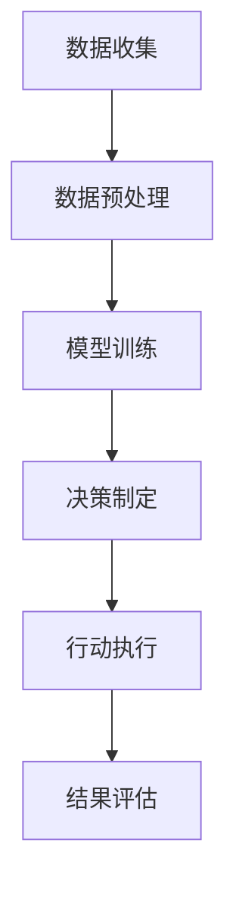

# AI人工智能代理工作流AI Agent WorkFlow：仿真环境中AI代理的实验与评估

## 1.背景介绍

人工智能（AI）代理在现代计算机科学和工程中扮演着越来越重要的角色。随着AI技术的不断进步，AI代理被广泛应用于自动驾驶、智能家居、金融分析等多个领域。AI代理的工作流设计和评估在确保其性能和可靠性方面至关重要。本文将深入探讨AI代理的工作流，特别是在仿真环境中的实验与评估。

## 2.核心概念与联系

### 2.1 AI代理

AI代理是一个能够自主感知环境、做出决策并执行行动的计算机程序。它通常由感知模块、决策模块和执行模块组成。

### 2.2 工作流

工作流是指一系列有序的步骤或任务，用于完成特定的目标。在AI代理的上下文中，工作流包括数据收集、模型训练、决策制定和结果评估等步骤。

### 2.3 仿真环境

仿真环境是一个虚拟的测试平台，用于模拟现实世界中的各种场景和条件。它为AI代理提供了一个安全、可控的测试环境。

### 2.4 实验与评估

实验与评估是指通过一系列测试和分析，评估AI代理的性能和可靠性。这包括准确性、效率、鲁棒性等多个方面。

## 3.核心算法原理具体操作步骤

### 3.1 数据收集与预处理

数据是AI代理的基础。数据收集包括从传感器、数据库或其他来源获取原始数据。预处理步骤包括数据清洗、归一化和特征提取。

### 3.2 模型训练

模型训练是指使用预处理后的数据来训练AI模型。常用的算法包括深度学习、强化学习和监督学习等。

### 3.3 决策制定

决策制定是AI代理根据训练好的模型和当前环境状态，选择最优行动的过程。常用的方法包括马尔可夫决策过程（MDP）和部分可观测马尔可夫决策过程（POMDP）。

### 3.4 行动执行

行动执行是AI代理根据决策结果，执行相应的操作。这一步骤需要与物理设备或其他系统进行交互。

### 3.5 结果评估

结果评估是通过一系列指标来评估AI代理的性能。常用的评估指标包括准确率、召回率、F1分数等。



## 4.数学模型和公式详细讲解举例说明

### 4.1 马尔可夫决策过程（MDP）

MDP是一个用于建模决策过程的数学框架。它由状态集 $S$、动作集 $A$、状态转移概率 $P$ 和奖励函数 $R$ 组成。

$$
P(s'|s, a) = \mathbb{P}(S_{t+1} = s' | S_t = s, A_t = a)
$$

$$
R(s, a) = \mathbb{E}[R_{t+1} | S_t = s, A_t = a]
$$

### 4.2 强化学习

强化学习是通过与环境的交互，学习最优策略的过程。常用的算法包括Q学习和深度Q网络（DQN）。

$$
Q(s, a) = \mathbb{E}[R_{t+1} + \gamma \max_{a'} Q(s', a') | S_t = s, A_t = a]
$$

### 4.3 监督学习

监督学习是通过已标注的数据来训练模型的过程。常用的算法包括线性回归、逻辑回归和支持向量机（SVM）。

$$
L(\theta) = \frac{1}{2m} \sum_{i=1}^{m} (h_\theta(x^{(i)}) - y^{(i)})^2
$$

## 5.项目实践：代码实例和详细解释说明

### 5.1 数据收集与预处理

```python
import pandas as pd
from sklearn.preprocessing import StandardScaler

# 数据收集
data = pd.read_csv('data.csv')

# 数据预处理
scaler = StandardScaler()
data_scaled = scaler.fit_transform(data)
```

### 5.2 模型训练

```python
from sklearn.model_selection import train_test_split
from sklearn.ensemble import RandomForestClassifier

# 数据分割
X_train, X_test, y_train, y_test = train_test_split(data_scaled, labels, test_size=0.2)

# 模型训练
model = RandomForestClassifier()
model.fit(X_train, y_train)
```

### 5.3 决策制定

```python
# 决策制定
predictions = model.predict(X_test)
```

### 5.4 行动执行

```python
# 假设我们有一个机器人控制接口
robot.execute(predictions)
```

### 5.5 结果评估

```python
from sklearn.metrics import accuracy_score, recall_score, f1_score

# 结果评估
accuracy = accuracy_score(y_test, predictions)
recall = recall_score(y_test, predictions)
f1 = f1_score(y_test, predictions)

print(f'Accuracy: {accuracy}, Recall: {recall}, F1 Score: {f1}')
```

## 6.实际应用场景

### 6.1 自动驾驶

AI代理在自动驾驶中扮演着关键角色。通过感知环境、决策制定和行动执行，自动驾驶汽车能够自主导航和避障。

### 6.2 智能家居

在智能家居中，AI代理可以通过传感器数据，自动调节温度、照明和安全系统，提高生活质量。

### 6.3 金融分析

AI代理在金融分析中用于预测市场趋势、评估风险和制定投资策略。通过大数据分析和机器学习算法，AI代理能够提供高效、准确的金融决策。

## 7.工具和资源推荐

### 7.1 开源工具

- **TensorFlow**：一个开源的机器学习框架，适用于深度学习和强化学习。
- **PyTorch**：另一个流行的深度学习框架，具有灵活性和易用性。
- **OpenAI Gym**：一个用于开发和比较强化学习算法的工具包。

### 7.2 数据集

- **MNIST**：手写数字识别数据集，广泛用于图像分类任务。
- **CIFAR-10**：一个包含10类图像的数据集，常用于图像识别和分类。
- **IMDB**：电影评论数据集，常用于自然语言处理任务。

### 7.3 在线课程

- **Coursera**：提供多种AI和机器学习相关的在线课程。
- **edX**：另一个提供高质量AI课程的平台。
- **Udacity**：专注于技术领域的在线教育平台，提供AI和机器学习纳米学位。

## 8.总结：未来发展趋势与挑战

### 8.1 未来发展趋势

- **自适应学习**：未来的AI代理将能够自适应地学习和调整其策略，以应对不断变化的环境。
- **多代理系统**：多个AI代理协同工作，将在复杂任务中展现出更高的效率和鲁棒性。
- **人机协作**：AI代理将与人类协作，共同完成任务，提高生产力和决策质量。

### 8.2 挑战

- **数据隐私**：在数据驱动的AI代理中，如何保护用户隐私是一个重要的挑战。
- **伦理问题**：AI代理的决策可能涉及伦理问题，需要制定相应的规范和标准。
- **鲁棒性**：AI代理在面对未知环境和突发情况时的鲁棒性仍需提高。

## 9.附录：常见问题与解答

### 9.1 如何选择合适的AI算法？

选择AI算法取决于具体的应用场景和数据特性。对于图像识别任务，深度学习算法通常表现较好；对于时间序列预测，LSTM等递归神经网络是不错的选择。

### 9.2 如何评估AI代理的性能？

评估AI代理的性能可以通过多种指标，如准确率、召回率、F1分数等。此外，还可以通过仿真环境中的实验，评估其在实际应用中的表现。

### 9.3 如何提高AI代理的鲁棒性？

提高AI代理的鲁棒性可以通过多种方法，如数据增强、模型正则化和多样化训练数据等。此外，使用多代理系统也可以提高整体系统的鲁棒性。

### 9.4 AI代理在实际应用中有哪些风险？

AI代理在实际应用中可能面临数据隐私、伦理问题和鲁棒性等风险。需要通过技术手段和政策法规，来降低这些风险。

### 9.5 如何获取更多的学习资源？

可以通过在线课程、开源项目和技术博客等途径，获取更多的学习资源。推荐的平台包括Coursera、edX和Udacity等。

---

作者：禅与计算机程序设计艺术 / Zen and the Art of Computer Programming