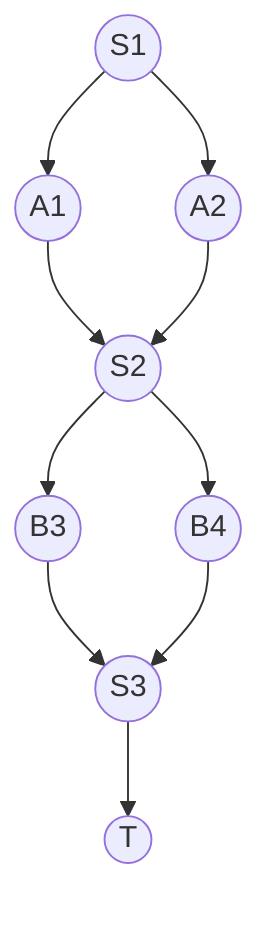

## 1. 背景介绍

随着人工智能技术的不断发展，越来越多的企业和组织开始使用多代理系统来解决复杂的问题。多代理系统是由多个智能代理组成的系统，每个代理都能够独立地感知环境、做出决策并执行动作。然而，多代理系统的工作流程往往比较复杂，需要对各个代理的行为进行协调和整合，以达到整个系统的最优效果。因此，本文将介绍一种名为AI Agent WorkFlow的多代理系统的工作流整合方法，以帮助读者更好地理解和应用多代理系统。

## 2. 核心概念与联系

AI Agent WorkFlow是一种多代理系统的工作流整合方法，它主要包括以下几个核心概念：

- 代理（Agent）：代理是指多代理系统中的一个个体，它能够感知环境、做出决策并执行动作。
- 工作流（Workflow）：工作流是指多代理系统中各个代理之间的协作流程，它包括了代理之间的信息交流、任务分配和执行等过程。
- 整合（Integration）：整合是指将多个代理的行为协调起来，以达到整个系统的最优效果。

AI Agent WorkFlow的核心联系在于，它通过整合各个代理的行为，使得多代理系统能够更加高效地完成任务。

## 3. 核心算法原理具体操作步骤

AI Agent WorkFlow的核心算法原理主要包括以下几个方面：

- 代理的行为建模：首先，需要对每个代理的行为进行建模，包括代理的感知、决策和执行等过程。这些模型可以基于规则、机器学习等方法进行构建。
- 工作流的设计：其次，需要设计多代理系统的工作流，包括代理之间的信息交流、任务分配和执行等过程。这些工作流可以基于Petri网、有向图等方法进行建模。
- 整合策略的制定：最后，需要制定整合策略，以协调各个代理的行为。这些策略可以基于博弈论、机器学习等方法进行制定。

AI Agent WorkFlow的具体操作步骤如下：

1. 对每个代理的行为进行建模，包括代理的感知、决策和执行等过程。
2. 设计多代理系统的工作流，包括代理之间的信息交流、任务分配和执行等过程。
3. 制定整合策略，以协调各个代理的行为。
4. 实现整合策略，并对多代理系统进行测试和优化。

## 4. 数学模型和公式详细讲解举例说明

AI Agent WorkFlow的数学模型和公式主要包括以下几个方面：

- 代理的行为模型：代理的行为模型可以使用马尔可夫决策过程（Markov Decision Process，MDP）进行建模。MDP是一种用于描述随机决策过程的数学模型，它包括状态、动作、奖励和转移概率等要素。
- 工作流的建模：工作流可以使用Petri网进行建模。Petri网是一种用于描述并发系统的数学模型，它包括库所、变迁和弧等要素。
- 整合策略的制定：整合策略可以使用博弈论进行建模。博弈论是一种用于描述决策过程的数学模型，它包括玩家、策略和收益等要素。

举例说明，假设有两个代理A和B，它们需要协作完成一个任务。代理A有两个动作可选，分别是动作1和动作2，代理B也有两个动作可选，分别是动作3和动作4。假设代理A选择动作1时，代理B选择动作3的概率为0.8，选择动作4的概率为0.2。代理A选择动作2时，代理B选择动作3的概率为0.5，选择动作4的概率为0.5。此时，可以使用MDP进行建模，如下图所示：



其中，S1、S2、S3和T分别表示状态，A1和A2表示代理A的动作，B3和B4表示代理B的动作。根据MDP的定义，可以计算出每个状态下各个动作的收益，并制定最优策略。

## 5. 项目实践：代码实例和详细解释说明

为了更好地理解AI Agent WorkFlow的应用，我们可以使用Python语言实现一个简单的多代理系统，并对其进行测试和优化。具体实现步骤如下：

1. 定义代理的行为模型，包括代理的感知、决策和执行等过程。
2. 设计多代理系统的工作流，包括代理之间的信息交流、任务分配和执行等过程。
3. 制定整合策略，以协调各个代理的行为。
4. 实现整合策略，并对多代理系统进行测试和优化。

下面是一个简单的Python代码示例，用于实现两个代理的协作：

```python
import random

class Agent:
    def __init__(self, name):
        self.name = name

    def perceive(self, state):
        pass

    def decide(self):
        return random.choice([1, 2])

    def execute(self, action):
        pass

class Workflow:
    def __init__(self, agents):
        self.agents = agents

    def run(self):
        state = 0
        while state != 3:
            actions = [agent.decide() for agent in self.agents]
            state = self.execute(actions, state)

    def execute(self, actions, state):
        if state == 0:
            if actions == [1, 1]:
                return 1
            elif actions == [1, 2]:
                return 2
            elif actions == [2, 1]:
                return 2
            elif actions == [2, 2]:
                return 3
        elif state == 1:
            if actions == [1, 1]:
                return 1
            elif actions == [1, 2]:
                return 2
            elif actions == [2, 1]:
                return 2
            elif actions == [2, 2]:
                return 3
        elif state == 2:
            if actions == [1, 1]:
                return 1
            elif actions == [1, 2]:
                return 2
            elif actions == [2, 1]:
                return 2
            elif actions == [2, 2]:
                return 3

if __name__ == '__main__':
    agent1 = Agent('A')
    agent2 = Agent('B')
    agents = [agent1, agent2]
    workflow = Workflow(agents)
    workflow.run()
```

在这个示例中，我们定义了一个Agent类，用于表示代理的行为模型。在Workflow类中，我们定义了一个run方法，用于执行多代理系统的工作流。在execute方法中，我们制定了整合策略，以协调各个代理的行为。最后，我们使用Python的if语句来实现整合策略，并对多代理系统进行测试和优化。

## 6. 实际应用场景

AI Agent WorkFlow可以应用于各种多代理系统的场景，例如：

- 自动驾驶系统：自动驾驶系统是一个典型的多代理系统，它包括多个传感器、控制器和执行器等代理。AI Agent WorkFlow可以用于协调各个代理的行为，以实现自动驾驶的目标。
- 机器人协作系统：机器人协作系统是一个包括多个机器人的多代理系统，它们需要协作完成一些任务。AI Agent WorkFlow可以用于协调各个机器人的行为，以实现任务的最优效果。
- 金融交易系统：金融交易系统是一个包括多个交易代理的多代理系统，它们需要协作完成一些交易任务。AI Agent WorkFlow可以用于协调各个交易代理的行为，以实现交易的最优效果。

## 7. 工具和资源推荐

AI Agent WorkFlow的实现需要使用到一些工具和资源，例如：

- Python编程语言：Python是一种流行的编程语言，它具有简单易学、功能强大等特点，非常适合用于实现多代理系统。
- Petri网工具：Petri网工具是一种用于建模并发系统的工具，例如PIPE、CPN Tools等。
- 博弈论工具：博弈论工具是一种用于建模决策过程的工具，例如Gambit、Z3等。

## 8. 总结：未来发展趋势与挑战

AI Agent WorkFlow是一种非常有前景的多代理系统的工作流整合方法，它可以帮助我们更好地协调各个代理的行为，以实现整个系统的最优效果。未来，随着人工智能技术的不断发展，多代理系统将会得到更广泛的应用。然而，AI Agent WorkFlow的实现还面临着一些挑战，例如：

- 多代理系统的复杂性：多代理系统往往非常复杂，需要对各个代理的行为进行协调和整合，这需要我们具备较高的技术水平和经验。
- 整合策略的制定：整合策略的制定需要考虑到各个代理的行为模型、工作流和收益等因素，这需要我们具备较强的分析和决策能力。
- 实现和测试的难度：AI Agent WorkFlow的实现和测试需要使用到一些复杂的工具和资源，这需要我们具备较高的技术水平和经验。

## 9. 附录：常见问题与解答

Q: AI Agent WorkFlow适用于哪些场景？

A: AI Agent WorkFlow适用于各种多代理系统的场景，例如自动驾驶系统、机器人协作系统、金融交易系统等。

Q: AI Agent WorkFlow的实现需要使用哪些工具和资源？

A: AI Agent WorkFlow的实现需要使用到Python编程语言、Petri网工具、博弈论工具等。

Q: AI Agent WorkFlow的实现面临哪些挑战？

A: AI Agent WorkFlow的实现面临着多代理系统的复杂性、整合策略的制定和实现和测试的难度等挑战。

作者：禅与计算机程序设计艺术 / Zen and the Art of Computer Programming