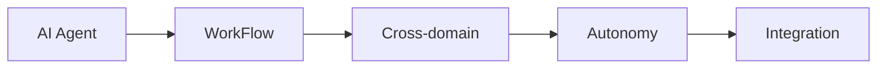

# AI人工智能代理工作流AI Agent WorkFlow：跨领域自主AI代理的集成

## 1. 背景介绍
### 1.1 人工智能代理的发展历程
#### 1.1.1 早期人工智能代理的探索
#### 1.1.2 现代人工智能代理的兴起
#### 1.1.3 未来人工智能代理的展望

### 1.2 跨领域自主AI代理的需求
#### 1.2.1 单领域AI代理的局限性
#### 1.2.2 跨领域AI代理的优势
#### 1.2.3 自主AI代理的必要性

### 1.3 AI Agent WorkFlow的提出
#### 1.3.1 AI Agent WorkFlow的定义
#### 1.3.2 AI Agent WorkFlow的目标
#### 1.3.3 AI Agent WorkFlow的意义

## 2. 核心概念与联系
### 2.1 AI代理(AI Agent)
#### 2.1.1 AI代理的定义
#### 2.1.2 AI代理的特点
#### 2.1.3 AI代理的分类

### 2.2 工作流(WorkFlow)  
#### 2.2.1 工作流的定义
#### 2.2.2 工作流的组成要素
#### 2.2.3 工作流的优势

### 2.3 跨领域(Cross-domain)
#### 2.3.1 领域的概念
#### 2.3.2 跨领域的定义
#### 2.3.3 跨领域的挑战

### 2.4 自主性(Autonomy)
#### 2.4.1 自主性的定义 
#### 2.4.2 AI代理自主性的体现
#### 2.4.3 自主性的重要性

### 2.5 集成(Integration)
#### 2.5.1 集成的定义
#### 2.5.2 AI代理集成的必要性
#### 2.5.3 AI代理集成的方式

### 2.6 核心概念之间的联系


## 3. 核心算法原理具体操作步骤
### 3.1 多智能体协同算法
#### 3.1.1 多智能体系统概述
#### 3.1.2 协同机制设计
#### 3.1.3 通信协议设计

### 3.2 跨领域知识迁移算法
#### 3.2.1 知识表示与建模
#### 3.2.2 相似性度量
#### 3.2.3 知识迁移过程

### 3.3 分层次任务规划算法
#### 3.3.1 任务分解
#### 3.3.2 任务分配
#### 3.3.3 任务执行与监控

### 3.4 自主学习与适应算法
#### 3.4.1 强化学习
#### 3.4.2 元学习
#### 3.4.3 在线学习

### 3.5 工作流集成优化算法
#### 3.5.1 工作流建模
#### 3.5.2 工作流编排优化
#### 3.5.3 工作流执行与调度

## 4. 数学模型和公式详细讲解举例说明
### 4.1 马尔可夫决策过程(MDP)
#### 4.1.1 MDP的定义
$$
M=\langle S,A,P,R,\gamma \rangle
$$
其中，$S$为状态集，$A$为动作集，$P$为状态转移概率矩阵，$R$为奖励函数，$\gamma$为折扣因子。

#### 4.1.2 MDP的求解
- 值迭代
- 策略迭代
- 蒙特卡洛方法

#### 4.1.3 MDP在AI代理中的应用

### 4.2 知识图谱嵌入(Knowledge Graph Embedding)
#### 4.2.1 知识图谱嵌入的定义
将知识图谱中的实体和关系映射到连续的低维向量空间，同时保留图谱的结构信息。

#### 4.2.2 经典模型
- TransE
$$
f_r(h,t)=\Vert \mathbf{h}+\mathbf{r}-\mathbf{t} \Vert
$$
- TransR 
$$
f_r(h,t)=\Vert \mathbf{M}_r\mathbf{h}+\mathbf{r}-\mathbf{M}_r\mathbf{t} \Vert
$$

#### 4.2.3 在跨领域知识迁移中的应用

### 4.3 多臂老虎机(Multi-Armed Bandit)
#### 4.3.1 多臂老虎机问题定义
有$K$个臂，每个臂有一个未知的奖励分布，目标是最大化总奖励。

#### 4.3.2 经典算法
- $\epsilon$-贪心算法
- Upper Confidence Bound (UCB)算法
$$
\mathrm{UCB}_i=\overline{X}_i+\sqrt{\frac{2\ln n}{n_i}}
$$

#### 4.3.3 在自主学习与探索中的应用

### 4.4 因果推理(Causal Inference)
#### 4.4.1 因果推理的定义
研究变量之间的因果关系，揭示变量变化的原因和结果。

#### 4.4.2 因果图模型
- 有向无环图(DAG)
- 结构方程模型(SEM)
$$
X_i=f_i(\mathrm{Pa}_i,\epsilon_i),i=1,\cdots,n
$$

#### 4.4.3 在AI代理决策中的应用

### 4.5 博弈论(Game Theory)
#### 4.5.1 博弈论的定义
研究多个理性决策者之间的策略互动，每个决策者的收益依赖于所有参与者的策略选择。

#### 4.5.2 经典博弈模型 
- 囚徒困境
- 纳什均衡
$$
u_i(s_i^*,s_{-i}^*) \geq u_i(s_i,s_{-i}^*),\forall i,\forall s_i \in S_i
$$

#### 4.5.3 在多智能体协同中的应用

## 5. 项目实践：代码实例和详细解释说明
### 5.1 多智能体协同任务执行
#### 5.1.1 场景描述
多个AI代理协同完成复杂任务，如智能物流调度、智慧城市管理等。

#### 5.1.2 关键代码实现
```python
# 定义Agent类
class Agent:
    def __init__(self, id):
        self.id = id
        self.state = None
        self.action = None
        self.reward = 0
        
    def observe(self, env):
        self.state = env.get_state(self.id)
        
    def decide(self):
        # 根据当前状态选择动作
        self.action = self.policy(self.state)
        
    def update(self, reward):
        self.reward += reward
        # 根据反馈更新策略
        self.policy.update(self.state, self.action, reward)
        
# 定义多智能体环境类        
class MultiAgentEnv:
    def __init__(self, num_agents):
        self.num_agents = num_agents
        self.agents = [Agent(i) for i in range(num_agents)]
        
    def get_state(self, agent_id):
        # 返回指定Agent的状态
        pass
        
    def step(self):
        # 环境动力学更新
        for agent in self.agents:
            agent.observe(self) 
            agent.decide()
        next_state, rewards = self.transit(self.agents)
        for agent, reward in zip(self.agents, rewards):  
            agent.update(reward)
        return next_state
```

#### 5.1.3 代码解释
- `Agent`类封装了智能体的状态、动作、奖励以及决策策略，通过`observe`、`decide`、`update`三个方法实现感知、决策、学习的功能。
- `MultiAgentEnv`类封装了多智能体交互的环境，通过`get_state`方法返回特定智能体的局部状态，通过`step`方法实现多智能体的联合决策与环境更新。
- 在每个时间步，每个智能体首先观测环境状态，然后根据当前策略选择动作，环境根据所有智能体的动作更新状态并反馈奖励，智能体根据奖励更新自身策略，不断循环迭代优化。

### 5.2 跨领域知识迁移学习
#### 5.2.1 场景描述
利用已有领域的知识，快速适应新领域的任务，如将图像识别模型迁移应用于医学影像分析。

#### 5.2.2 关键代码实现
```python
# 定义源领域和目标领域的数据集
source_dataset = ImageFolder('source/dataset')
target_dataset = ImageFolder('target/dataset')

# 定义源领域和目标领域的特征提取器
source_feature_extractor = nn.Sequential(...)
target_feature_extractor = nn.Sequential(...)

# 定义源领域和目标领域的分类器
source_classifier = nn.Linear(...)
target_classifier = nn.Linear(...)

# 源领域分类损失
source_class_loss = nn.CrossEntropyLoss()(source_classifier(source_feature_extractor(source_data)), source_label)

# MMD度量源领域和目标领域特征的分布差异
mmd_loss = mmd(source_feature_extractor(source_data), target_feature_extractor(target_data))

# 领域对抗损失
domain_loss = nn.BCELoss()(domain_discriminator(source_feature_extractor(source_data)), domain_source_label) + 
              nn.BCELoss()(domain_discriminator(target_feature_extractor(target_data)), domain_target_label)
              
# 目标领域分类损失
target_class_loss = nn.CrossEntropyLoss()(target_classifier(target_feature_extractor(target_data)), target_label)

# 总损失
total_loss = source_class_loss + mmd_loss + domain_loss + target_class_loss
```

#### 5.2.3 代码解释
- 分别定义源领域和目标领域的数据集，用于训练和测试。
- 分别定义源领域和目标领域的特征提取器，用于提取数据的高层特征表示。
- 分别定义源领域和目标领域的分类器，用于预测样本的类别标签。
- 源领域分类损失用于衡量源领域特征提取器和分类器的性能。
- MMD(Maximum Mean Discrepancy)度量源领域和目标领域特征的分布差异，用于缩小两个领域特征的分布差距。
- 领域对抗损失用于训练领域判别器，使其无法区分源领域特征和目标领域特征，从而实现领域自适应。
- 目标领域分类损失用于衡量目标领域特征提取器和分类器的性能，通过反向传播优化目标领域模型。
- 总损失为各项损失的加权和，通过联合优化实现跨领域知识迁移。

## 6. 实际应用场景
### 6.1 智能客服系统
#### 6.1.1 业务痛点
传统客服系统效率低下，无法24小时不间断服务，客服人员流失率高。

#### 6.1.2 解决方案
构建多领域智能客服AI代理，通过知识图谱实现跨领域知识集成，通过强化学习实现对话策略自主优化，通过自然语言处理实现智能问答与任务协同。

#### 6.1.3 方案优势
- 24小时不间断高质量服务
- 大幅降低人工客服成本
- 快速响应多领域复杂问题
- 个性化服务提升用户体验

### 6.2 自动驾驶汽车
#### 6.2.1 业务痛点
传统汽车安全事故频发，驾驶员疲劳驾驶风险高，交通拥堵问题严重。

#### 6.2.2 解决方案
研发自动驾驶AI代理，通过计算机视觉实现环境感知，通过深度强化学习实现驾驶策略自主决策，通过车联网实现车队协同控制，通过云端大脑实现跨代理经验汇总与学习。

#### 6.2.3 方案优势 
- 显著提升行车安全性
- 有效缓解交通拥堵问题
- 降低驾驶员劳动强度
- 优化车辆能耗与排放

### 6.3 智慧医疗辅助系统
#### 6.3.1 业务痛点
优质医疗资源稀缺，基层医疗水平参差不齐，医患沟通存在障碍，误诊漏诊时有发生。

#### 6.3.2 解决方案
开发医疗辅助AI代理，通过医学知识图谱实现跨科室知识融合，通过医学影像分析实现智能诊断，通过自然语言处理实现医患互动，通过治疗方案推荐实现精准治疗。

#### 6.3.3 方案优势
- 促进优质医疗资源下沉
- 提高基层医疗服务水平
- 改善医患沟通与理解
- 规范诊疗行为降低医疗风险

## 7.