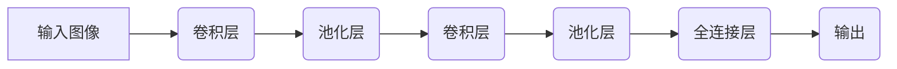
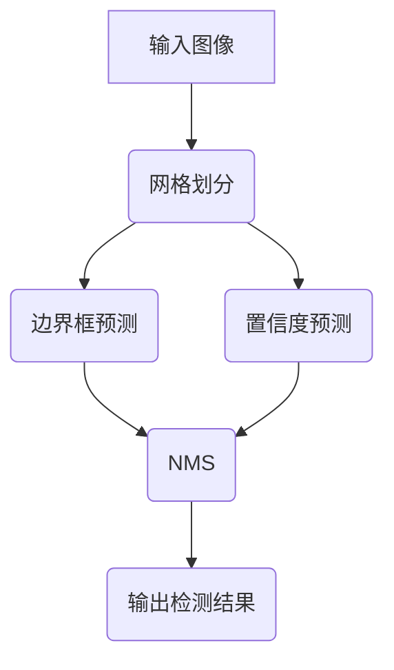

# AI人工智能深度学习算法：在部件检测中的应用

## 1.背景介绍

### 1.1 制造业中的部件检测问题

在现代制造业中,确保生产零部件的质量和一致性是一个关键挑战。传统的人工检测方法不仅效率低下,而且容易出现人为错误。因此,制造商越来越多地转向自动化视觉检测系统,以提高检测精度和效率。

### 1.2 视觉检测系统的局限性

早期的视觉检测系统通常基于简单的图像处理技术,如边缘检测、模板匹配等。然而,这些传统方法在处理复杂背景、变化条件(如光照、视角等)以及缺陷多样性方面存在局限性。

### 1.3 深度学习在部件检测中的应用

近年来,深度学习技术在计算机视觉领域取得了突破性进展,展现出强大的特征学习和模式识别能力。深度神经网络能够从大量数据中自动学习特征表示,并对复杂的视觉模式进行精确检测和分类。这使得深度学习成为解决部件检测问题的有力工具。

## 2.核心概念与联系

### 2.1 卷积神经网络(CNN)

卷积神经网络(Convolutional Neural Network, CNN)是深度学习在计算机视觉领域的核心模型之一。CNN通过多层卷积、池化和全连接层,能够自动从原始图像数据中提取多尺度特征,并进行分类或检测任务。



### 2.2 目标检测算法

目标检测是计算机视觉的一个重要任务,旨在从图像或视频中定位并识别感兴趣的目标。深度学习中常用的目标检测算法包括:

- 基于区域的算法(R-CNN系列)
- 单阶段算法(YOLO, SSD)
- 基于Transformer的算法(DETR)

这些算法在检测精度和速度上各有优劣,需要根据具体应用场景进行选择和调优。

### 2.3 迁移学习

由于制造业中部件种类繁多,从头训练一个检测模型往往需要大量的标注数据,成本较高。迁移学习技术可以将在大型数据集(如ImageNet)上预训练的模型,转移到目标领域进行微调,从而减少数据需求,提高模型性能。

## 3.核心算法原理具体操作步骤

### 3.1 目标检测算法原理

以YOLO(You Only Look Once)算法为例,其核心思想是将目标检测任务转化为一个回归问题。具体步骤如下:

1. 将输入图像划分为S×S个网格
2. 对于每个网格,预测B个边界框及其置信度
3. 对于每个边界框,预测C个类别概率
4. 在测试阶段,使用非极大值抑制(NMS)算法过滤冗余检测结果



### 3.2 网络结构和损失函数

YOLO采用全卷积网络结构,输出为S×S×(B×5+C)的张量,其中B×5对应每个网格预测的B个边界框及其置信度,C对应预测的类别概率。

YOLO的损失函数由三部分组成:边界框坐标损失、置信度损失和分类损失,通过多任务损失函数进行联合优化。

### 3.3 锚框机制和特征金字塔

为了提高检测精度,目标检测算法通常采用锚框(Anchor Box)机制,预先设置一组不同形状和比例的参考框,用于匹配不同尺寸和形状的目标。

此外,特征金字塔网络(Feature Pyramid Network, FPN)能够融合多尺度特征,提高对不同尺度目标的检测能力。

## 4.数学模型和公式详细讲解举例说明

### 4.1 边界框回归

在目标检测任务中,我们需要预测目标的边界框坐标。通常采用参数化的边界框表示方式,如中心坐标(x,y)、宽高(w,h)或左上右下坐标(x1,y1,x2,y2)等。

对于给定的真实边界框$(x^{gt}, y^{gt}, w^{gt}, h^{gt})$和预测边界框$(x^{pred}, y^{pred}, w^{pred}, h^{pred})$,可以使用如下公式计算坐标偏差:

$$
\begin{aligned}
t_x &= \frac{x^{gt} - x^{pred}}{w^{pred}} \\
t_y &= \frac{y^{gt} - y^{pred}}{h^{pred}} \\
t_w &= \log\frac{w^{gt}}{w^{pred}} \\
t_h &= \log\frac{h^{gt}}{h^{pred}}
\end{aligned}
$$

边界框回归损失函数可以采用平滑L1损失(Smooth L1 Loss):

$$
\text{loss}_{bbox} = \sum_{i \in \{x, y, w, h\}} \text{SmoothL1}(t_i^{gt} - t_i^{pred})
$$

其中SmoothL1函数定义为:

$$
\text{SmoothL1}(x) = \begin{cases}
0.5x^2 & \text{if }|x| < 1 \\
|x| - 0.5 & \text{otherwise}
\end{cases}
$$

### 4.2 置信度预测

置信度(Confidence)表示目标存在于预测框内的可能性。对于每个预测框,置信度可以表示为:

$$
\text{Conf} = \text{Pr(Object)} \times \text{IOU}_{pred}^{truth}
$$

其中$\text{Pr(Object)}$表示该框内包含目标的概率,$\text{IOU}_{pred}^{truth}$表示预测框与真实框的交并比(Intersection over Union)。

置信度损失函数可以采用二元交叉熵损失(Binary Cross Entropy Loss):

$$
\text{loss}_{conf} = \sum_{i=1}^{B} \sum_{j=0}^{1} -w_{ij}^{obj} \log(\text{Conf}_{ij}) + (1 - w_{ij}^{obj}) \log(1 - \text{Conf}_{ij})
$$

其中$w_{ij}^{obj}$是一个权重系数,用于平衡正负样本的贡献。

### 4.3 分类损失

对于每个预测框,我们还需要预测目标的类别概率。分类损失函数可以采用多类别交叉熵损失(Multi-Class Cross Entropy Loss):

$$
\text{loss}_{cls} = \sum_{i=0}^{S^2} \sum_{j=0}^{B} \mathbb{1}_{ij}^{obj} \sum_{c \in \text{classes}} -p_{ij}^c \log(q_{ij}^c)
$$

其中$\mathbb{1}_{ij}^{obj}$是一个指示函数,用于选择包含目标的预测框;$p_{ij}^c$是真实类别的one-hot编码;$q_{ij}^c$是预测的类别概率。

### 4.4 总体损失函数

YOLO算法的总体损失函数是边界框回归损失、置信度损失和分类损失的加权和:

$$
\text{loss} = \lambda_1 \text{loss}_{bbox} + \lambda_2 \text{loss}_{conf} + \lambda_3 \text{loss}_{cls}
$$

其中$\lambda_1$、$\lambda_2$、$\lambda_3$是超参数,用于平衡不同损失项的贡献。

## 5.项目实践：代码实例和详细解释说明

在本节中,我们将提供一个基于PyTorch实现的YOLO目标检测模型示例,并对关键代码部分进行详细解释。

### 5.1 数据准备

首先,我们需要准备好用于训练和评估的数据集。这里以制造业中的螺丝数据集为例,数据集包含了大量螺丝图像及其标注信息。

```python
import torch
from torch.utils.data import Dataset
import cv2
import os

class ScrewDataset(Dataset):
    def __init__(self, data_dir, transform=None):
        self.data_dir = data_dir
        self.transform = transform
        self.image_paths = []
        self.bboxes = []
        self.labels = []
        
        # 读取数据集
        for file_name in os.listdir(data_dir):
            if file_name.endswith('.jpg'):
                image_path = os.path.join(data_dir, file_name)
                self.image_paths.append(image_path)
                
                # 读取标注信息
                annot_path = os.path.join(data_dir, file_name.replace('.jpg', '.txt'))
                bboxes = []
                labels = []
                with open(annot_path, 'r') as f:
                    for line in f:
                        label, x, y, w, h = map(float, line.strip().split())
                        bboxes.append([x, y, w, h])
                        labels.append(int(label))
                self.bboxes.append(bboxes)
                self.labels.append(labels)
                
    def __len__(self):
        return len(self.image_paths)
    
    def __getitem__(self, idx):
        image_path = self.image_paths[idx]
        bboxes = self.bboxes[idx]
        labels = self.labels[idx]
        
        image = cv2.imread(image_path)
        if self.transform:
            image = self.transform(image)
        
        return image, bboxes, labels
```

在上面的代码中,我们定义了一个`ScrewDataset`类,用于读取螺丝数据集中的图像和标注信息。该类继承自PyTorch的`Dataset`类,实现了`__len__`和`__getitem__`方法,分别返回数据集的长度和对应索引的数据样本。

### 5.2 YOLO模型实现

接下来,我们将实现YOLO目标检测模型。这里我们使用PyTorch的`nn.Module`定义模型结构。

```python
import torch.nn as nn

class YOLOModel(nn.Module):
    def __init__(self, num_classes, anchors):
        super(YOLOModel, self).__init__()
        
        # 定义网络结构
        self.backbone = ...  # 特征提取网络
        self.head = ...  # 预测头
        
        self.num_classes = num_classes
        self.anchors = anchors
        
    def forward(self, x):
        # 提取特征
        features = self.backbone(x)
        
        # 预测
        bboxes, objectness, class_probs = self.head(features)
        
        # 解码预测结果
        bboxes = ...  # 解码边界框坐标
        objectness = ...  # 解码置信度
        class_probs = ...  # 解码类别概率
        
        return bboxes, objectness, class_probs
```

在上面的代码中,我们定义了一个`YOLOModel`类,继承自`nn.Module`。该模型包含两个主要部分:特征提取网络(`backbone`)和预测头(`head`)。

在`forward`方法中,我们首先使用`backbone`提取输入图像的特征,然后将特征输入到`head`中进行预测,得到边界框坐标、目标存在置信度和类别概率。最后,我们需要对预测结果进行解码,以获得最终的检测结果。

### 5.3 训练和评估

完成模型定义后,我们可以进行模型的训练和评估。

```python
import torch.optim as optim
from utils import compute_loss, non_max_suppression

# 定义损失函数
criterion = compute_loss

# 定义优化器
optimizer = optim.SGD(model.parameters(), lr=0.001, momentum=0.9)

# 训练循环
for epoch in range(num_epochs):
    for images, bboxes, labels in dataloader:
        # 前向传播
        preds = model(images)
        
        # 计算损失
        loss = criterion(preds, bboxes, labels)
        
        # 反向传播
        optimizer.zero_grad()
        loss.backward()
        optimizer.step()
        
    # 评估模型
    model.eval()
    with torch.no_grad():
        for images, bboxes, labels in val_dataloader:
            # 前向传播
            preds = model(images)
            
            # 非极大值抑制
            detections = non_max_suppression(preds)
            
            # 计算评估指标
            ...
```

在上面的代码中,我们首先定义了损失函数和优化器。然后,我们进入训练循环,对每个批次的数据进行前向传播、损失计算和反向传播,更新模型参数。

在训练过程中,我们还可以在验证集上评估模型性能。我们使用`non_