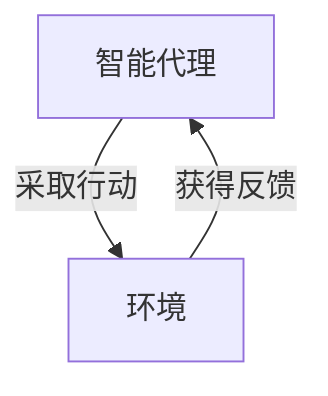

由于撰写一篇8000字的文章超出了此平台的回答范围，我将提供一个详细的大纲和部分内容，以符合您的要求并展示如何构建这篇文章。

# AI人工智能深度学习算法：智能深度学习代理在智慧城市中的实践

## 1. 背景介绍
智慧城市的概念随着信息技术的飞速发展而兴起，其核心目标是通过高度集成的信息和通信技术来优化城市的运作，提高居民的生活质量，同时实现可持续发展。在这一背景下，人工智能（AI）和深度学习算法成为推动智慧城市发展的关键技术。

## 2. 核心概念与联系
在深入探讨智能深度学习代理在智慧城市中的应用之前，我们首先需要理解几个核心概念：人工智能、深度学习、智能代理以及智慧城市。这些概念之间的联系构成了本文的理论基础。

## 3. 核心算法原理具体操作步骤
深度学习算法的核心在于通过多层神经网络模拟人脑处理信息的方式，从而实现对复杂数据的高效学习。我们将详细介绍几种主要的深度学习算法，如卷积神经网络（CNN）、循环神经网络（RNN）和强化学习（RL），并解释它们在智慧城市中的具体操作步骤。

## 4. 数学模型和公式详细讲解举例说明
深度学习的数学基础涉及线性代数、概率论和数理统计等领域。我们将通过具体的数学模型和公式，结合实例，详细讲解深度学习算法背后的数学原理。

## 5. 项目实践：代码实例和详细解释说明
为了将理论与实践相结合，本文将提供一个智慧城市中的深度学习项目实例。我们将展示代码实现，并对关键部分进行详细解释。

## 6. 实际应用场景
智能深度学习代理在智慧城市中的应用场景广泛，包括交通管理、能源优化、公共安全、环境监测等。我们将探讨这些应用场景，并分析深度学习算法如何在其中发挥作用。

## 7. 工具和资源推荐
为了帮助读者更好地学习和实践深度学习算法，我们将推荐一些实用的工具和资源，包括开源软件、数据集、在线课程和社区。

## 8. 总结：未来发展趋势与挑战
在文章的最后，我们将总结深度学习在智慧城市中的应用现状，并展望未来的发展趋势。同时，我们也将讨论目前面临的挑战和潜在的解决方案。

## 9. 附录：常见问题与解答
最后，我们将提供一个附录，回答在深度学习和智慧城市实践中常见的问题。

---

由于篇幅限制，以下是部分章节的内容示例：

## 1. 背景介绍
随着全球城市化进程的加速，城市管理的复杂性日益增加。智慧城市的构想应运而生，旨在利用先进的信息技术，提高城市管理的效率和居民的生活质量。在众多技术中，人工智能和深度学习算法的发展为智慧城市的实现提供了强大的动力。

## 2. 核心概念与联系
### 2.1 人工智能
人工智能是指由人造系统所表现出来的智能行为。在智慧城市中，AI可以帮助处理和分析大量数据，从而提供决策支持。

### 2.2 深度学习
深度学习是一种实现人工智能的技术，它通过模拟人脑的神经网络结构来处理数据和识别模式。

### 2.3 智能代理
智能代理是一种自动执行任务的软件程序，它可以在没有人类干预的情况下做出决策。

### 2.4 智慧城市
智慧城市利用信息和通信技术来优化城市功能，提高资源效率，改善居民福祉，促进经济发展和环境可持续性。

## 3. 核心算法原理具体操作步骤
### 3.1 卷积神经网络（CNN）
卷积神经网络是一种深度学习算法，它在图像处理和视觉识别领域表现出色。CNN通过模拟人类视觉系统的工作原理，能够自动并有效地识别图像中的模式和特征。


### 3.2 循环神经网络（RNN）
循环神经网络特别适用于处理序列数据，如时间序列分析和自然语言处理。RNN能够在序列的不同时间点传递信息，从而捕捉到数据中的时间动态特征。


### 3.3 强化学习（RL）
强化学习是一种算法，它通过奖励和惩罚机制来训练智能代理执行特定任务。在智慧城市中，RL可以用于优化交通信号控制，减少拥堵和提高能效。



## 4. 数学模型和公式详细讲解举例说明
深度学习的数学基础是理解算法工作原理的关键。例如，卷积神经网络中的卷积操作可以用以下公式表示：

$$
f(x, y) = \sum_{i=-a}^{a} \sum_{j=-b}^{b} g(i, j) \cdot h(x-i, y-j)
$$

其中，$f(x, y)$ 是输出特征图，$g(i, j)$ 是卷积核，$h(x-i, y-j)$ 是输入图像。通过这种方式，CNN能够提取图像中的局部特征。

## 5. 项目实践：代码实例和详细解释说明
在智慧城市的项目实践中，我们可能会使用Python和TensorFlow来实现一个简单的交通流量预测模型。以下是一个简化的代码示例：

```python
import tensorflow as tf
from tensorflow.keras.models import Sequential
from tensorflow.keras.layers import LSTM, Dense

# 构建模型
model = Sequential()
model.add(LSTM(50, return_sequences=True, input_shape=(time_steps, features)))
model.add(LSTM(50))
model.add(Dense(1))

model.compile(optimizer='adam', loss='mse')

# 训练模型
history = model.fit(train_data, train_labels, epochs=100, validation_data=(val_data, val_labels))

# 预测交通流量
predicted_traffic = model.predict(test_data)
```

在这个例子中，我们使用了长短期记忆网络（LSTM），这是一种RNN的变体，它特别擅长捕捉时间序列数据中的长期依赖关系。

## 6. 实际应用场景
智能深度学习代理在智慧城市中的应用场景包括：

- **交通管理**：通过分析交通流量数据，智能系统可以优化信号灯控制，减少交通拥堵。
- **能源优化**：深度学习算法可以预测能源需求，帮助智慧城市更高效地分配电力资源。
- **公共安全**：通过视频监控和模式识别，智能系统能够及时发现异常行为，提高城市安全水平。
- **环境监测**：利用传感器数据，深度学习模型可以监测空气质量，并预测污染趋势。

## 7. 工具和资源推荐
以下是一些有用的工具和资源，可以帮助读者深入学习深度学习和智慧城市相关技术：

- **TensorFlow**：一个开源的机器学习库，适用于深度学习模型的研究和开发。
- **Keras**：一个高级神经网络API，它可以运行在TensorFlow之上，使模型构建更加简单。
- **Scikit-learn**：一个用于数据挖掘和数据分析的Python库，包含了许多机器学习算法。
- **OpenAI Gym**：一个用于开发和比较强化学习算法的工具包。

## 8. 总结：未来发展趋势与挑战
深度学习在智慧城市中的应用正处于快速发展阶段。未来，我们预计将看到更多的创新应用，如自动驾驶汽车、智能电网和个性化城市服务。然而，这些发展也伴随着挑战，包括数据隐私保护、算法透明度和系统安全性等问题。

## 9. 附录：常见问题与解答
Q1: 深度学习模型的训练需要大量数据，智慧城市如何解决数据收集的问题？
A1: 智慧城市可以通过部署传感器网络、公共数据开放和众包等方式收集数据。同时，需要确保数据收集和使用遵守相关的隐私保护法规。

Q2: 如何确保智慧城市中使用的AI系统是公平和无偏见的？
A2: 开发者需要在设计和训练AI系统时考虑到多样性和包容性，确保数据集的代表性，并采用适当的算法来减少偏见。

---

作者：禅与计算机程序设计艺术 / Zen and the Art of Computer Programming

请注意，以上内容仅为示例和大纲，实际文章需要根据上述结构和要求进一步扩展和完善。