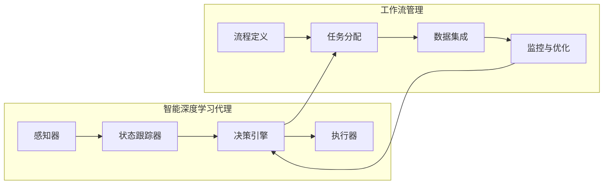

# AI人工智能深度学习算法：智能深度学习代理的工作流整合方法

## 1.背景介绍

### 1.1 人工智能发展概述

人工智能(Artificial Intelligence, AI)是当代科技发展的前沿领域,旨在通过使用算法和软件来模拟人类的认知功能,如学习、推理、感知、行为等。近年来,AI取得了长足进步,尤其是在深度学习(Deep Learning)和机器学习(Machine Learning)等技术的推动下,AI系统在语音识别、图像处理、自然语言处理等领域表现出色,正逐步深入并改变着人类的生产和生活方式。

### 1.2 智能代理与工作流

在AI系统中,智能代理(Intelligent Agent)扮演着关键角色。智能代理是一种自主的软件实体,能够感知环境、处理信息、作出决策并采取行动以完成特定目标。工作流(Workflow)则是指为完成某项任务而定义的一系列有序活动。将智能代理与工作流相结合,可实现自动化和智能化的任务处理,提高效率和决策质量。

### 1.3 智能深度学习代理的重要性

传统的工作流系统通常依赖人工干预和决策,效率低下且容易出错。相比之下,智能深度学习代理能够自主学习和优化决策过程,从而实现高效、准确、可扩展的工作流管理。此外,智能代理可应用于各种复杂的决策场景,如供应链优化、医疗诊断、金融风险管理等,为企业带来巨大价值。

## 2.核心概念与联系  

### 2.1 深度学习

深度学习是机器学习的一个新兴热点领域,其灵感来源于人类大脑的结构和功能。深度学习算法通过对数据的建模抽象,自动学习数据特征模式,并用以完成检测、分类等任务。常见的深度学习模型有卷积神经网络(CNN)、递归神经网络(RNN)、长短期记忆网络(LSTM)等。

### 2.2 智能代理

智能代理是具备一定智能的软件实体,能够根据感知的环境状态自主做出决策并执行相应动作。智能代理一般由以下几个核心组件构成:

- 感知器(Sensor):用于获取环境状态信息
- 执行器(Actuator):用于在环境中执行动作
- 状态跟踪器(State Tracker):维护代理当前状态
- 决策引擎(Decision Engine):根据状态选择最优动作

### 2.3 工作流管理

工作流管理是指对组织内部工作活动的部署、执行、监控和优化。一个完整的工作流包括以下关键要素:

- 流程定义:对工作活动及其执行顺序的形式化描述
- 任务分配:将工作活动合理分配给执行者
- 数据集成:跨应用程序和系统共享相关数据
- 监控与优化:实时监视流程执行并持续优化

### 2.4 智能深度学习代理与工作流的联系

智能深度学习代理与工作流管理存在内在联系:

- 决策引擎利用深度学习算法学习历史工作流数据,优化任务分配决策
- 工作流执行过程中产生的数据反馈给代理,用于持续改进决策模型
- 代理的执行器根据决策引擎的指令驱动工作流的自动化执行
- 工作流监控与优化为代理提供环境感知,指导其动态调整决策

两者的紧密结合实现了高度智能化的工作流管理,提高了效率和决策质量。

## 3.核心算法原理具体操作步骤

### 3.1 深度强化学习

深度强化学习(Deep Reinforcement Learning)是将深度学习与强化学习(Reinforcement Learning)相结合的技术,常用于训练智能代理。其核心思想是让代理通过不断与环境交互、试错并获得反馈来优化自身的决策策略,从而达到最大化预期累积奖励的目标。

强化学习过程包括以下几个关键要素:

- **环境(Environment)**: 代理所处的状态空间
- **状态(State)**: 环境的当前具体状态
- **动作(Action)**: 代理可执行的操作
- **奖励(Reward)**: 代理执行动作后获得的反馈
- **策略(Policy)**: 代理根据状态选择动作的策略函数

强化学习算法的目标是学习一个最优策略$\pi^*$,使代理在该策略指导下的预期累积奖励最大化:

$$\pi^* = \arg\max_\pi \mathbb{E}\left[\sum_{t=0}^\infty \gamma^t r_t | \pi\right]$$

其中$r_t$是时间步$t$获得的奖励,$\gamma$是折现因子。

### 3.2 Deep Q-Network (DQN)算法

DQN是将深度神经网络应用于Q-Learning的一种强化学习算法,常用于训练智能代理。Q-Learning的核心是学习一个动作价值函数$Q(s,a)$,表示在状态$s$下执行动作$a$的预期累积奖励。

DQN使用一个神经网络来拟合$Q(s,a)$函数,并通过与环境交互不断更新网络参数,使$Q(s,a)$逼近真实的动作价值函数。算法流程如下:

1. 初始化神经网络参数$\theta$,创建经验回放池$D$
2. 对于每个时间步:
    a) 根据当前策略选择动作$a_t = \arg\max_a Q(s_t,a;\theta)$
    b) 执行动作$a_t$,观测奖励$r_t$和新状态$s_{t+1}$
    c) 将$(s_t,a_t,r_t,s_{t+1})$存入经验回放池$D$
    d) 从$D$中随机采样批量数据,计算目标值$y_i = r_i + \gamma \max_{a'} Q(s_{i+1}, a';\theta^-)$
    e) 优化损失函数$L(\theta) = \mathbb{E}_{(s,a,r,s')\sim D}\left[(y_i - Q(s_i,a_i;\theta))^2\right]$,更新$\theta$
3. 重复步骤2,直至收敛

通过上述过程,DQN算法能够逐步学习出一个近似最优的策略,指导智能代理在各种状态下选择最佳动作。

### 3.3 Policy Gradient算法

Policy Gradient是另一种常用的深度强化学习算法,直接对代理的策略函数$\pi_\theta(a|s)$进行参数化,通过梯度上升法最大化策略的预期累积奖励:

$$\nabla_\theta J(\theta) = \mathbb{E}_{\pi_\theta}\left[\sum_{t=0}^\infty \nabla_\theta \log\pi_\theta(a_t|s_t)Q^{\pi_\theta}(s_t,a_t)\right]$$

其中$Q^{\pi_\theta}(s_t,a_t)$是在策略$\pi_\theta$指导下,状态$s_t$执行动作$a_t$的动作价值函数。

算法具体步骤为:

1. 初始化策略网络参数$\theta$
2. 对于每个时间步:
    a) 根据当前策略$\pi_\theta(a|s_t)$选择动作$a_t$
    b) 执行动作$a_t$,观测奖励$r_t$和新状态$s_{t+1}$
    c) 计算累积奖励$R_t = \sum_{i=t}^T \gamma^{i-t}r_i$
    d) 计算策略梯度$\nabla_\theta \log\pi_\theta(a_t|s_t)R_t$
    e) 通过梯度上升法更新$\theta$
3. 重复步骤2,直至收敛

Policy Gradient算法直接优化策略函数,常用于连续动作空间的强化学习问题。

## 4.数学模型和公式详细讲解举例说明

在上一节中,我们介绍了深度强化学习的核心算法DQN和Policy Gradient。这一节将详细解释其中涉及的数学模型和公式,并给出具体例子加深理解。

### 4.1 马尔可夫决策过程(MDP)

强化学习问题通常建模为马尔可夫决策过程(Markov Decision Process, MDP)。MDP是一种离散时间随机控制过程,由以下5个要素组成:

- 状态集合$\mathcal{S}$
- 动作集合$\mathcal{A}$  
- 状态转移概率$\mathcal{P}_{ss'}^a = \Pr(s_{t+1}=s'|s_t=s,a_t=a)$
- 奖励函数$\mathcal{R}_s^a = \mathbb{E}[r_{t+1}|s_t=s,a_t=a]$
- 折现因子$\gamma \in [0, 1)$

在MDP中,代理处于某一状态$s \in \mathcal{S}$,选择一个动作$a \in \mathcal{A}$执行,然后根据状态转移概率$\mathcal{P}_{ss'}^a$转移到新状态$s' \in \mathcal{S}$,并获得奖励$r = \mathcal{R}_s^a$。代理的目标是学习一个策略$\pi: \mathcal{S} \rightarrow \mathcal{A}$,使预期累积折现奖励最大化:

$$J(\pi) = \mathbb{E}_\pi\left[\sum_{t=0}^\infty \gamma^t r_t\right]$$

例如,考虑一个简单的格子世界,代理需要从起点移动到终点。每移动一步代理会获得-1的奖励,到达终点获得+100的奖励。该问题可建模为一个MDP:

- $\mathcal{S}$为所有可能的格子位置
- $\mathcal{A} = \{\text{上,下,左,右}\}$
- $\mathcal{P}_{ss'}^a$为根据动作$a$从$s$移动到$s'$的概率(确定性环境为1或0)
- $\mathcal{R}_s^a=-1$,除了到达终点时为100
- $\gamma=0.9$

通过与该MDP环境交互,代理可以学习出一个最优策略,指导它以最短路径到达终点。

### 4.2 Q-Learning算法

Q-Learning是一种基于时序差分(Temporal Difference, TD)的强化学习算法,用于估计最优动作价值函数:

$$Q^*(s,a) = \mathbb{E}_\pi\left[\sum_{k=0}^\infty \gamma^k r_{t+k+1} | s_t=s, a_t=a, \pi\right]$$

也就是在状态$s$下执行动作$a$,之后按策略$\pi$行动所能获得的预期累积奖励。一旦学习到了$Q^*$,则可以简单地通过$\pi^*(s) = \arg\max_a Q^*(s,a)$得到最优策略。

Q-Learning使用以下迭代方式更新$Q$函数的估计值:

$$Q(s_t,a_t) \leftarrow Q(s_t,a_t) + \alpha\left[r_t + \gamma\max_{a'}Q(s_{t+1},a') - Q(s_t,a_t)\right]$$

其中$\alpha$是学习率。该更新规则将$Q(s_t,a_t)$朝着TD目标$r_t + \gamma\max_{a'}Q(s_{t+1},a')$的方向调整,从而逐步改进$Q$函数估计。

以格子世界为例,假设代理当前在状态$s_t$执行动作$a_t=\text{右}$,获得奖励$r_t=-1$并转移到新状态$s_{t+1}$。此时TD目标为:

$$r_t + \gamma\max_{a'}Q(s_{t+1},a') = -1 + 0.9 \times \max\begin{cases}
Q(s_{t+1},\text{上})\\
Q(s_{t+1},\text{下})\\
Q(s_{t+1},\text{左})\\
Q(s_{t+1},\text{右})
\end{cases}$$

我们将$Q(s_t,\text{右})$朝着该目标值调整一小步,从而更新对$(s_t,\text{右})$状态动作对的价值估计。通过不断与环境交互并应用该更新规则