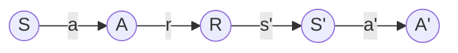

# AI人工智能深度学习算法：智能深度学习代理的未来发展趋势

## 1. 背景介绍

### 1.1 人工智能的发展历程

人工智能(Artificial Intelligence, AI)作为计算机科学的一个分支,旨在研究如何让机器模拟甚至超越人类的智能。自1956年达特茅斯会议首次提出"人工智能"这一概念以来,AI经历了从早期的符号主义、专家系统,到90年代的统计学习和神经网络,再到21世纪的深度学习等多个发展阶段。

### 1.2 深度学习的兴起

近十年来,以深度学习(Deep Learning, DL)为代表的AI技术取得了突破性进展。DL通过构建多层神经网络,利用海量数据进行训练,使机器能够自动学习数据中蕴含的复杂模式和规律,从而大幅提升了语音识别、图像识别、自然语言处理等领域的性能。

### 1.3 智能代理的崛起

伴随DL的发展,一种新型的AI系统——智能代理(Intelligent Agent)开始崭露头角。智能代理是一种能够感知环境、自主学习和决策,并与人类或其他代理进行交互的AI系统。AlphaGo、Siri、无人驾驶汽车等都可视为智能代理的典型应用。

## 2. 核心概念与联系

### 2.1 深度学习

深度学习是一种基于人工神经网络(Artificial Neural Network, ANN)的机器学习方法。传统的浅层ANN只包含1~2个隐藏层,而DL模型通常有5层、10层,甚至上百层的网络结构,能够学习到更加抽象和复杂的特征表示。

### 2.2 强化学习

强化学习(Reinforcement Learning, RL)是一种让智能体通过与环境的交互来学习最优决策的机器学习范式。RL中的智能体接收环境的状态输入,根据一定的策略选择行动,并从环境反馈中获得奖励,通过最大化累积奖励来不断优化策略。

### 2.3 深度强化学习

深度强化学习(Deep Reinforcement Learning, DRL)将DL和RL结合,用深度神经网络逼近RL中的策略函数或价值函数,极大地提升了传统RL方法处理高维观测空间的能力。DRL已在AlphaGo、Atari游戏、机器人控制等领域取得了重大突破。

### 2.4 多智能体学习

多智能体学习(Multi-Agent Learning, MAL)研究多个智能体在同一环境下如何通过学习来协调配合、竞争博弈。MAL不仅要考虑单个智能体的决策优化,还需兼顾智能体之间的信息交互与策略协同。

## 3. 核心算法原理具体操作步骤

### 3.1 深度Q网络(DQN)

DQN是将Q学习与深度神经网络相结合的DRL算法。其主要步骤如下:

1. 初始化Q网络参数$\theta$,目标网络参数$\theta^-$
2. 初始化经验回放池$D$
3. for episode = 1 to M do
   1. 初始化环境状态$s_1$
   2. for t = 1 to T do 
      1. 根据$\epsilon-greedy$策略选择动作$a_t$
      2. 执行$a_t$,观测奖励$r_t$和下一状态$s_{t+1}$
      3. 将转移样本$(s_t,a_t,r_t,s_{t+1})$存入$D$
      4. 从$D$中随机采样一批转移样本$(s,a,r,s')$
      5. 计算目标值$y=r+\gamma max_{a'}Q(s',a';\theta^-)$
      6. 最小化损失$L(\theta)=\mathbb{E}[(y-Q(s,a;\theta))^2]$,更新$\theta$
      7. 每C步同步目标网络参数$\theta^-=\theta$
   3. end for
4. end for

### 3.2 深度确定性策略梯度(DDPG)

DDPG结合了DQN和演员-评论家(Actor-Critic)架构,可直接学习连续动作空间上的策略。其主要步骤如下:

1. 随机初始化演员网络$\mu(s|\theta^\mu)$和评论家网络$Q(s,a|\theta^Q)$
2. 初始化目标网络参数$\theta^{\mu'}=\theta^\mu,\theta^{Q'}=\theta^Q$
3. 初始化经验回放池$R$
4. for episode = 1 to M do
   1. 初始化环境获得初始状态$s_1$
   2. for t = 1 to T do
      1. 根据$\mu(s_t)$选择动作$a_t$,并添加探索噪声$\mathcal{N}_t$
      2. 执行$a_t$,观测奖励$r_t$和新状态$s_{t+1}$
      3. 将$(s_t,a_t,r_t,s_{t+1})$存入$R$
      4. 从$R$中采样一批转移样本$(s,a,r,s')$
      5. 计算目标值$y=r+\gamma Q'(s',\mu'(s'))$
      6. 更新评论家参数$\theta^Q$,最小化损失$L=\frac{1}{N}\sum_i(y_i-Q(s_i,a_i))^2$
      7. 更新演员参数$\theta^\mu$,策略梯度为$\nabla_{\theta^\mu}J=\frac{1}{N}\sum_i\nabla_aQ(s,a)\nabla_{\theta^\mu}\mu(s)$
      8. 软更新目标网络参数$\theta^{Q'}=\tau\theta^Q+(1-\tau)\theta^{Q'},\theta^{\mu'}=\tau\theta^\mu+(1-\tau)\theta^{\mu'}$
   3. end for
5. end for

### 3.3 异步优势演员-评论家(A3C)

A3C采用多个并行的演员-评论家,每个演员与环境独立交互,异步更新全局策略网络。其主要步骤如下:

1. 初始化全局策略网络参数$\theta$和$\theta_v$
2. 设置并行演员-评论家数量为$N$
3. for agent = 1 to N do
   1. 初始化环境,获得初始状态$s_0$
   2. 初始化agent参数$\theta'=\theta,\theta_v'=\theta_v$
   3. 设置$t_{start}=t$
   4. repeat
      1. 根据$\pi(a_t|s_t;\theta')$选择$a_t$,执行$a_t$
      2. 观测$r_t,s_{t+1}$
      3. if $s_{t+1}$是终止状态 then
         1. 计算回报$R=\left\{\begin{matrix}0 & \text{if }s_{t+1}\text{ is terminal} \\ V(s_{t+1};\theta_v') & \text{otherwise}\end{matrix}\right.$
      4. else
         1. $R=r_t+\gamma R$
      5. 计算优势函数$A=R-V(s_t;\theta_v')$
      6. 累积梯度$d\theta=d\theta+\nabla_{\theta'}\log\pi(a_t|s_t;\theta')A$
      7. 累积$dv=dv+\partial(R-V(s_t;\theta_v'))^2/\partial\theta_v'$
      8. $s_t=s_{t+1}$
      9. $t=t+1$
      10. if $s_t$是终止状态 or $t-t_{start}==t_{max}$ then
          1. 异步更新$\theta$使用$d\theta,\theta_v$使用$dv$
          2. $\theta'=\theta,\theta_v'=\theta_v$
          3. $t_{start}=t$
          4. $dv=0,d\theta=0$
   5. until $T>T_{max}$
4. end for

## 4. 数学模型和公式详细讲解举例说明

### 4.1 马尔可夫决策过程(MDP)

强化学习问题通常被建模为马尔可夫决策过程(Markov Decision Process, MDP)。一个MDP由一个五元组$\mathcal{M}=\langle\mathcal{S},\mathcal{A},\mathcal{P},\mathcal{R},\gamma\rangle$定义:

- $\mathcal{S}$是有限的状态集
- $\mathcal{A}$是有限的动作集
- $\mathcal{P}:\mathcal{S}\times\mathcal{A}\times\mathcal{S}\to[0,1]$是状态转移概率函数,$\mathcal{P}_{ss'}^a=\mathbb{P}[S_{t+1}=s'|S_t=s,A_t=a]$表示在状态$s$下执行动作$a$后转移到状态$s'$的概率
- $\mathcal{R}:\mathcal{S}\times\mathcal{A}\to\mathbb{R}$是奖励函数,$\mathcal{R}_s^a=\mathbb{E}[R_{t+1}|S_t=s,A_t=a]$表示在状态$s$下执行动作$a$获得的期望即时奖励
- $\gamma\in[0,1]$是折扣因子,表示未来奖励的重要程度

在MDP中,智能体与环境交互的过程可以用下图表示:



智能体在每个时间步$t$观测到状态$S_t\in\mathcal{S}$,根据策略$\pi(a|s)$选择一个动作$A_t\in\mathcal{A}$,环境接收到动作后,转移到下一个状态$S_{t+1}\sim\mathcal{P}_{S_tS_{t+1}}^{A_t}$,同时反馈给智能体一个即时奖励$R_{t+1}\sim\mathcal{R}_{S_t}^{A_t}$。

RL的目标是学习一个最优策略$\pi^*$,使得智能体能够获得最大的期望累积奖励:

$$\pi^*=\arg\max_\pi\mathbb{E}_\pi\left[\sum_{t=0}^\infty\gamma^tR_{t+1}\right]$$

### 4.2 值函数与贝尔曼方程

为了评估一个策略的好坏,引入状态值函数$V^\pi(s)$和动作值函数$Q^\pi(s,a)$:

- 状态值函数:$V^\pi(s)=\mathbb{E}_\pi\left[\sum_{k=0}^\infty\gamma^kR_{t+k+1}|S_t=s\right]$,表示从状态$s$开始,遵循策略$\pi$能获得的期望累积奖励
- 动作值函数:$Q^\pi(s,a)=\mathbb{E}_\pi\left[\sum_{k=0}^\infty\gamma^kR_{t+k+1}|S_t=s,A_t=a\right]$,表示在状态$s$下选择动作$a$,遵循策略$\pi$能获得的期望累积奖励

值函数满足贝尔曼方程(Bellman Equation):

$$V^\pi(s)=\sum_a\pi(a|s)\sum_{s',r}\mathcal{P}_{ss'}^a[r+\gamma V^\pi(s')]$$

$$Q^\pi(s,a)=\sum_{s',r}\mathcal{P}_{ss'}^a[r+\gamma\sum_{a'}\pi(a'|s')Q^\pi(s',a')]$$

最优值函数$V^*(s)$和$Q^*(s,a)$满足最优贝尔曼方程:

$$V^*(s)=\max_a\sum_{s',r}\mathcal{P}_{ss'}^a[r+\gamma V^*(s')]$$

$$Q^*(s,a)=\sum_{s',r}\mathcal{P}_{ss'}^a[r+\gamma\max_{a'}Q^*(s',a')]$$

当我们获得了最优动作值函数$Q^*$后,最优策略可以通过在每个状态选择使$Q^*$最大化的动作得到:

$$\pi^*(s)=\arg\max_aQ^*(s,a)$$

### 4.3 示例:网格世界导航

考虑如下的一个网格世界导航任务:

```
+---+---+---+---+
| S |   |   | T |
+---+---+---+---+
|   |   | X |   |
+---+---+---+---+
|   |   |   |   |
+---+---+---+---+
```

智能体初始位于网格的左上角(S),目标是导航到右上角的终点(T),同时要避免中间的障碍物(X)。

我们可以将这个任务建模为一个MDP:

- 状态空间$\mathcal{S}$:网格中的每个位置$(i,j)$对应一个状态,共12个状态
- 动作空间$\mathcal{A