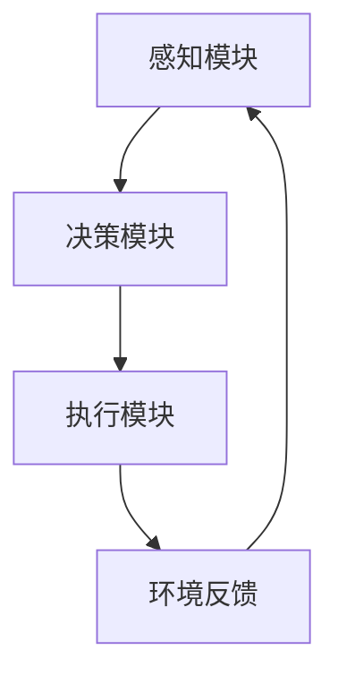

# AI人工智能深度学习算法：智能深度学习代理的自主行为与规划策略

## 1.背景介绍

人工智能（AI）和深度学习（DL）在过去十年中取得了显著的进展，推动了许多领域的技术革新。从自动驾驶汽车到智能家居设备，AI的应用无处不在。深度学习作为AI的一个重要分支，通过模拟人脑的神经网络结构，能够处理复杂的模式识别和决策问题。本文将深入探讨智能深度学习代理的自主行为与规划策略，揭示其背后的核心算法和实际应用。

## 2.核心概念与联系

### 2.1 深度学习

深度学习是一种机器学习方法，利用多层神经网络来学习数据的表示。其核心在于通过层层抽象，逐步提取数据的高层特征。

### 2.2 智能代理

智能代理是能够自主感知环境并采取行动以实现特定目标的系统。智能代理通常具备感知、决策和执行三个主要功能。

### 2.3 自主行为与规划

自主行为指的是智能代理在没有外部干预的情况下，基于感知到的环境信息进行决策和行动。规划策略则是指智能代理在实现目标过程中所采用的步骤和方法。

### 2.4 核心概念联系

深度学习为智能代理提供了强大的感知和决策能力，而自主行为和规划策略则是智能代理实现目标的关键。三者的有机结合，使得智能代理能够在复杂环境中自主行动。

## 3.核心算法原理具体操作步骤

### 3.1 感知模块

感知模块负责从环境中获取信息，并将其转换为适合处理的形式。常用的感知算法包括卷积神经网络（CNN）和循环神经网络（RNN）。

### 3.2 决策模块

决策模块基于感知模块提供的信息，利用深度强化学习（DRL）算法进行决策。DRL结合了深度学习和强化学习的优点，能够在复杂环境中学习最优策略。

### 3.3 执行模块

执行模块负责将决策模块的输出转化为具体的行动。执行模块通常需要考虑物理约束和安全性问题。

### 3.4 算法流程图



## 4.数学模型和公式详细讲解举例说明

### 4.1 深度学习模型

深度学习模型通常由多个层组成，每一层都可以表示为一个函数 $f(x)$。假设输入数据为 $x$，则第 $i$ 层的输出可以表示为：

$$
h_i = f_i(h_{i-1})
$$

其中，$h_0 = x$，$h_i$ 是第 $i$ 层的输出。

### 4.2 强化学习模型

强化学习模型通过与环境的交互来学习策略 $\pi$，其目标是最大化累积奖励 $R$。策略 $\pi$ 可以表示为：

$$
\pi(a|s) = P(a|s)
$$

其中，$a$ 是动作，$s$ 是状态。

### 4.3 深度强化学习模型

深度强化学习结合了深度学习和强化学习，其核心是利用深度神经网络来近似值函数 $Q(s, a)$：

$$
Q(s, a) = \mathbb{E}[R|s, a]
$$

通过不断更新网络参数 $\theta$，使得 $Q$ 函数逼近真实的值函数。

## 5.项目实践：代码实例和详细解释说明

### 5.1 环境搭建

首先，我们需要安装必要的库：

```bash
pip install tensorflow gym
```

### 5.2 感知模块代码示例

```python
import tensorflow as tf
from tensorflow.keras import layers

def create_cnn_model(input_shape):
    model = tf.keras.Sequential([
        layers.Conv2D(32, (3, 3), activation='relu', input_shape=input_shape),
        layers.MaxPooling2D((2, 2)),
        layers.Conv2D(64, (3, 3), activation='relu'),
        layers.MaxPooling2D((2, 2)),
        layers.Flatten(),
        layers.Dense(128, activation='relu'),
        layers.Dense(10, activation='softmax')
    ])
    return model
```

### 5.3 决策模块代码示例

```python
import gym
import numpy as np

env = gym.make('CartPole-v1')

def choose_action(state, model):
    q_values = model.predict(state)
    return np.argmax(q_values[0])

state = env.reset()
state = np.reshape(state, [1, 4])

action = choose_action(state, model)
```

### 5.4 执行模块代码示例

```python
def execute_action(action):
    next_state, reward, done, _ = env.step(action)
    return next_state, reward, done

next_state, reward, done = execute_action(action)
```

## 6.实际应用场景

### 6.1 自动驾驶

自动驾驶汽车需要在复杂的道路环境中自主决策和行动。深度学习和深度强化学习算法在感知、决策和执行方面发挥了重要作用。

### 6.2 智能家居

智能家居设备通过感知用户行为和环境变化，自动调整设置以提高用户体验。例如，智能温控器可以根据用户的作息时间自动调节温度。

### 6.3 医疗诊断

在医疗领域，深度学习算法被用于图像识别和疾病诊断。智能代理可以通过分析医疗图像，辅助医生进行诊断和治疗。

## 7.工具和资源推荐

### 7.1 开源框架

- TensorFlow：一个广泛使用的深度学习框架，支持多种神经网络模型的构建和训练。
- PyTorch：另一个流行的深度学习框架，以其灵活性和易用性著称。

### 7.2 数据集

- ImageNet：一个大型图像数据集，广泛用于图像分类和物体检测任务。
- OpenAI Gym：一个用于强化学习研究的工具包，提供了多种模拟环境。

### 7.3 在线课程

- Coursera上的深度学习课程：由Andrew Ng教授讲授，涵盖了深度学习的基础知识和应用。
- Udacity的深度强化学习纳米学位：提供了深度强化学习的系统学习路径。

## 8.总结：未来发展趋势与挑战

### 8.1 未来发展趋势

随着计算能力的提升和数据量的增加，深度学习和智能代理技术将继续快速发展。未来，智能代理将更加自主和智能，能够在更复杂的环境中执行任务。

### 8.2 挑战

尽管取得了显著进展，智能代理在实际应用中仍面临许多挑战。例如，如何在不确定和动态变化的环境中保持稳定性和安全性，如何处理多模态数据，以及如何提高算法的可解释性和透明性。

## 9.附录：常见问题与解答

### 9.1 深度学习和机器学习的区别是什么？

深度学习是机器学习的一个子集，主要关注使用多层神经网络来学习数据的表示。机器学习则包括了更广泛的算法和方法，如决策树、支持向量机等。

### 9.2 什么是深度强化学习？

深度强化学习结合了深度学习和强化学习，通过深度神经网络来近似值函数，从而在复杂环境中学习最优策略。

### 9.3 如何选择合适的深度学习框架？

选择深度学习框架时，应考虑项目的具体需求、团队的技术背景以及框架的社区支持。TensorFlow和PyTorch是目前最流行的两个框架，各有优劣。

### 9.4 智能代理的应用前景如何？

智能代理在自动驾驶、智能家居、医疗诊断等领域具有广阔的应用前景。随着技术的不断进步，智能代理将变得更加智能和自主。

---

作者：禅与计算机程序设计艺术 / Zen and the Art of Computer Programming