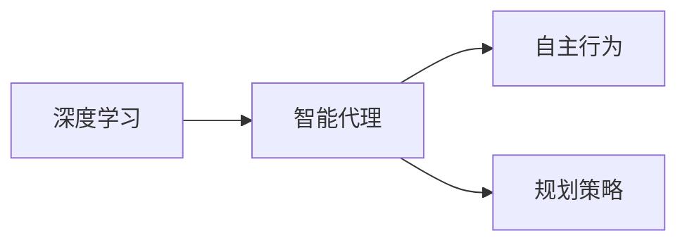

## 1.背景介绍

在过去的十年里，我们见证了人工智能（AI）和深度学习在各个领域的飞速发展。从图像识别到自然语言处理，再到游戏智能，深度学习已经在各个方面取得了显著的成果。然而，这一切的成就并没有让我们停下探索的脚步，相反，我们正在走向一个全新的领域：智能深度学习代理的自主行为与规划策略。

## 2.核心概念与联系

在讨论智能深度学习代理的自主行为与规划策略之前，我们首先需要理解几个核心概念：

- **深度学习**：深度学习是一种基于人工神经网络的机器学习技术。它通过模拟人脑神经网络的工作机制，让机器能够自主学习和理解数据。

- **智能代理**：智能代理是一种能够感知环境并根据环境做出决策的实体。在深度学习中，智能代理可以通过学习环境中的数据，自主地做出决策。

- **自主行为**：自主行为是指智能代理能够根据自己的判断和学习，而不是预设的规则，来做出决策和行动。

- **规划策略**：规划策略是指智能代理在做出决策时，会考虑未来可能的情况和结果，从而制定出最优的行动方案。

这四个概念之间的关系可以用下面的 Mermaid 流程图来表示：



## 3.核心算法原理具体操作步骤

智能深度学习代理的自主行为与规划策略的实现，主要依赖于强化学习算法。强化学习算法是一种让智能代理通过与环境的交互，自我学习和优化行为策略的方法。其基本步骤如下：

1. 初始化：初始化智能代理和环境的状态。

2. 选择行动：根据当前状态，智能代理选择一个行动。

3. 执行行动：智能代理执行选择的行动，并观察环境的反馈。

4. 学习更新：根据环境的反馈，智能代理更新自己的行为策略。

5. 循环：重复以上步骤，直到达到预设的学习目标。

## 4.数学模型和公式详细讲解举例说明

强化学习的核心是一个叫做状态-行动-奖励的循环过程。我们可以用数学公式来表示这个过程：

1. 状态 $S_t$：表示智能代理在时间 $t$ 的状态。

2. 行动 $A_t$：表示智能代理在时间 $t$ 根据状态 $S_t$ 选择的行动。

3. 奖励 $R_{t+1}$：表示智能代理在时间 $t+1$ 得到的奖励，这个奖励是根据行动 $A_t$ 和环境的反馈计算的。

4. 状态转移概率 $P_{ss'}^a = P[S_{t+1} = s' | S_t = s, A_t = a]$：表示在状态 $s$，采取行动 $a$ 后，转移到状态 $s'$ 的概率。

5. 奖励函数 $R_s^a = E[R_{t+1} | S_t = s, A_t = a]$：表示在状态 $s$，采取行动 $a$ 后，期望得到的奖励。

强化学习的目标是找到一个最优策略 $\pi*$，使得从任何状态 $s$ 开始，按照策略 $\pi*$ 行动，能够获得的总奖励最大。这个总奖励可以用以下公式表示：

$$G_t = R_{t+1} + \gamma R_{t+2} + \gamma^2 R_{t+3} + ... = \sum_{k=0}^{\infty} \gamma^k R_{t+k+1}$$

其中，$\gamma$ 是一个折扣因子，用来平衡即时奖励和未来奖励的重要性。

## 5.项目实践：代码实例和详细解释说明

以下是一个简单的强化学习算法实现，我们使用 Python 语言和 OpenAI 的 Gym 库来实现一个玩 CartPole 游戏的智能代理。

```python
import gym
import numpy as np

# 创建环境
env = gym.make('CartPole-v0')

# 初始化 Q-table
Q = np.zeros([env.observation_space.n, env.action_space.n])

# 参数设置
alpha = 0.5
gamma = 0.95
epsilon = 0.1
episodes = 50000

# 开始训练
for episode in range(episodes):
    state = env.reset()
    done = False

    while not done:
        # 选择行动
        if np.random.uniform(0, 1) < epsilon:
            action = env.action_space.sample()  # 随机选择行动
        else:
            action = np.argmax(Q[state, :])  # 选择最优行动

        # 执行行动
        next_state, reward, done, info = env.step(action)

        # 更新 Q-table
        Q[state, action] = Q[state, action] + alpha * (reward + gamma * np.max(Q[next_state, :]) - Q[state, action])

        # 更新状态
        state = next_state

# 测试智能代理
state = env.reset()
done = False
while not done:
    action = np.argmax(Q[state, :])  # 选择最优行动
    state, reward, done, info = env.step(action)  # 执行行动
    env.render()  # 渲染环境
env.close()
```

## 6.实际应用场景

智能深度学习代理的自主行为与规划策略在许多领域都有实际应用，例如：

- 游戏智能：通过强化学习，智能代理可以学习如何玩游戏，并达到超过人类玩家的水平。

- 自动驾驶：智能代理可以根据环境的变化，自主地做出驾驶决策，从而实现自动驾驶。

- 机器人控制：智能代理可以学习如何控制机器人的动作，使其能够完成各种复杂的任务。

## 7.工具和资源推荐

- **Python**：Python 是一种广泛用于科学计算和数据分析的编程语言，它有许多强大的库，如 NumPy、Pandas 和 Matplotlib，可以帮助我们进行数据处理和可视化。

- **OpenAI Gym**：OpenAI Gym 是一个用于开发和比较强化学习算法的工具包，它提供了许多预定义的环境，可以帮助我们快速地实现和测试强化学习算法。

- **TensorFlow**：TensorFlow 是一个开源的机器学习框架，它提供了许多高级的功能，如自动微分和优化算法，可以帮助我们更容易地实现深度学习模型。

## 8.总结：未来发展趋势与挑战

智能深度学习代理的自主行为与规划策略是人工智能的一个重要研究方向，它有着广阔的应用前景。然而，这个领域也面临着许多挑战，例如如何处理复杂的环境和不确定性，如何实现长期规划等。我们期待在未来的研究中，能够找到解决这些挑战的方法。

## 9.附录：常见问题与解答

1. **Q：强化学习和监督学习有什么区别？**

   A：强化学习和监督学习都是机器学习的方法，但它们的目标和方法有所不同。监督学习的目标是根据标签数据学习一个映射函数，而强化学习的目标是通过与环境的交互，学习一个最优的行为策略。

2. **Q：如何选择强化学习的参数，如学习率和折扣因子？**

   A：选择强化学习的参数通常需要根据具体的任务和环境来进行。一般来说，学习率决定了智能代理学习新知识的速度，折扣因子决定了智能代理对未来奖励的重视程度。

3. **Q：强化学习可以用于解决所有的问题吗？**

   A：强化学习是一种强大的机器学习方法，但并不是所有的问题都适合用强化学习来解决。强化学习适合于那些需要通过与环境的交互，进行试错学习的问题。

作者：禅与计算机程序设计艺术 / Zen and the Art of Computer Programming