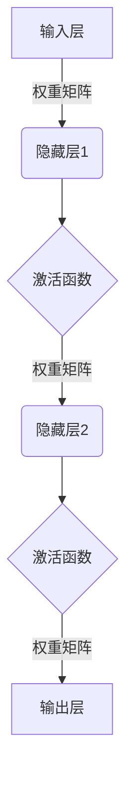

# AI人工智能深度学习算法：深度学习的挑战与前景

## 1.背景介绍

### 1.1 人工智能的兴起

人工智能(Artificial Intelligence, AI)是当代科技发展的前沿领域,近年来受到了前所未有的关注和投资。从语音助手到自动驾驶汽车,从医疗诊断到金融预测,AI技术正在渗透到各个行业,引领着科技革命的新浪潮。

### 1.2 深度学习的重要性

在AI的众多分支中,深度学习(Deep Learning)是最具革命性的技术之一。它是一种模仿人脑神经网络结构和工作原理的机器学习算法,能够从海量数据中自主学习特征模式,并对复杂问题进行预测和决策。深度学习在计算机视觉、自然语言处理、推荐系统等领域取得了突破性进展,成为AI技术发展的核心动力。

### 1.3 深度学习面临的挑战

尽管深度学习取得了令人鼓舞的成就,但它也面临着诸多挑战和局限性。例如,深度神经网络往往需要大量的训练数据和计算资源,存在"黑盒"问题难以解释,并且容易受到对抗性攻击的影响。此外,如何实现人工通用智能(Artificial General Intelligence, AGI)、解决少样本学习等问题,都是深度学习需要突破的重大难题。

## 2.核心概念与联系

### 2.1 神经网络

神经网络(Neural Network)是深度学习的核心概念,它是一种模仿生物神经系统的数学模型。神经网络由多层节点(神经元)组成,每个节点接收来自前一层的输入信号,经过非线性变换后传递到下一层。通过反复迭代和权重调整,神经网络可以从训练数据中学习到特征模式,并对新输入进行预测或决策。



### 2.2 深度学习模型

深度学习模型是指具有多个隐藏层的神经网络结构,例如:

- **卷积神经网络(CNN)**: 擅长处理图像和视频数据,在计算机视觉领域表现出色。
- **循环神经网络(RNN)**: 适用于序列数据处理,如自然语言处理和时间序列预测。
- **长短期记忆网络(LSTM)**: RNN的一种变体,能够更好地捕捉长期依赖关系。
- **生成对抗网络(GAN)**: 由生成网络和判别网络组成,可用于生成逼真的图像和语音。
- **变分自编码器(VAE)**: 通过学习数据的潜在分布来生成新样本。
- **transformer**: 基于注意力机制的序列模型,在机器翻译等任务中表现优异。

### 2.3 深度学习与其他机器学习的关系

深度学习是机器学习的一个重要分支,但两者并非完全等同。传统的机器学习算法(如决策树、支持向量机等)需要人工设计特征,而深度学习则能够自动从原始数据中学习特征表示。此外,深度学习模型通常具有更强的泛化能力,能够处理更复杂的任务,但也需要更多的计算资源和训练数据。

## 3.核心算法原理具体操作步骤

### 3.1 前向传播

前向传播(Forward Propagation)是深度神经网络的基本运算过程。它从输入层开始,将输入数据通过权重矩阵和激活函数逐层传递到输出层,得到最终的预测结果。具体步骤如下:

1. 输入层接收原始数据,如图像像素值或文本向量。
2. 隐藏层通过权重矩阵对输入进行线性变换,得到加权和。
3. 加权和通过非线性激活函数(如ReLU、Sigmoid等)进行变换,产生该层的输出。
4. 重复步骤2和3,将输出传递到下一隐藏层,直至到达输出层。
5. 输出层给出最终的预测结果,如分类概率或回归值。

### 3.2 反向传播

反向传播(Backpropagation)是深度学习模型训练的核心算法,它通过梯度下降法更新网络权重,使模型在训练数据上的预测误差最小化。具体步骤如下:

1. 计算输出层的预测误差(损失函数),如交叉熵损失或均方误差。
2. 根据链式法则,计算损失函数相对于输出层权重的梯度。
3. 将梯度值传递回前一隐藏层,计算相对于该层权重的梯度。
4. 重复步骤3,逐层计算并累积梯度,直至到达输入层。
5. 根据梯度值和学习率,更新每一层的权重矩阵。
6. 重复以上步骤,对训练数据进行多次迭代,直至模型收敛。

### 3.3 优化算法

为了加速训练收敛并提高模型性能,深度学习中常采用一些优化算法,如:

- **随机梯度下降(SGD)**: 每次更新时只使用一个或部分训练样本的梯度,计算高效但可能震荡较大。
- **动量优化(Momentum)**: 在梯度更新中引入动量项,帮助加速并跳出局部最优。
- **自适应学习率优化(AdaGrad、RMSProp、Adam)**: 根据历史梯度自动调整每个参数的学习率。
- **批归一化(Batch Normalization)**: 通过归一化输入数据的分布,加速收敛并提高泛化能力。

## 4.数学模型和公式详细讲解举例说明

### 4.1 神经网络模型

假设一个简单的全连接神经网络,输入层有$n$个神经元,隐藏层有$m$个神经元,输出层有$k$个神经元。令$\mathbf{x} = (x_1, x_2, \dots, x_n)^T$为输入向量,$\mathbf{y} = (y_1, y_2, \dots, y_k)^T$为期望输出向量。

1) 输入层到隐藏层的映射:

$$\mathbf{h} = f(\mathbf{W}^{(1)}\mathbf{x} + \mathbf{b}^{(1)})$$

其中,$\mathbf{W}^{(1)}$是$m \times n$的权重矩阵,$\mathbf{b}^{(1)}$是$m \times 1$的偏置向量,$f$是激活函数(如ReLU或Sigmoid)，对向量进行元素级运算。

2) 隐藏层到输出层的映射:

$$\hat{\mathbf{y}} = g(\mathbf{W}^{(2)}\mathbf{h} + \mathbf{b}^{(2)})$$

其中,$\mathbf{W}^{(2)}$是$k \times m$的权重矩阵,$\mathbf{b}^{(2)}$是$k \times 1$的偏置向量,$g$是输出层的激活函数(如Softmax或线性函数)。

3) 损失函数:

对于分类任务,常用交叉熵损失函数:

$$J(\theta) = -\frac{1}{N}\sum_{i=1}^N\sum_{j=1}^k y_j^{(i)}\log\hat{y}_j^{(i)}$$

对于回归任务,常用均方误差损失函数:

$$J(\theta) = \frac{1}{2N}\sum_{i=1}^N\|\mathbf{y}^{(i)} - \hat{\mathbf{y}}^{(i)}\|_2^2$$

其中,$\theta$是所有权重和偏置的集合,$N$是训练样本数量。

### 4.2 反向传播

根据链式法则,我们可以计算损失函数相对于每一层权重的梯度:

$$\frac{\partial J}{\partial \mathbf{W}^{(2)}} = \frac{\partial J}{\partial \hat{\mathbf{y}}}\frac{\partial \hat{\mathbf{y}}}{\partial \mathbf{W}^{(2)}}$$

$$\frac{\partial J}{\partial \mathbf{W}^{(1)}} = \frac{\partial J}{\partial \hat{\mathbf{y}}}\frac{\partial \hat{\mathbf{y}}}{\partial \mathbf{h}}\frac{\partial \mathbf{h}}{\partial \mathbf{W}^{(1)}}$$

通过反向传播算法,我们可以高效地计算这些梯度,并根据梯度下降法更新权重:

$$\mathbf{W}^{(l)} \leftarrow \mathbf{W}^{(l)} - \eta\frac{\partial J}{\partial \mathbf{W}^{(l)}}$$

其中,$\eta$是学习率,控制更新步长的大小。

### 4.3 优化算法公式

以动量优化(Momentum)为例,更新公式为:

$$\mathbf{v}_t = \gamma\mathbf{v}_{t-1} + \eta\nabla_{\theta}J(\theta_{t-1})$$
$$\theta_t = \theta_{t-1} - \mathbf{v}_t$$

其中,$\mathbf{v}_t$是当前动量向量,$\gamma$是动量系数,$\nabla_{\theta}J(\theta_{t-1})$是损失函数相对于$\theta$的梯度。

对于自适应学习率优化算法Adam,更新公式为:

$$\mathbf{m}_t = \beta_1\mathbf{m}_{t-1} + (1 - \beta_1)\nabla_{\theta}J(\theta_{t-1})$$
$$\mathbf{v}_t = \beta_2\mathbf{v}_{t-1} + (1 - \beta_2)(\nabla_{\theta}J(\theta_{t-1}))^2$$
$$\hat{\mathbf{m}}_t = \frac{\mathbf{m}_t}{1 - \beta_1^t}$$
$$\hat{\mathbf{v}}_t = \frac{\mathbf{v}_t}{1 - \beta_2^t}$$
$$\theta_t = \theta_{t-1} - \eta\frac{\hat{\mathbf{m}}_t}{\sqrt{\hat{\mathbf{v}}_t} + \epsilon}$$

其中,$\mathbf{m}_t$和$\mathbf{v}_t$分别是一阶和二阶动量估计,$\beta_1$和$\beta_2$是相应的指数衰减率,$\epsilon$是一个很小的常数,避免分母为0。

## 5.项目实践：代码实例和详细解释说明

以下是一个使用PyTorch框架构建的简单全连接神经网络示例,用于手写数字识别任务(MNIST数据集):

```python
import torch
import torch.nn as nn
import torch.nn.functional as F

# 定义网络结构
class Net(nn.Module):
    def __init__(self):
        super(Net, self).__init__()
        self.fc1 = nn.Linear(28 * 28, 512)  # 输入层到隐藏层
        self.fc2 = nn.Linear(512, 10)  # 隐藏层到输出层

    def forward(self, x):
        x = x.view(-1, 28 * 28)  # 将图像拉平为一维向量
        x = F.relu(self.fc1(x))  # 隐藏层使用ReLU激活函数
        x = self.fc2(x)  # 输出层无激活函数(分类问题)
        return x

# 实例化模型
model = Net()

# 定义损失函数和优化器
criterion = nn.CrossEntropyLoss()
optimizer = torch.optim.Adam(model.parameters(), lr=0.001)

# 训练循环
for epoch in range(10):
    running_loss = 0.0
    for i, data in enumerate(train_loader, 0):
        inputs, labels = data
        optimizer.zero_grad()  # 梯度清零

        outputs = model(inputs)  # 前向传播
        loss = criterion(outputs, labels)  # 计算损失
        loss.backward()  # 反向传播
        optimizer.step()  # 更新权重

        running_loss += loss.item()
        if i % 1000 == 999:
            print('[%d, %5d] loss: %.3f' %
                  (epoch + 1, i + 1, running_loss / 1000))
            running_loss = 0.0

# 测试
correct = 0
total = 0
with torch.no_grad():
    for data in test_loader:
        images, labels = data
        outputs = model(images)
        _, predicted = torch.max(outputs.data, 1)
        total += labels.size(0)
        correct += (predicted == labels).sum().item()

print('Accuracy on test set: %d %%' % (100 * correct / total))
```

代码解释:

1. 定义网络结构:输入层为28x28=784个神经元,隐藏层为512个神经元,输出层为10个