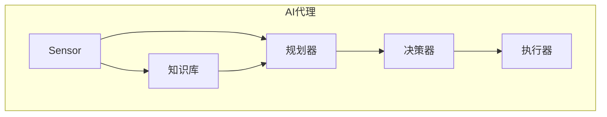

# AI代理在智慧农业中的工作流与决策支持

## 1.背景介绍

### 1.1 智慧农业的兴起

随着人口不断增长和气候变化的影响,确保粮食安全和可持续发展农业已成为当前人类社会面临的重大挑战。传统农业生产方式难以满足日益增长的需求,因此智慧农业应运而生。智慧农业是指利用物联网、大数据、人工智能等新兴技术,对农业生产全过程进行精细化管理和决策支持,从而实现农业可持续发展的新型农业模式。

### 1.2 AI代理在智慧农业中的作用

在智慧农业中,AI代理扮演着关键角色。AI代理是指具备一定智能和自主性的软件系统,能够根据预设目标和环境感知数据做出决策并执行相应行为。AI代理可广泛应用于农场环境监测、作物生长管理、病虫害防治、灌溉决策等智慧农业的各个环节,提高农业生产的效率和质量。

## 2.核心概念与联系

### 2.1 AI代理的构成

AI代理通常由以下几个核心组件构成:

1. **感知器(Sensor)**: 用于获取环境数据,如温湿度、光照、土壤数据等。
2. **执行器(Actuator)**: 根据决策执行相应动作,如控制灌溉系统、施肥机等。  
3. **知识库(Knowledge Base)**: 存储领域知识、规则、历史数据等。
4. **规划器(Planner)**: 根据目标、知识和感知数据生成行为计划。
5. **决策器(Decision Maker)**: 选择最优行为计划并发送给执行器。



### 2.2 AI代理与智慧农业的关系

AI代理在智慧农业中发挥着智能决策和自动化控制的作用,是实现精细化农业生产管理的关键。它们能够根据农场环境数据、作物生长模型等知识,自主生成最优决策并执行相应行为,如调节灌溉、施肥等,从而提高农业生产效率和可持续性。

## 3.核心算法原理具体操作步骤  

AI代理的核心在于根据感知数据、知识库和目标生成最优行为计划,并执行相应动作。这个过程一般遵循以下步骤:

1. **环境感知**: 通过各种传感器获取农场环境数据,如温湿度、光照、土壤数据等。

2. **状态表示**: 将获取的原始数据转化为代理可识别的状态表示,作为规划和决策的输入。

3. **目标设置**: 根据具体应用场景设置代理的目标,如最大化产量、最小化成本等。

4. **规划生成**: 基于当前状态、知识库和目标,通过搜索或学习算法生成一系列可选行为计划。常用算法有:
    - **启发式搜索算法**: 如A*算法、GBFS等,通过评估函数有针对性地搜索解空间。
    - **强化学习算法**: 如Q-Learning、Deep Q-Network等,通过试错学习获得最优策略。

5. **决策选择**: 根据一定策略(如最大化期望收益),从候选计划中选择一个最优计划。

6. **行为执行**: 通过执行器执行选定的行为计划,如控制灌溉系统、施肥机等设备。

7. **反馈学习**: 监测行为执行的效果,并将结果反馈至知识库,用于未来改进决策。

该过程是一个闭环,代理会持续感知环境、学习并优化决策,不断适应环境变化。

## 4.数学模型和公式详细讲解举例说明

AI代理的决策过程通常可以建模为**马尔可夫决策过程(MDP)** :

一个MDP可以用元组 $\langle \mathcal{S}, \mathcal{A}, \mathcal{P}, \mathcal{R}, \gamma \rangle$ 来表示:

- $\mathcal{S}$ 是代理可能处于的**状态集合**
- $\mathcal{A}$ 是代理可执行的**行为集合**  
- $\mathcal{P}(s, a, s')=\Pr(s_{t+1}=s'|s_t=s, a_t=a)$ 是**状态转移概率函数**
- $\mathcal{R}(s, a, s')$ 是在状态 $s$ 执行行为 $a$ 并转移到状态 $s'$ 时获得的**奖励**
- $\gamma \in [0, 1)$ 是**折现因子**,用于权衡即时奖励和长期收益

代理的目标是找到一个**策略** $\pi: \mathcal{S} \rightarrow \mathcal{A}$,使得期望的累积折现奖励最大:

$$
\max_\pi \mathbb{E}\left[ \sum_{t=0}^\infty \gamma^t R(s_t, a_t, s_{t+1}) \right]
$$

其中 $s_0$ 是初始状态, $a_t \sim \pi(s_t)$, $s_{t+1} \sim \mathcal{P}(s_t, a_t, \cdot)$。

常用的求解MDP的算法有**价值迭代**和**策略迭代**等。以价值迭代为例:

定义**状态价值函数** $V^\pi(s)$ 为在策略 $\pi$ 下从状态 $s$ 开始的期望累积折现奖励:

$$
V^\pi(s) = \mathbb{E}_\pi \left[ \sum_{t=0}^\infty \gamma^t R(s_t, a_t, s_{t+1}) | s_0 = s \right]
$$

则最优状态价值函数 $V^*(s)$ 满足**Bellman方程**:

$$
V^*(s) = \max_a \left\{ \mathcal{R}(s, a) + \gamma \sum_{s' \in \mathcal{S}} \mathcal{P}(s, a, s') V^*(s') \right\}
$$

可以通过**价值迭代算法**求解最优状态价值函数,进而得到最优策略:

```python
while True:
    delta = 0
    for s in S:
        v = V[s]
        V[s] = max(R(s, a) + gamma * sum(P(s, a, s_prime) * V[s_prime] for s_prime in S))
        delta = max(delta, abs(v - V[s]))
    if delta < theta:
        break
        
pi_star = {}
for s in S:
    pi_star[s] = argmax(R(s, a) + gamma * sum(P(s, a, s_prime) * V[s_prime] for s_prime in S))
```

以上是MDP和价值迭代的基本原理,在实际应用中还可以结合其他技术如深度学习、蒙特卡罗树搜索等提高性能。

## 5.项目实践:代码实例和详细解释说明

下面是一个基于强化学习的AI代理在温室大棚环境中控制灌溉的示例:

### 5.1 环境构建

我们首先定义智能温室大棚的环境,包括状态空间、行为空间和奖励函数。

```python
import numpy as np

class GreenHouseEnv:
    def __init__(self):
        self.max_soil_moisture = 100
        self.max_temp = 40
        self.min_temp = 10
        
        self.soil_moisture = 50 # 初始土壤湿度
        self.temp = 25 # 初始温度
        
    def step(self, action):
        """
        执行灌溉或不灌溉的动作,更新环境状态
        :param action: 0 不灌溉, 1 灌溉
        :return: 新状态, 奖励, 是否终止, 其他信息
        """
        self.soil_moisture += (20 * action - 5) # 灌溉增加湿度,自然减少湿度
        self.temp += (5 * action - 2) # 灌溉升高温度,自然降低温度
        
        # 计算奖励
        if self.min_temp <= self.temp <= self.max_temp and self.soil_moisture >= 40:
            reward = 1
        else:
            reward = -1
        
        # 判断是否需要重置环境
        done = bool(self.temp < self.min_temp or self.temp > self.max_temp or self.soil_moisture <= 0)
        
        # 限制状态范围
        self.soil_moisture = np.clip(self.soil_moisture, 0, self.max_soil_moisture)
        self.temp = np.clip(self.temp, self.min_temp, self.max_temp)
        
        state = (self.soil_moisture, self.temp)
        info = {}
        
        return state, reward, done, info
    
    def reset(self):
        """重置环境状态"""
        self.soil_moisture = 50
        self.temp = 25
        return (self.soil_moisture, self.temp)
```

### 5.2 训练智能体

接下来我们使用Deep Q-Network (DQN)算法训练一个智能体,学习控制灌溉的最优策略。

```python
import random
from collections import deque
import torch
import torch.nn as nn
import torch.optim as optim

class DQN(nn.Module):
    def __init__(self, state_dim, action_dim):
        super().__init__()
        self.fc1 = nn.Linear(state_dim, 64)
        self.fc2 = nn.Linear(64, action_dim)
        
    def forward(self, x):
        x = torch.relu(self.fc1(x))
        return self.fc2(x)

# 超参数
BUFFER_SIZE = 10000
BATCH_SIZE = 64
GAMMA = 0.99
TAU = 1e-3
LR = 1e-4
UPDATE_EVERY = 4

# 初始化环境和智能体
env = GreenHouseEnv()
state_dim = len(env.reset())
action_dim = 2 # 灌溉或不灌溉
agent = DQN(state_dim, action_dim)
target_agent = DQN(state_dim, action_dim)
optimizer = optim.Adam(agent.parameters(), lr=LR)
memory = deque(maxlen=BUFFER_SIZE)

# 训练循环
def train(n_episodes):
    scores = []
    for i_episode in range(n_episodes):
        state = env.reset()
        score = 0
        while True:
            action = agent.forward(torch.from_numpy(state).float()).max(0)[1].item()
            next_state, reward, done, _ = env.step(action)
            memory.append((state, action, reward, next_state, done))
            score += reward
            state = next_state
            if done:
                break
        scores.append(score)
        
        # 每UPDATE_EVERY步更新一次网络
        if i_episode % UPDATE_EVERY == 0:
            update_network(memory, optimizer)
            
        # 更新目标网络
        if i_episode % 100 == 0:
            target_agent.load_state_dict(agent.state_dict())
            
    return scores

# 从经验回放缓冲区中采样数据,并优化网络
def update_network(memory, optimizer):
    sample = random.sample(memory, BATCH_SIZE)
    states, actions, rewards, next_states, dones = zip(*sample)
    
    # 计算当前状态的Q值
    q_values = agent(torch.from_numpy(np.array(states)).float())
    q_values_next = target_agent(torch.from_numpy(np.array(next_states)).float()).detach().max(1)[0]
    
    # 计算目标Q值
    q_targets = rewards + GAMMA * q_values_next * (1 - np.array(dones))
    q_targets = q_targets.reshape(-1, 1)
    
    # 计算损失并优化网络
    loss = nn.MSELoss()(q_values.gather(1, torch.tensor(actions).long().view(-1, 1)), q_targets)
    optimizer.zero_grad()
    loss.backward()
    optimizer.step()
    
scores = train(1000)
```

通过上述代码,我们训练了一个DQN智能体,能够根据当前温室大棚的土壤湿度和温度状态,做出是否灌溉的最优决策,从而维持作物生长的理想环境。实际应用中,我们可以将训练好的智能体部署到真实的温室大棚系统中,与各种传感器和执行设备相连接,实现自动化智能控制。

## 6.实际应用场景

AI代理在智慧农业中有广泛的应用前景,主要包括以下几个方面:

### 6.1 农场环境监测

通过部署各种物联网传感器,AI代理可以实时监测农场的环境数据,如温湿度、光照、土壤养分等,为后续决策提供数据支持。

### 6.2 作物生长管理

结合作物生长模型、历史数据等知识,AI代理能够预测作物生长状况,并及时做出浇水、施肥、调节温室环境等管理决策,确保作物健康生长。

### 6.3 病虫害防治

AI代理可以通