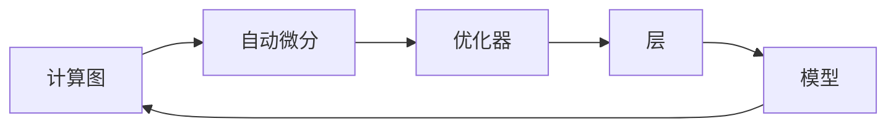

# AI开发框架原理与代码实战案例讲解

## 1. 背景介绍
随着人工智能技术的飞速发展，AI开发框架成为了支撑起整个行业的基石。从TensorFlow、PyTorch到Keras，这些框架极大地降低了AI技术的门槛，使得研究者和开发者能够专注于模型的设计与优化，而不必过多地关注底层的实现细节。本文将深入探讨AI开发框架的核心原理，并通过代码实战案例，帮助读者更好地理解和应用这些原理。

## 2. 核心概念与联系
AI开发框架的核心概念包括计算图、自动微分、优化器、层和模型等。计算图为模型的结构提供了清晰的可视化表示，自动微分则简化了梯度计算过程，优化器负责模型参数的更新，层和模型则是构建复杂网络的基本构件。这些概念相互联系，共同构成了AI开发框架的基础。



## 3. 核心算法原理具体操作步骤
AI框架中的核心算法包括前向传播、反向传播和参数更新。前向传播用于计算损失函数，反向传播通过链式法则计算梯度，参数更新则根据梯度调整模型参数以最小化损失函数。

## 4. 数学模型和公式详细讲解举例说明
以神经网络为例，其数学模型可以表示为一系列层的叠加，每层的输出是上一层输出的加权和经过非线性激活函数的变换。例如，对于单个神经元，其输出 $y$ 可以表示为：

$$ y = f(\sum_{i=1}^{n} w_i x_i + b) $$

其中，$x_i$ 是输入，$w_i$ 是权重，$b$ 是偏置，$f$ 是激活函数。

## 5. 项目实践：代码实例和详细解释说明
以TensorFlow为例，构建一个简单的全连接神经网络来解决二分类问题的代码如下：

```python
import tensorflow as tf

# 定义模型
model = tf.keras.Sequential([
    tf.keras.layers.Dense(10, activation='relu', input_shape=(None, 20)),
    tf.keras.layers.Dense(1, activation='sigmoid')
])

# 编译模型
model.compile(optimizer='adam', loss='binary_crossentropy', metrics=['accuracy'])

# 训练模型
model.fit(x_train, y_train, epochs=10, batch_size=32)
```

## 6. 实际应用场景
AI开发框架广泛应用于图像识别、自然语言处理、游戏AI、自动驾驶等多个领域。例如，在自然语言处理中，BERT模型的出现极大地推动了语言理解任务的发展。

## 7. 工具和资源推荐
除了TensorFlow和PyTorch，还有许多其他有用的工具和资源，如ONNX用于模型转换，MLflow用于机器学习生命周期管理，以及各种开源数据集和预训练模型。

## 8. 总结：未来发展趋势与挑战
AI开发框架未来的发展趋势包括更高的性能优化、更丰富的模型支持、更好的跨平台兼容性等。同时，随着AI技术的不断进步，如何保证模型的可解释性和安全性也成为了新的挑战。

## 9. 附录：常见问题与解答
Q1: 如何选择合适的AI开发框架？
A1: 需要根据项目需求、团队熟悉度和社区支持等因素综合考虑。

Q2: 如何提高模型的训练效率？
A2: 可以通过模型简化、数据预处理、分布式训练等方式来提高效率。

作者：禅与计算机程序设计艺术 / Zen and the Art of Computer Programming