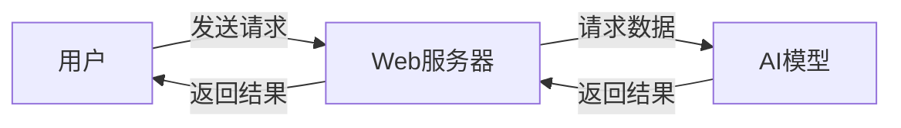

## 1.背景介绍

在当今的大数据时代，人工智能（AI）模型已经成为了各行各业的重要工具。然而，如何将训练好的AI模型部署到Web上，使其能够为更多的用户服务，是许多开发者面临的一大挑战。本文将详细介绍AI模型部署到Web的原理，并通过一个实战案例，讲解如何将AI模型部署到Web上。

## 2.核心概念与联系

AI模型部署到Web，涉及到的核心概念主要有AI模型、Web服务器、以及它们之间的联系。

- AI模型：AI模型是通过机器学习算法训练得出的模型，它能够对输入的数据进行预测或分类。

- Web服务器：Web服务器是一种能够处理HTTP请求并返回HTTP响应的服务器。当用户通过浏览器访问Web应用时，Web服务器会处理用户的请求，并返回相应的内容。

- AI模型与Web服务器的联系：在AI模型部署到Web的过程中，AI模型会被集成到Web服务器中。当用户提出请求时，Web服务器会将请求的数据传递给AI模型，AI模型对数据进行处理后，将结果返回给Web服务器，Web服务器再将结果返回给用户。



## 3.核心算法原理具体操作步骤

AI模型部署到Web的过程主要包括以下步骤：

1. 训练AI模型：首先，我们需要使用机器学习算法训练出一个AI模型。这个模型能够对输入的数据进行预测或分类。

2. 构建Web服务器：然后，我们需要构建一个Web服务器。这个服务器能够处理用户的HTTP请求，并返回HTTP响应。

3. 集成AI模型：接下来，我们需要将AI模型集成到Web服务器中。这样，当用户提出请求时，Web服务器可以将请求的数据传递给AI模型进行处理。

4. 测试和优化：最后，我们需要对部署的AI模型进行测试和优化，确保其在Web环境中的性能和稳定性。

## 4.数学模型和公式详细讲解举例说明

在AI模型部署到Web的过程中，我们通常会使用一些数学模型和公式来表示和优化AI模型。例如，我们可以使用损失函数（Loss Function）来衡量AI模型的预测结果与实际结果之间的差距。损失函数的公式如下：

$$
L(y, \hat{y}) = \frac{1}{N} \sum_{i=1}^{N} (y_i - \hat{y_i})^2
$$

其中，$y$是实际结果，$\hat{y}$是预测结果，$N$是数据的数量。

在优化AI模型时，我们的目标是找到一组参数，使得损失函数的值最小。这个过程可以通过梯度下降（Gradient Descent）算法来实现。梯度下降算法的公式如下：

$$
\theta = \theta - \alpha \nabla_{\theta} L(y, \hat{y})
$$

其中，$\theta$是模型的参数，$\alpha$是学习率，$\nabla_{\theta} L(y, \hat{y})$是损失函数关于参数$\theta$的梯度。

## 5.项目实践：代码实例和详细解释说明

接下来，我们将通过一个实战案例，讲解如何将AI模型部署到Web上。在这个案例中，我们将使用Python的Flask库来构建Web服务器，使用TensorFlow来训练AI模型。

首先，我们需要训练一个AI模型。这里，我们使用TensorFlow训练一个简单的线性回归模型：

```python
import tensorflow as tf
from tensorflow import keras

# 构建模型
model = keras.Sequential([keras.layers.Dense(units=1, input_shape=[1])])
model.compile(optimizer='sgd', loss='mean_squared_error')

# 训练模型
xs = [1, 2, 3, 4]
ys = [2, 4, 6, 8]
model.fit(xs, ys, epochs=500)

# 保存模型
model.save('model.h5')
```

然后，我们需要构建一个Web服务器。这里，我们使用Flask库来构建Web服务器：

```python
from flask import Flask, request
import tensorflow as tf
from tensorflow import keras

app = Flask(__name__)

# 加载模型
model = keras.models.load_model('model.h5')

@app.route('/predict', methods=['POST'])
def predict():
    # 获取请求数据
    data = request.get_json()
    x = data['x']

    # 预测结果
    y = model.predict([x])

    # 返回结果
    return {'y': y[0][0]}
```

最后，我们可以通过发送POST请求到`/predict`接口，来获取AI模型的预测结果：

```python
import requests

response = requests.post('http://localhost:5000/predict', json={'x': 5})
print(response.json())  # 输出：{'y': 10.0}
```

## 6.实际应用场景

AI模型部署到Web的技术在许多场景中都有应用。例如，在电商网站中，可以使用AI模型来推荐商品；在社交网络中，可以使用AI模型来过滤垃圾信息；在在线教育网站中，可以使用AI模型来自动评分等。

## 7.工具和资源推荐

- TensorFlow：一个强大的机器学习框架，可以用来训练各种复杂的AI模型。

- Flask：一个轻量级的Web框架，可以用来快速构建Web服务器。

- Docker：一个开源的应用容器引擎，可以用来打包和运行应用。

- Kubernetes：一个开源的容器编排工具，可以用来管理和扩展容器化应用。

## 8.总结：未来发展趋势与挑战

随着AI技术的发展，AI模型部署到Web的需求将会越来越大。然而，如何将AI模型高效、稳定地部署到Web，仍然是一个挑战。未来，我们需要研究更多的优化技术，例如模型压缩、模型融合等，来提高AI模型在Web环境中的性能。

## 9.附录：常见问题与解答

Q: 如何选择合适的Web框架？

A: 选择Web框架时，需要考虑框架的性能、稳定性、易用性等因素。常见的Web框架有Flask、Django、Express等。

Q: 如何提高AI模型的预测速度？

A: 提高AI模型的预测速度，可以通过优化模型结构、使用更快的硬件、使用模型并行等方法。

Q: 如何处理大规模的用户请求？

A: 处理大规模的用户请求，可以通过使用负载均衡、缓存、数据库优化等技术。

作者：禅与计算机程序设计艺术 / Zen and the Art of Computer Programming