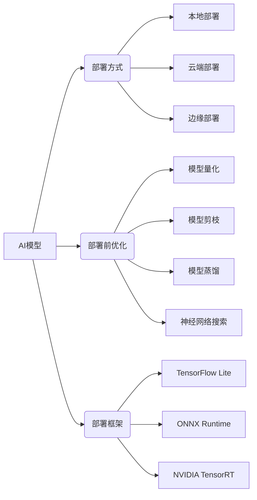

# AI模型部署原理与代码实战案例讲解

## 1. 背景介绍
### 1.1 AI模型部署的重要性
### 1.2 AI模型部署的挑战
### 1.3 本文的目标和结构

## 2. 核心概念与联系
### 2.1 AI模型的定义和类型
#### 2.1.1 监督学习模型
#### 2.1.2 无监督学习模型  
#### 2.1.3 强化学习模型
### 2.2 AI模型部署的定义
### 2.3 AI模型部署与模型训练、评估的关系
### 2.4 常见的AI模型部署方式
#### 2.4.1 本地部署
#### 2.4.2 云端部署
#### 2.4.3 边缘部署

## 3. 核心算法原理具体操作步骤
### 3.1 模型量化
#### 3.1.1 静态量化
#### 3.1.2 动态量化
#### 3.1.3 量化感知训练
### 3.2 模型剪枝
#### 3.2.1 非结构化剪枝
#### 3.2.2 结构化剪枝
#### 3.2.3 基于重要性的剪枝
### 3.3 模型蒸馏
#### 3.3.1 响应蒸馏
#### 3.3.2 特征蒸馏
#### 3.3.3 关系蒸馏
### 3.4 神经网络搜索
#### 3.4.1 强化学习搜索
#### 3.4.2 进化算法搜索 
#### 3.4.3 基于梯度的搜索

## 4. 数学模型和公式详细讲解举例说明
### 4.1 卷积神经网络压缩
#### 4.1.1 深度可分离卷积
#### 4.1.2 逐点组卷积
#### 4.1.3 通道混洗
### 4.2 循环神经网络加速
#### 4.2.1 低秩分解 
#### 4.2.2 参数共享
### 4.3 Transformer模型优化
#### 4.3.1 知识蒸馏
#### 4.3.2 层归一化
#### 4.3.3 可逆网络

## 5. 项目实践：代码实例和详细解释说明
### 5.1 使用TensorFlow Lite部署移动端模型
#### 5.1.1 环境配置
#### 5.1.2 模型转换
#### 5.1.3 Android部署
### 5.2 使用ONNX Runtime加速服务器端推理
#### 5.2.1 模型导出为ONNX格式
#### 5.2.2 ONNX Runtime加速  
#### 5.2.3 Web服务部署
### 5.3 使用NVIDIA TensorRT优化嵌入式设备模型
#### 5.3.1 TensorRT介绍
#### 5.3.2 模型解析与构建引擎
#### 5.3.3 Jetson Nano部署

## 6. 实际应用场景
### 6.1 智能手机上的人脸识别
### 6.2 自动驾驶中的目标检测
### 6.3 工业质检中的缺陷检测
### 6.4 智能家居中的语音交互

## 7. 工具和资源推荐 
### 7.1 模型压缩工具
#### 7.1.1 TensorFlow Model Optimization Toolkit
#### 7.1.2 NetAdapt
#### 7.1.3 PocketFlow
### 7.2 模型部署框架
#### 7.2.1 TensorFlow Serving
#### 7.2.2 NVIDIA Triton Inference Server
#### 7.2.3 Amazon SageMaker  
### 7.3 边缘计算平台
#### 7.3.1 NVIDIA Jetson
#### 7.3.2 Google Coral
#### 7.3.3 Intel OpenVINO

## 8. 总结：未来发展趋势与挑战
### 8.1 AI模型部署的发展趋势 
#### 8.1.1 轻量化与移动化
#### 8.1.2 云边端协同
#### 8.1.3 安全与隐私保护
### 8.2 AI模型部署面临的挑战
#### 8.2.1 模型适配与优化
#### 8.2.2 资源受限环境
#### 8.2.3 部署效率与成本  
### 8.3 未来的研究方向
#### 8.3.1 自动化部署流程
#### 8.3.2 跨平台与框架兼容
#### 8.3.3 AI模型的解释与可信

## 9. 附录：常见问题与解答
### 9.1 如何选择适合的部署方式？
### 9.2 模型量化会带来多大的精度损失？
### 9.3 边缘部署对硬件有哪些要求？
### 9.4 如何平衡模型压缩和性能的关系？
### 9.5 部署后如何监控模型性能并及时更新？

AI模型部署是将训练好的机器学习模型应用到实际生产环境中,使其能够为终端用户提供服务的过程。随着人工智能技术的快速发展,AI模型在图像识别、自然语言处理、推荐系统等领域得到了广泛应用。然而,训练好的模型要真正落地服务,还面临着诸多挑战,例如模型体积过大、推理速度较慢、资源消耗高等。因此,AI模型部署成为了实现AI商业价值的关键一环。

本文将从算法原理到工程实践,系统地介绍AI模型部署的相关技术。首先,我们将讨论AI模型部署的重要性以及面临的挑战。接着,介绍模型压缩和加速的核心算法,包括量化、剪枝、蒸馏等。然后,我们将通过数学模型和代码实例,详细说明这些算法的原理和实现。同时,本文也将介绍主流的模型部署工具和框架,如TensorFlow Lite、ONNX Runtime等。

在实践部分,我们将选取几个具有代表性的应用场景,如移动端人脸识别、自动驾驶目标检测等,展示如何使用前述技术将AI模型高效部署。通过这些实例,读者可以对AI模型部署的完整流程有一个直观的认识。

此外,本文还总结了AI模型部署领域的发展趋势,如云边端协同、自动化部署等,以及面临的挑战和未来的研究方向。在附录中,我们也收录了一些常见问题,如如何选择部署方式、如何权衡压缩和精度等,以帮助读者进一步理解AI模型部署中的实践考量。

总的来说,AI模型部署是一个涉及算法、工程、硬件的综合技术。通过对模型进行压缩、加速、优化,并结合云端、边缘的计算资源,我们能够让AI真正走出实验室,服务于各行各业。本文希望能为从事AI相关工作的研究者、工程师提供一个全面的参考,帮助大家掌握AI模型部署的关键技术,推动人工智能产业的发展。

上图展示了AI模型部署的总体架构。首先,我们需要根据具体应用场景,选择合适的部署方式,如本地部署、云端部署或边缘部署。然后,为了满足部署环境的资源限制,我们通常需要对原始模型进行压缩和加速优化,主要技术包括量化、剪枝、蒸馏和神经网络搜索等。最后,根据不同的部署环境和需求,选择相应的部署框架,如移动端的TensorFlow Lite、服务器端的ONNX Runtime以及嵌入式设备的NVIDIA TensorRT等。

接下来,我们将逐一详细介绍这些环节所涉及的核心技术原理和实践案例。

## 3. 核心算法原理具体操作步骤

### 3.1 模型量化

模型量化是指将模型中的浮点参数转换为定点数表示,从而减小模型体积和加速推理过程。常见的量化方法有:

#### 3.1.1 静态量化

静态量化是指在模型训练完成后,对权重进行量化。具体步骤如下:

1. 计算权重的最大值和最小值
2. 选择合适的量化位宽(如int8)和量化范围 
3. 对权重进行线性量化到定点数
4. 量化后的模型进行推理时,先将输入反量化为浮点数,再进行计算

静态量化可以显著减小模型体积,但可能导致一定的精度损失。

#### 3.1.2 动态量化

动态量化是指在推理过程中,根据输入数据的分布,动态调整量化范围。具体步骤如下:

1. 在模型中添加量化节点,用于统计输入数据的最大最小值 
2. 根据统计得到的范围,对输入进行量化
3. 量化后的数据用于后续的定点数计算
4. 计算结果再反量化为浮点数输出

动态量化能够更好地适应输入数据的分布,从而保持较高的精度。但其推理速度可能不如静态量化。

#### 3.1.3 量化感知训练

量化感知训练是指在模型训练过程中,就引入量化操作,让模型适应量化带来的精度损失。具体步骤如下:

1. 在前向传播中加入伪量化节点,模拟量化误差
2. 计算量化节点的梯度,将误差传递到权重 
3. 梯度更新时,同时更新伪量化节点的量化范围
4. 训练完成后,保存量化后的权重和量化范围参数

量化感知训练能够在量化后达到更高的精度,但训练时间会有所增加。

### 3.2 模型剪枝

模型剪枝是指将模型中不重要的连接或节点移除,从而获得更紧凑的网络结构。常见的剪枝方法有:

#### 3.2.1 非结构化剪枝

非结构化剪枝是指将权重矩阵中的个别元素剪除。具体步骤如下:

1. 根据某种重要性准则(如L1范数),对每个权重进行排序
2. 将重要性低于阈值的权重置零
3. 对剪枝后的稀疏矩阵进行重新训练,恢复精度

非结构化剪枝可以高度压缩模型,但生成的稀疏矩阵不规则,不利于加速推理。

#### 3.2.2 结构化剪枝

结构化剪枝是指按某种结构(如卷积核或滤波器)对权重进行剪除。具体步骤如下:

1. 计算每个结构的重要性(如L2范数) 
2. 将重要性低的结构整体移除
3. 对剪枝后的模型进行微调,恢复精度

结构化剪枝能够有效压缩模型,且生成规则的稀疏模式,便于加速推理。

#### 3.2.3 基于重要性的剪枝

基于重要性的剪枝是指通过估计每个连接或节点对模型性能的影响,来决定剪枝对象。常见的重要性估计方法有:

1. 基于梯度的重要性估计,如Taylor展开
2. 基于激活值的重要性估计,如平均激活值
3. 基于信息论的重要性估计,如互信息

这些方法能够更精确地识别出冗余结构,从而在保证精度的同时,获得更高的压缩率。

### 3.3 模型蒸馏

模型蒸馏是指使用一个大型的教师模型,来指导训练一个小型的学生模型,从而获得参数量更少但性能接近的模型。常见的蒸馏方法有:

#### 3.3.1 响应蒸馏

响应蒸馏是指让学生模型去模仿教师模型的输出概率分布。具体步骤如下:

1. 使用教师模型对训练数据进行推理,得到软目标概率(soft targets)
2. 学生模型在训练时,不仅要拟合真实的硬目标(hard targets),还要与教师模型的软目标最小化KL散度
3. 最终得到的学生模型,能够模仿教师模型的预测结果,但参数量更少

响应蒸馏