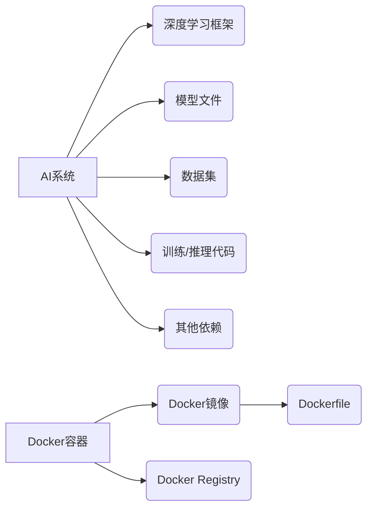

# AI系统Docker原理与代码实战案例讲解

## 1.背景介绍

### 1.1 AI系统的兴起与发展

近年来,人工智能(AI)技术在各个领域得到了广泛的应用和发展,从计算机视觉、自然语言处理到机器学习等,AI系统已经渗透到我们生活的方方面面。随着AI算法和模型的不断优化,以及计算能力的提升,AI系统的性能和应用场景也在不断扩展。

### 1.2 Docker容器化技术概述 

Docker作为一种开源的应用容器引擎,使开发人员可以打包应用及其依赖包到一个可移植的容器中,然后发布到任何流行的 Linux 或 Windows 操作系统的机器上。Docker 容器完全使用沙箱机制,相互之间不会有任何接口。容器的核心在于对系统资源进行隔离,使容器之间彼此互不影响。

### 1.3 Docker与AI系统的结合

将AI系统部署到生产环境中是一个巨大的挑战,因为AI系统通常需要复杂的环境依赖,包括特定版本的深度学习框架、Python库、CUDA/cuDNN等。Docker可以解决这个问题,将AI系统及其所有依赖打包到一个可移植的容器中,从而简化了部署和维护的过程。

## 2.核心概念与联系

### 2.1 Docker核心概念

- 镜像(Image):Docker 镜像是一个只读模板,用于创建 Docker 容器实例。
- 容器(Container):Docker 容器是镜像的一个运行实例。
- Dockerfile:用于定义Docker镜像的构建过程。
- Docker Registry:用于存储和分发Docker镜像的仓库。

### 2.2 AI系统与Docker的联系

AI系统通常由以下几个核心部分组成:

- 深度学习框架(如TensorFlow、PyTorch等)
- 模型文件
- 数据集
- 训练/推理代码
- 其他依赖(如CUDA、cuDNN等)

Docker可以将这些部分打包到一个容器中,从而确保在不同环境下运行时,依赖关系保持一致,避免了"在我的机器上可以运行"的问题。



## 3.核心算法原理具体操作步骤

### 3.1 Docker镜像构建

Docker镜像是通过Dockerfile构建的,Dockerfile包含了一系列指令,描述了如何从基础镜像开始一层层构建新镜像。以下是一个简单的Dockerfile示例:

```dockerfile
# 基础镜像
FROM nvidia/cuda:11.3.1-cudnn8-devel-ubuntu20.04

# 设置工作目录
WORKDIR /app

# 复制文件到容器中
COPY . .

# 安装Python依赖
RUN pip install --no-cache-dir -r requirements.txt

# 设置默认命令
CMD ["python", "app.py"]
```

构建镜像的命令:

```bash
docker build -t my-ai-app .
```

### 3.2 Docker容器运行

通过Docker镜像可以创建和运行容器实例,以下是一个示例:

```bash
# 运行容器
docker run -it --gpus all --rm -v $(pwd):/app my-ai-app

# 或者使用docker-compose运行
docker-compose up
```

`-it`参数表示交互式运行,`--gpus all`表示使用所有GPU资源,`--rm`表示容器退出后自动删除,`-v`表示挂载本地目录到容器中。

### 3.3 Docker Registry

Docker Registry用于存储和分发Docker镜像,最知名的是Docker Hub。我们可以将构建好的镜像推送到Registry中:

```bash
docker push my-registry.azurecr.io/my-ai-app:v1
```

其他人或服务就可以从Registry中拉取该镜像并运行容器。

## 4.数学模型和公式详细讲解举例说明

在AI系统中,数学模型和公式扮演着至关重要的角色。以下是一些常见的数学模型和公式:

### 4.1 线性回归

线性回归是一种常见的监督学习算法,用于预测连续值的目标变量。其数学表达式如下:

$$y = w_0 + w_1x_1 + w_2x_2 + ... + w_nx_n$$

其中$y$是目标变量,$x_i$是特征变量,$w_i$是权重参数。

### 4.2 逻辑回归

逻辑回归是一种用于二分类问题的算法,其数学表达式如下:

$$p(y=1|x) = \sigma(w_0 + w_1x_1 + w_2x_2 + ... + w_nx_n)$$

其中$\sigma$是Sigmoid函数:

$$\sigma(z) = \frac{1}{1+e^{-z}}$$

### 4.3 交叉熵损失函数

交叉熵损失函数常用于分类问题中,其数学表达式如下:

$$J(\theta) = -\frac{1}{m}\sum_{i=1}^m[y^{(i)}\log(h_\theta(x^{(i)})) + (1-y^{(i)})\log(1-h_\theta(x^{(i)}))]$$

其中$m$是样本数量,$y^{(i)}$是第$i$个样本的真实标签,$h_\theta(x^{(i)})$是模型对第$i$个样本的预测值。

## 5.项目实践:代码实例和详细解释说明

### 5.1 项目结构

以下是一个典型的AI项目结构:

```
my-ai-app/
├── data/
│   ├── train/
│   └── test/
├── models/
│   └── model.pth
├── src/
│   ├── train.py
│   ├── inference.py
│   └── utils.py
├── requirements.txt
├── Dockerfile
└── docker-compose.yml
```

- `data/`目录存放训练和测试数据集
- `models/`目录存放训练好的模型文件
- `src/`目录包含训练、推理和工具代码
- `requirements.txt`列出了Python依赖包
- `Dockerfile`定义了Docker镜像的构建过程
- `docker-compose.yml`用于使用Docker Compose编排多个容器服务

### 5.2 代码示例

以下是一个简单的PyTorch代码示例,用于训练和评估一个图像分类模型:

```python
# train.py
import torch
from torchvision import datasets, transforms
from torch.utils.data import DataLoader
import torch.nn as nn
import torch.optim as optim

# 定义数据转换
transform = transforms.Compose([
    transforms.Resize(256),
    transforms.CenterCrop(224),
    transforms.ToTensor(),
    transforms.Normalize(mean=[0.485, 0.456, 0.406], std=[0.229, 0.224, 0.225]),
])

# 加载数据集
train_dataset = datasets.ImageFolder('data/train', transform=transform)
test_dataset = datasets.ImageFolder('data/test', transform=transform)
train_loader = DataLoader(train_dataset, batch_size=32, shuffle=True)
test_loader = DataLoader(test_dataset, batch_size=32, shuffle=False)

# 定义模型
model = models.resnet18(pretrained=True)
num_ftrs = model.fc.in_features
model.fc = nn.Linear(num_ftrs, len(train_dataset.classes))

# 定义损失函数和优化器
criterion = nn.CrossEntropyLoss()
optimizer = optim.SGD(model.parameters(), lr=0.001, momentum=0.9)

# 训练循环
for epoch in range(10):
    running_loss = 0.0
    for inputs, labels in train_loader:
        optimizer.zero_grad()
        outputs = model(inputs)
        loss = criterion(outputs, labels)
        loss.backward()
        optimizer.step()
        running_loss += loss.item()
    print(f'Epoch {epoch+1} loss: {running_loss / len(train_loader)}')

# 评估模型
correct = 0
total = 0
with torch.no_grad():
    for inputs, labels in test_loader:
        outputs = model(inputs)
        _, predicted = torch.max(outputs.data, 1)
        total += labels.size(0)
        correct += (predicted == labels).sum().item()

print(f'Accuracy: {100 * correct / total}%')
```

该代码首先定义了数据转换和加载器,然后定义了ResNet18模型并对最后一层进行了修改以适应我们的分类任务。接下来是训练循环,使用交叉熵损失函数和SGD优化器进行模型训练。最后,我们在测试集上评估模型的准确率。

## 6.实际应用场景

Docker化的AI系统在实际应用中有着广泛的用途,以下是一些典型的场景:

### 6.1 云服务部署

许多云服务提供商(如AWS、Azure、GCP等)都支持在其平台上部署Docker容器。我们可以将打包好的AI系统镜像推送到云服务的容器注册表中,然后在云端启动容器实例,实现快速、可靠的部署。

### 6.2 边缘设备部署

除了云端部署,Docker容器也可以部署在边缘设备上,如工业机器人、自动驾驶汽车等。由于边缘设备的硬件资源通常有限,Docker的轻量级和可移植性就显得尤为重要。

### 6.3 CI/CD集成

在持续集成和持续交付(CI/CD)流程中,Docker可以发挥重要作用。我们可以在CI环节中自动构建Docker镜像,然后在CD环节中将镜像部署到目标环境中。这种方式可以确保应用程序在不同环境中的一致性。

### 6.4 本地开发和测试

Docker不仅适用于生产环境,在开发和测试阶段也可以发挥作用。开发人员可以在本地使用Docker进行隔离的开发和测试,避免了环境依赖的问题,提高了开发效率。

## 7.工具和资源推荐

### 7.1 Docker工具

- Docker Desktop: 用于在Windows和macOS上安装和运行Docker
- Docker Compose: 用于定义和运行多容器Docker应用程序
- Docker Machine: 用于在虚拟主机上安装Docker Engine
- Portainer: 一个轻量级的Docker管理用户界面

### 7.2 AI框架和库

- TensorFlow: 谷歌开源的端到端机器学习平台
- PyTorch: Facebook开源的机器学习库
- Keras: 高级神经网络API,可在TensorFlow或Theano之上运行
- scikit-learn: 用于机器学习的Python模块

### 7.3 在线资源

- Docker官方文档: https://docs.docker.com/
- TensorFlow官方文档: https://www.tensorflow.org/
- PyTorch官方文档: https://pytorch.org/docs/stable/index.html
- AI资源清单: https://github.com/dair-ai/ML-Resources

## 8.总结:未来发展趋势与挑战

### 8.1 AI系统的发展趋势

未来,AI系统将在以下几个方面得到进一步发展:

- 更强大的算法和模型,如大型语言模型、多模态模型等
- 更高效的硬件加速,如专用AI芯片、量子计算等
- 更丰富的应用场景,如自动驾驶、医疗诊断、智能助理等
- 更注重隐私保护和安全性,如联邦学习、加密计算等

### 8.2 Docker容器化的挑战

虽然Docker为AI系统的部署和运维带来了诸多便利,但也面临一些挑战:

- GPU资源利用率: 如何在容器中高效利用GPU资源
-存储和网络性能: 容器存储和网络通信的性能优化
-监控和日志记录: 如何对容器化的AI系统进行监控和日志记录
-安全性: 如何确保容器的安全性,防止被入侵和滥用

未来,Docker生态系统需要继续发展和完善,以更好地支持AI系统的需求。

## 9.附录:常见问题与解答

### 9.1 为什么要将AI系统容器化?

将AI系统容器化可以带来以下好处:

- 环境一致性: 确保AI系统在不同环境下运行时,依赖关系保持一致
- 可移植性: 容器可以在任何支持Docker的平台上运行
- 隔离性: 容器之间相互隔离,互不影响
- 轻量级: 容器比虚拟机更加轻量级,资源占用更小
- 可扩展性: 可以根据需求快速扩展或缩减容器实例

### 9.2 如何选择合适的基础镜像?

选择合适的基础镜像对于构建高效的Docker镜像至关重要。以下是一些建议:

- 尽可能选择官方镜像,如`nvidia/cuda`、`python`等
- 选择体积较小、只包含必要组件