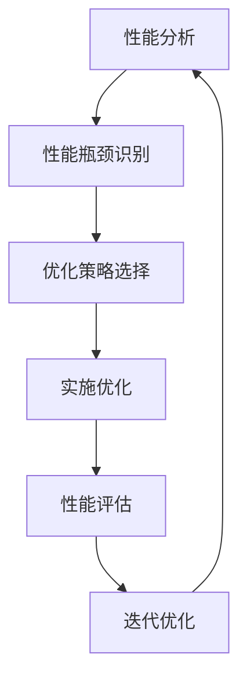

# AI系统性能优化原理与代码实战案例讲解

## 1.背景介绍

在当今数字时代,人工智能(AI)系统无处不在,从个人助理到自动驾驶汽车,再到医疗诊断和金融分析等领域。随着AI系统的复杂性和规模不断扩大,优化其性能以确保高效、可靠和可扩展的运行变得至关重要。本文将探讨AI系统性能优化的核心原理、算法和实践,并通过实战案例讲解,为读者提供全面的理解和实用的指导。

## 2.核心概念与联系

### 2.1 AI系统性能优化概述

AI系统性能优化旨在提高系统的响应时间、吞吐量、资源利用率和可扩展性。它涉及多个领域,包括算法优化、数据处理、模型压缩、硬件加速等。优化过程需要考虑系统的整体架构、数据特征、模型复杂度和硬件资源等多个方面。

### 2.2 关键概念

以下是AI系统性能优化的几个关键概念:

1. **模型压缩**: 减小模型大小和计算复杂度,同时保持模型精度。
2. **硬件加速**: 利用GPU、TPU等专用硬件加速AI计算。
3. **数据处理优化**: 优化数据预处理、特征工程和数据管道。
4. **分布式训练**: 在多台机器上并行训练大型模型。
5. **模型并行**: 将大型模型分割到多个设备上进行并行计算。
6. **异构计算**: 在CPU、GPU和FPGA等异构硬件上协同计算。

### 2.3 性能优化流程

AI系统性能优化通常遵循以下流程:

## 3.核心算法原理具体操作步骤

### 3.1 模型压缩

模型压缩旨在减小模型大小和计算复杂度,从而提高推理效率和降低资源消耗。常见的模型压缩技术包括剪枝(Pruning)、量化(Quantization)、知识蒸馏(Knowledge Distillation)等。

#### 3.1.1 剪枝

剪枝通过移除模型中的冗余权重来压缩模型。主要步骤如下:

1. **计算权重重要性**: 使用某种标准(如绝对值、二范数等)评估每个权重的重要性。
2. **剪枝低重要权重**: 根据设定的阈值,移除低重要性权重。
3. **微调模型**: 在剪枝后,对剩余权重进行微调,以恢复模型精度。

#### 3.1.2 量化

量化将模型权重和激活值从32位或16位浮点数转换为8位或更低位数的定点数表示,从而减小模型大小和计算复杂度。典型的量化流程包括:

1. **确定量化范围**: 统计权重和激活值的数值范围。
2. **量化映射**: 将浮点数映射到定点数表示。
3. **量化感知训练**: 使用量化值进行模型训练,提高量化后的精度。

#### 3.1.3 知识蒸馏

知识蒸馏将大型教师模型的知识转移到小型学生模型中,以获得较高的压缩比。主要步骤如下:

1. **训练教师模型**: 训练一个大型高精度的教师模型。
2. **生成软标签**: 使用教师模型对训练数据生成软标签(logits)。
3. **训练学生模型**: 使用软标签和硬标签(真实标签)训练小型学生模型。

### 3.2 硬件加速

利用专用硬件(如GPU和TPU)加速AI计算,可以显著提高训练和推理的性能。硬件加速通常涉及以下步骤:

1. **选择合适的硬件**: 根据模型类型、计算需求和预算选择合适的硬件(如GPU或TPU)。
2. **优化计算图**: 将模型计算图优化为在目标硬件上高效执行的形式。
3. **内存优化**: 优化内存使用,减少数据传输开销。
4. **并行计算**: 利用硬件的并行计算能力,如CUDA核心或Tensor核。

### 3.3 数据处理优化

优化数据处理管道可以减少I/O开销,加快数据传输速度,并提高整体系统吞吐量。常见的优化技术包括:

1. **数据格式优化**: 使用高效的数据格式(如Apache Parquet或记录二进制格式)存储和传输数据。
2. **数据缓存**: 缓存频繁访问的数据,减少I/O开销。
3. **数据并行处理**: 在多个线程或进程中并行处理数据。
4. **数据局部性优化**: 提高数据局部性,减少缓存未命中。

### 3.4 分布式训练

对于大型模型,可以在多台机器上进行分布式训练,以加快训练速度。常见的分布式训练策略包括:

1. **数据并行**: 将训练数据划分到多个worker上,每个worker处理一部分数据。
2. **模型并行**: 将模型划分到多个worker上,每个worker处理模型的一部分。
3. **混合并行**: 结合数据并行和模型并行,实现更高效的并行训练。

分布式训练需要解决通信开销、梯度同步、故障恢复等挑战。常用的分布式训练框架包括TensorFlow分布式策略、PyTorch DistributedDataParallel等。

### 3.5 模型并行

对于超大型模型(如GPT-3),单台机器的内存和计算资源可能不足以容纳和训练整个模型。模型并行通过将模型划分到多个设备上,实现并行计算和内存利用。主要步骤如下:

1. **模型分片**: 将模型划分为多个可并行计算的分片(如Transformer层或注意力头)。
2. **计算调度**: 在不同设备上调度分片的计算,并管理设备间的数据传输。
3. **梯度聚合**: 在反向传播时,聚合来自不同设备的梯度更新。

常用的模型并行框架包括深度学习编译栈(如XLA)、模型并行库(如Megatron-LM)等。

### 3.6 异构计算

异构计算利用CPU、GPU、FPGA等异构硬件的优势,协同完成AI计算任务。不同硬件擅长于不同的计算模式,如CPU适合序列化计算,GPU适合并行计算,FPGA适合定制化计算等。

异构计算的关键步骤包括:

1. **任务分解**: 将AI计算任务分解为适合不同硬件的子任务。
2. **任务调度**: 根据子任务的特点,将其调度到合适的硬件上执行。
3. **数据传输**: 在不同硬件之间高效传输数据。
4. **结果聚合**: 将来自不同硬件的计算结果聚合。

异构计算框架(如TVM和HeteroParallel)可以简化异构计算的编程和优化过程。

## 4.数学模型和公式详细讲解举例说明

### 4.1 模型压缩

#### 4.1.1 剪枝

剪枝算法通常使用某种标准(如绝对值或二范数)评估权重重要性,并移除低重要性权重。假设模型权重矩阵为$W$,权重重要性评估函数为$\text{imp}(w)$,阈值为$\theta$,剪枝后的权重矩阵$W'$可表示为:

$$W' = \begin{cases} 
    0, & \text{if } \text{imp}(w) < \theta\\
    w, & \text{otherwise}
\end{cases}$$

常用的重要性评估函数包括:

- 绝对值: $\text{imp}(w) = |w|$
- 二范数: $\text{imp}(w) = \sqrt{\sum_{i}w_i^2}$

#### 4.1.2 量化

量化将浮点数权重$w$映射到定点数表示$\hat{w}$,可使用以下公式:

$$\hat{w} = \text{round}\left(\frac{w - \text{min}}{\text{max} - \text{min}} \times (2^b - 1)\right)$$

其中$b$是定点数位宽,$\text{min}$和$\text{max}$分别是权重的最小值和最大值。

对于激活值量化,通常使用对数或其他非线性函数拉伸数据分布,然后再量化。假设激活值为$a$,量化后的激活值$\hat{a}$可表示为:

$$\hat{a} = \text{round}\left(\frac{\log(a - \text{min} + 1)}{\log(\text{max} - \text{min} + 1)} \times (2^b - 1)\right)$$

#### 4.1.3 知识蒸馏

知识蒸馏的目标是将教师模型的知识(通常表示为logits或软标签)转移到学生模型中。假设教师模型的logits为$z_t$,学生模型的logits为$z_s$,真实标签为$y$,知识蒸馏损失函数可表示为:

$$\mathcal{L}_\text{dist} = (1 - \alpha)\mathcal{H}(y, \sigma(z_s)) + \alpha T^2 \mathcal{H}(\sigma(z_t/T), \sigma(z_s/T))$$

其中$\mathcal{H}$是交叉熵损失函数,$\sigma$是softmax函数,$T$是温度超参数(通常取值3~10),$\alpha$是平衡硬标签损失和软标签损失的超参数。

### 4.2 硬件加速

#### 4.2.1 GPU加速

GPU由大量的CUDA核心组成,擅长于并行计算。在GPU上加速AI计算通常涉及以下步骤:

1. 将模型计算图转换为GPU可执行的内核函数。
2. 在GPU内存中分配数据缓冲区,并将数据从主机(CPU)复制到设备(GPU)上。
3. 调用内核函数在GPU上并行执行计算。
4. 将计算结果从设备复制回主机。

以矩阵乘法为例,在GPU上的并行实现可表示为:

$$C_{i,j} = \sum_{k=0}^{n} A_{i,k} \times B_{k,j}$$

其中$A$和$B$是输入矩阵,$C$是输出矩阵。每个线程块负责计算$C$的一个子矩阵,线程块内的线程并行计算子矩阵的元素。

#### 4.2.2 TPU加速

TPU(Tensor Processing Unit)是Google专门为AI计算而设计的专用硬件。TPU由大量的Tensor核心组成,擅长于矩阵运算和卷积运算。

在TPU上加速AI计算需要将模型计算图转换为TPU可执行的形式,并利用TPU的硬件特性(如大量的Tensor核心和高带宽内存)实现高效计算。

以矩阵乘法为例,在TPU上的并行实现可表示为:

$$C = A \times B$$

其中$A$、$B$和$C$分别是输入矩阵和输出矩阵。TPU会自动将矩阵划分为多个块,并在Tensor核心上并行执行块矩阵乘法。

### 4.3 分布式训练

在数据并行训练中,每个worker处理一部分训练数据,并计算相应的梯度。最终需要将所有worker的梯度聚合,以更新全局模型参数。假设有$N$个worker,第$i$个worker计算的梯度为$g_i$,全局梯度$G$可表示为:

$$G = \frac{1}{N}\sum_{i=1}^{N}g_i$$

在模型并行训练中,模型被划分为多个分片,每个分片分配给一个worker。在前向传播时,每个worker计算分片的输出;在反向传播时,每个worker计算分片的梯度,并与其他worker交换梯度,以计算整个模型的梯度。

假设模型被划分为$M$个分片,第$j$个分片的输入为$x_j$,输出为$y_j$,参数为$\theta_j$,损失函数为$\mathcal{L}$,则第$j$个分片的梯度为:

$$g_j = \frac{\partial \mathcal{L}}{\partial \theta_j} = \frac{\partial \mathcal{L}}{\partial y_j} \cdot \frac{\partial y_j}{\partial x_j} \cdot \frac{\partial x_j}{\partial \theta_j}$$

所有