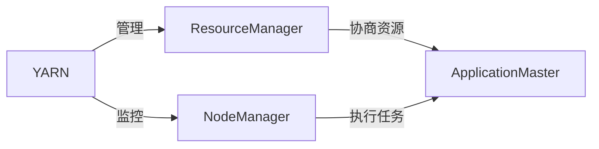

# ApplicationMaster 原理与代码实例讲解

## 1. 背景介绍
在大数据处理领域，资源管理和任务调度是实现高效计算的关键。Apache Hadoop YARN（Yet Another Resource Negotiator）是一个广泛使用的资源管理平台，它允许多个数据处理引擎在同一个物理数据集上高效地进行计算。ApplicationMaster是YARN中的核心组件之一，负责应用程序的生命周期管理和资源协调。理解ApplicationMaster的工作原理对于开发和优化基于YARN的应用至关重要。

## 2. 核心概念与联系
在深入ApplicationMaster之前，我们需要明确几个核心概念及其之间的联系：

- **YARN**：负责资源管理和作业调度的框架。
- **ResourceManager (RM)**：YARN中的全局资源管理器，负责系统中所有应用程序的资源分配。
- **NodeManager (NM)**：YARN中的节点级别资源管理和监控组件。
- **ApplicationMaster (AM)**：负责管理单个应用程序的执行，与RM协商资源，并监控任务执行。



## 3. 核心算法原理具体操作步骤
ApplicationMaster的工作流程可以分为以下几个步骤：

1. **初始化**：当应用程序启动时，RM会为其分配第一个容器，并在该容器中启动AM。
2. **资源请求**：AM根据应用程序的需求向RM请求必要的资源。
3. **资源分配**：RM根据集群资源情况，为AM分配资源，并通知AM。
4. **任务调度**：AM在获取资源后，会在相应的NM上启动任务。
5. **监控与管理**：AM负责监控任务的执行状态，并在必要时重新请求资源或释放资源。
6. **完成与清理**：应用程序完成后，AM会通知RM释放所有资源，并进行清理工作。

## 4. 数学模型和公式详细讲解举例说明
在资源请求阶段，AM通常需要执行复杂的资源计算，以确定最优的资源请求策略。例如，AM可能会使用如下数学模型来估算资源需求：

$$
R = \sum_{i=1}^{n} (C_i \times T_i)
$$

其中，$R$ 表示总资源需求，$C_i$ 表示第$i$个任务需要的单个资源量，$T_i$ 表示第$i$个任务的数量。

## 5. 项目实践：代码实例和详细解释说明
为了具体说明ApplicationMaster的实现，我们将通过一个简单的MapReduce作业示例来展示AM的代码结构和关键函数。

```java
public class SimpleMRAppMaster extends ApplicationMaster {
    // 初始化AM
    @Override
    protected void serviceInit(Configuration conf) throws Exception {
        super.serviceInit(conf);
        // 初始化代码...
    }

    // 启动AM
    @Override
    protected void serviceStart() throws Exception {
        super.serviceStart();
        // 启动代码...
    }

    // AM的主要工作逻辑
    public void run() throws Exception {
        // 1. 初始化
        // 2. 资源请求
        // 3. 资源分配处理
        // 4. 启动任务
        // 5. 监控任务执行
        // 6. 完成与清理
    }

    // 其他辅助函数...
}
```

在这个示例中，`SimpleMRAppMaster`继承自`ApplicationMaster`类，并重写了初始化和启动方法。`run`方法包含了AM的主要工作逻辑。

## 6. 实际应用场景
ApplicationMaster在多种大数据处理场景中发挥作用，如批处理、流处理、交互式查询等。在Hadoop MapReduce中，每个作业都会有一个对应的AM来管理任务的执行。

## 7. 工具和资源推荐
为了更好地开发和调试ApplicationMaster，以下是一些推荐的工具和资源：

- **Apache Hadoop YARN官方文档**：提供了YARN和AM的详细介绍。
- **Apache Tez**：一个基于YARN的数据处理框架，可以用来深入理解AM的高级用法。
- **YARN源码**：阅读源码是理解AM工作原理的最直接方式。

## 8. 总结：未来发展趋势与挑战
随着云计算和容器技术的发展，YARN和ApplicationMaster也在不断进化。未来，AM可能会更加智能化，能够更好地支持多租户环境和服务级别协议（SLA）。

## 9. 附录：常见问题与解答
- **Q1**: ApplicationMaster如何处理任务失败？
- **A1**: AM会根据策略决定是重试失败的任务还是标记作业失败。

- **Q2**: 如何调试ApplicationMaster？
- **A2**: 可以通过查看YARN日志和使用YARN的Web UI来调试AM。

作者：禅与计算机程序设计艺术 / Zen and the Art of Computer Programming