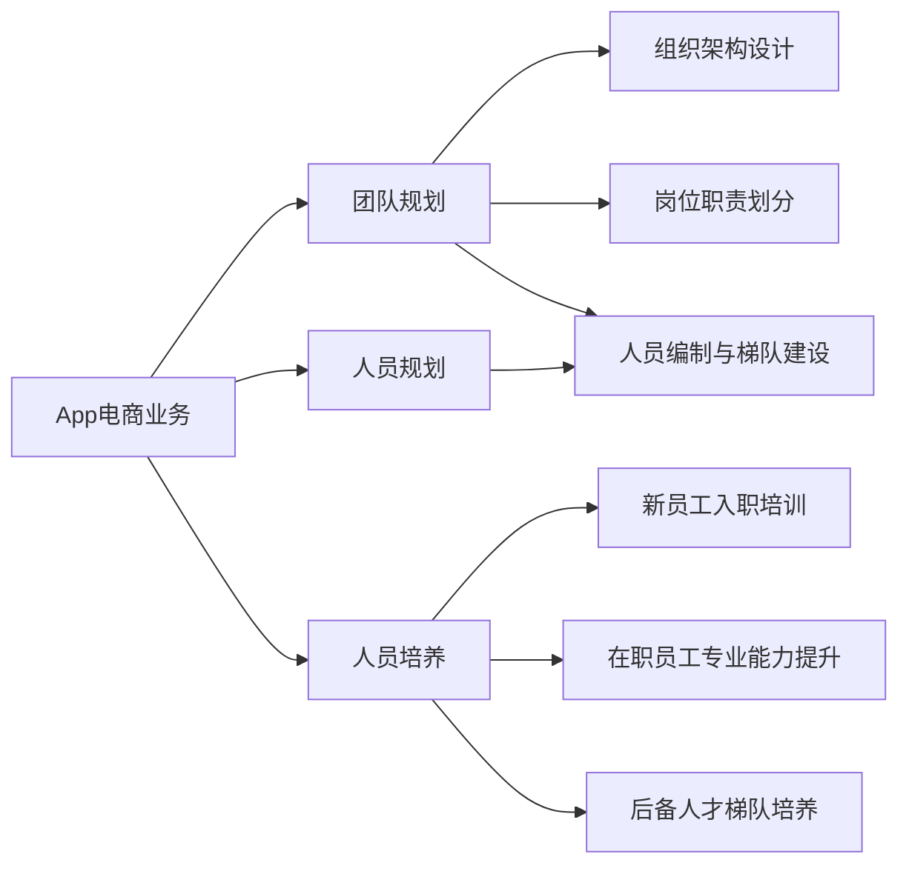

# App电商业务团队规划和人员规划与人员培养计划

## 1. 背景介绍
### 1.1 App电商行业发展现状
#### 1.1.1 市场规模与增长趋势
#### 1.1.2 用户规模与消费习惯变化
#### 1.1.3 竞争格局与主要玩家

### 1.2 企业发展阶段与面临的挑战
#### 1.2.1 企业当前发展阶段
#### 1.2.2 业务发展面临的主要挑战
#### 1.2.3 人才队伍建设的迫切需求

### 1.3 团队规划与人员培养的重要性
#### 1.3.1 高质量团队对业务发展的关键作用
#### 1.3.2 人才培养对团队可持续发展的重要性
#### 1.3.3 系统性规划的必要性

## 2. 核心概念与联系
### 2.1 App电商业务的核心要素
#### 2.1.1 产品与技术
#### 2.1.2 运营与营销
#### 2.1.3 客户服务与物流配送

### 2.2 团队规划的关键维度
#### 2.2.1 组织架构设计
#### 2.2.2 岗位职责划分
#### 2.2.3 人员编制与梯队建设

### 2.3 人员培养的主要路径
#### 2.3.1 新员工入职培训
#### 2.3.2 在职员工专业能力提升
#### 2.3.3 后备人才梯队培养

### 2.4 核心概念之间的逻辑关系

## 3. 团队规划的具体操作步骤
### 3.1 组织架构设计
#### 3.1.1 明确业务发展阶段与目标
#### 3.1.2 梳理业务流程与功能模块
#### 3.1.3 设计扁平化、灵活高效的组织架构

### 3.2 岗位职责划分
#### 3.2.1 根据业务需求确定各岗位类型
#### 3.2.2 明确各岗位的职责边界与工作内容
#### 3.2.3 建立岗位说明书与任职要求

### 3.3 人员编制与梯队建设
#### 3.3.1 根据业务规模确定人员编制
#### 3.3.2 不同层级员工比例的合理搭配
#### 3.3.3 建立人才盘点与梯队建设机制

## 4. 人员培养的实施路径与方法
### 4.1 新员工入职培训
#### 4.1.1 制定系统化的新员工培训方案
#### 4.1.2 分阶段开展通用技能与专业技能培训
#### 4.1.3 导师制助力新员工快速成长

### 4.2 在职员工专业能力提升
#### 4.2.1 建立员工职业发展通道
#### 4.2.2 针对性开展专业技能培训 
#### 4.2.3 项目实践与轮岗锻炼相结合

### 4.3 后备人才梯队培养
#### 4.3.1 高潜人才的选拔标准与方法
#### 4.3.2 有针对性的领导力培养项目
#### 4.3.3 跨部门/跨业务线的锻炼机会

## 5. 项目实践：基于胜任力模型的人才盘点与培养
### 5.1 胜任力模型构建
#### 5.1.1 识别关键岗位的核心胜任力要素
#### 5.1.2 行为事件访谈法提炼关键行为特征
#### 5.1.3 构建分层分类的胜任力模型

### 5.2 人才盘点
#### 5.2.1 确定人才盘点的目的与范围
#### 5.2.2 根据胜任力模型开展多维度评估
#### 5.2.3 形成人才概览图谱，识别高潜人才

### 5.3 人才培养
#### 5.3.1 基于胜任力模型的培养项目设计
#### 5.3.2 针对性的课程学习、实践锻炼、辅导反馈
#### 5.3.3 培养效果评估与改进优化

## 6. 团队规划与人员培养的典型应用场景
### 6.1 初创团队的快速组建与人员配置
### 6.2 业务快速扩张期的组织能力提升
### 6.3 数字化转型期的人才队伍升级

## 7. 团队管理的工具与资源推荐
### 7.1 组织管理工具
#### 7.1.1 OKR目标管理
#### 7.1.2 人力资源管理系统
#### 7.1.3 内部协作与沟通平台

### 7.2 人才培养资源
#### 7.2.1 在线学习平台
#### 7.2.2 专业培训机构
#### 7.2.3 行业会议与交流活动

## 8. 未来趋势与挑战
### 8.1 组织形态的柔性化与扁平化趋势
### 8.2 人工智能等新技术对人才能力要求的影响
### 8.3 人才争夺加剧与员工忠诚度管理挑战

## 9. 常见问题与解答
### 9.1 如何评估团队规划的效果？
### 9.2 人员培养周期长、见效慢怎么办？ 
### 9.3 如何平衡人才引进与内部培养？

App电商行业的快速发展对企业的团队建设与人才培养提出了更高要求。系统性的团队规划需要从组织架构设计、岗位职责划分、人员编制与梯队建设等维度进行综合考虑。而人员培养则需要针对不同发展阶段的员工，从新员工入职培训、在职员工能力提升到后备人才梯队建设，形成体系化的培养路径。

项目实践中，基于胜任力模型的人才盘点与培养是行之有效的方法。通过识别关键岗位的胜任力要素，开展多维度人才评估，识别高潜人才，并有针对性地开展培养项目，能够持续提升组织的人才竞争力。

展望未来，App电商企业需要顺应组织扁平化与人才要求变革的趋势，加强人才引进与内部培养并重，完善人才发展通道与激励机制，建设学习型组织，培养能够驱动业务不断创新发展的敏捷型人才队伍，为企业的可持续发展提供坚实保障。

作者：禅与计算机程序设计艺术 / Zen and the Art of Computer Programming