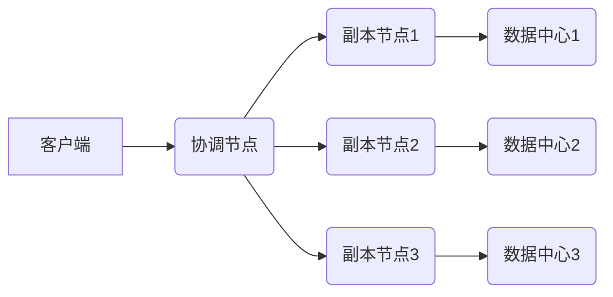
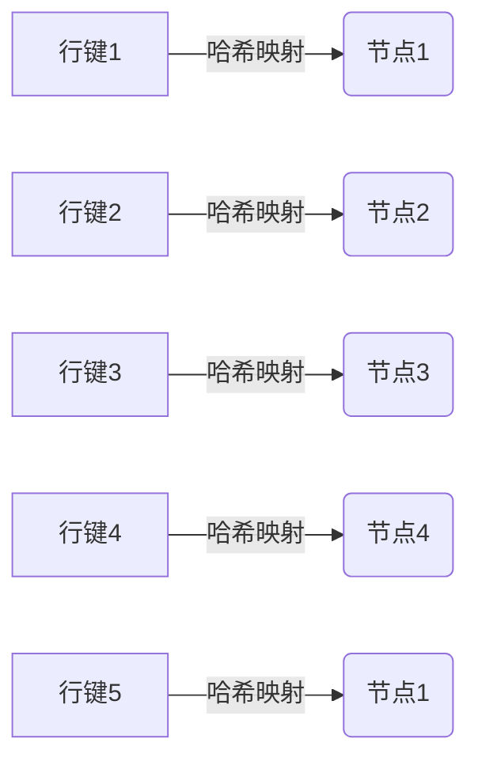
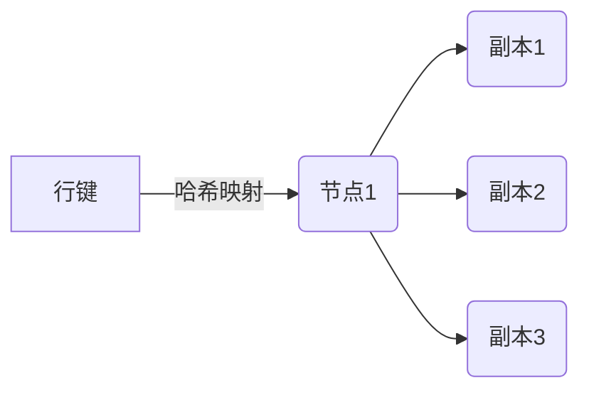

# Cassandra原理与代码实例讲解

## 1.背景介绍

在当今大数据时代,传统的关系型数据库已经难以满足日益增长的数据存储和处理需求。这种需求催生了一种新型的分布式NoSQL数据库,被称为Cassandra。Cassandra是一种免费的开源分布式NoSQL数据库系统,最初由Facebook设计用于存储收件箱数据,后来被Apache软件基金会开源。

Cassandra的设计目标是可扩展性和高可用性,它不依赖于单个主节点,而是采用完全分布式的体系结构。这使得它能够跨多个服务器进行扩展,并且能够容忍部分机器故障而不会中断服务。Cassandra还提供了数据复制功能,确保数据在多个节点之间保持一致。

Cassandra采用了Amazon的Dynamo分布式存储系统的设计理念,并结合了Google的BigTable数据模型。它使用分区行存储模型,将数据存储为稀疏的多维映射表。这种数据模型非常适合处理大规模的分布式数据集。

## 2.核心概念与联系

### 2.1 数据模型

Cassandra的数据模型由键空间(Keyspace)、表(Table)、行(Row)和列(Column)组成。

- 键空间类似于关系型数据库中的数据库概念,用于逻辑上组织表。
- 表是Cassandra中存储数据的核心组件,类似于关系型数据库中的表。
- 行是表中的一个条目,由行键(Row Key)和一个或多个列组成。
- 列由列名(Column Name)和列值(Column Value)组成,可以是任意数据类型。

Cassandra的数据模型采用了列式存储,这意味着数据按列而不是按行进行存储。这种设计使得Cassandra在读取少量列时表现出色,非常适合大规模数据分析场景。

### 2.2 分布式体系结构

Cassandra采用了完全分布式的体系结构,没有单点故障问题。每个节点在逻辑上都是对等的,可以处理读写请求。数据通过一致性哈希分布在集群中的节点上,并通过复制机制实现数据冗余。

Cassandra使用虚拟节点(Virtual Node)的概念来实现更好的数据分布。每个物理节点可以拥有多个虚拟节点,数据会均匀分布在这些虚拟节点上。这种设计提高了数据分布的均匀性,避免了数据热点问题。

### 2.3 复制和一致性

为了确保数据可靠性,Cassandra采用了复制机制。数据会在多个节点上保存副本,副本的数量由复制因子(Replication Factor)决定。当写入数据时,Cassandra会将数据写入到指定数量的副本节点上。

Cassandra提供了可调节的一致性级别,允许在数据一致性和可用性之间进行权衡。一致性级别决定了读写操作需要等待多少个副本节点响应才能完成。较高的一致性级别意味着更强的数据一致性,但可用性会受到影响。



上图展示了Cassandra的写入流程。客户端向协调节点发送写入请求,协调节点将数据分发到多个副本节点。副本节点可以分布在不同的数据中心,提高了数据的可用性和容错能力。

## 3.核心算法原理具体操作步骤

### 3.1 数据分区

Cassandra使用一致性哈希算法(Consistent Hashing)将数据分布在集群中的节点上。这种算法可以确保数据在节点增加或删除时只需要重新分布一小部分数据,而不是全部重新分布。

具体步骤如下:

1. 为每个节点分配一个令牌(Token),令牌在环形空间上均匀分布。
2. 计算每个行键的哈希值,并将其映射到环形空间上。
3.将行键分配给环形空间上顺时针方向最近的令牌所对应的节点。



上图展示了一致性哈希算法的工作原理。行键通过哈希映射到环形空间上,并分配给最近的节点。当节点加入或离开时,只需要重新分布环形空间上相邻的一小部分数据。

### 3.2 数据复制

为了提高数据可靠性,Cassandra采用了数据复制机制。每个行键会在多个节点上保存副本,副本的数量由复制因子(Replication Factor)决定。

复制步骤如下:

1. 确定复制策略,可以是简单策略(SimpleStrategy)或网络拓扑策略(NetworkTopologyStrategy)。
2. 根据复制策略和复制因子,为每个行键选择多个节点存储副本。
3. 将数据写入到所有副本节点。



上图展示了数据复制的过程。行键被分配到节点1,同时在节点1、副本节点2和副本节点3上保存了数据副本。这样即使某个节点发生故障,数据也不会丢失。

### 3.3 数据读写

Cassandra支持读修复(Read Repair)和反熵(Anti-Entropy)机制,用于维护数据一致性。

读操作步骤:

1. 客户端向协调节点发送读请求。
2. 协调节点从所有副本节点读取数据。
3. 如果发现不一致的数据,协调节点会触发读修复过程,将正确的数据写回到不一致的副本节点。
4. 协调节点将最新的数据返回给客户端。

写操作步骤:

1. 客户端向协调节点发送写请求。
2. 协调节点将数据写入到所有副本节点,并等待指定数量的副本节点确认写入成功。
3. 如果写入成功,协调节点将成功响应返回给客户端。

反熵是一个后台进程,用于检测和修复数据不一致的情况。它会定期在节点之间交换数据摘要,并将不一致的数据修复到正确的值。

## 4.数学模型和公式详细讲解举例说明

### 4.1 一致性哈希算法

一致性哈希算法是Cassandra实现数据分区和负载均衡的核心算法。它将节点和数据映射到一个环形空间上,并通过哈希函数确定数据的存储位置。

设有n个节点,令牌空间为$[0, 2^{64})$,每个节点被分配一个令牌$token_i$。令牌在环形空间上均匀分布,即:

$$token_i = \frac{2^{64}}{n} \times i, i = 0, 1, \dots, n-1$$

对于任意一个行键$k$,计算其哈希值$h(k)$,并将其映射到环形空间上。行键$k$将被分配给环形空间上顺时针方向最近的节点$node_j$,满足:

$$token_j \leq h(k) < token_{(j+1) \bmod n}$$

当节点加入或离开时,只需要重新分布环形空间上相邻的一小部分数据,而不是全部重新分布。这种设计大大提高了数据分布的效率和可扩展性。

### 4.2 复制置换策略

Cassandra采用复制置换策略(Replication Placement Strategy)来确定数据副本的存储位置。常用的策略有简单策略(SimpleStrategy)和网络拓扑策略(NetworkTopologyStrategy)。

简单策略适用于单数据中心的环境,它将副本均匀分布在不同的节点上。假设复制因子为$RF$,则每个行键的副本数量为$RF$,分布在$RF$个不同的节点上。

网络拓扑策略适用于多数据中心的环境,它根据数据中心和机架的拓扑结构来分布副本。假设有$DC$个数据中心,每个数据中心有$R$个机架,复制因子为$RF$,则每个行键在每个数据中心中有$RF/DC$个副本,每个机架上有$RF/(DC \times R)$个副本。

这种策略可以提高数据的可用性和容错能力,即使某个数据中心或机架发生故障,数据也不会丢失。

## 5.项目实践:代码实例和详细解释说明

### 5.1 创建键空间和表

下面是使用Cassandra查询语言(CQL)创建键空间和表的示例:

```sql
-- 创建键空间
CREATE KEYSPACE myapp
  WITH replication = {'class': 'SimpleStrategy', 'replication_factor': 3};

-- 切换到键空间
USE myapp;

-- 创建表
CREATE TABLE users (
  user_id uuid PRIMARY KEY,
  email text,
  name text,
  password text
);
```

上述代码创建了一个名为`myapp`的键空间,复制策略为`SimpleStrategy`,复制因子为3。然后在`myapp`键空间中创建了一个名为`users`的表,包含`user_id`(UUID类型主键)、`email`、`name`和`password`列。

### 5.2 插入和查询数据

```python
from uuid import uuid4
from cassandra.cluster import Cluster

# 连接到Cassandra集群
cluster = Cluster(['127.0.0.1'])
session = cluster.connect('myapp')

# 插入数据
user_id = uuid4()
session.execute(
    """
    INSERT INTO users (user_id, email, name, password)
    VALUES (%s, %s, %s, %s)
    """,
    (user_id, 'john@example.com', 'John Doe', 'password123')
)

# 查询数据
rows = session.execute("SELECT * FROM users")
for row in rows:
    print(row)

# 关闭集群连接
cluster.shutdown()
```

上述Python代码首先连接到Cassandra集群,并切换到`myapp`键空间。然后使用`INSERT`语句插入一条用户数据,其中`user_id`使用UUID作为主键。最后使用`SELECT`语句查询`users`表中的所有数据,并输出结果。

### 5.3 使用Python驱动进行CRUD操作

Cassandra提供了多种语言的客户端驱动程序,下面是使用Python驱动程序进行CRUD操作的示例:

```python
from cassandra.cluster import Cluster
from cassandra.query import BatchStatement

# 连接到Cassandra集群
cluster = Cluster(['127.0.0.1'])
session = cluster.connect('myapp')

# 创建表
session.execute(
    """
    CREATE TABLE IF NOT EXISTS products (
        product_id uuid PRIMARY KEY,
        name text,
        price decimal
    )
    """
)

# 插入数据
insert_stmt = session.prepare("INSERT INTO products (product_id, name, price) VALUES (?, ?, ?)")
batch = BatchStatement()
batch.add(insert_stmt, (uuid4(), 'Product 1', 9.99))
batch.add(insert_stmt, (uuid4(), 'Product 2', 19.99))
session.execute(batch)

# 查询数据
rows = session.execute("SELECT * FROM products")
for row in rows:
    print(row)

# 更新数据
session.execute(
    """
    UPDATE products
    SET price = 14.99
    WHERE product_id = %s
    """,
    (rows[0].product_id,)
)

# 删除数据
session.execute(
    """
    DELETE FROM products
    WHERE product_id = %s
    """,
    (rows[1].product_id,)
)

# 关闭集群连接
cluster.shutdown()
```

上述代码首先创建了一个名为`products`的表,包含`product_id`(UUID类型主键)、`name`和`price`列。然后使用`INSERT`语句批量插入两条产品数据。

接下来,使用`SELECT`语句查询`products`表中的所有数据,并使用`UPDATE`语句更新第一条数据的价格。最后,使用`DELETE`语句删除第二条数据。

这些示例展示了如何使用Python驱动程序执行Cassandra的基本CRUD操作。

## 6.实际应用场景

Cassandra由于其高度可扩展性和高可用性,在各种大数据应用场景中得到了广泛应用,包括:

1. **物联网(IoT)数据处理**: 物联网设备产生大量时序数据,Cassandra可以高效地存储和处理这些