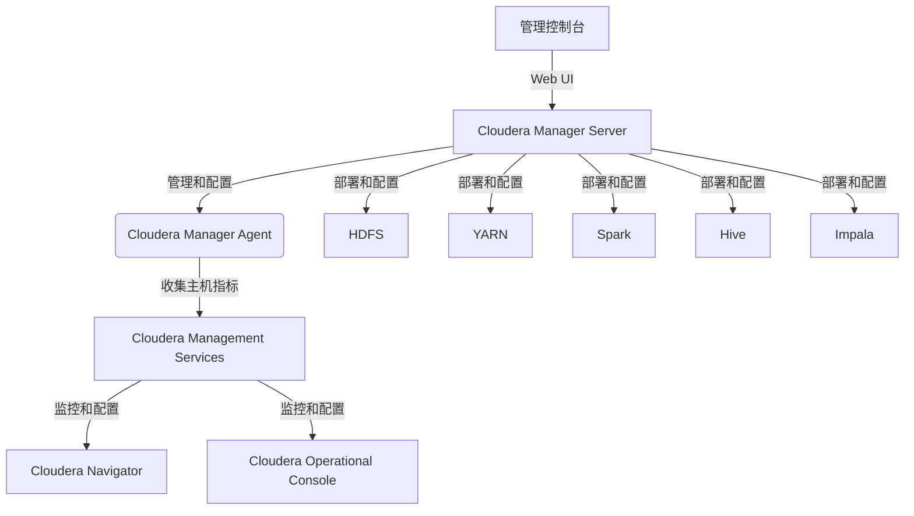

# Cloudera Manager原理与代码实例讲解

## 1.背景介绍

随着大数据时代的到来,企业需要处理海量的结构化和非结构化数据。Apache Hadoop作为一种分布式系统,能够存储和处理大规模数据集,成为大数据处理的核心技术之一。然而,手动部署、配置和管理Hadoop集群是一项艰巨的任务,需要大量的时间和专业知识。为了简化这一过程,Cloudera公司开发了Cloudera Manager,一款用于部署、管理和监控Hadoop集群的工具。

Cloudera Manager提供了一个集中式的管理控制台,使得管理员能够轻松地部署和监控Hadoop集群。它支持多个版本的Hadoop发行版,包括Cloudera的CDH(Cloudera Distribution Hadoop)和Apache的开源版本。通过Cloudera Manager,管理员可以轻松地添加或删除节点、配置服务、监控集群健康状况、管理安全性等。

## 2.核心概念与联系

### 2.1 Cloudera Manager架构

Cloudera Manager由以下几个核心组件组成:

1. **Server** - 管理服务,负责安装软件、配置和启动集群服务。
2. **Agent** - 在每个节点上运行,负责启动和监控进程、收集主机级别的指标。
3. **管理控制台** - 基于Web的用户界面,用于管理集群和监控活动。
4. **Cloudera管理服务** - 一组用于监控和配置的服务,包括活动监控器、主机监控器、服务监控器、事件服务器和报警器。
5. **Cloudera Navigator** - 数据管理组件,提供数据审计、数据质量和数据生命周期管理功能。
6. **Cloudera运营控制台** - 提供了一个集中的视图来监控Hadoop集群的运行状况和性能。



### 2.2 关键功能

Cloudera Manager的关键功能包括:

- **部署和配置** - 自动化部署和配置Hadoop集群及相关服务。
- **集中管理** - 提供集中式管理控制台,可监控和管理整个Hadoop集群。
- **服务生命周期管理** - 管理Hadoop服务的整个生命周期,包括启动、停止、添加和删除服务。
- **主机管理** - 添加、删除和重新配置主机,并监控主机的健康状况和资源利用率。
- **监控和诊断** - 收集和监控指标,提供集群健康状况的可视化视图,并发送警报。
- **数据管理** - 通过Cloudera Navigator提供数据审计、数据质量和数据生命周期管理功能。

## 3.核心算法原理具体操作步骤

Cloudera Manager的核心算法主要包括以下几个方面:

### 3.1 自动化部署和配置

Cloudera Manager通过以下步骤自动化部署和配置Hadoop集群:

1. **规划集群** - 根据业务需求和硬件资源规划集群规模和服务组件。
2. **准备主机** - 在目标主机上安装操作系统、JDK和其他依赖项。
3. **安装Cloudera Manager Server** - 在一个主机上安装Cloudera Manager Server。
4. **安装Cloudera Manager Agent** - 在所有集群节点上安装Cloudera Manager Agent。
5. **配置集群** - 通过Cloudera Manager控制台配置集群服务,如HDFS、YARN、Hive等。
6. **启动集群** - 启动集群服务并验证集群运行状态。

### 3.2 集中管理

Cloudera Manager通过以下步骤实现集中管理:

1. **监控集群** - 持续收集和监控集群指标,包括服务运行状态、主机资源利用率等。
2. **管理服务生命周期** - 通过控制台启动、停止、添加或删除Hadoop服务。
3. **管理主机** - 添加、删除或重新配置主机,并监控主机健康状况。
4. **配置管理** - 修改服务配置并自动分发到集群节点。
5. **警报管理** - 设置监控阈值并发送警报通知。

### 3.3 自动化修复

Cloudera Manager还提供了自动化修复功能,可以自动检测和修复一些常见的集群问题:

1. **自动修复** - 自动检测并修复一些常见的配置错误或服务故障。
2. **手动修复** - 对于无法自动修复的问题,Cloudera Manager会提供修复指导。
3. **日志管理** - 收集和管理集群日志,方便问题排查和调试。

## 4.数学模型和公式详细讲解举例说明

在Cloudera Manager中,一些关键的数学模型和公式用于优化集群性能和资源利用率。

### 4.1 YARN资源调度模型

Apache YARN (Yet Another Resource Negotiator)是Hadoop的资源管理和作业调度系统,负责管理和分配集群资源。YARN采用了容器(Container)的概念,将CPU、内存等资源抽象为容器资源。

YARN的资源调度模型基于以下公式:

$$
\begin{aligned}
\text{Container} &= \langle N_\text{cores}, N_\text{memory} \rangle \\
\text{Cluster Capacity} &= \sum_{\text{all nodes}} \text{Node Capacity} \\
\text{Node Capacity} &= \langle N_\text{cores}, N_\text{memory} \rangle \\
\text{Pending Tasks} &= \sum_{\text{all jobs}} \text{Remaining Tasks}
\end{aligned}
$$

其中:

- $\text{Container}$ 表示一个容器的资源配置,包括CPU核数和内存大小。
- $\text{Cluster Capacity}$ 表示整个集群的资源容量,等于所有节点的资源容量之和。
- $\text{Node Capacity}$ 表示单个节点的资源容量,包括CPU核数和内存大小。
- $\text{Pending Tasks}$ 表示当前等待调度的任务数,等于所有作业剩余任务数之和。

YARN调度器根据这些公式,将资源公平或按优先级分配给各个应用程序。

### 4.2 HDFS数据放置策略

Apache HDFS (Hadoop Distributed File System)是Hadoop的分布式文件系统,负责存储和管理数据。HDFS采用了数据块复制的方式来提供数据冗余和可用性。数据放置策略决定了数据块的存储位置,对集群性能和数据本地性有重要影响。

HDFS的数据放置策略基于以下公式:

$$
\begin{aligned}
W &= \sum_{n=0}^{N-1} D_n \times S_n \\
D_n &=\begin{cases}
1 & \text{if node $n$ is a different rack} \\
1/\epsilon & \text{if node $n$ is the same rack}
\end{cases} \\
S_n &= \begin{cases}
\infty & \text{if node $n$ is not available} \\
1 & \text{if node $n$ is available}
\end{cases}
\end{aligned}
$$

其中:

- $W$ 表示数据块放置的权重,越大表示该位置越优先。
- $N$ 表示集群节点数。
- $D_n$ 表示节点 $n$ 的机架距离权重,不同机架权重为1,同机架权重为 $1/\epsilon$ ($\epsilon$ 是一个大于1的常数)。
- $S_n$ 表示节点 $n$ 的可用性权重,不可用节点权重为无穷大,可用节点权重为1。

HDFS首先尝试在不同机架上放置数据块副本,以提高可用性和容错性。如果无法在不同机架上放置,则尽量将副本放置在同一机架的不同节点上,以提高数据本地性。

### 4.3 Impala查询优化

Impala是Cloudera开发的大数据查询引擎,支持对存储在HDFS、HBase等系统中的大数据进行快速、高效的SQL查询。Impala采用了基于代价的查询优化策略,通过估算不同查询计划的代价,选择代价最小的执行计划。

Impala的查询优化模型基于以下公式:

$$
\begin{aligned}
\text{Cost}(P) &= \text{Cost}_\text{CPU}(P) + \text{Cost}_\text{IO}(P) + \text{Cost}_\text{Network}(P) \\
\text{Cost}_\text{CPU}(P) &= \sum_{\text{operators}} \text{CPU Cost}(\text{operator}) \\
\text{Cost}_\text{IO}(P) &= \sum_{\text{scan operators}} \text{IO Cost}(\text{scan operator}) \\
\text{Cost}_\text{Network}(P) &= \sum_{\text{data transfers}} \text{Network Cost}(\text{data transfer})
\end{aligned}
$$

其中:

- $\text{Cost}(P)$ 表示查询计划 $P$ 的总代价。
- $\text{Cost}_\text{CPU}(P)$ 表示查询计划 $P$ 的CPU代价,等于所有操作符的CPU代价之和。
- $\text{Cost}_\text{IO}(P)$ 表示查询计划 $P$ 的IO代价,等于所有扫描操作符的IO代价之和。
- $\text{Cost}_\text{Network}(P)$ 表示查询计划 $P$ 的网络代价,等于所有数据传输的网络代价之和。

Impala通过估算每个操作符的CPU、IO和网络代价,并将它们相加得到整个查询计划的总代价。优化器会尝试不同的查询计划,选择代价最小的执行。

## 5.项目实践:代码实例和详细解释说明

接下来,我们通过一个示例项目来演示如何使用Cloudera Manager部署和管理Hadoop集群。

### 5.1 环境准备

我们将在三台虚拟机上部署一个小型的Hadoop集群,其中一台作为Cloudera Manager Server,另外两台作为数据节点。

1. 准备三台CentOS 7虚拟机,每台配置4GB内存、2个CPU核心。
2. 在所有节点上安装JDK 8、Python 2.7和其他依赖项。
3. 配置主机名和静态IP地址,并在所有节点上配置主机名解析。
4. 在所有节点上配置SSH无密码登录。

### 5.2 安装Cloudera Manager

1. 在其中一台节点上下载并安装Cloudera Manager Server。

```bash
# 下载Cloudera Manager安装包
wget https://archive.cloudera.com/cm7/7.7.1/cloudera-manager-installer.bin

# 赋予执行权限
chmod u+x cloudera-manager-installer.bin

# 安装Cloudera Manager Server
sudo ./cloudera-manager-installer.bin
```

2. 在其他两台节点上安装Cloudera Manager Agent。

```bash
# 下载Cloudera Manager Agent安装包
wget https://archive.cloudera.com/cm7/7.7.1/cloudera-manager-agent.bin

# 赋予执行权限
chmod u+x cloudera-manager-agent.bin

# 安装Cloudera Manager Agent
sudo ./cloudera-manager-agent.bin
```

### 5.3 配置Hadoop集群

1. 打开Cloudera Manager控制台,通过向导配置集群。
2. 选择要安装的Hadoop服务,如HDFS、YARN、Hive、Impala等。
3. 指定每个服务的角色分配,例如NameNode、DataNode、ResourceManager等。
4. 根据需要调整服务配置参数。
5. 部署客户端配置文件。
6. 启动集群服务。

### 5.4 管理和监控集群

1. 在Cloudera Manager控制台上,可以查看集群的整体状态和各个服务的运行情况。
2. 监控主机的CPU、内存、磁盘等资源利用率。
3. 查看HDFS的数据块位置和复制情况。
4. 监控YARN的作业和应用程序运行情况。
5. 查看Hive和Impala的查询历史和性能指标。
6. 配置警报规则,及时获取异常通知。

### 5.5 自动化修复示例

假设由于某些原因,HDFS的NameNode进程异常退出。Cloudera Manager会自动检测到这个问题,并尝试自动修复。

1. Cloudera Manager检测到NameNode进程异常退出。
2. 自动重启NameNode进程。
3. 如果重启失败,Cloudera Manager会提供手动修复指导。
4. 管理员可以查看