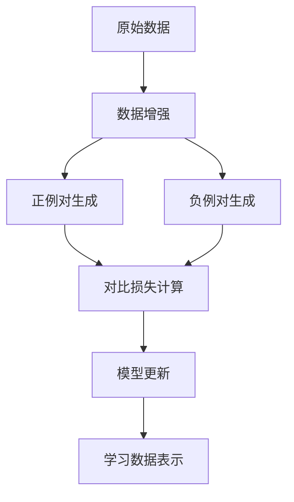
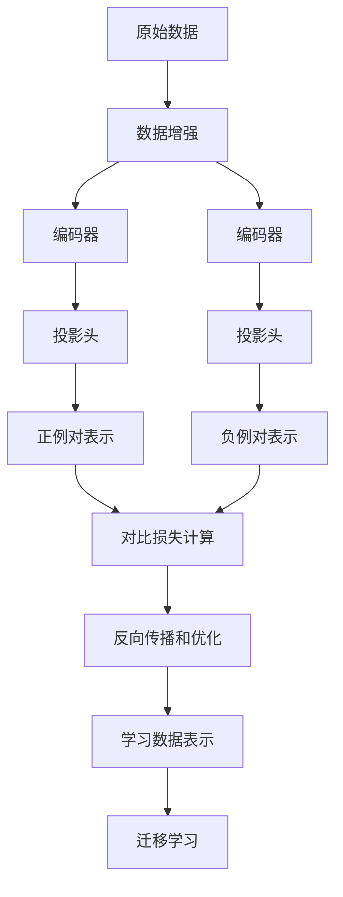

# Contrastive Learning原理与代码实例讲解

## 1.背景介绍

### 1.1 机器学习中的挑战

在机器学习领域,特别是深度学习中,获取大量高质量的标注数据一直是一个巨大的挑战。标注数据的过程通常是昂贵和耗时的,需要人工标注大量的图像、文本或其他形式的数据。这种监督学习方法对于一些复杂的任务来说是行不通的,比如自动驾驶汽车需要处理各种复杂的实时数据。

### 1.2 自监督学习的兴起

为了解决上述问题,自监督学习(Self-Supervised Learning)应运而生。自监督学习是一种无需人工标注的学习方式,它利用原始数据本身的信息进行训练,从而学习数据的内在表示。这种方法可以从大量未标注的数据中学习有用的表示,为下游任务提供有效的迁移学习。

### 1.3 Contrastive Learning的重要性

在自监督学习的多种方法中,Contrastive Learning(对比学习)凭借其出色的性能备受关注。它通过最大化相似样本之间的相似性,最小化不相似样本之间的相似性,从而学习数据的discriminative(有区分能力的)表示。这种方法已被广泛应用于计算机视觉、自然语言处理等领域,取得了卓越的成果。

## 2.核心概念与联系

### 2.1 对比学习的基本思想

对比学习的核心思想是通过对比相似和不相似的样本对,来学习数据的discriminative representation。具体来说,它会从原始数据中生成正例对(相似样本对)和负例对(不相似样本对),然后最大化正例对之间的相似性,最小化负例对之间的相似性。



### 2.2 关键组件

对比学习框架通常包含以下几个关键组件:

1. **数据增强(Data Augmentation)**:通过一些变换操作(如裁剪、旋转等)从原始数据生成相似的视图,作为正例对的输入。
2. **编码器(Encoder)**:将增强后的数据映射到表示空间,得到对应的表示向量。
3. **投影头(Projection Head)**:对编码器的输出进行非线性映射,以增加表示的区分能力。
4. **对比损失函数(Contrastive Loss)**:衡量正例对的相似性和负例对的不相似性,并优化模型参数。

### 2.3 对比学习与其他自监督学习方法的关系

对比学习是自监督学习的一个分支,与其他自监督学习方法(如自编码器、生成对抗网络等)有一些相似之处,但也有明显的区别。它们都试图从未标注的数据中学习有用的表示,但对比学习更侧重于学习discriminative的表示,而不是重建原始数据或生成新的数据。

## 3.核心算法原理具体操作步骤

对比学习算法的核心步骤如下:

1. **数据增强**:对原始数据进行一些随机变换操作(如裁剪、旋转、高斯噪声等),生成相似的视图对作为正例对。
2. **编码**:将增强后的正例对输入到编码器中,得到对应的表示向量。
3. **投影**:将编码器的输出通过一个非线性投影头映射到另一个表示空间,以增加表示的区分能力。
4. **构建负例对**:除了正例对之外,还需要构建负例对(不相似的样本对)。常见的方法是将其他样本的表示作为负例。
5. **计算对比损失**:基于正例对和负例对的相似性,计算对比损失函数。常用的损失函数包括NT-Xent Loss和InfoNCE Loss等。
6. **反向传播和优化**:使用梯度下降法,反向传播对比损失,并更新编码器和投影头的参数。
7. **迁移学习**:在下游任务上,可以直接使用对比学习得到的编码器参数作为初始化,或者进行微调,以获得更好的性能。



## 4.数学模型和公式详细讲解举例说明

### 4.1 NT-Xent Loss

NT-Xent Loss(Noise-Contrastive Estimation Loss)是对比学习中常用的损失函数之一。它的目标是最大化正例对的相似性,同时最小化负例对的相似性。具体来说,给定一个正例对$(i, j)$和一组负例对$(i, k)$,NT-Xent Loss定义为:

$$\mathcal{L}_{i,j} = -\log\frac{\exp(\mathrm{sim}(z_i, z_j) / \tau)}{\sum_{k=1}^{2N}\mathbb{1}_{[k\neq i]}\exp(\mathrm{sim}(z_i, z_k) / \tau)}$$

其中:

- $z_i$和$z_j$分别表示正例对$(i, j)$的表示向量
- $\mathrm{sim}(\cdot, \cdot)$是相似性函数,通常使用点积相似性或余弦相似性
- $\tau$是一个温度超参数,用于控制相似性分数的尺度
- $N$是批量大小,分母部分的求和是在整个批量上进行的
- $\mathbb{1}_{[k\neq i]}$是一个指示函数,确保不包括$(i, i)$这个对

通过最小化NT-Xent Loss,模型可以学习到使正例对的相似性最大化,负例对的相似性最小化的表示。

### 4.2 InfoNCE Loss

InfoNCE Loss(Information Noise-Contrastive Estimation Loss)是另一种常用的对比损失函数。它源自信息论中的噪声对比估计(Noise Contrastive Estimation, NCE),旨在最大化正例对的互信息(mutual information)。给定一个正例对$(i, j)$和一组负例对$(i, k)$,InfoNCE Loss定义为:

$$\mathcal{L}_{i,j} = -\log\frac{\exp(\mathrm{sim}(z_i, z_j) / \tau)}{\exp(\mathrm{sim}(z_i, z_j) / \tau) + \sum_{k=1}^{2N}\mathbb{1}_{[k\neq i]}\exp(\mathrm{sim}(z_i, z_k) / \tau)}$$

与NT-Xent Loss相比,InfoNCE Loss的分母部分多了一项$\exp(\mathrm{sim}(z_i, z_j) / \tau)$,这使得损失函数更加稳定和平滑。

通过最小化InfoNCE Loss,模型可以学习到最大化正例对的互信息,从而获得discriminative的表示。

### 4.3 其他对比损失函数

除了NT-Xent Loss和InfoNCE Loss之外,还有一些其他的对比损失函数,如:

- **Margin Loss**: 通过设置一个边际值,强制正例对的相似性大于负例对的相似性加上这个边际值。
- **Circle Loss**: 在高维球面上最小化正例对与负例对的角距离。
- **Triplet Loss**: 最小化锚点样本与正例的距离,最大化锚点样本与负例的距离。

不同的损失函数有不同的优缺点,需要根据具体的任务和数据集进行选择和调整。

## 5.项目实践:代码实例和详细解释说明

在这一部分,我们将通过一个基于PyTorch的实例,演示如何实现对比学习算法。我们将使用CIFAR-10数据集进行训练,并在下游任务上评估对比学习得到的表示的质量。

### 5.1 导入所需库

```python
import torch
import torch.nn as nn
import torch.nn.functional as F
import torchvision
import torchvision.transforms as transforms
```

### 5.2 数据准备

```python
# 定义数据增强操作
train_transform = transforms.Compose([
    transforms.RandomResizedCrop(32),
    transforms.RandomHorizontalFlip(p=0.5),
    transforms.RandomApply([transforms.ColorJitter(0.4, 0.4, 0.4, 0.1)], p=0.8),
    transforms.RandomGrayscale(p=0.2),
    transforms.ToTensor(),
    transforms.Normalize((0.4914, 0.4822, 0.4465), (0.2023, 0.1994, 0.2010))
])

# 加载CIFAR-10数据集
train_dataset = torchvision.datasets.CIFAR10(root='./data', train=True, download=True, transform=train_transform)
train_loader = torch.utils.data.DataLoader(train_dataset, batch_size=256, shuffle=True, num_workers=4, drop_last=True)
```

在这里,我们定义了一系列数据增强操作,包括随机裁剪、水平翻转、颜色抖动和灰度化等。这些操作可以从原始图像生成相似的视图对,作为对比学习的输入。

### 5.3 模型定义

```python
class ContrastiveModel(nn.Module):
    def __init__(self, base_encoder, proj_dim=128):
        super(ContrastiveModel, self).__init__()
        self.encoder = base_encoder
        self.proj_head = nn.Sequential(
            nn.Linear(base_encoder.proj_dim, proj_dim),
            nn.BatchNorm1d(proj_dim),
            nn.ReLU(),
            nn.Linear(proj_dim, proj_dim)
        )

    def forward(self, x):
        h = self.encoder(x)
        z = self.proj_head(h)
        return h, z

# 定义编码器
class Encoder(nn.Module):
    def __init__(self):
        super(Encoder, self).__init__()
        self.proj_dim = 512
        self.conv = nn.Sequential(
            nn.Conv2d(3, 64, kernel_size=3, stride=1, padding=1),
            nn.ReLU(),
            nn.MaxPool2d(kernel_size=2, stride=2),
            nn.Conv2d(64, 128, kernel_size=3, stride=1, padding=1),
            nn.ReLU(),
            nn.MaxPool2d(kernel_size=2, stride=2),
            nn.Conv2d(128, 256, kernel_size=3, stride=1, padding=1),
            nn.ReLU(),
            nn.MaxPool2d(kernel_size=2, stride=2),
            nn.Conv2d(256, 512, kernel_size=3, stride=1, padding=1),
            nn.ReLU(),
            nn.MaxPool2d(kernel_size=2, stride=2),
            nn.Flatten(),
            nn.Linear(512, self.proj_dim)
        )

    def forward(self, x):
        return self.conv(x)

# 实例化模型
encoder = Encoder()
model = ContrastiveModel(encoder)
```

在这个示例中,我们定义了一个简单的卷积神经网络作为编码器,以及一个投影头网络。编码器将输入图像映射到一个512维的表示空间,投影头则将这个表示映射到一个128维的空间,以增加表示的区分能力。

### 5.4 对比损失函数

```python
def nt_xent_loss(z1, z2, temperature=0.5):
    batch_size, _ = z1.shape
    z1 = F.normalize(z1, dim=-1)
    z2 = F.normalize(z2, dim=-1)
    sim_matrix = torch.einsum('il,jl->ij', z1, z2) * temperature
    sim_matrix_exp = torch.exp(sim_matrix)
    
    mask = torch.eye(batch_size, device=sim_matrix.device).bool()
    sim_matrix_exp = sim_matrix_exp.masked_fill(mask, 0)
    
    denom = torch.sum(sim_matrix_exp, dim=1, keepdim=True)
    loss = -torch.sum(torch.log(sim_matrix_exp.diag() / denom)) / batch_size
    return loss
```

这里我们实现了NT-Xent Loss。首先,我们对表示向量进行归一化处理。然后,我们计算正例对和负例对之间的相似性矩阵,并使用指数函数对其进行缩放。接着,我们将对角线元素(即正例对的相似性)除以行和,得到正例对的相对相似性。最后,我们取负对数并求平均,得到最终的损失值。

### 5.5 训练过程

```python
device = torch.device('cuda' if torch.cuda.is_available() else 'cpu')
model = model.to(device)

optimizer = torch.optim.Adam(model.parameters(), lr=1e-3)
epochs = 100

for epoch in range(epochs):