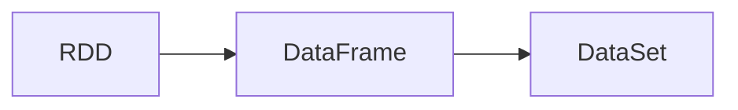

# DataSet原理与代码实例讲解

## 1.背景介绍

### 1.1 大数据时代的数据处理挑战

在大数据时代,我们面临着海量、高维、异构数据的处理挑战。传统的数据处理方式已经无法满足实时性、高效性的要求。为了应对这一挑战,需要重新审视和设计数据的组织方式,而DataSet就是一种非常有前景的解决方案。

### 1.2 DataSet的起源与发展

DataSet最早由UC Berkeley的AMP Lab提出,是Spark生态系统中的分布式数据集合抽象。它建立在RDD之上,提供了更加丰富的数据转换和操作,同时支持结构化数据和半结构化数据。随着Spark的广泛应用,DataSet也逐渐成为大数据处理领域的重要工具。

### 1.3 DataSet的应用场景

DataSet适用于多种数据处理场景,包括:

- 批处理:对海量数据进行复杂的转换和聚合操作。
- 交互式分析:支持交互式查询和数据探索。
- 流处理:可以与Spark Streaming无缝集成,实现实时数据处理。
- 机器学习:为Spark MLlib提供数据输入。

## 2.核心概念与联系

### 2.1 DataSet与DataFrame、RDD的关系



- RDD:弹性分布式数据集,Spark的基础数据抽象。
- DataFrame:基于RDD的结构化数据集,支持SQL操作。
- DataSet:融合了RDD和DataFrame的优点,支持强类型和Lambda函数。

### 2.2 DataSet的特点

- 强类型:编译时类型检查,减少运行时错误。
- 高性能:使用Tungsten进行内存管理和代码生成优化。
- 易用性:支持Lambda函数,API更加友好。
- 统一:统一了批处理、交互式查询和流处理。

### 2.3 DataSet的数据源

DataSet可以从多种数据源创建,包括:

- 结构化文件:如CSV、JSON、Parquet等。
- RDD:可以从现有RDD转换而来。
- 关系型数据库:通过JDBC连接。
- Hive:支持直接查询Hive中的表。

## 3.核心算法原理具体操作步骤

### 3.1 创建DataSet

#### 3.1.1 从RDD创建DataSet

```scala
case class Person(name: String, age: Int)
val peopleRDD = sc.textFile("people.txt")
  .map(_.split(","))
  .map(attributes => Person(attributes(0), attributes(1).trim.toInt))
val peopleDS = peopleRDD.toDS()
```

#### 3.1.2 从结构化文件创建DataSet

```scala
val peopleDS = spark.read.json("people.json").as[Person]
```

### 3.2 DataSet转换操作

#### 3.2.1 map

```scala
val namesDS = peopleDS.map(_.name)
```

#### 3.2.2 filter

```scala
val adultsDS = peopleDS.filter(_.age >= 18)
```

#### 3.2.3 flatMap

```scala
val peopleDS = spark.createDataset(Seq(Person("Alice,20,student", 20), Person("Bob,30,engineer", 30))) 
val nameDS = peopleDS.flatMap(_.name.split(","))
```

#### 3.2.4 groupByKey

```scala
val avgAgeByNameDS = peopleDS.groupByKey(_.name).mapGroups{case (name, people) =>
  (name, people.map(_.age).sum / people.size)
}
```

### 3.3 DataSet行动操作

#### 3.3.1 foreach

```scala
peopleDS.foreach(println(_))
```

#### 3.3.2 collect

```scala
val peopleArray = peopleDS.collect()
```

#### 3.3.3 show

```scala
peopleDS.show()
```

## 4.数学模型和公式详细讲解举例说明

### 4.1 DataSet的数学模型

DataSet可以看作是一个分布式的、强类型的数据集合,它的数学模型可以表示为:

$$DataSet[T] = \{x_1, x_2, ..., x_n\}, x_i \in T$$

其中,$T$表示DataSet中元素的类型,$n$表示DataSet中元素的个数。

### 4.2 转换操作的数学形式化

#### 4.2.1 map

$$map(DataSet[T], f: T \rightarrow U) \rightarrow DataSet[U]$$

其中,$f$表示map函数,$T$和$U$分别表示转换前后的元素类型。

#### 4.2.2 filter

$$filter(DataSet[T], p: T \rightarrow Boolean) \rightarrow DataSet[T]$$

其中,$p$表示filter谓词。

#### 4.2.3 flatMap

$$flatMap(DataSet[T], f: T \rightarrow Seq[U]) \rightarrow DataSet[U]$$

其中,$f$表示flatMap函数,$Seq[U]$表示$U$类型的序列。

#### 4.2.4 groupByKey

$$groupByKey(DataSet[(K, V)]) \rightarrow DataSet[(K, Iterable[V])]$$

其中,$K$表示分组的key的类型,$V$表示value的类型。

## 5.项目实践：代码实例和详细解释说明

下面我们通过一个实际的项目案例,来演示DataSet的使用。该项目的目标是分析员工数据,计算每个部门的平均工资。

### 5.1 数据准备

首先,我们准备员工数据文件employee.json:

```json
{"name": "Alice", "department": "Sales", "salary": 5000}
{"name": "Bob", "department": "Engineering", "salary": 8000}
{"name": "Charlie", "department": "Sales", "salary": 4500}
{"name": "David", "department": "Engineering", "salary": 7000}
```

### 5.2 创建DataSet

```scala
case class Employee(name: String, department: String, salary: Int)

val employeeDS = spark.read.json("employee.json").as[Employee]
```

这里我们首先定义了样例类Employee,然后使用spark.read.json方法从JSON文件创建DataSet。

### 5.3 计算每个部门的平均工资

```scala
val avgSalaryByDeptDS = employeeDS
  .groupByKey(_.department)
  .mapGroups{case (dept, employees) => 
    (dept, employees.map(_.salary).sum / employees.size)
  }

avgSalaryByDeptDS.show()
```

输出:
```
+------------+------------------+
|  department|       avg(salary)|
+------------+------------------+
|       Sales|            4750.0|
| Engineering|            7500.0|
+------------+------------------+
```

这里我们首先使用groupByKey按department对员工进行分组,然后使用mapGroups计算每个部门的平均工资。最后,通过show方法显示结果。

## 6.实际应用场景

DataSet在实际的大数据处理中有广泛的应用,下面列举几个典型场景:

### 6.1 日志分析

我们可以使用DataSet对应用程序的日志进行分析,例如:

- 统计每个用户的访问次数。
- 计算每个页面的平均响应时间。
- 分析用户的行为路径。

### 6.2 推荐系统

在推荐系统中,我们可以使用DataSet进行用户行为分析和特征工程,例如:

- 计算用户的兴趣分布。
- 提取用户和物品的隐式特征。
- 构建用户相似度矩阵。

### 6.3 金融风控

在金融风控场景,我们可以使用DataSet进行欺诈检测和风险评估,例如:

- 分析用户的交易行为,识别异常模式。
- 计算用户的信用评分。
- 构建风险预测模型。

## 7.工具和资源推荐

### 7.1 编程工具

- IntelliJ IDEA:功能强大的Scala IDE。
- Jupyter Notebook:交互式的数据分析工具。
- Zeppelin:基于Web的交互式开发环境。

### 7.2 学习资源

- 《Spark: The Definitive Guide》:Spark权威指南,对DataSet有深入介绍。
- 《Learning Spark》:Spark入门教程,通俗易懂。
- Spark官方文档:提供了详尽的API参考和示例。

### 7.3 社区资源

- Spark官方论坛:Spark开发者交流的平台。
- Stack Overflow:可以搜索和提问DataSet相关的问题。
- GitHub:可以关注Spark项目的最新进展,也可以参与贡献。

## 8.总结：未来发展趋势与挑战

### 8.1 发展趋势

- 与AI技术的结合:DataSet将在机器学习和深度学习中发挥更大作用。
- 实时化:支持实时数据处理和流式计算将成为趋势。
- 云原生:无缝运行在Kubernetes等云平台上,实现弹性伸缩。

### 8.2 挑战

- 数据隐私与安全:如何在分布式环境下保护敏感数据。
- 数据质量:如何进行数据清洗和统一。
- 性能优化:如何进一步提升DataSet的计算效率。

## 9.附录：常见问题与解答

### 9.1 DataSet和DataFrame的区别是什么?

DataSet是强类型的,编译时即可检查类型错误,而DataFrame是无类型的,只在运行时检查。此外,DataSet支持Lambda函数,API更加友好。

### 9.2 DataSet可以与哪些存储系统集成?

DataSet可以与HDFS、S3、HBase、Cassandra等多种存储系统集成,也支持从关系型数据库和Hive中读取数据。

### 9.3 DataSet的性能如何优化?

可以考虑以下几个方面:

- 使用Kryo序列化。
- 开启Tungsten优化。
- 调整并行度和分区数。
- 使用恰当的数据格式,如Parquet列式存储。

作者：禅与计算机程序设计艺术 / Zen and the Art of Computer Programming