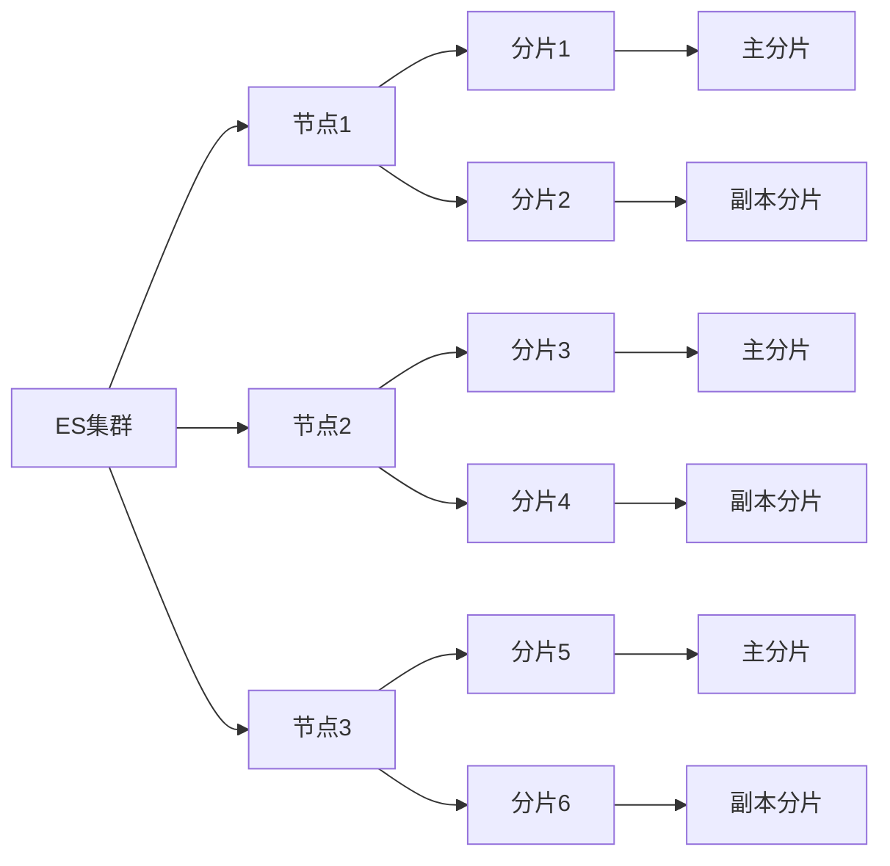

# ES搜索原理与代码实例讲解

## 1. 背景介绍
### 1.1 搜索引擎的发展历程
#### 1.1.1 早期的文件检索系统
#### 1.1.2 关键词检索的兴起 
#### 1.1.3 链接分析和PageRank算法

### 1.2 ES的诞生
#### 1.2.1 Lucene时代
#### 1.2.2 ES的崛起
#### 1.2.3 ES生态圈的繁荣

### 1.3 ES在企业中的应用现状
#### 1.3.1 日志分析领域
#### 1.3.2 站内搜索
#### 1.3.3 数据分析与可视化

## 2. 核心概念与联系
### 2.1 ES基本概念
#### 2.1.1 Near Realtime (NRT) 
#### 2.1.2 Cluster 集群
#### 2.1.3 Node 节点
#### 2.1.4 Index 索引
#### 2.1.5 Type 类型
#### 2.1.6 Document 文档
#### 2.1.7 Shards & Replicas 分片与副本

### 2.2 Lucene相关概念
#### 2.2.1 Lucene简介
#### 2.2.2 Analysis 分析
#### 2.2.3 Analyzer 分析器 
#### 2.2.4 Inverted Index 倒排索引

### 2.3 概念关系梳理


## 3. 核心算法原理具体操作步骤
### 3.1 文档写入原理
#### 3.1.1 文档解析
#### 3.1.2 文档索引
#### 3.1.3 文档刷新
#### 3.1.4 文档提交

### 3.2 查询原理
#### 3.2.1 查询解析
#### 3.2.2 查询路由
#### 3.2.3 查询执行
#### 3.2.4 结果合并
#### 3.2.5 结果排序
#### 3.2.6 结果高亮

### 3.3 相关性算分原理
#### 3.3.1 TF/IDF算法
#### 3.3.2 BM25算法
#### 3.3.3 字段长度归一化
#### 3.3.4 协调因子

## 4. 数学模型和公式详细讲解举例说明
### 4.1 布尔模型
#### 4.1.1 布尔模型介绍
#### 4.1.2 布尔查询表达式
#### 4.1.3 布尔查询优化

### 4.2 向量空间模型
#### 4.2.1 向量空间模型介绍
#### 4.2.2 文档向量表示
#### 4.2.3 查询向量表示 
#### 4.2.4 相似度计算
$$ sim(q,d) = \frac{\sum_{i=1}^{n} w_{i,q} \cdot w_{i,d}}{\sqrt{\sum_{i=1}^{n} w_{i,q}^2} \cdot \sqrt{\sum_{i=1}^{n} w_{i,d}^2}} $$

### 4.3 概率模型
#### 4.3.1 概率模型介绍
#### 4.3.2 语言模型
$$ P(Q|D) = \prod_{i=1}^{n} P(q_i|D) $$
#### 4.3.3 BM25模型
$$ score(D,Q) = \sum_{i=1}^{n} IDF(q_i) \cdot \frac{f(q_i,D) \cdot (k_1+1)}{f(q_i,D) + k_1 \cdot (1-b+b \cdot \frac{|D|}{avgdl})} $$

## 5. 项目实践：代码实例和详细解释说明
### 5.1 创建索引
```java
CreateIndexRequest request = new CreateIndexRequest("my-index");
CreateIndexResponse createIndexResponse = client.indices().create(request, RequestOptions.DEFAULT);
```

### 5.2 索引文档
```java
IndexRequest request = new IndexRequest("my-index");
request.id("1");
String jsonString = "{" +
        "\"user\":\"kimchy\"," +
        "\"postDate\":\"2013-01-30\"," +
        "\"message\":\"trying out Elasticsearch\"" +
        "}";
request.source(jsonString, XContentType.JSON);
IndexResponse indexResponse = client.index(request, RequestOptions.DEFAULT);
```

### 5.3 查询文档
```java
SearchRequest searchRequest = new SearchRequest("my-index"); 
SearchSourceBuilder sourceBuilder = new SearchSourceBuilder(); 
sourceBuilder.query(QueryBuilders.termQuery("user", "kimchy")); 
sourceBuilder.from(0); 
sourceBuilder.size(5);
searchRequest.source(sourceBuilder);
SearchResponse searchResponse = client.search(searchRequest, RequestOptions.DEFAULT);
```

### 5.4 聚合分析
```java
SearchRequest searchRequest = new SearchRequest();
SearchSourceBuilder searchSourceBuilder = new SearchSourceBuilder();
TermsAggregationBuilder aggregation = AggregationBuilders.terms("by_company")
        .field("company.keyword");
aggregation.subAggregation(AggregationBuilders.avg("average_age")
        .field("age"));
searchSourceBuilder.aggregation(aggregation);
searchRequest.source(searchSourceBuilder);
SearchResponse searchResponse = client.search(searchRequest, RequestOptions.DEFAULT);
```

## 6. 实际应用场景
### 6.1 电商搜索
#### 6.1.1 商品信息索引
#### 6.1.2 多条件搜索与过滤
#### 6.1.3 相关性排序优化

### 6.2 日志分析
#### 6.2.1 日志数据采集与索引
#### 6.2.2 异常检测与告警
#### 6.2.3 用户行为分析

### 6.3 智能问答
#### 6.3.1 问题理解与分析
#### 6.3.2 知识库构建
#### 6.3.3 问题匹配与答案检索

## 7. 工具和资源推荐
### 7.1 ES官方文档
### 7.2 ES Java Rest Client
### 7.3 Kibana
### 7.4 Logstash
### 7.5 Beats

## 8. 总结：未来发展趋势与挑战
### 8.1 ES在AI领域的应用前景
### 8.2 ES在知识图谱领域的机遇
### 8.3 ES面临的性能与扩展性挑战
### 8.4 ES生态圈的持续繁荣

## 9. 附录：常见问题与解答
### 9.1 ES如何实现近实时搜索？
### 9.2 ES的分布式架构是如何实现的？
### 9.3 ES的分片与副本机制有什么作用？
### 9.4 如何优化ES的查询性能？
### 9.5 ES在海量数据场景下应该如何规划集群？

作者：禅与计算机程序设计艺术 / Zen and the Art of Computer Programming