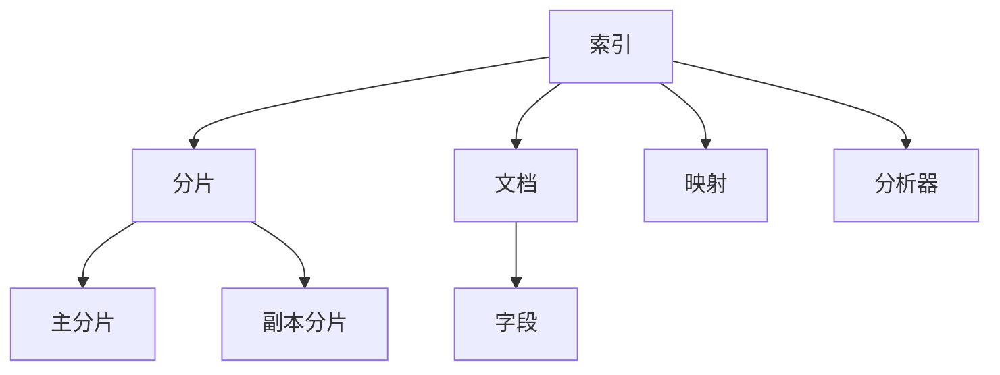

# ES索引原理与代码实例讲解

## 1.背景介绍

Elasticsearch（简称ES）是一个分布式搜索和分析引擎，广泛应用于全文搜索、日志分析、实时数据流处理等领域。其核心功能之一是索引（Index），索引的设计和实现直接影响到ES的性能和可扩展性。本文将深入探讨ES索引的原理，并通过代码实例详细讲解其具体操作步骤。

## 2.核心概念与联系

### 2.1 索引（Index）

在ES中，索引类似于关系型数据库中的表。它是一个逻辑命名空间，用于存储和管理文档。每个索引由一个或多个分片（Shard）组成，每个分片又可以有多个副本（Replica）。

### 2.2 文档（Document）

文档是ES中的基本数据单元，类似于关系型数据库中的行。每个文档是一个JSON对象，包含多个字段（Field）。

### 2.3 分片（Shard）

分片是索引的物理存储单元。每个索引可以分为多个分片，以实现数据的分布式存储和处理。分片可以进一步分为主分片（Primary Shard）和副本分片（Replica Shard）。

### 2.4 映射（Mapping）

映射定义了索引中字段的类型和属性。它类似于关系型数据库中的模式（Schema）。映射可以在索引创建时定义，也可以在索引创建后动态添加。

### 2.5 分析器（Analyzer）

分析器用于处理文本数据，将其分解为词项（Term）。分析器由字符过滤器、分词器和词项过滤器组成。



## 3.核心算法原理具体操作步骤

### 3.1 索引创建

创建索引时，ES会根据用户提供的配置（如分片数、副本数、映射等）初始化索引。以下是创建索引的基本步骤：

1. **定义索引名称和配置**：用户提供索引名称和配置参数。
2. **分片分配**：ES根据配置参数将分片分配到集群中的节点。
3. **映射设置**：用户可以在创建索引时定义映射，也可以在索引创建后动态添加。

### 3.2 文档索引

文档索引是将文档存储到索引中的过程。以下是文档索引的基本步骤：

1. **文档解析**：将文档解析为JSON对象。
2. **字段映射**：根据映射将文档中的字段映射到索引中。
3. **分片选择**：根据文档ID选择目标分片。
4. **文档存储**：将文档存储到目标分片中。

### 3.3 查询处理

查询处理是从索引中检索数据的过程。以下是查询处理的基本步骤：

1. **查询解析**：将用户查询解析为ES查询DSL。
2. **分片选择**：根据查询条件选择目标分片。
3. **查询执行**：在目标分片上执行查询。
4. **结果合并**：将各分片的查询结果合并并返回给用户。

## 4.数学模型和公式详细讲解举例说明

### 4.1 倒排索引

倒排索引是ES中最核心的数据结构之一。它将文档中的词项映射到包含这些词项的文档ID列表。倒排索引的构建过程如下：

1. **分词**：将文档内容分解为词项。
2. **词项排序**：对词项进行排序。
3. **倒排列表构建**：为每个词项构建包含文档ID的倒排列表。

倒排索引的数学表示如下：

$$
I(t) = \{d_1, d_2, \ldots, d_n\}
$$

其中，$I(t)$ 表示词项 $t$ 的倒排列表，$d_i$ 表示包含词项 $t$ 的文档ID。

### 4.2 TF-IDF

TF-IDF（Term Frequency-Inverse Document Frequency）是衡量词项重要性的一种方法。其计算公式如下：

$$
\text{TF-IDF}(t, d) = \text{TF}(t, d) \times \text{IDF}(t)
$$

其中，$\text{TF}(t, d)$ 表示词项 $t$ 在文档 $d$ 中的频率，$\text{IDF}(t)$ 表示词项 $t$ 的逆文档频率，计算公式如下：

$$
\text{IDF}(t) = \log \frac{N}{|\{d \in D : t \in d\}|}
$$

其中，$N$ 表示文档总数，$|\{d \in D : t \in d\}|$ 表示包含词项 $t$ 的文档数。

## 5.项目实践：代码实例和详细解释说明

### 5.1 创建索引

以下是使用Elasticsearch Java API创建索引的示例代码：

```java
import org.elasticsearch.client.RequestOptions;
import org.elasticsearch.client.RestHighLevelClient;
import org.elasticsearch.client.indices.CreateIndexRequest;
import org.elasticsearch.client.indices.CreateIndexResponse;
import org.elasticsearch.common.settings.Settings;
import org.elasticsearch.common.xcontent.XContentType;

public class CreateIndexExample {
    public static void main(String[] args) {
        try (RestHighLevelClient client = new RestHighLevelClient()) {
            CreateIndexRequest request = new CreateIndexRequest("my_index");
            request.settings(Settings.builder()
                .put("index.number_of_shards", 3)
                .put("index.number_of_replicas", 2)
            );
            request.mapping(
                "{\n" +
                "  \"properties\": {\n" +
                "    \"field1\": {\"type\": \"text\"},\n" +
                "    \"field2\": {\"type\": \"keyword\"}\n" +
                "  }\n" +
                "}", 
                XContentType.JSON
            );
            CreateIndexResponse createIndexResponse = client.indices().create(request, RequestOptions.DEFAULT);
            System.out.println("Index created: " + createIndexResponse.index());
        } catch (Exception e) {
            e.printStackTrace();
        }
    }
}
```

### 5.2 索引文档

以下是使用Elasticsearch Java API索引文档的示例代码：

```java
import org.elasticsearch.action.index.IndexRequest;
import org.elasticsearch.action.index.IndexResponse;
import org.elasticsearch.client.RequestOptions;
import org.elasticsearch.client.RestHighLevelClient;
import org.elasticsearch.common.xcontent.XContentType;

public class IndexDocumentExample {
    public static void main(String[] args) {
        try (RestHighLevelClient client = new RestHighLevelClient()) {
            IndexRequest request = new IndexRequest("my_index");
            request.id("1");
            request.source(
                "{\n" +
                "  \"field1\": \"value1\",\n" +
                "  \"field2\": \"value2\"\n" +
                "}", 
                XContentType.JSON
            );
            IndexResponse indexResponse = client.index(request, RequestOptions.DEFAULT);
            System.out.println("Document indexed: " + indexResponse.getId());
        } catch (Exception e) {
            e.printStackTrace();
        }
    }
}
```

### 5.3 查询文档

以下是使用Elasticsearch Java API查询文档的示例代码：

```java
import org.elasticsearch.action.search.SearchRequest;
import org.elasticsearch.action.search.SearchResponse;
import org.elasticsearch.client.RequestOptions;
import org.elasticsearch.client.RestHighLevelClient;
import org.elasticsearch.index.query.QueryBuilders;
import org.elasticsearch.search.builder.SearchSourceBuilder;

public class SearchDocumentExample {
    public static void main(String[] args) {
        try (RestHighLevelClient client = new RestHighLevelClient()) {
            SearchRequest searchRequest = new SearchRequest("my_index");
            SearchSourceBuilder searchSourceBuilder = new SearchSourceBuilder();
            searchSourceBuilder.query(QueryBuilders.matchQuery("field1", "value1"));
            searchRequest.source(searchSourceBuilder);
            SearchResponse searchResponse = client.search(searchRequest, RequestOptions.DEFAULT);
            System.out.println("Search results: " + searchResponse.getHits().getHits().length);
        } catch (Exception e) {
            e.printStackTrace();
        }
    }
}
```

## 6.实际应用场景

### 6.1 全文搜索

ES广泛应用于全文搜索场景，如网站搜索、文档搜索等。其强大的分词和倒排索引功能使其能够快速、高效地处理大规模文本数据。

### 6.2 日志分析

ES在日志分析领域也有广泛应用。通过与Logstash和Kibana的结合，ES可以实现实时日志收集、存储和分析，帮助运维人员快速定位和解决问题。

### 6.3 实时数据流处理

ES还可以用于实时数据流处理，如监控系统、实时推荐系统等。其高效的索引和查询能力使其能够处理大规模实时数据。

## 7.工具和资源推荐

### 7.1 Elasticsearch官方文档

Elasticsearch官方文档是学习和使用ES的最佳资源，包含详细的API文档、使用指南和示例代码。

### 7.2 Kibana

Kibana是Elasticsearch的可视化工具，提供了强大的数据可视化和分析功能。通过Kibana，用户可以方便地创建和分享仪表盘，实时监控和分析数据。

### 7.3 Logstash

Logstash是一个数据收集和处理工具，常与Elasticsearch和Kibana一起使用。它可以从多种数据源收集数据，进行过滤和转换，并将数据发送到Elasticsearch进行存储和分析。

## 8.总结：未来发展趋势与挑战

### 8.1 未来发展趋势

随着大数据和人工智能技术的发展，Elasticsearch在数据搜索和分析领域的应用将越来越广泛。未来，ES可能会在以下几个方面有所突破：

1. **性能优化**：通过改进索引和查询算法，提高ES的性能和可扩展性。
2. **智能搜索**：结合机器学习和自然语言处理技术，实现更智能的搜索和推荐功能。
3. **多模态数据处理**：支持更多类型的数据，如图像、视频等，实现多模态数据的搜索和分析。

### 8.2 挑战

尽管Elasticsearch在很多领域表现出色，但它也面临一些挑战：

1. **数据一致性**：在分布式环境中，如何保证数据的一致性是一个重要问题。
2. **资源消耗**：ES在处理大规模数据时，可能会消耗大量的计算和存储资源。
3. **安全性**：如何保证数据的安全性和隐私保护，也是ES需要面对的挑战。

## 9.附录：常见问题与解答

### 9.1 如何选择分片数和副本数？

选择分片数和副本数时，需要考虑数据量、查询性能和集群的可扩展性。一般来说，分片数应根据数据量和节点数进行设置，副本数则根据数据的容错需求进行设置。

### 9.2 如何优化查询性能？

优化查询性能的方法包括：合理设置索引和映射、使用合适的查询类型、避免使用复杂的脚本查询、定期进行索引优化等。

### 9.3 如何处理集群故障？

处理集群故障的方法包括：设置合理的副本数、使用快照进行数据备份、监控集群状态并及时处理异常等。

### 9.4 如何保证数据安全？

保证数据安全的方法包括：使用SSL/TLS加密通信、设置访问控制策略、定期进行安全审计等。

---

作者：禅与计算机程序设计艺术 / Zen and the Art of Computer Programming