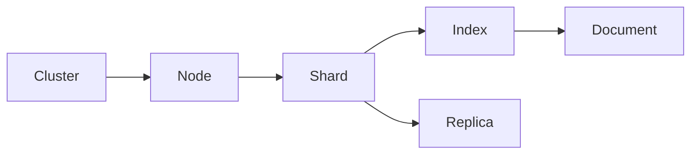

# ElasticSearch Document原理与代码实例讲解

## 1.背景介绍

### 1.1 全文搜索引擎的发展历程

#### 1.1.1 早期的文本搜索
#### 1.1.2 倒排索引的出现  
#### 1.1.3 分布式搜索引擎的兴起

### 1.2 ElasticSearch的诞生

#### 1.2.1 Lucene搜索库
#### 1.2.2 Shay Banon的创新之作
#### 1.2.3 ElasticSearch的快速发展

### 1.3 ElasticSearch在现代应用中的重要地位

#### 1.3.1 海量数据的实时搜索 
#### 1.3.2 日志分析与异常检测
#### 1.3.3 用户行为分析与个性化推荐

## 2.核心概念与联系

### 2.1 Node与Cluster

#### 2.1.1 Node的定义与作用
#### 2.1.2 Cluster的概念与特点  
#### 2.1.3 Node与Cluster的关系

### 2.2 Index与Document

#### 2.2.1 Index的结构与创建
#### 2.2.2 Document的概念与组成
#### 2.2.3 Index与Document的映射关系

### 2.3 Shard与Replica 

#### 2.3.1 Shard分片机制
#### 2.3.2 Replica副本与高可用
#### 2.3.3 Shard与Replica的分布策略

### 2.4 概念之间的关系总结



## 3.核心算法原理具体操作步骤

### 3.1 文档的索引过程

#### 3.1.1 文档写入分析
#### 3.1.2 文档字段的倒排索引构建
#### 3.1.3 索引文件的不可变更新

### 3.2 文档的搜索过程

#### 3.2.1 搜索请求的分发与路由
#### 3.2.2 分片级别的查询执行
#### 3.2.3 结果的合并与排序

### 3.3 文档的更新与删除

#### 3.3.1 文档更新的原子操作
#### 3.3.2 基于版本号的乐观锁并发控制
#### 3.3.3 删除操作的标记与清理

## 4.数学模型和公式详细讲解举例说明

### 4.1 向量空间模型(VSM)

#### 4.1.1 TF-IDF权重计算
$$
w_{t,d} = (1 + \log{tf_{t,d}}) \cdot \log{\frac{N}{df_t}}
$$
#### 4.1.2 文档相似度计算
$sim(d_1,d_2) = \cos(\vec{V}(d_1),\vec{V}(d_2)) = \frac{\vec{V}(d_1) \cdot \vec{V}(d_2)}{|\vec{V}(d_1)| \times |\vec{V}(d_2)|}$

### 4.2 BM25概率相关性模型

#### 4.2.1 BM25相关性评分函数
$$
score(D,Q) = \sum_{i=1}^n IDF(q_i) \cdot \frac{f(q_i,D) \cdot (k_1+1)}{f(q_i,D) + k_1 \cdot (1-b+b \cdot \frac{|D|}{avgdl})}
$$
#### 4.2.2 BM25+与BM25L改进

### 4.3 学习排序模型(LTR) 

#### 4.3.1 Pointwise方法
#### 4.3.2 Pairwise方法
#### 4.3.3 Listwise方法

## 5.项目实践：代码实例和详细解释说明

### 5.1 环境准备与配置

#### 5.1.1 ElasticSearch安装
#### 5.1.2 Kibana界面介绍
#### 5.1.3 客户端连接代码

### 5.2 文档的索引与搜索

#### 5.2.1 创建索引与Mapping定义
```json
PUT /my_index
{
  "mappings": {
    "properties": {
      "title": { "type": "text" },
      "content": { "type": "text" },
      "publish_date": { "type": "date" }
    }
  }
}
```

#### 5.2.2 单文档的写入与查询
```json
PUT /my_index/_doc/1
{
  "title": "ElasticSearch Guide",
  "content": "A practical guide to ElasticSearch",
  "publish_date": "2023-06-14" 
}

GET /my_index/_doc/1
```

#### 5.2.3 批量索引文档
```json
POST /my_index/_bulk
{"index":{"_id":"1"}}
{"title":"Doc 1", "content":"Hello"}
{"index":{"_id":"2"}}  
{"title":"Doc 2", "content":"World"}
```

#### 5.2.4 全文搜索与过滤
```json
GET /my_index/_search
{
  "query": {
    "bool": {
      "must": [
        {
          "match": {
            "content": "elasticsearch guide"
          }
        }
      ],
      "filter": [
        {
          "range": {
            "publish_date": {
              "gte": "2023-01-01"
            }
          }
        }
      ]
    }
  }
}
```

### 5.3 聚合分析与可视化

#### 5.3.1 Metric聚合
#### 5.3.2 Bucket聚合
#### 5.3.3 Kibana可视化面板

## 6.实际应用场景

### 6.1 电商搜索引擎 

#### 6.1.1 商品信息索引构建
#### 6.1.2 多条件搜索与过滤
#### 6.1.3 搜索结果高亮与排序

### 6.2 日志分析平台

#### 6.2.1 日志数据收集与索引  
#### 6.2.2 异常检测与告警
#### 6.2.3 统计分析与报表

### 6.3 用户行为分析

#### 6.3.1 用户行为数据采集
#### 6.3.2 Session分析
#### 6.3.3 个性化推荐

## 7.工具和资源推荐

### 7.1 ElasticSearch生态圈

#### 7.1.1 Logstash数据处理管道
#### 7.1.2 Beats轻量级采集器
#### 7.1.3 X-Pack商业版扩展

### 7.2 常用开发工具

#### 7.2.1 Postman/Insomnia接口测试
#### 7.2.2 Cerebro集群管理
#### 7.2.3 Dejavu数据可视化

### 7.3 学习资源

#### 7.3.1 官方文档
#### 7.3.2 在线教程
#### 7.3.3 经典图书

## 8.总结：未来发展趋势与挑战

### 8.1 ElasticSearch新特性

#### 8.1.1 SQL支持
#### 8.1.2 机器学习集成
#### 8.1.3 向量搜索

### 8.2 行业发展趋势

#### 8.2.1 云原生与Kubernetes部署 
#### 8.2.2 实时数据分析
#### 8.2.3 知识图谱与语义搜索

### 8.3 面临的挑战

#### 8.3.1 数据规模与性能优化
#### 8.3.2 安全与权限管控
#### 8.3.3 运维复杂度

## 9.附录：常见问题与解答

### 9.1 ElasticSearch与关系型数据库的区别?
### 9.2 ElasticSearch适合哪些场景使用?
### 9.3 如何对ElasticSearch进行容量规划?
### 9.4 ElasticSearch如何保证数据可靠性? 
### 9.5 ElasticSearch的性能优化要点有哪些?

作者：禅与计算机程序设计艺术 / Zen and the Art of Computer Programming