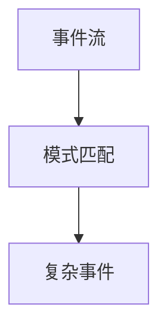

# Flink CEP原理与代码实例讲解

## 1.背景介绍

在当今快速发展的数字时代,实时数据处理和复杂事件处理(CEP)已经成为许多企业和组织的关键需求。随着海量数据的不断涌入,能够及时发现数据中隐藏的关键信息模式和异常情况,对于提高业务效率、优化决策过程以及确保系统安全性至关重要。Apache Flink作为一个开源的分布式流处理框架,凭借其强大的流处理能力和CEP库,成为了解决这些挑战的优秀选择。

### 1.1 什么是复杂事件处理(CEP)

复杂事件处理(Complex Event Processing,CEP)是一种从大量来自不同源头的事件数据中,实时识别出感兴趣的事件模式的技术。它通过对连续到达的简单事件进行过滤、关联和分析,从而检测出更加复杂的事件模式。CEP广泛应用于金融交易监控、网络安全威胁检测、物联网设备监控等领域。

### 1.2 Flink CEP的重要性

作为一个高性能的分布式流处理引擎,Flink提供了一个强大的CEP库,使得开发人员能够方便地在Flink作业中集成CEP功能。Flink CEP库支持各种事件模式匹配,如序列模式、贪婪模式等,并提供了丰富的API,使得编写CEP规则变得简单高效。此外,Flink CEP还具有低延迟、高吞吐量等优势,能够实时处理大规模数据流,满足企业级应用的需求。

## 2.核心概念与联系 

在深入探讨Flink CEP的原理和实现之前,我们需要先了解一些核心概念,并理解它们之间的联系。

### 2.1 事件(Event)

事件是CEP处理的基本单元,可以是任何包含时间戳和有效负载数据的记录。在Flink中,事件通常被表示为DataStream或DataSet中的元素。

### 2.2 事件流(Event Stream)

事件流是一个按时间有序的事件序列,是CEP处理的输入数据源。在Flink中,事件流可以来自各种数据源,如Apache Kafka、RabbitMQ等消息队列,或者是文件、Socket等。

### 2.3 模式(Pattern)

模式定义了我们感兴趣的复杂事件序列。Flink CEP库支持多种模式,包括严格连续模式、宽松连续模式、不确定性模式等。模式可以由多个模式组合而成,形成更加复杂的模式。



### 2.4 模式流(Pattern Stream)

模式流是由模式序列与事件流匹配后产生的数据流,它包含了所有匹配上的复杂事件。模式流可以作为Flink作业的输出,也可以作为下游算子的输入,进行进一步的处理。

### 2.5 窗口(Window)

窗口是一个用于对事件流进行切分的概念,它定义了一个事件流的时间或计数边界。在CEP中,窗口往往与模式结合使用,用于限制模式匹配的范围,提高效率并避免内存溢出。

### 2.6 CEP库与DataStream/DataSet API的关系

Flink CEP库是建立在DataStream和DataSet API之上的,它为复杂事件处理提供了专门的API和操作符。开发人员可以在Flink作业中自由地混合使用CEP库和其他API,实现更加复杂的流处理逻辑。

## 3.核心算法原理具体操作步骤

Flink CEP库的核心算法原理是基于有限状态自动机(Finite Automata)。在介绍具体的操作步骤之前,我们先来了解一下有限状态自动机的概念。

### 3.1 有限状态自动机

有限状态自动机是一种计算模型,它由一系列状态和状态转移规则组成。根据输入符号,自动机会从一个状态转移到另一个状态。当自动机到达某个特定的终止状态时,就表示它接受了输入符号序列。


在上图中,自动机从起始状态A开始,如果输入符号序列是"abc",那么它会经过状态B和状态C,最终到达终止状态D,表示接受了这个输入序列。

### 3.2 Flink CEP中的有限状态自动机

Flink CEP库内部使用有限状态自动机来实现模式匹配。每个模式都会被转换成一个相应的非确定有限自动机(NFA),用于在事件流上进行匹配。

具体的操作步骤如下:

1. **构建NFA**: 根据用户定义的模式,Flink CEP库会构建一个对应的NFA。这个NFA包含了所有可能的状态转移路径,用于匹配输入的事件序列。

2. **事件流遍历**: Flink CEP库会遍历输入的事件流,并将每个事件传递给NFA进行处理。

3. **状态转移**: NFA根据当前状态和输入事件,按照转移规则进行状态转移。如果当前事件可以使自动机从一个状态转移到另一个状态,那么就执行相应的转移操作。

4. **模式匹配检测**: 如果NFA到达了终止状态,那么就表示它匹配到了一个符合模式的事件序列。此时,Flink CEP库会输出这个复杂事件。

5. **状态维护**: 为了支持宽松连续模式的匹配,Flink CEP库会维护自动机的所有活跃状态,而不是只维护当前状态。这样可以确保在未来的事件到达时,能够从任何活跃状态继续进行状态转移。

6. **窗口处理**: 如果使用了窗口,Flink CEP库会根据窗口的时间或计数边界,自动清除过期的状态,避免状态空间无限增长。

通过上述步骤,Flink CEP库能够高效地在事件流上进行模式匹配,并输出符合模式的复杂事件。

## 4.数学模型和公式详细讲解举例说明

在CEP中,数学模型和公式主要用于描述和分析事件流的行为,以及模式匹配的性能和复杂度。下面我们将详细讲解一些常见的数学模型和公式。

### 4.1 事件流建模

事件流可以被建模为一个离散的时间序列,用于分析其统计特性和行为模式。设$E=\{e_1, e_2, \ldots, e_n\}$表示一个包含$n$个事件的事件流,其中$e_i$表示第$i$个事件,并且$t(e_i)$表示事件$e_i$的时间戳。我们可以定义以下公式:

$$
\begin{align}
\lambda &= \frac{n}{t(e_n) - t(e_1)} \\
\sigma^2 &= \frac{1}{n-1}\sum_{i=1}^{n}(t(e_{i+1}) - t(e_i) - \bar{\tau})^2 \\
\bar{\tau} &= \frac{1}{n-1}\sum_{i=1}^{n-1}(t(e_{i+1}) - t(e_i))
\end{align}
$$

其中$\lambda$表示事件流的平均事件率,$\sigma^2$表示事件间隔时间的方差,而$\bar{\tau}$表示事件间隔时间的均值。这些指标可以帮助我们了解事件流的基本统计特性,为后续的模式匹配和性能优化提供依据。

### 4.2 模式匹配复杂度分析

模式匹配的复杂度主要取决于模式的结构和事件流的特性。我们可以使用下面的公式来估计模式匹配的时间复杂度:

$$
T(n, m) = O(n \times \sum_{i=1}^{m}c_i)
$$

其中$n$表示事件流的长度,$m$表示模式中状态的数量,$c_i$表示第$i$个状态的平均检查次数。对于简单的模式,如严格连续模式,每个状态的检查次数为1,因此时间复杂度为$O(n \times m)$。而对于更复杂的模式,如宽松连续模式或负模式,状态检查次数会更多,导致时间复杂度增加。

同时,我们还可以使用下面的公式来估计模式匹配的空间复杂度:

$$
S(m, w) = O(m \times w)
$$

其中$m$表示模式中状态的数量,$w$表示窗口的大小。空间复杂度主要取决于需要维护的活跃状态数量,而活跃状态的数量又与窗口大小有关。因此,适当设置窗口大小对于控制空间复杂度非常重要。

通过对上述公式的分析,我们可以更好地理解模式匹配的性能特征,并针对性地进行优化,以提高CEP系统的效率和可扩展性。

### 4.3 示例:网络入侵检测中的模式匹配

在网络入侵检测领域,CEP可以用于实时监控网络流量,并检测出可疑的攻击模式。假设我们需要检测以下攻击模式:在5分钟内,同一IP地址尝试登录失败超过5次。我们可以使用Flink CEP库来实现这个需求。

首先,我们需要定义一个模式序列,用于描述感兴趣的事件序列:

```java
Pattern<Event, ?> pattern = Pattern.<Event>begin("start")
    .where(event -> event.getSrcIP() != null)
    .next("next")
    .where(event -> event.getType().equals("LOGIN_FAILED"))
    .times(5)
    .within(Time.minutes(5));
```

这个模式序列描述了一个起始事件(具有非空源IP地址),后面紧跟5个"LOGIN_FAILED"事件,并且这些事件必须在5分钟内发生。

接下来,我们可以在Flink作业中应用这个模式,并对匹配的复杂事件进行进一步处理:

```java
DataStream<Event> input = env.addSource(...); // 事件流源

PatternStream<Event> patternStream = CEP.pattern(input, pattern);

DataStream<Alert> alerts = patternStream.process(
    new PatternProcessFunction<Event, Alert>() {
        @Override
        public void processMatch(Map<String, List<Event>> pattern, Context ctx, Collector<Alert> out) throws Exception {
            List<Event> events = pattern.get("start");
            String srcIP = events.get(0).getSrcIP();
            out.collect(new Alert(srcIP, "Potential brute-force attack detected"));
        }
    }
);
```

在这个例子中,我们首先从事件流源获取输入数据,然后使用`CEP.pattern`方法应用我们定义的模式。对于每个匹配的模式序列,我们会输出一个警报,提示可能发生了暴力破解攻击。

通过这个示例,我们可以看到如何在Flink CEP库中定义模式,并将其应用于实际的应用场景。同时,我们也可以根据具体的需求,调整模式的复杂度和窗口大小,从而优化模式匹配的性能和资源使用。

## 5.项目实践:代码实例和详细解释说明

为了更好地理解Flink CEP的使用方式,我们将通过一个实际项目案例来演示如何在Flink作业中集成CEP功能。在这个案例中,我们将构建一个简单的在线购物网站监控系统,使用CEP来检测可疑的购买行为。

### 5.1 项目概述

我们的在线购物网站会记录每个用户的购买行为,生成一个包含以下字段的事件流:

- `userId`: 用户ID
- `itemId`: 购买商品的ID
- `quantity`: 购买数量
- `timestamp`: 购买时间戳

我们的目标是实时监控这个事件流,并检测出以下可疑行为模式:

1. **短时间内大量购买同一商品**:如果同一用户在5分钟内购买同一商品的数量超过10件,则可能是机器人或者垃圾订单。

2. **连续多次小额购买**:如果同一用户连续5次进行小于10元的购买,则可能是恶意消费或者测试系统漏洞。

3. **高价值商品购买**:如果用户购买价格超过1000元的商品,则需要进行身份验证,防止信用卡盗刷等风险。

我们将使用Flink CEP库来实现这些监控规则,并输出相