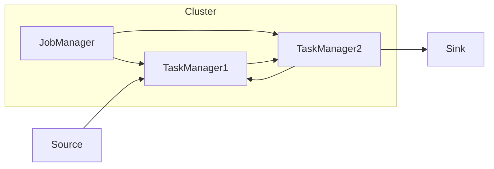
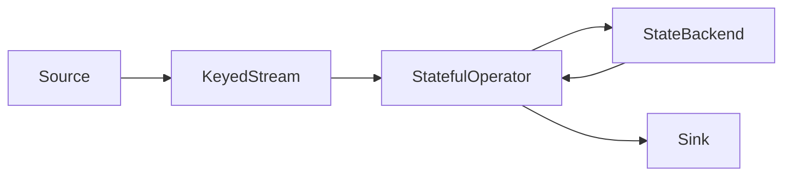

# Flink Stream 原理与代码实例讲解

## 1. 背景介绍

### 1.1 大数据处理的演进

在过去的几十年里，数据处理技术经历了从批处理到流处理的重大转变。早期的数据处理系统主要采用批处理模式,即先将大量数据积累到某个时间点,然后对这些数据进行处理。这种模式适用于离线分析和计算,但无法满足对实时数据处理的需求。

随着互联网、物联网和移动设备的兴起,实时数据处理变得越来越重要。大量连续不断的数据流需要被实时捕获、处理和分析。这就催生了流处理系统的出现,流处理系统能够持续不断地处理数据流,并及时产生结果。

### 1.2 Apache Flink 概述

Apache Flink 是一个开源的分布式流处理框架,最初由柏林理工大学的数据系统小组开发。它被设计用于统一处理有界数据流(如文件)和无界数据流(如事件流或传感器数据)。Flink 具有低延迟、高吞吐量、容错性强等特点,可以在大规模分布式环境中运行流处理应用程序。

Flink 的核心是流处理引擎,支持有状态计算、事件时间处理、窗口操作等高级功能。它提供了 DataStream API 和 DataSet API,可以使用 Java、Scala 和 Python 编写流处理应用程序。此外,Flink 还支持机器学习算法、图处理和关系型查询等多种计算范式。

## 2. 核心概念与联系

### 2.1 流处理基本概念

在讨论 Flink 的核心概念之前,我们先介绍一些流处理的基本概念:

- **流(Stream)**: 一个无界的、持续不断的数据序列。
- **事件(Event)**: 流中的每个数据元素。
- **窗口(Window)**: 对流进行分割的一种方式,将无限流划分为有限的数据块。
- **状态(State)**: 流处理应用程序需要保存中间结果或统计数据,这些数据被称为状态。
- **时间语义**: 流处理系统需要处理事件的时间信息,包括事件时间(Event Time)和处理时间(Processing Time)。

### 2.2 Flink 核心概念

Flink 的核心概念包括:

- **流执行环境(StreamExecutionEnvironment)**: 用于设置流处理作业的执行环境和参数。
- **数据源(Source)**: 定义输入数据流的来源,如文件、socket 或 Kafka 等。
- **转换(Transformation)**: 对流进行各种转换操作,如过滤、映射、聚合等。
- **数据sink(Sink)**: 定义输出数据流的目的地,如文件、socket 或 Kafka 等。
- **窗口(Window)**: Flink 支持多种窗口类型,如滚动窗口、滑动窗口、会话窗口等。
- **状态(State)**: Flink 支持各种状态类型,如键控状态、广播状态等。
- **时间语义(Time Semantics)**: Flink 支持事件时间和处理时间两种时间语义。
- **容错机制(Fault Tolerance)**: Flink 采用轻量级快照机制实现容错。

这些概念相互关联,共同构建了 Flink 的流处理框架。下面我们将详细介绍其中的一些核心概念。

### 2.3 流执行环境

`StreamExecutionEnvironment` 是 Flink 流处理应用程序的入口,用于设置执行环境参数和创建数据源。它提供了一些重要的配置选项,如设置并行度、启用检查点、指定默认时间特征等。

```java
// 创建流执行环境
StreamExecutionEnvironment env = StreamExecutionEnvironment.getExecutionEnvironment();

// 设置并行度
env.setParallelism(4);

// 启用检查点
env.enableCheckpointing(5000); 

// 设置事件时间为时间特征
env.setStreamTimeCharacteristic(TimeCharacteristic.EventTime);
```

### 2.4 数据源与Sink

Flink 提供了多种数据源和 Sink 连接器,支持从各种系统读取和写入数据流。

```java
// 从socket读取数据流
DataStream<String> stream = env.socketTextStream("localhost", 9999);

// 从Kafka读取数据流
Properties props = new Properties();
props.setProperty("bootstrap.servers", "kafka-broker:9092");
DataStream<String> stream = env.addSource(new FlinkKafkaConsumer<>("topic", new SimpleStringSchema(), props));

// 将数据流写入socket
stream.print();

// 将数据流写入Kafka
props.setProperty("bootstrap.servers", "kafka-broker:9092");
stream.addSink(new FlinkKafkaProducer<>("topic", new SimpleStringSchema(), props));
```

### 2.5 转换操作

Flink 提供了丰富的转换操作,用于对数据流进行各种转换和处理。常见的转换操作包括 map、flatMap、filter、keyBy、reduce 等。

```java
// 过滤事件
stream.filter(event -> event.getId() > 0)
       .keyBy(event -> event.getCategory())
       .window(TumblingEventTimeWindows.of(Time.seconds(10)))
       .reduce((a, b) -> a.update(b))
       .print();
```

### 2.6 窗口操作

窗口是流处理中一个非常重要的概念。Flink 支持多种窗口类型,包括时间窗口和计数窗口。时间窗口又可分为滚动窗口、滑动窗口和会话窗口。

```java
// 滚动事件时间窗口(10秒)
stream.window(TumblingEventTimeWindows.of(Time.seconds(10)))

// 滑动事件时间窗口(15秒,每5秒滑动一次)  
stream.window(SlidingEventTimeWindows.of(Time.seconds(15), Time.seconds(5)))

// 会话窗口(30分钟不活动就合并窗口)
stream.window(EventTimeSessionWindows.withGap(Time.minutes(30)))
```

窗口操作通常与其他转换操作结合使用,如 reduce、aggregate、apply 等。

### 2.7 状态管理

有状态计算是 Flink 的一大核心特性。Flink 支持各种状态类型,包括:

- **键控状态(Keyed State)**: 根据键值来维护和访问状态。
- **广播状态(Broadcast State)**: 可以将数据广播到所有并行实例的状态。
- **窗口状态(Window State)**: 维护窗口数据的状态。

状态存储在内存或者 RocksDB 中,并通过检查点机制实现状态一致性和容错。

```java
// 使用键控状态
stream.keyBy(...)
      .flatMapWithState(
          (IN value, StatefulFlatMapFunction.StateContext<State> ctx) -> {...},
          StatefulFlatMapFunction.StateDescriptor(...)
      );
```

### 2.8 时间语义

在流处理中,正确处理事件的时间语义至关重要。Flink 支持两种时间语义:

- **事件时间(Event Time)**: 事件实际发生的时间。适用于有序事件流或乱序事件流。
- **处理时间(Processing Time)**: 事件进入 Flink 的时间。

Flink 默认采用处理时间语义,可以通过 `env.setStreamTimeCharacteristic(TimeCharacteristic.EventTime)` 设置为事件时间语义。此外,Flink 还提供了多种机制来处理乱序事件。

### 2.9 容错机制

Flink 采用轻量级快照机制实现容错,可以在发生故障时从最近一次成功的检查点恢复状态。检查点由 JobManager 协调,将状态持久化存储在分布式文件系统中。

```java
// 启用检查点,间隔为5秒
env.enableCheckpointing(5000);

// 设置检查点模式(EXACTLY_ONCE)
env.getCheckpointConfig().setCheckpointingMode(CheckpointingMode.EXACTLY_ONCE);
```

Flink 还支持端到端的精确一次语义,确保在发生故障时不会丢失或重复计算事件。

## 3. 核心算法原理具体操作步骤

在上一节中,我们介绍了 Flink 的核心概念。现在,我们将深入探讨 Flink 的核心算法原理和具体操作步骤。

### 3.1 Flink 架构概览

Flink 采用主从架构,由 JobManager 和 TaskManager 组成。

- **JobManager**: 负责协调分布式执行,调度任务、协调检查点、监控执行过程等。
- **TaskManager**: 执行实际的数据处理任务,包括数据流的接收、转换和发送。

TaskManager 之间通过数据流进行数据传输和处理,而 JobManager 负责协调整个流处理作业的执行。



### 3.2 数据流模型

Flink 采用流式数据处理模型,将数据流表示为逻辑流和物理流两个层次。

- **逻辑流**: 由 DataStream 程序构建的有向无环图(DAG),描述了数据的转换关系。
- **物理流**: 由一系列 Task 组成的有向无环图,描述了数据的传输和处理过程。

在执行阶段,Flink 会将逻辑流转换为物理流,并在 TaskManager 上执行相应的 Task。


### 3.3 Task 链接

为了减少数据传输和序列化开销,Flink 采用了 Task 链接机制。相邻的 Task 会被链接在一起,形成 Task 链,在同一个线程中执行。这样可以避免不必要的数据缓冲和序列化操作。


### 3.4 数据分区

在分布式环境中,数据需要在不同的 Task 之间进行分区和传输。Flink 支持多种分区策略:

- **重分区(Rebalance)**: 将数据均匀分布到下游分区。
- **哈希分区(Hash)**: 根据 Key 的哈希值分区。
- **广播分区(Broadcast)**: 将数据复制到所有下游分区。
- **范围分区(Range)**: 根据 Key 的范围分区。
- **...`

分区策略可以在 DataStream API 中指定,如 `stream.keyBy(...).window(...)`。

### 3.5 窗口算法

窗口是 Flink 流处理中一个非常重要的概念。Flink 支持多种窗口类型和窗口操作,如滚动窗口、滑动窗口、会话窗口等。

窗口算法的核心思想是将无限流拆分为有限的窗口,然后在每个窗口上执行相应的计算操作。Flink 采用了增量计算和状态维护的方式来实现窗口操作。


### 3.6 有状态计算

有状态计算是 Flink 的一大核心特性。Flink 将状态存储在内存或 RocksDB 中,并通过检查点机制实现状态一致性和容错。

有状态计算的核心思想是将状态与计算分开,状态可以跨多个事件进行维护和更新。Flink 提供了多种状态类型,如键控状态、广播状态和窗口状态。



### 3.7 时间语义处理

正确处理事件的时间语义对流处理系统至关重要。Flink 支持事件时间和处理时间两种时间语义。

- **事件时间**: 事件实际发生的时间。适用于有序事件流或乱序事件流。Flink 提供了多种机制来处理乱序事件,如延迟数据处理、watermark 机制等。
- **处理时间**: 事件进入 Flink 的时间。处理时间相对简单,但无法处理乱序事件。

时间语义的处理贯穿于 Flink 的整个执行过程,包括数据源、窗口操作、状态管理等。

### 3.8 容错机制

Flink 采用轻量级快照机制实现容错,可以在发生故障时从最近一次成功的检查点恢复状态。

检查点由 JobManager 协调,将状态持久化存储在分布式文件系统中。TaskManager 会定期向 Job