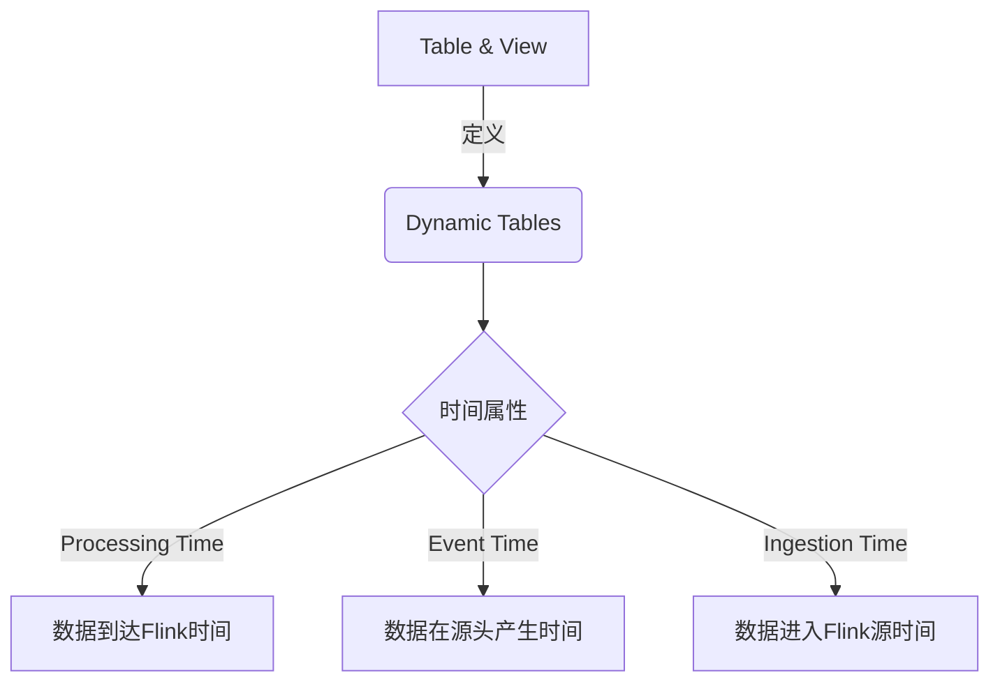
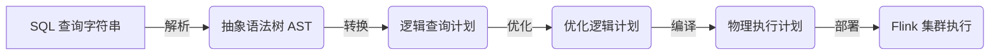

# Flink Table API和SQL原理与代码实例讲解

## 1.背景介绍

Apache Flink 是一个开源的分布式流处理框架,支持有状态计算、事件驱动型应用程序,具有低延迟、高吞吐量和精确一次语义等特点。Flink Table API 和 SQL 是 Flink 提供的两种关系型API,用于处理批处理和流数据。它们为开发人员提供了声明式的方式来处理数据,从而简化了数据处理的编程模型。

### 1.1 Flink Table API

Flink Table API 是一种用于统一流处理和批处理的关系型API。它基于 Apache Calcite 的查询优化器,支持SQL的所有主要特性,如投影(Projection)、聚合(Aggregation)、连接(Join)、窗口(Window)等。Table API 使用类似于集合操作的语法,允许以编程方式组合关系算子。

### 1.2 Flink SQL

Flink SQL 是基于 Apache Calcite 解析和优化 SQL 查询的组件。它支持标准的 SQL 语法,包括 DDL(数据定义语言)、DML(数据操作语言)和 DQL(数据查询语言)。Flink SQL 可以与 Table API 无缝集成,并且支持流处理和批处理的混合执行。

## 2.核心概念与联系

### 2.1 Table 和 View

Table 是 Flink 中的核心概念,代表一个逻辑关系。Table 可以从各种数据源创建,如文件、Kafka 主题、数据库表等。Table 可以通过 Table API 或 SQL 进行查询和转换。View 是一个虚拟的 Table,由一个逻辑查询定义。View 可以用于封装复杂的查询,并在其他查询中重用。

### 2.2 动态表(Dynamic Tables)

动态表是一种特殊类型的 Table,用于描述持续更新的数据流或外部数据源。动态表支持 CDC(Change Data Capture),可以捕获数据源的插入、更新和删除操作。动态表可以用于实现有状态的流处理应用程序。

### 2.3 时间属性

在流处理中,时间属性是一个关键概念。Flink 支持三种时间属性:

- Processing Time: 数据到达 Flink 的时间
- Event Time: 数据在源头产生的时间
- Ingestion Time: 数据进入 Flink 源的时间

时间属性可以用于窗口操作、Join 操作和时间戳提取等。



## 3.核心算法原理具体操作步骤

### 3.1 Table API 编程模型

Table API 提供了一种关系型的编程接口,允许以编程方式组合关系算子。它的核心算法原理包括以下步骤:

1. **创建 Table 环境**:首先需要创建一个 `TableEnvironment`,它是 Table API 和 SQL 集成的核心入口。

```java
// 创建 Batch 环境
ExecutionEnvironment bEnv = ExecutionEnvironment.getExecutionEnvironment();
BatchTableEnvironment bTableEnv = BatchTableEnvironment.create(bEnv);

// 创建 Stream 环境  
StreamExecutionEnvironment sEnv = StreamExecutionEnvironment.getExecutionEnvironment();
StreamTableEnvironment sTableEnv = StreamTableEnvironment.create(sEnv);
```

2. **注册数据源**:将数据源注册为 Table,可以是文件、Kafka 主题、数据库表等。

```java
// 从文件创建 Table
tableEnv.executeSql("CREATE TABLE fileTable (...) WITH (...)")

// 从 Kafka 创建 Table
tableEnv.executeSql("CREATE TABLE kafkaTable (...) WITH (...)")
```

3. **Table API 转换**:使用关系算子对 Table 进行转换,如 Select、Filter、Join、Window 等。

```java
Table table1 = ...
Table table2 = table1
    .select(...) // 投影
    .filter(...) // 过滤
    .join(...) // 连接
    .window(...) // 窗口
    .groupBy(...) // 分组
    .aggregate(...); // 聚合
```

4. **执行查询**:最后将转换后的 Table 发送到 Sink,触发执行。

```java
// 输出到文件
table2.executeInsert("fileOutput");

// 输出到 Kafka
table2.executeInsert("kafkaOutput");
```

### 3.2 Flink SQL 执行模型

Flink SQL 遵循标准的 SQL 执行模型,其核心算法原理包括以下步骤:

1. **SQL 解析**:SQL 查询字符串首先被解析为抽象语法树(AST)。

2. **逻辑查询计划**:AST 被转换为逻辑查询计划,表示查询的关系代数表示。

3. **优化器**:逻辑查询计划通过优化器进行优化,包括投影剪裁、谓词下推、Join 重排序等。

4. **物理执行计划**:优化后的逻辑计划被编译为物理执行计划,包括算子实例化和任务链接。

5. **执行**:物理执行计划被部署到 Flink 集群上执行。



## 4.数学模型和公式详细讲解举例说明

在 Flink Table API 和 SQL 中,常用的数学模型和公式包括窗口函数和聚合函数。

### 4.1 窗口函数

窗口函数用于对无边界的流数据进行有状态计算。Flink 支持多种窗口模型,如滚动窗口(Tumbling Window)、滑动窗口(Sliding Window)、会话窗口(Session Window)等。

**滚动窗口**

滚动窗口将数据流划分为不重叠的窗口,每个窗口持续一段固定的时间长度。滚动窗口的数学模型如下:

$$
\begin{align*}
W_i &= [t_i, t_i + window\_size) \\
t_i &= i \times window\_size
\end{align*}
$$

其中 $W_i$ 表示第 i 个窗口, $t_i$ 表示窗口的起始时间戳, $window\_size$ 表示窗口的大小。

**滑动窗口**

滑动窗口将数据流划分为重叠的固定长度的窗口,每个窗口滑动一个固定的时间间隔。滑动窗口的数学模型如下:

$$
\begin{align*}
W_i &= [t_i, t_i + window\_size) \\
t_i &= i \times slide\_size
\end{align*}
$$

其中 $slide\_size$ 表示窗口的滑动间隔。

### 4.2 聚合函数

聚合函数用于对一组值进行计算,并返回单个值。Flink 支持常见的聚合函数,如 SUM、COUNT、AVG、MAX、MIN 等。

**COUNT 函数**

COUNT 函数用于计算一组值中的元素个数。对于一个数据集 $D$,COUNT 函数的数学模型如下:

$$
COUNT(D) = \left\vert D \right\vert
$$

其中 $\left\vert D \right\vert$ 表示数据集 D 中元素的个数。

**SUM 函数**

SUM 函数用于计算一组数值的总和。对于一个数值数据集 $D = \{x_1, x_2, \ldots, x_n\}$,SUM 函数的数学模型如下:

$$
SUM(D) = \sum_{i=1}^{n} x_i
$$

**AVG 函数**

AVG 函数用于计算一组数值的平均值。对于一个数值数据集 $D = \{x_1, x_2, \ldots, x_n\}$,AVG 函数的数学模型如下:

$$
AVG(D) = \frac{1}{n} \sum_{i=1}^{n} x_i
$$

其中 $n$ 表示数据集 D 中元素的个数。

## 5.项目实践:代码实例和详细解释说明

在本节中,我们将通过一个电子商务订单数据的实例,演示如何使用 Flink Table API 和 SQL 进行数据处理。

### 5.1 数据源

我们使用一个名为 `orders` 的 Kafka 主题作为数据源,该主题包含电子商务订单的数据。每条消息的格式如下:

```json
{
  "order_id": 1,
  "user_id": 101,
  "total_price": 29.98,
  "order_timestamp": "2023-05-15T10:30:00Z"
}
```

### 5.2 创建 Table 环境

首先,我们创建一个 `StreamTableEnvironment` 并设置相关参数:

```java
// 创建 StreamTableEnvironment
StreamExecutionEnvironment env = StreamExecutionEnvironment.getExecutionEnvironment();
StreamTableEnvironment tableEnv = StreamTableEnvironment.create(env);

// 设置事件时间
tableEnv.getConfig().getConfiguration().setString("execution.runtime-mode", "streaming");
tableEnv.getConfig().setIdleStateRetention(Duration.ofSeconds(30));

// 设置并行度
env.setParallelism(4);
```

### 5.3 定义源表

接下来,我们使用 DDL 语句定义一个源表 `orders`,该表映射到 Kafka 主题 `orders`:

```sql
CREATE TABLE orders (
  order_id BIGINT,
  user_id BIGINT,
  total_price DOUBLE,
  order_timestamp TIMESTAMP(3) METADATA FROM 'value.source.timestamp',
  WATERMARK FOR order_timestamp AS order_timestamp - INTERVAL 5 SECOND
) WITH (
  'connector' = 'kafka',
  'topic' = 'orders',
  'scan.startup.mode' = 'latest-offset',
  'properties.bootstrap.servers' = 'kafka:9092',
  'format' = 'json'
)
```

在上述 DDL 中,我们还定义了一个基于 `order_timestamp` 字段的水位线(Watermark),用于处理乱序事件。

### 5.4 Table API 查询

现在,我们使用 Table API 对订单数据进行查询和转换。

```java
// 创建一个视图,过滤出总价大于 20 的订单
Table ordersWithPriceFilter = tableEnv.from("orders")
    .filter($("total_price").isGreater(20));

// 使用窗口函数计算每个用户最近一小时内的订单总金额
Table userOrdersPerHour = ordersWithPriceFilter
    .window(Tumble.over(lit(1).hour())
                  .on($("order_timestamp"))
                  .as("hourlyWindow"))
    .groupBy($("user_id"), $("hourlyWindow"))
    .select($("user_id"),
            $("hourlyWindow").start().as("window_start"),
            $("hourlyWindow").end().as("window_end"),
            $("total_price").sum().as("total_revenue"));

// 将结果输出到 Kafka 主题
tableEnv.toDataStream(userOrdersPerHour)
    .map(row -> {
        // 将行转换为 JSON 字符串
        // ...
    })
    .addSink(new FlinkKafkaProducer<>("user_orders_per_hour", ...));
```

在上述代码中,我们首先过滤出总价大于 20 的订单,然后使用 1 小时的滚动窗口计算每个用户在该窗口内的订单总金额。最后,我们将结果输出到一个 Kafka 主题。

### 5.5 Flink SQL 查询

除了使用 Table API,我们还可以使用 Flink SQL 执行相同的查询:

```sql
CREATE VIEW orders_filtered AS
SELECT *
FROM orders
WHERE total_price > 20;

CREATE VIEW user_orders_per_hour AS
SELECT
  user_id,
  TUMBLE_START(order_timestamp, INTERVAL 1 HOUR) AS window_start,
  TUMBLE_END(order_timestamp, INTERVAL 1 HOUR) AS window_end,
  SUM(total_price) AS total_revenue
FROM orders_filtered
GROUP BY
  user_id,
  TUMBLE(order_timestamp, INTERVAL 1 HOUR);

INSERT INTO user_orders_per_hour_output
SELECT *
FROM user_orders_per_hour;
```

在上述 SQL 中,我们首先创建一个视图 `orders_filtered` 来过滤出总价大于 20 的订单。然后,我们使用 `TUMBLE` 窗口函数和 `GROUP BY` 子句计算每个用户每小时的订单总金额。最后,我们将结果插入到一个输出表中,该表可以映射到 Kafka 主题或其他 Sink。

## 6.实际应用场景

Flink Table API 和 SQL 广泛应用于各种流处理和批处理场景,包括但不限于:

1. **实时分析**:利用 