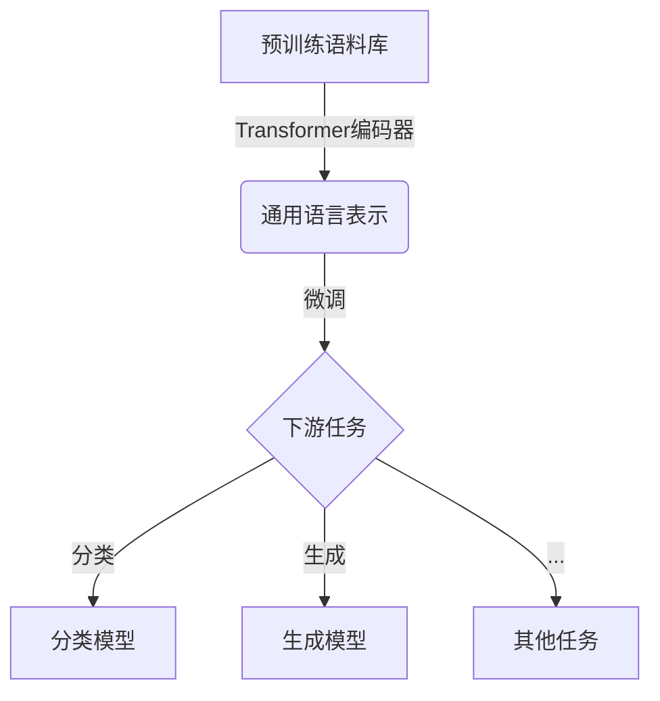
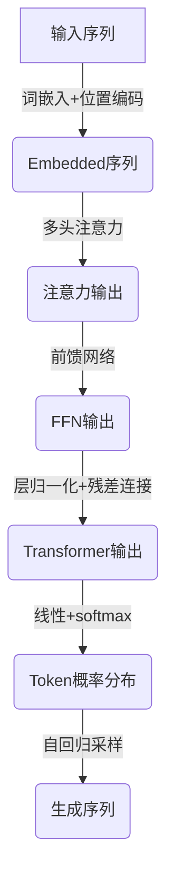

# GPT原理与代码实例讲解

## 1.背景介绍

在过去几年中,自然语言处理(NLP)领域取得了长足的进步,很大程度上归功于Transformer模型和预训练语言模型(PLM)的出现。作为PLM的代表,GPT(Generative Pre-trained Transformer)模型在语言生成、机器翻译、问答系统等多个任务中展现出了卓越的性能。

GPT最初由OpenAI于2018年提出,它采用Transformer解码器结构,在大规模语料库上进行预训练,学习语言的概率分布。通过自回归(Autoregressive)的方式,GPT能够根据给定的文本前缀生成连贯、流畅的文本。GPT-2于2019年发布,使用更大的模型和数据集进行预训练,在多项基准测试中取得了新的最佳成绩。2020年,OpenAI推出GPT-3,其参数量高达1750亿,在广泛的任务上表现出了惊人的零示例(Zero-shot)和少示例(Few-shot)能力。

## 2.核心概念与联系

### 2.1 Transformer模型

Transformer是GPT的核心结构,由编码器(Encoder)和解码器(Decoder)组成。编码器将输入序列映射为上下文表示,解码器则根据上下文表示和之前生成的tokens,预测下一个token。

Transformer完全基于注意力(Attention)机制,摒弃了RNN和CNN等传统结构,显著提高了并行计算能力。多头注意力(Multi-Head Attention)机制能够从不同表示子空间捕获输入和输出之间的依赖关系。

### 2.2 自回归语言模型

GPT属于自回归语言模型,其训练目标是最大化给定前缀下,生成序列的概率:

$$P(y_1, y_2, ..., y_n) = \prod_{t=1}^{n}P(y_t|y_1, y_2, ..., y_{t-1})$$

其中$y_t$表示第t个token。在生成过程中,GPT将依次预测每个token,并将其作为下一步的输入,生成连贯的文本序列。

### 2.3 预训练与微调

GPT采用两阶段策略:首先在大规模语料库上进行预训练,学习通用的语言知识;然后针对特定任务,在相应数据集上进行微调(Fine-tuning),使模型获得特定领域的能力。

预训练阶段通常采用遮蔽语言模型(Masked LM)和下一句预测(Next Sentence Prediction)等任务,而微调阶段的目标函数取决于具体任务,如分类、生成等。



## 3.核心算法原理具体操作步骤

GPT的核心算法原理可以分为以下几个步骤:

### 3.1 输入表示

首先,将输入文本序列映射为词嵌入(Word Embedding)向量序列,并添加位置编码(Positional Encoding),赋予每个token相对位置信息。

### 3.2 多头注意力计算

将embedded序列输入Transformer的多头注意力层,计算Query、Key和Value之间的注意力权重,并根据权重对Value进行加权求和,得到注意力输出。

$$\mathrm{Attention}(Q, K, V) = \mathrm{softmax}(\frac{QK^T}{\sqrt{d_k}})V$$

其中$Q$、$K$、$V$分别表示Query、Key和Value。

### 3.3 前馈神经网络

注意力输出通过前馈神经网络(Feed-Forward Network),对每个位置的表示进行独立的非线性映射,捕获更复杂的特征。

### 3.4 层归一化和残差连接

在每个子层之后,进行层归一化(Layer Normalization)和残差连接(Residual Connection),以缓解梯度消失和梯度爆炸问题,提高模型性能。

### 3.5 生成和自回归

在生成阶段,GPT根据给定的文本前缀,自回归地预测下一个token的概率分布:

$$P(y_t|y_1, y_2, ..., y_{t-1}) = \mathrm{softmax}(h_tW_o + b_o)$$

其中$h_t$为Transformer解码器在时间步t的输出,而$W_o$和$b_o$为可训练参数。依次采样和预测,直至生成完整序列或达到最大长度。



## 4.数学模型和公式详细讲解举例说明

### 4.1 注意力机制(Attention Mechanism)

注意力机制是Transformer的核心,它能够捕捉输入序列中不同位置之间的依赖关系。给定Query $Q$、Key $K$和Value $V$,注意力计算公式为:

$$\mathrm{Attention}(Q, K, V) = \mathrm{softmax}(\frac{QK^T}{\sqrt{d_k}})V$$

其中$\sqrt{d_k}$是缩放因子,用于防止内积过大导致softmax函数的梯度较小。

例如,对于输入序列"我爱编程",其中"编程"是关键词,注意力权重分布如下:

```
Query: 我爱
Key:   我爱编程
Value: 我爱编程
Attention weights: [0.2, 0.3, 0.5]
Output: 0.2*我 + 0.3*爱 + 0.5*编程 = 编程
```

可见,注意力机制能够自动分配不同位置的权重,关注重要的部分。

### 4.2 多头注意力(Multi-Head Attention)

单一的注意力机制可能会遗漏一些依赖关系,因此Transformer采用了多头注意力,将Query、Key和Value进行线性变换后分别计算注意力,最后将所有注意力头的结果拼接起来:

$$\begin{aligned}
\mathrm{MultiHead}(Q, K, V) &= \mathrm{Concat}(\mathrm{head}_1, ..., \mathrm{head}_h)W^O\\
\mathrm{where\ head}_i &= \mathrm{Attention}(QW_i^Q, KW_i^K, VW_i^V)
\end{aligned}$$

其中$W_i^Q$、$W_i^K$、$W_i^V$和$W^O$是可训练的线性变换参数。多头注意力能够从不同的表示子空间捕获输入和输出之间的依赖关系,提高了模型的表达能力。

### 4.3 位置编码(Positional Encoding)

由于Transformer没有递归或卷积结构,因此需要一些方式来注入序列的位置信息。位置编码是一种将位置信息编码为向量的方法,并将其加到输入的嵌入向量中:

$$\mathrm{PE}_{(pos, 2i)} = \sin(pos / 10000^{2i / d_{model}})$$ 
$$\mathrm{PE}_{(pos, 2i+1)} = \cos(pos / 10000^{2i / d_{model}})$$

其中$pos$是token的位置索引,而$i$是维度索引。通过不同频率的正弦和余弦函数,位置编码能够唯一地编码每个位置。

## 5.项目实践:代码实例和详细解释说明

以下是使用PyTorch实现GPT模型的简化代码示例,包括模型定义、训练和生成部分。

### 5.1 模型定义

```python
import torch
import torch.nn as nn
import math

class MultiHeadAttention(nn.Module):
    def __init__(self, heads, head_size, dropout=0.1):
        super().__init__()
        
        self.heads = heads
        self.head_size = head_size

        self.qkv_layer = nn.Linear(head_size * heads * 3, head_size * heads * 3)
        self.fc_layer = nn.Linear(heads * head_size, head_size)
        
        self.dropout = nn.Dropout(dropout)
        
    def forward(self, x):
        batch_size = x.size(0)
        
        qkv = self.qkv_layer(x)
        qkv = qkv.reshape(batch_size, -1, 3, self.heads, self.head_size)
        q, k, v = qkv.permute(2, 0, 3, 1, 4)
        
        scores = torch.matmul(q, k.transpose(-2, -1)) / math.sqrt(self.head_size)
        scores = torch.softmax(scores, dim=-1)
        scores = self.dropout(scores)
        
        out = torch.matmul(scores, v)
        out = out.permute(1, 2, 0, 3, 4).contiguous()
        out = out.view(batch_size, -1, self.heads * self.head_size)
        out = self.fc_layer(out)
        
        return out

class TransformerBlock(nn.Module):
    def __init__(self, head_size, num_heads, dropout=0.1):
        super().__init__()
        
        self.attn = MultiHeadAttention(num_heads, head_size, dropout)
        self.ff = nn.Sequential(
            nn.Linear(head_size, head_size * 4),
            nn.ReLU(),
            nn.Linear(head_size * 4, head_size),
            nn.Dropout(dropout)
        )
        
        self.norm1 = nn.LayerNorm(head_size)
        self.norm2 = nn.LayerNorm(head_size)
        
    def forward(self, x):
        x = x + self.attn(self.norm1(x))
        x = x + self.ff(self.norm2(x))
        return x

class GPTModel(nn.Module):
    def __init__(self, vocab_size, max_len, head_size=768, num_heads=12, num_layers=12, dropout=0.1):
        super().__init__()
        
        self.token_emb = nn.Embedding(vocab_size, head_size)
        self.pos_emb = nn.Embedding(max_len, head_size)
        
        self.layers = nn.ModuleList([
            TransformerBlock(head_size, num_heads, dropout) for _ in range(num_layers)
        ])
        
        self.norm = nn.LayerNorm(head_size)
        self.fc = nn.Linear(head_size, vocab_size)
        
    def forward(self, x, pos):
        x = self.token_emb(x) + self.pos_emb(pos)
        for layer in self.layers:
            x = layer(x)
        x = self.norm(x)
        x = self.fc(x)
        return x
```

上述代码定义了GPT模型的核心组件:

- `MultiHeadAttention`实现了多头注意力机制。
- `TransformerBlock`包含了一个多头注意力层和一个前馈网络层,以及层归一化和残差连接。
- `GPTModel`是整个模型的定义,包括词嵌入、位置编码、Transformer块和线性输出层。

### 5.2 训练

```python
import torch.optim as optim
from torch.utils.data import DataLoader

# 准备数据
train_dataset = ...
train_loader = DataLoader(train_dataset, batch_size=32, shuffle=True)

# 初始化模型和优化器
model = GPTModel(vocab_size, max_len)
optimizer = optim.Adam(model.parameters(), lr=1e-4)
criterion = nn.CrossEntropyLoss()

# 训练循环
for epoch in range(num_epochs):
    for inputs, targets in train_loader:
        optimizer.zero_grad()
        
        # 前向传播
        outputs = model(inputs, torch.arange(inputs.size(1)).to(inputs.device))
        loss = criterion(outputs.view(-1, vocab_size), targets.view(-1))
        
        # 反向传播和优化
        loss.backward()
        optimizer.step()
        
    print(f"Epoch {epoch+1}, Loss: {loss.item()}")
```

训练过程包括以下步骤:

1. 准备训练数据集并使用`DataLoader`加载批次数据。
2. 初始化GPT模型和优化器(如Adam)。
3. 在训练循环中,对每个批次数据进行前向传播,计算交叉熵损失。
4. 反向传播计算梯度,并使用优化器更新模型参数。
5. 记录每个epoch的损失值。

### 5.3 生成

```python
import torch.nn.functional as F

# 输入起始tokens
start_tokens = torch.tensor([vocab['<start>']]).to(device)

# 生成循环
generated = start_tokens
for _ in range(max_len):
    outputs = model(generated, torch.arange(generated.size(1)).to(device))
    next_token_logits = outputs[:, -1, :]
    next_token = torch.multinomial(F.softmax(next_token_logits, dim=-1), num_samples=1)
    generated = torch.cat((generated, next_token), dim=