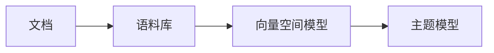

# Gensim 原理与代码实战案例讲解

## 1. 背景介绍
在自然语言处理（NLP）领域，文本分析和主题建模是重要的研究方向。Gensim是一个专注于从文档中自动提取语义主题的Python库，广泛应用于文档相似性分析、主题建模等任务。它的设计哲学是使用简单、直观的接口来实现算法的高效实现，使得即使在大规模数据集上也能运行。

## 2. 核心概念与联系
Gensim库的核心概念包括文档、语料库、向量空间模型、主题模型等。文档是文本分析的基本单位，语料库是文档的集合。向量空间模型是将文本转换为数学表达的方法，而主题模型则是用于发现文档集合中隐藏的主题结构。



## 3. 核心算法原理具体操作步骤
Gensim实现了多种主题模型算法，包括Latent Semantic Indexing (LSI)、Latent Dirichlet Allocation (LDA)和Hierarchical Dirichlet Process (HDP)等。这些算法的操作步骤通常包括文本预处理、构建词典、创建语料库、训练模型和主题推断。

## 4. 数学模型和公式详细讲解举例说明
以LDA为例，其数学模型基于以下假设：每个文档是主题的混合，每个主题是词汇的混合。LDA的目标是推断文档的主题结构。数学上，LDA模型可以用以下公式表示：

$$
p(\theta, \mathbf{z}, \mathbf{w} | \alpha, \beta) = p(\theta | \alpha) \prod_{n=1}^{N} p(z_n | \theta) p(w_n | z_n, \beta)
$$

其中，$\theta$ 是文档中主题的分布，$\mathbf{z}$ 是文档中词的主题分配，$\mathbf{w}$ 是观察到的词，$\alpha$ 和 $\beta$ 是模型的超参数。

## 5. 项目实践：代码实例和详细解释说明
在实践中，使用Gensim进行主题建模的代码示例如下：

```python
import gensim
from gensim import corpora, models

# 文本预处理
documents = [...]  # 文档集合
texts = [[word for word in document.lower().split()] for document in documents]

# 构建词典
dictionary = corpora.Dictionary(texts)

# 创建语料库
corpus = [dictionary.doc2bow(text) for text in texts]

# 训练LDA模型
lda = models.LdaModel(corpus, id2word=dictionary, num_topics=10)

# 主题推断
for topic in lda.print_topics(num_topics=10):
    print(topic)
```

## 6. 实际应用场景
Gensim在多个领域都有应用，如文本分类、推荐系统、社交网络分析等。在文本分类中，主题模型可以用于发现文档的隐含类别；在推荐系统中，可以通过分析用户的评论或行为来推荐相关内容；在社交网络分析中，可以用于发现社区结构或趋势。

## 7. 工具和资源推荐
除了Gensim库本身，还有一些其他资源可以帮助用户更好地使用Gensim，例如NLTK、Spacy等NLP工具库，以及在线课程和社区论坛。

## 8. 总结：未来发展趋势与挑战
随着深度学习的发展，主题模型也在不断进化。未来的趋势可能包括结合神经网络的主题模型、跨语言主题建模等。同时，如何处理更大规模的数据集、提高模型的解释性等也是未来的挑战。

## 9. 附录：常见问题与解答
Q1: Gensim与其他NLP库相比有何优势？
A1: Gensim在主题建模方面有优化的算法实现，特别适合处理大规模文本数据。

Q2: 如何选择合适的主题数？
A2: 主题数的选择通常需要根据实际应用场景和数据集的特点来决定，可以通过模型评估指标如困惑度（Perplexity）来辅助选择。

作者：禅与计算机程序设计艺术 / Zen and the Art of Computer Programming