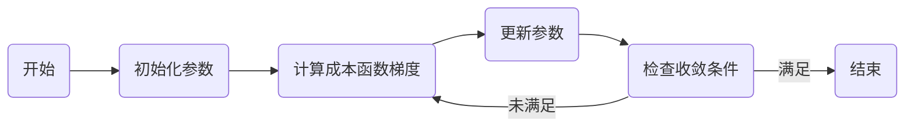

# Gradient Descent 原理与代码实战案例讲解

## 1. 背景介绍

在机器学习和深度学习的世界里，梯度下降（Gradient Descent）算法是一种基础且极其重要的优化算法。它用于最小化一个函数，即在寻找函数最小值的过程中，梯度下降帮助我们找到能够使成本函数（cost function）最小化的参数值。无论是在简单的线性回归问题还是复杂的神经网络训练中，梯度下降都扮演着至关重要的角色。

## 2. 核心概念与联系

### 2.1 梯度（Gradient）
梯度是多变量函数在某一点处的导数向量，指向函数增长最快的方向。

### 2.2 下降（Descent）
下降是指在优化过程中，沿着梯度的反方向——即函数值减小最快的方向进行搜索。

### 2.3 学习率（Learning Rate）
学习率决定了在梯度下降过程中每一步沿梯度反方向前进的距离。

### 2.4 成本函数（Cost Function）
成本函数是需要最小化的目标函数，通常在机器学习中表示模型预测值与真实值之间的差异。

### 2.5 参数更新（Parameter Update）
参数更新是指在每一次迭代中，根据梯度和学习率调整模型参数。

## 3. 核心算法原理具体操作步骤



1. 初始化参数：选择一个初始点作为参数的起始值。
2. 计算成本函数梯度：在当前参数下，计算成本函数相对于每个参数的梯度。
3. 更新参数：根据梯度和学习率调整参数值。
4. 检查收敛条件：判断算法是否满足停止条件，如梯度足够小或达到预设的迭代次数。
5. 重复步骤2-4，直到满足收敛条件。

## 4. 数学模型和公式详细讲解举例说明

梯度下降的核心公式如下：

$$
\theta_{next} = \theta_{current} - \alpha \cdot \nabla_{\theta}J(\theta)
$$

其中：
- $\theta$ 表示模型参数。
- $\alpha$ 表示学习率。
- $J(\theta)$ 表示成本函数。
- $\nabla_{\theta}J(\theta)$ 表示成本函数关于参数 $\theta$ 的梯度。

举例来说，对于线性回归模型 $f(x) = wx + b$，其成本函数可以是均方误差：

$$
J(w, b) = \frac{1}{2m} \sum_{i=1}^{m} (f(x^{(i)}) - y^{(i)})^2
$$

其中 $m$ 是样本数量，$x^{(i)}$ 和 $y^{(i)}$ 分别是第 $i$ 个样本的特征和标签。对 $w$ 和 $b$ 求偏导，得到梯度：

$$
\frac{\partial J}{\partial w} = \frac{1}{m} \sum_{i=1}^{m} (f(x^{(i)}) - y^{(i)})x^{(i)}
$$

$$
\frac{\partial J}{\partial b} = \frac{1}{m} \sum_{i=1}^{m} (f(x^{(i)}) - y^{(i)})
$$

然后使用这些梯度来更新 $w$ 和 $b$。

## 5. 项目实践：代码实例和详细解释说明

以下是一个简单的线性回归使用梯度下降的Python代码示例：

```python
import numpy as np

# 成本函数
def compute_cost(X, y, w, b):
    m = len(y)
    cost = (1/(2*m)) * np.sum((X.dot(w) + b - y) ** 2)
    return cost

# 梯度计算
def compute_gradient(X, y, w, b):
    m = len(y)
    dj_dw = (1/m) * np.dot(X.T, (X.dot(w) + b - y))
    dj_db = (1/m) * np.sum(X.dot(w) + b - y)
    return dj_dw, dj_db

# 梯度下降
def gradient_descent(X, y, w_init, b_init, alpha, num_iters):
    w = w_init
    b = b_init
    for i in range(num_iters):
        dj_dw, dj_db = compute_gradient(X, y, w, b)
        w = w - alpha * dj_dw
        b = b - alpha * dj_db
    return w, b

# 数据准备
X = np.array([[1], [2], [3]])
y = np.array([1, 2.5, 3.5])

# 初始化参数
w_init = np.zeros((1, 1))
b_init = 0

# 设置学习率和迭代次数
alpha = 0.01
num_iters = 1000

# 执行梯度下降
w_final, b_final = gradient_descent(X, y, w_init, b_init, alpha, num_iters)

print(f"最终参数：w = {w_final}, b = {b_final}")
```

在这个例子中，我们定义了成本函数 `compute_cost` 和梯度计算函数 `compute_gradient`。然后，我们通过迭代地执行 `gradient_descent` 函数来更新参数 `w` 和 `b`。

## 6. 实际应用场景

梯度下降算法在机器学习领域有广泛的应用，包括但不限于：

- 线性回归和逻辑回归模型的参数估计。
- 神经网络的权重和偏置优化。
- 支持向量机中核函数的参数搜索。
- 聚类算法中心点的确定。

## 7. 工具和资源推荐

- **Scikit-learn**: 一个提供多种机器学习算法的Python库，适合初学者快速实现梯度下降。
- **TensorFlow和PyTorch**: 两个强大的深度学习框架，内置了高效的梯度下降优化器。
- **Coursera和edX**: 提供机器学习和深度学习课程，可以帮助理解梯度下降的原理和应用。

## 8. 总结：未来发展趋势与挑战

梯度下降算法虽然简单有效，但在面对大规模数据和复杂模型时，仍存在一些挑战，如收敛速度慢、陷入局部最小值、调参困难等。未来的发展趋势可能包括自适应学习率算法的研究、并行和分布式梯度下降方法的优化，以及结合其他优化策略以提高效率和准确性。

## 9. 附录：常见问题与解答

- **Q: 如何选择合适的学习率？**
  - A: 学习率的选择通常需要通过实验来确定。太小的学习率会导致收敛速度慢，而太大的学习率可能会导致收敛过程不稳定。可以尝试使用学习率衰减或自适应学习率算法。

- **Q: 梯度下降是否总是能找到全局最小值？**
  - A: 对于凸函数，梯度下降可以保证找到全局最小值。但对于非凸函数，梯度下降可能会陷入局部最小值。

- **Q: 如何判断梯度下降是否收敛？**
  - A: 通常通过设置阈值来判断梯度的大小，或者监控成本函数的变化。如果在一定迭代次数内，成本函数的变化小于某个阈值，则可以认为算法已经收敛。

作者：禅与计算机程序设计艺术 / Zen and the Art of Computer Programming