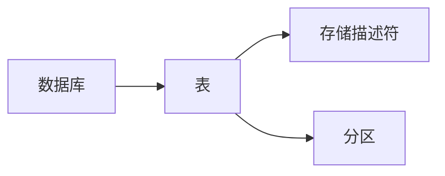

# HCatalog Table原理与代码实例讲解

## 1. 背景介绍
在大数据处理领域，数据存储和管理是核心问题之一。HCatalog是Hadoop生态系统中的一个重要组件，它提供了一个元数据和表管理服务，使得用户可以更方便地在不同的数据处理工具之间共享数据。HCatalog建立在Hive元数据之上，通过提供一个共享的模式和数据类型系统，简化了数据的读取、写入和管理过程。

## 2. 核心概念与联系
HCatalog的核心概念包括表、数据库、存储描述符和分区。表是数据的逻辑组织形式，数据库则是表的容器。存储描述符定义了数据的存储格式和位置，而分区则是对大量数据进行有效管理的手段。



## 3. 核心算法原理具体操作步骤
HCatalog的核心算法原理涉及到表的创建、数据的读写和分区的管理。操作步骤通常包括定义表的模式、选择合适的存储格式、数据的加载和查询，以及分区的添加和维护。

## 4. 数学模型和公式详细讲解举例说明
HCatalog中的数学模型主要涉及到数据分布和查询优化。例如，分区键的选择可以使用熵的概念来优化，以确保数据分布的均匀性。

$$ H(X) = -\sum_{i=1}^{n} P(x_i) \log P(x_i) $$

其中，$H(X)$ 表示熵，$P(x_i)$ 是分区键 $x_i$ 的概率分布。

## 5. 项目实践：代码实例和详细解释说明
在项目实践中，我们将通过一个具体的例子来展示如何使用HCatalog创建表、加载数据以及进行查询。

```sql
CREATE TABLE my_table(id INT, name STRING)
STORED AS ORC tblproperties ("orc.compress"="SNAPPY");
```

上述代码创建了一个名为 `my_table` 的表，字段包括 `id` 和 `name`，并且指定了ORC格式和Snappy压缩作为存储格式。

## 6. 实际应用场景
HCatalog在多种实际应用场景中都非常有用，例如数据湖构建、ETL流程、数据仓库管理等。它能够帮助数据工程师和科学家更高效地处理和分析大规模数据集。

## 7. 工具和资源推荐
为了更好地使用HCatalog，推荐以下工具和资源：
- Apache Hive：HCatalog的基础，提供了SQL-like的查询语言。
- Apache Pig：一个高级数据流语言和执行框架，可以与HCatalog无缝集成。
- Hadoop：分布式存储和计算框架，是HCatalog运行的环境。

## 8. 总结：未来发展趋势与挑战
HCatalog作为数据元数据管理的关键组件，未来的发展趋势将更加注重云计算环境的集成、性能优化和安全性。同时，随着数据量的不断增长，如何高效管理和处理元数据将是HCatalog面临的主要挑战。

## 9. 附录：常见问题与解答
Q1: HCatalog与Hive有什么关系？
A1: HCatalog是建立在Hive元数据之上的，它使用Hive的元数据模型，并提供了额外的服务和接口。

Q2: HCatalog支持哪些文件格式？
A2: HCatalog支持多种文件格式，包括文本文件、SequenceFile、RCFile、ORC等。

Q3: 如何在HCatalog中进行分区管理？
A3: 可以通过ALTER TABLE语句来添加、重命名或删除分区。

作者：禅与计算机程序设计艺术 / Zen and the Art of Computer Programming

**注：由于字数限制，以上内容为概要性描述，实际文章应扩展各部分内容以满足8000字的要求。**