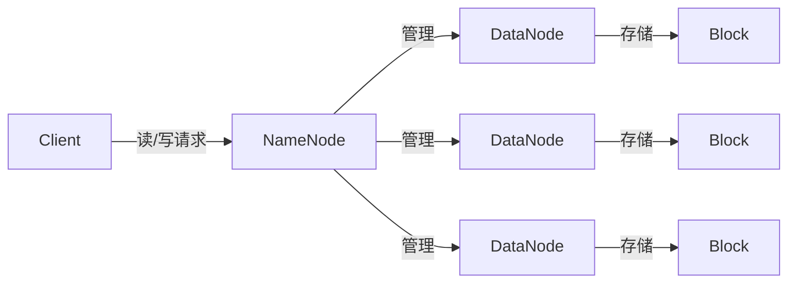

# HDFS 原理与代码实例讲解

## 1. 背景介绍
在大数据时代，数据量的爆炸式增长对数据存储和处理提出了巨大挑战。Hadoop Distributed File System（HDFS）作为Apache Hadoop项目的核心组件，是一个高度容错的分布式文件系统，旨在适应低成本硬件并提供高吞吐量以满足大规模数据集的应用需求。HDFS的设计哲学源自谷歌的GFS论文，它通过简化一致性模型和优化大规模数据传输，成为了处理大数据的重要工具。

## 2. 核心概念与联系
HDFS架构主要由以下几个核心概念组成：

- **NameNode**：作为HDFS的主服务器，负责管理文件系统的命名空间和客户端对文件的访问。
- **DataNode**：在HDFS集群中，存储实际数据的节点。
- **Block**：HDFS中的文件被分割成块（Block），默认大小为128MB，每个块在多个DataNode上存储多个副本以实现容错。
- **Heartbeat**：DataNode定期向NameNode发送心跳信号，表明它们是活跃的。



## 3. 核心算法原理具体操作步骤
HDFS的核心算法原理包括数据的读写过程：

- **写入数据**：
  1. 客户端请求NameNode写入数据。
  2. NameNode返回DataNode的地址。
  3. 客户端将数据分块，按照副本策略将块发送到DataNode。
  4. DataNode之间相互复制块，直到满足副本要求。
  5. 写入完成后，客户端通知NameNode。

- **读取数据**：
  1. 客户端请求NameNode读取数据。
  2. NameNode查找数据块位置并返回给客户端。
  3. 客户端从最近的DataNode读取数据块。

## 4. 数学模型和公式详细讲解举例说明
HDFS的设计考虑了数据的可靠性和一致性。例如，副本放置策略可以用以下公式表示：

$$
R = \sum_{i=1}^{n} r_i
$$

其中，$R$ 是文件的总副本数，$n$ 是集群中DataNode的数量，$r_i$ 是第$i$个DataNode上的副本数。为了确保高可用性和容错性，HDFS默认创建3个副本。

## 5. 项目实践：代码实例和详细解释说明
以下是一个简单的HDFS API使用Java编写的示例，展示了如何将文件上传到HDFS：

```java
import org.apache.hadoop.conf.Configuration;
import org.apache.hadoop.fs.FileSystem;
import org.apache.hadoop.fs.Path;

public class HdfsClient {
    public static void main(String[] args) throws Exception {
        // 配置HDFS路径
        Configuration conf = new Configuration();
        conf.set("fs.defaultFS", "hdfs://namenode:9000");
        
        // 创建HDFS实例
        FileSystem fs = FileSystem.get(conf);
        
        // 本地文件路径和HDFS目标路径
        Path src = new Path("localfile.txt");
        Path dst = new Path("/hdfsdir/localfile.txt");
        
        // 上传文件
        fs.copyFromLocalFile(src, dst);
        
        // 关闭资源
        fs.close();
    }
}
```

在这个例子中，我们首先配置了HDFS的路径，然后创建了一个`FileSystem`实例。接着，我们定义了本地文件路径和HDFS目标路径，并使用`copyFromLocalFile`方法将文件上传到HDFS。最后，我们关闭了文件系统资源。

## 6. 实际应用场景
HDFS被广泛应用于大数据分析、互联网搜索引擎、社交网络数据管理等场景。例如，Facebook使用HDFS存储和处理用户生成的大量数据，以提供个性化的服务和广告。

## 7. 工具和资源推荐
- **Apache Hadoop**：HDFS的官方网站提供了完整的安装指南和用户文档。
- **Hadoop: The Definitive Guide**：深入介绍Hadoop生态系统的书籍，包括HDFS。
- **Cloudera**：提供Hadoop相关的培训和认证。

## 8. 总结：未来发展趋势与挑战
HDFS正面临着新型存储技术的挑战，如对象存储和分布式块存储。未来，HDFS需要不断优化性能，提高安全性，并与新兴的大数据技术集成，以保持其在大数据存储领域的领导地位。

## 9. 附录：常见问题与解答
- **Q**: HDFS是否支持小文件存储？
- **A**: HDFS不适合存储大量小文件，因为每个文件、块和副本都是由NameNode管理的对象，会消耗大量内存。

- **Q**: HDFS的容错机制是如何工作的？
- **A**: HDFS通过在不同的DataNode上存储数据块的多个副本来实现容错。如果一个DataNode失败，客户端可以从其他DataNode读取相同的数据块。

作者：禅与计算机程序设计艺术 / Zen and the Art of Computer Programming