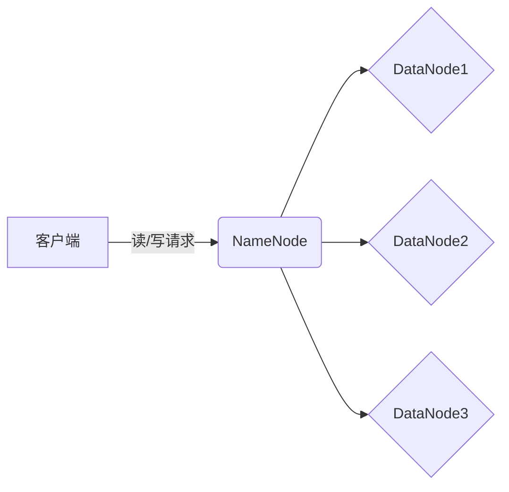

## 1.背景介绍

HDFS（Hadoop Distributed File System）是Apache Hadoop项目的核心组件之一，它是一个高度容错性的系统，适合在廉价的硬件上运行。HDFS为大规模数据集提供高吞吐量的数据访问，非常适合运行在大规模数据集上的应用程序。

HDFS的设计和实现源于Google的GFS（Google File System），并且在设计原则和架构上有很多相似之处。HDFS是一个分布式文件系统，它将文件分割成一系列的块，然后在集群中分布存储。这种架构方式提供了高度的数据冗余，保证了数据的可靠性和系统的可用性。

## 2.核心概念与联系

HDFS的架构主要由两部分组成：NameNode和DataNode。NameNode是HDFS的主节点，负责存储文件系统的元数据，如文件和目录的信息、每个文件的块列表和每个块的位置信息等。DataNode是HDFS的工作节点，负责存储和检索数据块，以及在NameNode的指导下，处理数据块的创建、删除和复制。



## 3.核心算法原理具体操作步骤

在HDFS中，文件被分割成一系列的块，每个块的默认大小是128MB。这些块被存储在DataNode上，每个块在DataNode上都有多个副本，以保证数据的可靠性和系统的容错性。当客户端需要读取一个文件时，它首先会向NameNode发送请求，获取该文件的块列表和每个块的位置信息。然后，客户端会直接与存储这些块的DataNode通信，读取数据。

在写入数据时，客户端也会首先向NameNode发送请求，获取数据块的存储位置。然后，客户端会将数据写入到指定的DataNode上。当一个块被写入到一个DataNode后，该DataNode会将这个块的数据复制到其他的DataNode上，这个过程是由NameNode来协调的。

## 4.数学模型和公式详细讲解举例说明

在HDFS中，文件的存储和读取过程可以用以下的数学模型来描述：

设F是一个文件，它被分割成n个块，即F={B1,B2,...,Bn}。每个块Bi在m个DataNode上有副本，即Bi={D1,D2,...,Dm}。

文件的读取过程可以表示为：

1. 客户端向NameNode发送读取请求：Read(F)
2. NameNode返回文件F的块列表和每个块的位置信息：{B1:{D1,D2,...,Dm}, B2:{D1,D2,...,Dm}, ..., Bn:{D1,D2,...,Dm}}
3. 客户端从DataNode读取数据块：Read(Bi)

文件的写入过程可以表示为：

1. 客户端向NameNode发送写入请求：Write(F)
2. NameNode返回数据块的存储位置：{B1:{D1,D2,...,Dm}, B2:{D1,D2,...,Dm}, ..., Bn:{D1,D2,...,Dm}}
3. 客户端将数据写入到DataNode：Write(Bi)

## 5.项目实践：代码实例和详细解释说明

下面是一个使用HDFS的Java API读取和写入文件的简单示例：

```java
// 读取文件
Configuration conf = new Configuration();
FileSystem fs = FileSystem.get(URI.create("hdfs://localhost:9000"), conf);
FSDataInputStream in = null;
try {
    in = fs.open(new Path("/user/hadoop/test.txt"));
    IOUtils.copyBytes(in, System.out, 4096, false);
} finally {
    IOUtils.closeStream(in);
}

// 写入文件
Configuration conf = new Configuration();
FileSystem fs = FileSystem.get(URI.create("hdfs://localhost:9000"), conf);
FSDataOutputStream out = null;
try {
    out = fs.create(new Path("/user/hadoop/test.txt"));
    IOUtils.copyBytes(System.in, out, 4096, false);
} finally {
    IOUtils.closeStream(out);
}
```

## 6.实际应用场景

HDFS在许多大数据处理场景中都有广泛的应用，例如：

- 互联网公司使用HDFS来存储和处理用户生成的大量数据，如搜索日志、社交网络数据等。
- 电信公司使用HDFS来存储和分析通信记录，以便进行网络优化和欺诈检测。
- 金融公司使用HDFS来存储和分析交易数据，以便进行风险管理和欺诈检测。

## 7.工具和资源推荐

- Apache Hadoop：HDFS的主要实现，提供了详细的文档和丰富的API。
- Cloudera：提供了基于Hadoop的商业解决方案，包括HDFS的优化版本。
- Hadoop: The Definitive Guide：这本书详细介绍了Hadoop和HDFS的原理和使用方法。

## 8.总结：未来发展趋势与挑战

随着数据量的不断增长，HDFS面临着许多挑战，例如如何提高存储效率、如何提高数据访问速度、如何提高系统的容错性等。但是，随着技术的发展，我们相信HDFS会不断优化和改进，以满足未来的大数据处理需求。

## 9.附录：常见问题与解答

Q: HDFS的块大小可以调整吗？

A: 可以的，HDFS的块大小是可以配置的，但是需要根据实际的应用需求和硬件条件来选择合适的块大小。

Q: HDFS的数据如何备份？

A: HDFS通过在多个DataNode上存储数据块的副本来实现数据的备份。当一个DataNode失效时，可以从其他的DataNode上读取数据。

作者：禅与计算机程序设计艺术 / Zen and the Art of Computer Programming