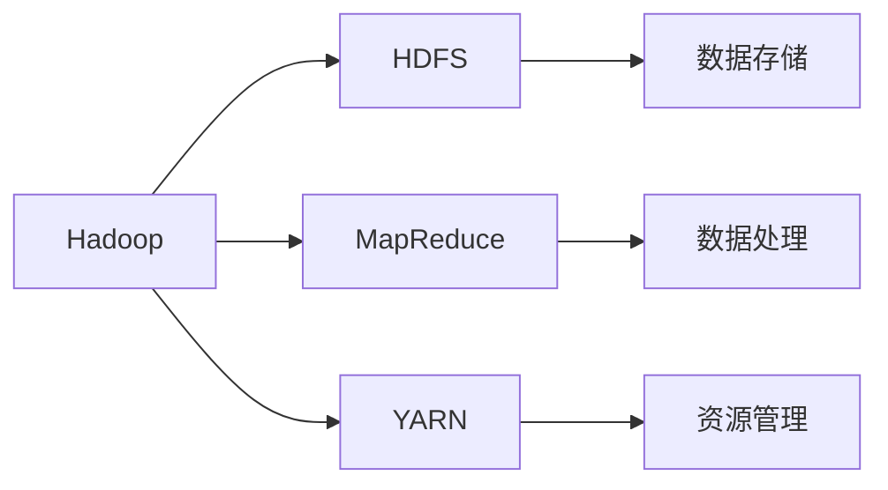

# Hadoop 原理与代码实例讲解

## 1. 背景介绍
在大数据时代，数据量的爆炸性增长对数据存储和处理提出了巨大挑战。Hadoop作为一个开源框架，它通过分布式存储和并行处理解决了这一问题，成为了大数据技术的基石。Hadoop的核心设计理念是将数据存储和计算分布在多个计算节点上，通过MapReduce编程模型来并行处理数据，从而实现高效的数据处理能力。

## 2. 核心概念与联系
Hadoop生态系统由多个关键组件构成，主要包括：

- **HDFS（Hadoop Distributed File System）**：一个高度容错的系统，用于存储大量数据。
- **MapReduce**：一个编程模型，用于并行计算。
- **YARN（Yet Another Resource Negotiator）**：资源管理和作业调度。

这些组件相互协作，共同提供了一个可扩展的大数据存储和处理平台。



## 3. 核心算法原理具体操作步骤
MapReduce算法包括两个主要阶段：Map阶段和Reduce阶段。

- **Map阶段**：将输入数据分割成独立的块，每个块由一个Map任务处理，转换成键值对（key-value pairs）。
- **Reduce阶段**：将Map阶段输出的键值对按键（key）进行合并，每组键值对由一个Reduce任务处理，输出最终结果。


## 4. 数学模型和公式详细讲解举例说明
以词频统计为例，MapReduce的数学模型可以表示为：

$$
\text{Map}(k1, v1) \rightarrow list(k2, v2)
$$

$$
\text{Reduce}(k2, list(v2)) \rightarrow list(v2)
$$

其中，$k1$和$v1$分别代表输入数据的键和值，$k2$和$v2$代表中间输出的键和值。

## 5. 项目实践：代码实例和详细解释说明
以Hadoop MapReduce实现词频统计为例，代码如下：

```java
public static class TokenizerMapper
       extends Mapper<Object, Text, Text, IntWritable>{

    private final static IntWritable one = new IntWritable(1);
    private Text word = new Text();

    public void map(Object key, Text value, Context context
                    ) throws IOException, InterruptedException {
        StringTokenizer itr = new StringTokenizer(value.toString());
        while (itr.hasMoreTokens()) {
            word.set(itr.nextToken());
            context.write(word, one);
        }
    }
}

public static class IntSumReducer
       extends Reducer<Text,IntWritable,Text,IntWritable> {
    private IntWritable result = new IntWritable();

    public void reduce(Text key, Iterable<IntWritable> values,
                       Context context
                       ) throws IOException, InterruptedException {
        int sum = 0;
        for (IntWritable val : values) {
            sum += val.get();
        }
        result.set(sum);
        context.write(key, result);
    }
}
```

## 6. 实际应用场景
Hadoop在多个领域都有广泛应用，包括但不限于：

- 互联网搜索引擎
- 社交网络分析
- 电子商务推荐系统
- 大规模日志分析

## 7. 工具和资源推荐
- **Apache Ambari**：用于管理和监控Hadoop集群。
- **Hadoop官方文档**：提供详细的安装和配置指南。
- **Cloudera**：提供Hadoop相关的培训和认证。

## 8. 总结：未来发展趋势与挑战
Hadoop作为大数据处理的重要工具，其未来的发展趋势包括更高效的计算模型、更强大的机器学习能力和更紧密的云集成。同时，数据安全和隐私保护、处理实时数据流等方面也是Hadoop面临的挑战。

## 9. 附录：常见问题与解答
- **Q1**: Hadoop和传统数据库有什么区别？
- **A1**: Hadoop适合处理大规模数据集，而传统数据库适合处理小规模、结构化数据。

- **Q2**: Hadoop能否处理实时数据？
- **A2**: Hadoop本身不是为实时数据处理设计的，但可以与其他系统如Apache Storm、Apache Flink集成来处理实时数据。

作者：禅与计算机程序设计艺术 / Zen and the Art of Computer Programming