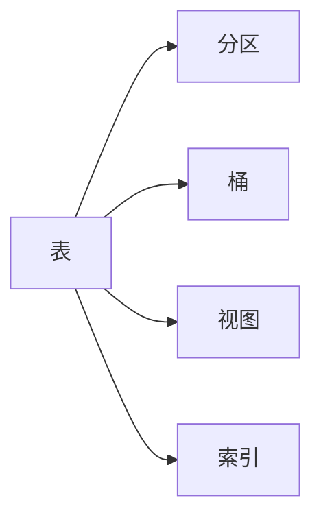

# HiveQL原理与代码实例讲解

## 1. 背景介绍

在大数据时代，数据仓库的概念变得越来越重要。Hive作为一个建立在Hadoop生态系统之上的数据仓库工具，它提供了一种类SQL查询语言——HiveQL，让开发者能够以类似于传统SQL的方式查询和管理大规模数据集。HiveQL的设计初衷是降低Hadoop的使用门槛，使得即使不熟悉Java或MapReduce编程模型的用户也能够轻松地进行大数据处理。

## 2. 核心概念与联系

HiveQL的核心概念包括表、分区、桶、视图和索引。表是存储数据的基本单位，分区和桶是优化查询性能的物理组织方式，视图是虚拟的表，用于简化复杂的查询，索引则用于加速数据检索。



## 3. 核心算法原理具体操作步骤

HiveQL的查询执行过程可以分为以下几个步骤：解析、编译、优化和执行。首先，HiveQL语句被解析成抽象语法树，然后编译成逻辑计划，接着通过优化器生成物理计划，最后由Hadoop执行物理计划。


## 4. 数学模型和公式详细讲解举例说明

HiveQL的优化器使用代价模型来选择最佳的执行计划。代价模型考虑的因素包括数据大小、数据分布、操作类型等。例如，对于JOIN操作，优化器会根据数据量来决定使用MapJoin还是ReduceJoin。

$$
Cost_{join} = Size_{left} \times Size_{right} \times Cost_{factor}
$$

其中，$Size_{left}$ 和 $Size_{right}$ 分别代表JOIN操作两边表的数据量，$Cost_{factor}$ 是根据数据分布和操作类型确定的系数。

## 5. 项目实践：代码实例和详细解释说明

以下是一个HiveQL查询示例，它展示了如何查询某个时间段内销售额最高的产品。

```sql
SELECT product_name, SUM(sales_amount) AS total_sales
FROM sales
WHERE sale_date BETWEEN '2021-01-01' AND '2021-12-31'
GROUP BY product_name
ORDER BY total_sales DESC
LIMIT 10;
```

这段代码首先从`sales`表中选择产品名称和销售额，然后根据销售日期过滤出2021年的数据，接着按产品名称分组并计算总销售额，最后按销售额降序排列并限制结果为前10名。

## 6. 实际应用场景

HiveQL广泛应用于数据分析、报表生成、数据挖掘等场景。例如，电商公司可能会使用HiveQL来分析用户行为、产品销售趋势，金融机构可能会用它来进行风险管理和欺诈检测。

## 7. 工具和资源推荐

- Apache Hive官方文档：提供最权威的HiveQL参考资料。
- Hadoop：Hive的底层计算框架。
- Hue：一个开源HiveQL编辑器，提供用户友好的界面。
- DataGrip：一个多引擎数据库环境，支持HiveQL语法高亮和自动完成。

## 8. 总结：未来发展趋势与挑战

随着云计算和即席查询的兴起，HiveQL正面临着性能和易用性的双重挑战。未来，HiveQL需要进一步优化执行引擎，提高查询效率，同时简化查询语法，降低用户的学习成本。

## 9. 附录：常见问题与解答

Q1: HiveQL和SQL有什么区别？
A1: HiveQL是为Hadoop设计的查询语言，它在SQL的基础上进行了扩展，以支持Hadoop的分布式存储和计算特性。

Q2: HiveQL是否支持实时查询？
A2: HiveQL本身不是为实时查询设计的，但可以通过与其他技术如Apache HBase结合使用来实现近实时查询。

作者：禅与计算机程序设计艺术 / Zen and the Art of Computer Programming