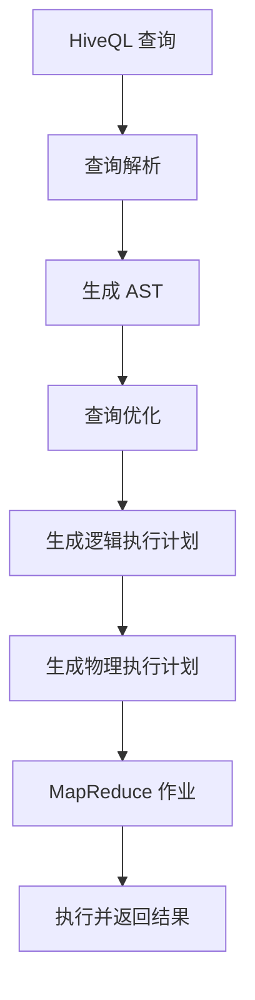

# Hive原理与代码实例讲解

## 1.背景介绍

Apache Hive 是一个基于 Hadoop 的数据仓库工具，用于处理和查询存储在 Hadoop 分布式文件系统 (HDFS) 中的大规模数据集。Hive 提供了一种类似 SQL 的查询语言，称为 HiveQL，使得数据分析师和开发人员可以使用熟悉的 SQL 语法来查询和管理大数据。Hive 的出现极大地简化了大数据处理的复杂性，使得非技术人员也能轻松上手。

### 1.1 Hive 的起源

Hive 由 Facebook 开发，最初是为了满足其内部数据处理需求。随着大数据的兴起，Hive 被捐赠给 Apache 软件基金会，并成为 Apache 的顶级项目。Hive 的设计目标是提供一种高效、可扩展且易于使用的数据仓库解决方案。

### 1.2 Hive 的重要性

在大数据生态系统中，Hive 扮演着重要角色。它不仅简化了数据查询和分析的过程，还提供了丰富的功能，如数据分区、索引、用户自定义函数 (UDF) 等。Hive 的出现使得大数据处理变得更加高效和便捷。

## 2.核心概念与联系

在深入了解 Hive 的原理和实现之前，我们需要先掌握一些核心概念。这些概念是理解 Hive 工作机制的基础。

### 2.1 表和数据库

Hive 中的数据存储在表中，表是数据的逻辑表示。表可以分为内部表和外部表。内部表的数据存储在 HDFS 中，而外部表的数据存储在外部系统中，如 HDFS、HBase 等。数据库是表的集合，用于组织和管理表。

### 2.2 分区和分桶

分区是将表的数据按某个字段进行划分，以提高查询效率。例如，可以按日期对日志数据进行分区。分桶是将分区内的数据进一步划分为多个桶，以便于并行处理。

### 2.3 HiveQL

HiveQL 是 Hive 提供的查询语言，类似于 SQL。它支持大多数 SQL 语法，如 SELECT、INSERT、UPDATE、DELETE 等。此外，HiveQL 还支持一些特定的功能，如分区、分桶、用户自定义函数等。

### 2.4 元数据存储

Hive 的元数据存储在一个关系型数据库中，称为 Metastore。元数据包括表的结构、分区信息、列的数据类型等。Metastore 是 Hive 的核心组件之一，负责管理和维护元数据。

## 3.核心算法原理具体操作步骤

Hive 的核心算法主要包括查询解析、优化和执行。下面我们详细介绍这些步骤。

### 3.1 查询解析

查询解析是将 HiveQL 查询转换为抽象语法树 (AST) 的过程。解析器会检查查询的语法和语义，并生成相应的 AST。这个过程类似于传统的 SQL 解析。

### 3.2 查询优化

查询优化是将 AST 转换为逻辑执行计划的过程。优化器会对查询进行优化，如谓词下推、列裁剪、连接重排序等。优化后的逻辑执行计划会被转换为物理执行计划。

### 3.3 查询执行

查询执行是将物理执行计划转换为 MapReduce 作业并在 Hadoop 集群上执行的过程。执行引擎会将查询分解为多个 MapReduce 作业，并按顺序执行这些作业。执行结果会返回给用户。

以下是 Hive 查询执行流程的 Mermaid 流程图：



## 4.数学模型和公式详细讲解举例说明

在 Hive 中，数据处理和查询的数学模型主要基于关系代数和概率统计。下面我们通过具体的例子来说明这些数学模型和公式。

### 4.1 关系代数

关系代数是关系数据库的理论基础。HiveQL 中的查询操作可以映射到关系代数的基本操作，如选择、投影、连接等。例如，以下是一个简单的选择操作：

```sql
SELECT * FROM employees WHERE age > 30;
```

这个查询可以表示为关系代数中的选择操作：

$$
\sigma_{age > 30}(employees)
$$

### 4.2 概率统计

在大数据分析中，概率统计是常用的工具。例如，我们可以使用概率统计来计算某个字段的分布情况。假设我们有一个包含用户年龄的表，我们可以计算年龄的平均值和标准差：

$$
\text{平均值} = \frac{1}{n} \sum_{i=1}^{n} age_i
$$

$$
\text{标准差} = \sqrt{\frac{1}{n} \sum_{i=1}^{n} (age_i - \text{平均值})^2}
$$

### 4.3 举例说明

假设我们有一个包含用户信息的表 `users`，我们想要计算用户的平均年龄和标准差。我们可以使用以下 HiveQL 查询：

```sql
SELECT AVG(age) AS avg_age, STDDEV(age) AS stddev_age FROM users;
```

这个查询会返回用户的平均年龄和标准差。我们可以使用上述公式来验证查询结果的正确性。

## 5.项目实践：代码实例和详细解释说明

在本节中，我们将通过一个具体的项目实例来演示如何使用 Hive 进行数据处理和查询。假设我们有一个包含用户行为日志的表 `user_logs`，我们需要分析用户的行为模式。

### 5.1 创建表

首先，我们需要创建一个表来存储用户行为日志。以下是创建表的 HiveQL 语句：

```sql
CREATE TABLE user_logs (
    user_id STRING,
    action STRING,
    timestamp BIGINT
)
ROW FORMAT DELIMITED
FIELDS TERMINATED BY ','
STORED AS TEXTFILE;
```

### 5.2 加载数据

接下来，我们需要将数据加载到表中。假设我们有一个 CSV 文件 `user_logs.csv`，我们可以使用以下 HiveQL 语句将数据加载到表中：

```sql
LOAD DATA INPATH '/path/to/user_logs.csv' INTO TABLE user_logs;
```

### 5.3 查询数据

现在，我们可以使用 HiveQL 查询数据。例如，我们想要统计每个用户的行为次数，可以使用以下查询：

```sql
SELECT user_id, action, COUNT(*) AS action_count
FROM user_logs
GROUP BY user_id, action;
```

### 5.4 分区和分桶

为了提高查询效率，我们可以对表进行分区和分桶。例如，我们可以按日期对表进行分区，并按用户 ID 进行分桶：

```sql
CREATE TABLE user_logs_partitioned (
    user_id STRING,
    action STRING,
    timestamp BIGINT
)
PARTITIONED BY (date STRING)
CLUSTERED BY (user_id) INTO 10 BUCKETS
ROW FORMAT DELIMITED
FIELDS TERMINATED BY ','
STORED AS TEXTFILE;
```

### 5.5 用户自定义函数

Hive 支持用户自定义函数 (UDF)，我们可以编写自定义函数来扩展 Hive 的功能。例如，我们可以编写一个 UDF 来计算用户行为的频率：

```java
public class ActionFrequencyUDF extends UDF {
    public double evaluate(int actionCount, int totalActions) {
        return (double) actionCount / totalActions;
    }
}
```

然后，我们可以在 HiveQL 查询中使用这个 UDF：

```sql
SELECT user_id, action, action_count, ActionFrequencyUDF(action_count, total_actions) AS action_frequency
FROM (
    SELECT user_id, action, COUNT(*) AS action_count, SUM(COUNT(*)) OVER (PARTITION BY user_id) AS total_actions
    FROM user_logs
    GROUP BY user_id, action
) t;
```

## 6.实际应用场景

Hive 在大数据处理和分析中有广泛的应用。以下是一些常见的应用场景：

### 6.1 数据仓库

Hive 可以用作数据仓库，用于存储和管理大规模数据集。企业可以使用 Hive 来存储和分析业务数据，如销售数据、用户行为数据等。

### 6.2 数据分析

Hive 提供了丰富的数据分析功能，如聚合、分组、排序等。数据分析师可以使用 HiveQL 来分析大数据，生成报表和图表。

### 6.3 数据挖掘

Hive 支持用户自定义函数 (UDF)，可以扩展其功能。数据科学家可以编写 UDF 来实现复杂的数据挖掘算法，如分类、聚类、回归等。

### 6.4 日志分析

Hive 可以用于分析日志数据，如 Web 服务器日志、应用程序日志等。通过对日志数据的分析，可以发现系统的性能瓶颈和异常情况。

## 7.工具和资源推荐

在使用 Hive 进行大数据处理和分析时，有一些工具和资源可以帮助我们提高效率和效果。

### 7.1 工具推荐

- **Apache Hadoop**：Hive 依赖于 Hadoop 生态系统，Hadoop 提供了分布式存储和计算能力。
- **Apache HBase**：HBase 是一个分布式 NoSQL 数据库，可以与 Hive 集成，用于存储和查询大规模数据。
- **Apache Spark**：Spark 是一个快速、通用的分布式计算系统，可以与 Hive 集成，用于高效的数据处理和分析。
- **Hue**：Hue 是一个开源的 Hadoop 用户界面，提供了 Hive 的图形化界面，方便用户进行数据查询和管理。

### 7.2 资源推荐

- **Hive 官方文档**：Hive 的官方文档提供了详细的使用指南和参考资料，是学习 Hive 的重要资源。
- **Hive Cookbook**：这本书提供了丰富的 Hive 使用实例和最佳实践，适合初学者和高级用户。
- **Hive Mailing List**：Hive 的邮件列表是一个活跃的社区，用户可以在这里提问和交流经验。

## 8.总结：未来发展趋势与挑战

Hive 作为大数据处理和分析的重要工具，已经在业界得到了广泛应用。然而，随着大数据技术的不断发展，Hive 也面临着一些挑战和机遇。

### 8.1 未来发展趋势

- **性能优化**：随着数据规模的不断增长，Hive 的性能优化将成为重要的研究方向。未来，Hive 将继续优化查询执行引擎，提高查询效率。
- **与新技术的集成**：随着新技术的不断涌现，Hive 将与更多的新技术集成，如 Apache Arrow、Apache Iceberg 等，以提供更高效的数据处理和存储方案。
- **云计算的应用**：随着云计算的普及，Hive 将更多地应用于云环境中，提供弹性、高效的大数据处理和分析服务。

### 8.2 面临的挑战

- **数据安全和隐私**：在大数据处理和分析中，数据安全和隐私保护是重要的挑战。Hive 需要提供更完善的安全机制，保护用户数据的安全和隐私。
- **复杂查询的优化**：对于复杂查询，Hive 的优化仍然是一个难题。未来，Hive 需要进一步优化查询优化器，提高复杂查询的执行效率。
- **用户体验的提升**：虽然 Hive 提供了丰富的功能，但其使用门槛较高。未来，Hive 需要提供更友好的用户界面和使用体验，降低用户的使用难度。

## 9.附录：常见问题与解答

在使用 Hive 的过程中，用户可能会遇到一些常见问题。以下是一些常见问题及其解答。

### 9.1 如何提高 Hive 查询的执行效率？

- **使用分区和分桶**：分区和分桶可以显著提高查询效率。通过将数据按某个字段进行分区和分桶，可以减少查询的数据量。
- **优化查询语句**：优化查询语句，如避免使用子查询、减少数据扫描量等，可以提高查询效率。
- **使用索引**：在需要频繁查询的字段上创建索引，可以提高查询效率。

### 9.2 如何处理 Hive 中的数据倾斜问题？

- **使用分桶**：分桶可以将数据均匀分布到多个桶中，减少数据倾斜。
- **调整分区策略**：通过调整分区策略，可以将数据均匀分布到不同的分区中，减少数据倾斜。
- **使用 MapJoin**：对于小表和大表的连接，可以使用 MapJoin，将小表加载到内存中，减少数据倾斜。

### 9.3 如何在 Hive 中实现复杂的分析和挖掘算法？

- **使用用户自定义函数 (UDF)**：可以编写 UDF 来实现复杂的分析和挖掘算法。UDF 可以用 Java、Python 等语言编写，并在 HiveQL 查询中使用。
- **与 Spark 集成**：可以将 Hive 与 Spark 集成，利用 Spark 的强大计算能力，实现复杂的分析和挖掘算法。

### 9.4 如何在 Hive 中处理非结构化数据？

- **使用外部表**：可以使用外部表将非结构化数据加载到 Hive 中。外部表的数据存储在外部系统中，如 HDFS、HBase 等。
- **使用 SerDe**：SerDe (Serializer/Deserializer) 是 Hive 提供的序列化和反序列化接口，可以用来处理非结构化数据。可以编写自定义的 SerDe 来解析和处理非结构化数据。

### 9.5 如何在 Hive 中实现数据的增量更新？

- **使用 ACID 表**：Hive 支持 ACID (Atomicity, Consistency, Isolation, Durability) 表，可以实现数据的增量更新。可以使用 INSERT、UPDATE、DELETE 等操作对 ACID 表进行增量更新。
- **使用外部表和分区**：可以使用外部表和分区来实现数据的增量更新。通过将新数据加载到新的分区中，可以实现数据的增量更新。

---

作者：禅与计算机程序设计艺术 / Zen and the Art of Computer Programming