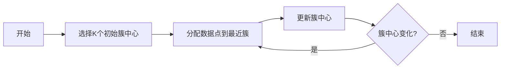

# K-Means Clustering 原理与代码实战案例讲解

## 1. 背景介绍
在数据科学和机器学习的领域中，聚类算法是一种重要的无监督学习技术，用于发现数据中的内在分布和模式。K-Means聚类算法因其简洁性和效率，在实际应用中广受欢迎。它的目标是将数据点划分为K个簇，使得同一簇内的点尽可能相似，而不同簇的点尽可能不同。

## 2. 核心概念与联系
K-Means算法的核心概念包括簇中心（Cluster Centroids）、簇内误差平方和（Within-Cluster Sum of Squares, WCSS）和迭代优化。簇中心代表了每个簇的中心位置，而WCSS是衡量簇内点与簇中心距离的指标，K-Means算法的目标就是最小化WCSS。

## 3. 核心算法原理具体操作步骤
K-Means算法的操作步骤可以概括为：
1. 随机选择K个数据点作为初始簇中心。
2. 将每个数据点分配到最近的簇中心所在的簇。
3. 更新每个簇的中心为簇内所有点的均值。
4. 重复步骤2和3，直到簇中心不再发生变化或达到预设的迭代次数。



## 4. 数学模型和公式详细讲解举例说明
K-Means算法的数学模型基于最小化WCSS，其公式为：
$$
WCSS = \sum_{i=1}^{k}\sum_{x \in S_i} ||x - \mu_i||^2
$$
其中，$k$ 是簇的数量，$S_i$ 是第$i$个簇中的点集，$\mu_i$ 是簇$S_i$的中心，$||x - \mu_i||^2$ 是点$x$到簇中心$\mu_i$的欧氏距离的平方。

## 5. 项目实践：代码实例和详细解释说明
在Python中，我们可以使用`sklearn`库中的`KMeans`类来实现K-Means聚类。以下是一个简单的代码示例：

```python
from sklearn.cluster import KMeans
import numpy as np

# 示例数据
X = np.array([[1, 2], [1, 4], [1, 0],
              [10, 2], [10, 4], [10, 0]])

# 初始化KMeans
kmeans = KMeans(n_clusters=2, random_state=0).fit(X)

# 输出簇中心和簇标签
print(kmeans.cluster_centers_)
print(kmeans.labels_)
```

## 6. 实际应用场景
K-Means聚类算法在许多领域都有应用，例如市场细分、社交网络分析、图像分割和基因表达数据分析等。

## 7. 工具和资源推荐
- `sklearn`库：提供了易于使用的K-Means实现。
- `matplotlib`库：用于数据可视化，帮助理解聚类结果。
- `scipy`库：提供了更多的科学计算工具，可以用于优化K-Means算法。

## 8. 总结：未来发展趋势与挑战
K-Means算法虽然简单高效，但也存在一些局限性，如对初始簇中心敏感、难以处理非球形簇和不同大小和密度的簇。未来的发展趋势可能包括算法的改进、与其他机器学习技术的结合以及在大数据环境下的优化。

## 9. 附录：常见问题与解答
- Q: K-Means算法如何选择合适的K值？
- A: 可以使用肘部法则（Elbow Method）来估计K值，即绘制不同K值的WCSS曲线，选择WCSS下降幅度变缓的点作为K值。

- Q: K-Means算法是否总能保证收敛？
- A: K-Means算法可以保证在有限步骤内收敛到局部最优解，但不一定是全局最优解。

- Q: 如何处理K-Means算法的随机性？
- A: 可以多次运行算法并选择最佳结果，或者使用K-Means++算法来选择初始簇中心，以减少随机性的影响。

作者：禅与计算机程序设计艺术 / Zen and the Art of Computer Programming