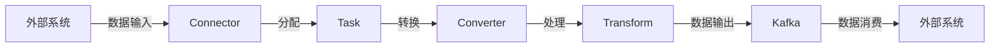

# Kafka Connect原理与代码实例讲解

## 1. 背景介绍
在现代数据密集型应用中，数据流动性是一个核心需求。Apache Kafka作为一个高吞吐量的分布式消息系统，已经成为企业数据架构中不可或缺的一部分。然而，数据的生产和消费往往需要与各种数据库、存储系统和应用程序接口进行集成。Kafka Connect是一个可扩展的工具，旨在简化这些外部系统与Kafka之间的数据传输。它提供了一种标准化方式，通过Connector插件来导入数据到Kafka和导出数据到外部系统。

## 2. 核心概念与联系
Kafka Connect基于几个核心概念：

- **Connector**：负责管理整个数据复制过程的高级逻辑。
- **Task**：Connector的实例，执行数据复制的实际工作。
- **Converter**：负责数据格式的转换。
- **Transform**：在数据到达目的地之前对其进行转换的组件。

这些组件之间的联系可以用以下Mermaid流程图表示：



## 3. 核心算法原理具体操作步骤
Kafka Connect的核心算法原理涉及以下步骤：

1. **配置解析**：解析Connector配置文件，确定需要启动的Connector和Task。
2. **任务分配**：根据配置和集群能力，将任务分配给不同的工作节点。
3. **数据流动**：Task按照配置从源系统拉取数据，或者将数据推送到目标系统。
4. **错误处理**：在数据复制过程中处理可能出现的错误和异常。

## 4. 数学模型和公式详细讲解举例说明
在Kafka Connect中，任务分配可以用数学模型来描述。假设有 $n$ 个Task和 $m$ 个工作节点，我们的目标是最小化最大负载，即：

$$
\min \max_{1 \leq i \leq m} \sum_{j=1}^{n} a_{ij}
$$

其中，$a_{ij}$ 是一个二元变量，如果任务 $j$ 被分配给节点 $i$，则 $a_{ij} = 1$，否则 $a_{ij} = 0$。

## 5. 项目实践：代码实例和详细解释说明
以下是一个简单的Kafka Connect Source Connector的代码实例：

```java
public class SimpleSourceConnector extends SourceConnector {
    private Map<String, String> configProperties;

    @Override
    public void start(Map<String, String> props) {
        this.configProperties = props;
    }

    @Override
    public Class<? extends Task> taskClass() {
        return SimpleSourceTask.class;
    }

    @Override
    public List<Map<String, String>> taskConfigs(int maxTasks) {
        // 分配任务配置
        List<Map<String, String>> taskConfigs = new ArrayList<>();
        for (int i = 0; i < maxTasks; i++) {
            taskConfigs.add(new HashMap<>(configProperties));
        }
        return taskConfigs;
    }

    @Override
    public void stop() {
        // 关闭资源
    }

    @Override
    public ConfigDef config() {
        return new ConfigDef()
            .define("topic", Type.STRING, Importance.HIGH, "The topic to publish data to");
    }

    @Override
    public String version() {
        return "1.0";
    }
}
```

这个例子展示了一个简单的Source Connector，它将配置信息传递给每个Task，并定义了必要的方法来启动和停止Connector。

## 6. 实际应用场景
Kafka Connect在多种场景下都有应用，例如：

- 数据库同步：实时将数据库变更同步到Kafka。
- 日志收集：从各种系统和应用中收集日志数据。
- 数据集成：将来自不同来源的数据集成到一个中央系统。

## 7. 工具和资源推荐
- **Confluent Hub**：一个提供各种Connector插件的市场。
- **Kafka Connect REST API**：用于管理Connector和Task的API。
- **Kafka Connect UI**：一个图形界面工具，用于配置和管理Kafka Connect。

## 8. 总结：未来发展趋势与挑战
Kafka Connect的未来发展趋势包括更加智能的错误处理、更高效的资源利用和更广泛的生态系统集成。挑战则包括保持与快速发展的Kafka生态系统的兼容性，以及处理日益增长的数据规模和复杂性。

## 9. 附录：常见问题与解答
- **Q：Kafka Connect和Kafka Streams有什么区别？**
  A：Kafka Connect主要用于数据的导入和导出，而Kafka Streams是一个流处理库，用于处理数据流。

- **Q：如何监控Kafka Connect的性能？**
  A：可以使用Kafka Connect的JMX指标，以及Confluent Control Center或其他监控工具。

- **Q：Kafka Connect支持哪些数据格式？**
  A：Kafka Connect支持多种数据格式，包括JSON、Avro、Protobuf等。

作者：禅与计算机程序设计艺术 / Zen and the Art of Computer Programming