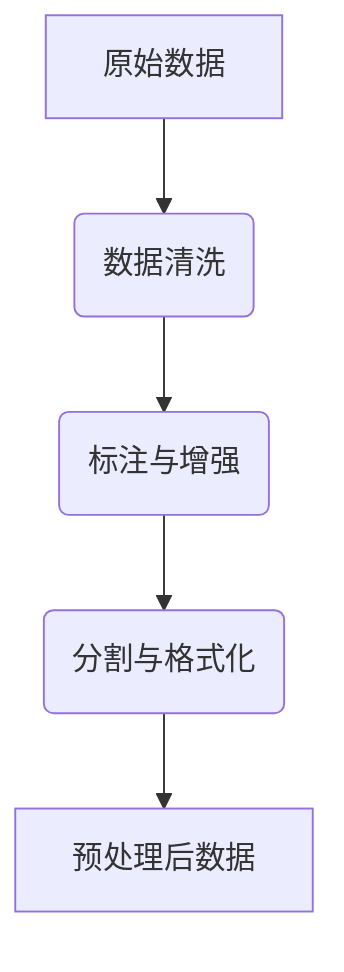
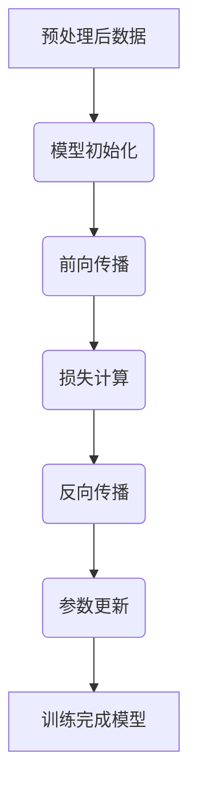
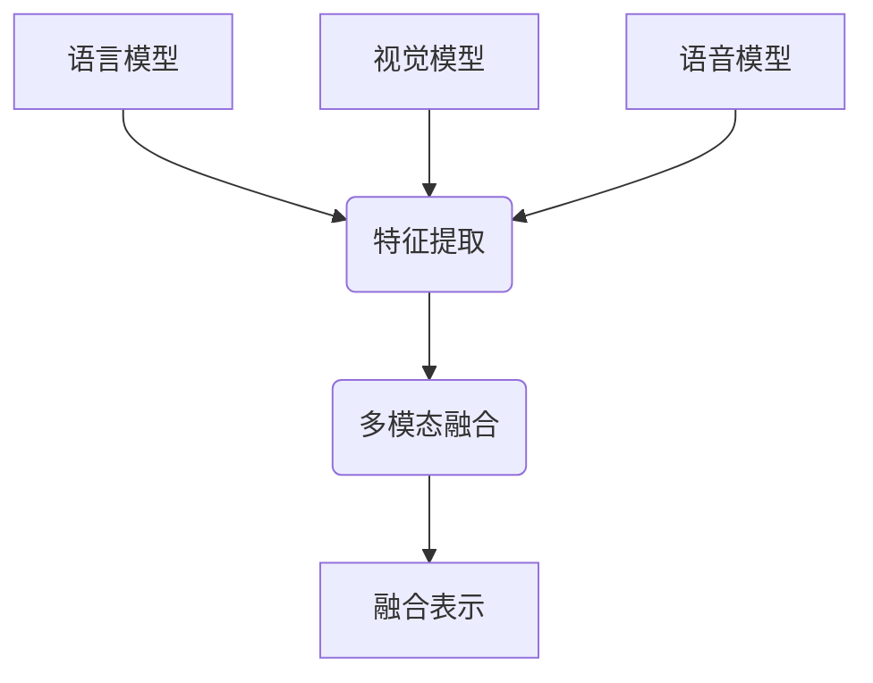
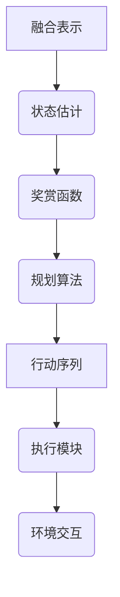

# LLM-based Agent

## 1.背景介绍

在当今的数字时代,人工智能(AI)技术正在快速发展,其中大型语言模型(LLM)引起了广泛关注。LLM是一种基于深度学习的自然语言处理(NLP)模型,能够理解和生成人类语言。随着计算能力和数据量的不断增加,LLM的性能不断提高,在各种应用场景中展现出了巨大的潜力。

LLM-based Agent是一种新兴的应用范式,它将LLM与其他AI组件(如计算机视觉、规划和控制等)相结合,旨在创建通用的人工智能代理,能够执行各种复杂任务。这种代理不仅能够理解自然语言指令,还能够与外部世界进行交互,感知环境并作出相应的行动。

LLM-based Agent的出现标志着人工智能发展的一个重要里程碑,它有望推动人工智能系统从狭隘的特定领域走向通用人工智能(AGI)的方向。然而,构建这种智能代理也面临着诸多挑战,需要解决模型的可解释性、安全性、可靠性等问题。

## 2.核心概念与联系

### 2.1 大型语言模型(LLM)

LLM是一种基于自然语言的人工智能模型,通过在大量文本数据上进行训练,学习语言的模式和规则。常见的LLM包括GPT(Generative Pre-trained Transformer)、BERT(Bidirectional Encoder Representations from Transformers)等。这些模型能够理解和生成人类语言,在自然语言处理任务中表现出色。

### 2.2 智能代理(Agent)

智能代理是一种能够感知环境、作出决策并采取行动的自主系统。在人工智能领域,代理通常被设计用于执行特定任务,如游戏AI、机器人控制等。LLM-based Agent旨在创建通用的智能代理,能够理解自然语言指令并与外部世界进行交互。

### 2.3 多模态交互

多模态交互是指智能系统能够通过多种模态(如文本、语音、图像、视频等)与用户进行交互。LLM-based Agent需要集成计算机视觉、语音识别等技术,实现多模态的输入和输出,以提高人机交互的自然性和效率。

### 2.4 知识库和推理

为了执行复杂任务,LLM-based Agent需要具备一定的知识库和推理能力。知识库可以来自于预训练的LLM模型,也可以通过其他方式(如知识图谱、规则库等)获取。推理能力则需要结合符号推理、规划和决策等技术,以便根据知识和环境状态作出合理的行动。

### 2.5 人工智能安全

构建LLM-based Agent面临着诸多安全挑战,包括模型的可解释性、可靠性、公平性和隐私保护等问题。确保智能代理的行为符合预期,不会产生有害或不当的结果,是一个重要的研究方向。

## 3.核心算法原理具体操作步骤

构建LLM-based Agent涉及多个关键步骤,包括数据预处理、模型训练、多模态融合、决策规划和行动执行等。下面将详细介绍这些步骤的核心算法原理和具体操作流程。

### 3.1 数据预处理



1. **数据清洗**:去除原始数据中的噪声、错误和冗余信息,确保数据的质量和一致性。
2. **标注与增强**:对数据进行人工或自动标注,为模型训练提供监督信号。同时可以使用数据增强技术(如回译、同义替换等)扩充数据量。
3. **分割与格式化**:将数据分割为合适的格式,如将文本分割为句子或段落,将图像分割为对象等。同时将数据转换为模型可接受的格式(如词嵌入、图像张量等)。

### 3.2 模型训练



1. **模型初始化**:选择合适的LLM架构(如Transformer、BERT等),并初始化模型参数。
2. **前向传播**:将预处理后的数据输入模型,计算模型的输出。
3. **损失计算**:比较模型输出与标注数据的差异,计算损失函数值。
4. **反向传播**:根据损失函数值,计算模型参数的梯度。
5. **参数更新**:使用优化算法(如SGD、Adam等)更新模型参数,minimizeimize损失函数。
6. **迭代训练**:重复上述步骤,直至模型收敛或达到预期性能。

### 3.3 多模态融合



1. **特征提取**:使用不同的模态模型(如LLM、CNN等)从各模态输入中提取特征表示。
2. **多模态融合**:将不同模态的特征表示融合,可以使用简单的拼接、注意力机制或外部记忆等方法。
3. **融合表示**:得到融合后的多模态表示,作为智能代理的输入,用于后续的决策和规划。

### 3.4 决策规划与行动执行



1. **状态估计**:根据融合表示和先验知识,估计当前的环境状态。
2. **奖赏函数**:设计一个奖赏函数,用于评估行动序列的质量。
3. **规划算法**:使用强化学习、搜索等算法,寻找能够最大化预期奖赏的行动序列。
4. **行动序列**:得到最优的行动序列作为智能代理的输出。
5. **执行模块**:将行动序列转换为对应的控制指令,如机器人运动指令等。
6. **环境交互**:通过执行模块与外部环境进行交互,感知环境反馈,重复上述过程。

上述步骤反映了LLM-based Agent的核心工作流程,将自然语言理解、多模态感知、决策规划和行动执行有机结合,实现了通用的人工智能代理。

## 4.数学模型和公式详细讲解举例说明

在LLM-based Agent的构建过程中,涉及多种数学模型和公式,下面将对其中一些核心部分进行详细讲解和举例说明。

### 4.1 Transformer模型

Transformer是LLM中广泛使用的一种序列到序列(Seq2Seq)模型架构,它基于自注意力(Self-Attention)机制,能够有效捕获长距离依赖关系。Transformer的数学表达式如下:

$$Attention(Q, K, V) = softmax(\frac{QK^T}{\sqrt{d_k}})V$$

其中$Q$、$K$、$V$分别表示查询(Query)、键(Key)和值(Value)。$d_k$是缩放因子,用于防止点积过大导致梯度消失。

自注意力机制允许每个位置的输出与输入序列的其他位置相关联,从而捕获全局依赖关系。例如,在机器翻译任务中,Transformer能够更好地捕获源语言和目标语言之间的长距离对应关系。

### 4.2 BERT模型

BERT(Bidirectional Encoder Representations from Transformers)是一种基于Transformer的双向编码器模型,在自然语言理解任务中表现卓越。BERT的核心思想是使用掩码语言模型(Masked Language Model)和下一句预测(Next Sentence Prediction)两个任务进行预训练。

掩码语言模型的目标是预测被掩码的单词,其损失函数为:

$$\mathcal{L}_{\text{MLM}} = -\sum_{i=1}^{n} \log P(x_i|x_{\backslash i})$$

其中$x_i$是被掩码的单词,$x_{\backslash i}$表示其他单词。

下一句预测任务的目标是判断两个句子是否连续,其二元交叉熵损失函数为:

$$\mathcal{L}_{\text{NSP}} = -\sum_{i=1}^{n} y_i \log P(y_i) + (1 - y_i) \log (1 - P(y_i))$$

其中$y_i$表示两个句子是否连续的标签。

通过预训练,BERT学习了丰富的语言表示,可以在下游任务中进行微调,取得优异的性能。

### 4.3 强化学习算法

在LLM-based Agent的决策规划过程中,常使用强化学习算法来寻找最优的行动序列。强化学习的核心思想是通过与环境的交互,学习一个状态-行动值函数$Q(s,a)$,表示在状态$s$下执行行动$a$的预期累积奖赏。

$Q$函数可以通过贝尔曼方程进行迭代更新:

$$Q(s_t, a_t) \leftarrow Q(s_t, a_t) + \alpha \left[ r_t + \gamma \max_{a} Q(s_{t+1}, a) - Q(s_t, a_t) \right]$$

其中$\alpha$是学习率,$\gamma$是折现因子,$r_t$是立即奖赏。

常用的强化学习算法包括Q-Learning、Sarsa、Deep Q-Network(DQN)等。以DQN为例,它使用深度神经网络来近似$Q$函数,通过经验回放和目标网络等技巧提高训练稳定性。

在LLM-based Agent中,强化学习算法可以根据环境状态和奖赏函数,学习出最优的行动策略,指导智能代理完成复杂任务。

## 5.项目实践:代码实例和详细解释说明

为了更好地理解LLM-based Agent的实现,下面将提供一个简化的代码示例,并对关键部分进行详细解释。

### 5.1 环境设置

```python
import gym
import numpy as np

# 创建环境
env = gym.make('CartPole-v1')

# 重置环境
state = env.reset()
```

在这个示例中,我们使用OpenAI Gym中的`CartPole-v1`环境,它模拟了一个小车平衡杆的控制问题。`env.reset()`函数用于重置环境,返回初始状态。

### 5.2 LLM模型

```python
import torch
import transformers

# 加载预训练LLM模型
model = transformers.GPT2LMHeadModel.from_pretrained('gpt2')

# 输入序列
input_ids = torch.tensor([[model.config.bos_token_id]])

# 生成输出
output = model.generate(input_ids, max_length=50, do_sample=True, top_k=50, top_p=0.95, num_return_sequences=1)

# 解码输出
output_text = model.tokenizer.decode(output[0], skip_special_tokens=True)
print(output_text)
```

这部分代码展示了如何加载和使用预训练的GPT-2语言模型。首先,我们使用`transformers`库加载模型。然后,我们提供一个起始标记作为输入,调用`model.generate()`函数生成文本输出。`max_length`参数控制输出长度,`top_k`和`top_p`用于控制输出的多样性。最后,我们使用tokenizer解码输出序列,得到自然语言文本。

### 5.3 多模态融合

```python
import cv2
from PIL import Image

# 加载图像
img = cv2.imread('example.jpg')

# 预处理图像
img = cv2.resize(img, (224, 224))
img = img.transpose(2, 0, 1)
img = torch.from_numpy(img).unsqueeze(0)

# 计算机视觉模型
vision_model = torchvision.models.resnet18(pretrained=True)
vision_output = vision_model(img)

# 融合语言和视觉表示
fused_output = torch.cat([output_text, vision_output], dim=1)
```

在这个示例中,我们加载一张图像,并使用预训练的ResNet-18模型提取视觉特征。然后,我们将语言