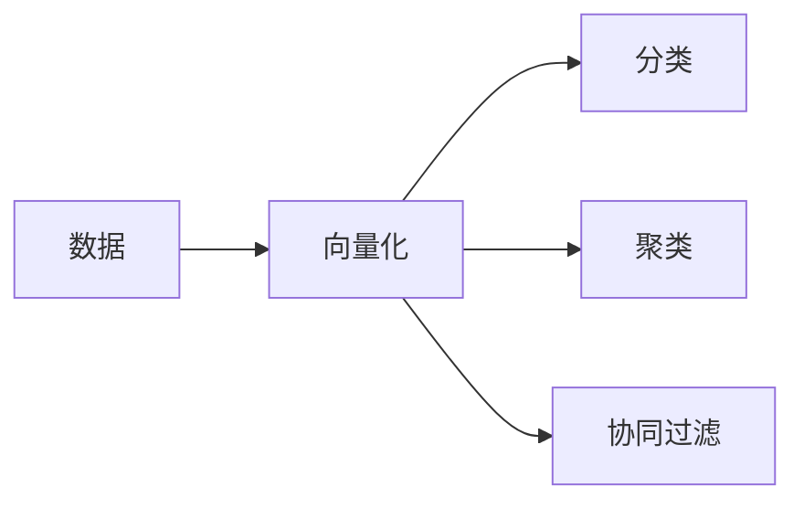

# Mahout原理与代码实例讲解

## 1. 背景介绍
Apache Mahout是一个分布式线性代数框架，旨在帮助开发者快速实现机器学习算法。Mahout提供了一系列可扩展的机器学习算法，这些算法专为处理大规模数据集而设计。随着大数据时代的到来，Mahout的重要性日益凸显，它能够帮助企业从海量数据中提取有价值的信息，从而做出更明智的决策。

## 2. 核心概念与联系
Mahout的核心概念包括向量化、分类、聚类和协同过滤等。这些概念相互联系，共同构成了Mahout的理论基础。向量化是将数据转换为向量形式，以便于算法处理；分类是将数据分为不同的类别；聚类是将相似的数据归为一组；协同过滤则是通过用户的历史行为来预测用户的兴趣。



## 3. 核心算法原理具体操作步骤
Mahout的核心算法包括K-Means聚类、随机森林分类和基于用户的协同过滤等。以K-Means聚类为例，其操作步骤包括选择初始中心点、计算每个点到中心点的距离、更新中心点位置，直到满足停止条件。

## 4. 数学模型和公式详细讲解举例说明
K-Means聚类的数学模型基于最小化每个点到其所属类中心点的距离之和。公式如下：

$$
J = \sum_{i=1}^{n}\sum_{j=1}^{k}z_{ij}\|x_i - \mu_j\|^2
$$

其中，$J$ 是代价函数，$n$ 是数据点的数量，$k$ 是类别的数量，$z_{ij}$ 是一个指示变量，如果数据点 $i$ 属于类别 $j$ 则为1，否则为0，$x_i$ 是数据点，$\mu_j$ 是类别 $j$ 的中心点。

## 5. 项目实践：代码实例和详细解释说明
在实际项目中，我们可以使用Mahout提供的API来实现K-Means聚类。以下是一个简单的代码实例：

```java
// 创建一个向量化的数据集
List<Vector> vectors = getVectors(data);

// 使用KMeansDriver类来执行K-Means聚类
KMeansDriver.run(conf, new Path("input"), new Path("clusters"),
                 new Path("output"), 0.001, 10, true, 0, false);

// 输出聚类结果
Path outGlob = new Path("output", "clusters-*-final");
FileSystem fs = FileSystem.get(conf);
FileStatus[] files = fs.globStatus(outGlob);
for (FileStatus file : files) {
    System.out.println("Cluster: " + file.getPath());
}
```

在这个例子中，我们首先将数据向量化，然后使用`KMeansDriver.run`方法执行聚类，并输出最终的聚类结果。

## 6. 实际应用场景
Mahout在许多领域都有应用，包括推荐系统、文本挖掘、网络分析等。例如，在电子商务网站中，Mahout可以用来分析用户行为，提供个性化的商品推荐。

## 7. 工具和资源推荐
为了更好地使用Mahout，推荐以下工具和资源：
- Apache Mahout官方网站：提供最新的版本和文档。
- Hadoop：Mahout常与Hadoop结合使用，处理大规模数据集。
- IntelliJ IDEA或Eclipse：强大的IDE，有助于代码开发和调试。

## 8. 总结：未来发展趋势与挑战
Mahout作为一个开源项目，随着社区的贡献不断发展。未来的发展趋势可能包括更多的算法实现、性能优化和易用性提升。同时，处理更大规模数据集和实时数据流将是Mahout面临的挑战。

## 9. 附录：常见问题与解答
Q1: Mahout能否独立于Hadoop使用？
A1: 可以，但是为了处理大规模数据集，通常与Hadoop结合使用。

Q2: Mahout支持哪些机器学习算法？
A2: Mahout支持多种算法，包括聚类、分类、协同过滤等。

Q3: 如何选择合适的算法？
A3: 需要根据具体的应用场景和数据特性来选择合适的算法。

作者：禅与计算机程序设计艺术 / Zen and the Art of Computer Programming