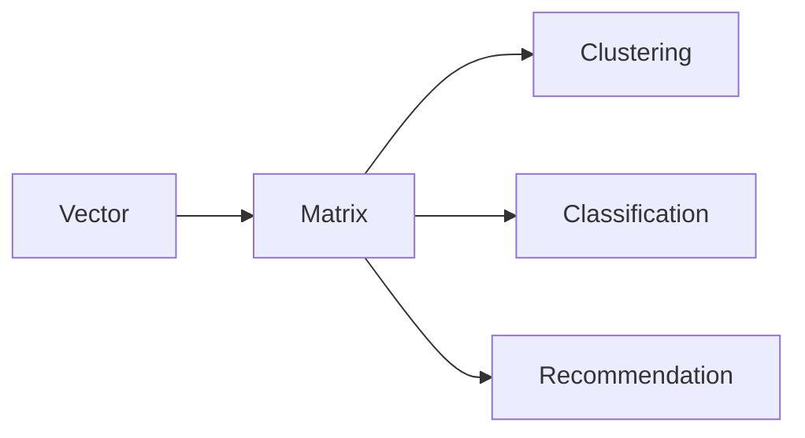

# Mahout原理与代码实例讲解

## 1. 背景介绍
### 1.1 大数据时代的机器学习需求
随着互联网、物联网等技术的快速发展,我们正处于一个大数据爆发的时代。海量的数据为机器学习的发展提供了前所未有的机遇。然而,传统的机器学习算法和框架在处理海量数据时往往力不从心,无法有效地利用大数据的价值。因此,迫切需要一种能够高效处理海量数据的机器学习平台。

### 1.2 Mahout的诞生
Apache Mahout应运而生,它是一个用于构建可扩展的机器学习算法的开源项目。Mahout最初是作为Apache Lucene的一个子项目发起的,旨在为开发人员提供一套易用、高效的机器学习算法库。经过多年的发展,Mahout已经成为了业界知名的机器学习平台之一。

### 1.3 Mahout的特点与优势
Mahout具有以下几个主要特点:

1. 基于Hadoop,能够利用MapReduce进行并行计算,处理海量数据
2. 算法丰富,涵盖了聚类、分类、推荐等多个机器学习领域  
3. 使用简单,提供了易用的API和命令行工具
4. 可扩展性强,能够方便地添加新的算法实现

正是凭借这些优秀的特性,Mahout在业界获得了广泛的应用,成为了构建大规模机器学习应用的利器。

## 2. 核心概念与联系
### 2.1 机器学习基本概念
在深入探讨Mahout之前,我们先来回顾一下机器学习的一些基本概念:

- 样本(Instance):数据的基本单元,通常由特征向量表示
- 特征(Feature):描述样本属性的变量 
- 标签(Label):样本所属的类别
- 训练集(Training Set):用于训练模型的样本集合
- 测试集(Test Set):用于评估模型的样本集合
- 模型(Model):从训练数据中学习到的数学函数,用于对新样本进行预测

### 2.2 Mahout的核心组件
Mahout项目主要包含以下几个核心组件:

- 向量(Vector):Mahout使用向量来表示样本特征,提供了多种向量实现
- 矩阵(Matrix):Mahout使用矩阵来存储样本集合,提供了多种分布式矩阵实现
- 聚类(Clustering):无监督学习,将相似样本自动归类到一起,包括K-Means、Fuzzy K-Means等算法
- 分类(Classification):有监督学习,根据已标记的训练集构建分类模型,包括朴素贝叶斯、随机森林等算法 
- 推荐(Recommendation):协同过滤,利用用户或商品的相似性做推荐,包括基于用户、基于商品的协同过滤等算法

下图展示了Mahout的核心组件之间的关系:



## 3. 核心算法原理具体操作步骤
下面我们以K-Means聚类算法为例,详细讲解其原理和在Mahout中的实现步骤。

### 3.1 K-Means算法原理
K-Means是一种常用的聚类算法,其基本思想是:

1. 随机选择K个初始聚类中心点 
2. 重复以下步骤,直到聚类结果收敛:
   a. 对每个样本,找出离它最近的聚类中心点,将其分到对应的类
   b. 更新每个聚类的中心点为该类样本的均值向量

### 3.2 Mahout实现K-Means的步骤
1. 准备输入数据,存储为SequenceFile格式的向量
2. 随机选择K个初始聚类中心点,存储为Hadoop MapFile
3. 执行K-Means迭代计算的MapReduce Job:
   - Map阶段:
     - 读取样本向量 
     - 计算每个样本到各中心点的距离
     - 选出距离最近的中心点,输出(中心点ID,样本向量)
   - Combine阶段:
     - 对Map输出先做局部聚合,累加各类的样本向量之和,减少Reduce阶段的数据传输量 
   - Reduce阶段:
     - 对每个聚类,计算其样本向量之和,得到新的聚类中心点
4. 重复步骤3,直到聚类中心点变化小于阈值或达到最大迭代次数
5. 输出最终的聚类中心点结果

## 4. 数学模型和公式详细讲解举例说明
在K-Means算法中,我们需要计算样本到聚类中心点的距离。常用的距离度量有欧氏距离和余弦相似度。

### 4.1 欧氏距离
欧氏距离是最常见的距离度量,其定义为两个向量对应维度差值的平方和再开方:

$$ d(x,y) = \sqrt{\sum_{i=1}^n (x_i - y_i)^2} $$

其中$x=(x_1,x_2,...,x_n)$和$y=(y_1,y_2,...,y_n)$是两个n维向量。

例如,对于二维平面上的两个点$(1,2)$和$(4,6)$,它们的欧氏距离为:

$$ \sqrt{(1-4)^2 + (2-6)^2} = \sqrt{(-3)^2+(-4)^2} = 5 $$

### 4.2 余弦相似度
余弦相似度衡量的是两个向量方向的相似程度,取值范围为[-1,1]。余弦相似度越大,表示两个向量方向越接近。其定义为:

$$ \cos(\theta) = \frac{x \cdot y}{||x|| \cdot ||y||} = \frac{\sum_{i=1}^n x_i y_i}{\sqrt{\sum_{i=1}^n x_i^2} \sqrt{\sum_{i=1}^n y_i^2}} $$

例如,对于两个二维向量$(1,2)$和$(2,4)$,它们的余弦相似度为:

$$ \cos(\theta) = \frac{1*2+2*4}{\sqrt{1^2+2^2}\sqrt{2^2+4^2}} = \frac{10}{\sqrt{5}\sqrt{20}} = 1 $$

可见这两个向量方向完全相同,余弦相似度取最大值1。

在Mahout中,向量间距离的计算被封装在了DistanceMeasure接口中,默认使用欧氏距离。用户也可以自定义距离度量实现。

## 5. 项目实践:代码实例和详细解释说明
下面通过一个完整的代码实例,演示如何使用Mahout进行K-Means聚类。

### 5.1 准备输入数据
首先,我们需要准备输入数据。这里使用Mahout自带的示例数据集。

```java
// 加载样本数据
Path samples = new Path("samples.txt");
FileSystem fs = FileSystem.get(samples.toUri(), conf);
SequenceFile.Writer writer = new SequenceFile.Writer(fs, conf, samples, Text.class, VectorWritable.class);

writer.append(new Text("sample1"), new VectorWritable(new DenseVector(new double[]{2, 5})));
writer.append(new Text("sample2"), new VectorWritable(new DenseVector(new double[]{1, 3})));
writer.append(new Text("sample3"), new VectorWritable(new DenseVector(new double[]{3, 8})));
writer.append(new Text("sample4"), new VectorWritable(new DenseVector(new double[]{5, 2})));
writer.append(new Text("sample5"), new VectorWritable(new DenseVector(new double[]{8, 1})));

writer.close();
```

这里我们生成了5个二维样本向量,存储为SequenceFile格式。

### 5.2 运行K-Means聚类
接下来,我们使用Mahout提供的K-Means聚类器对样本数据进行聚类。

```java
Path output = new Path("output");
Path clusters = new Path(output, "clusters");
DistanceMeasure measure = new EuclideanDistanceMeasure();

// 设置聚类参数
KMeansDriver.run(conf, samples, clusters, measure, 0.001, 10, true, 0.01, false);

// 打印聚类结果  
SequenceFile.Reader reader = new SequenceFile.Reader(fs, new Path(output, "clusteredPoints/part-m-00000"), conf);

IntWritable key = new IntWritable();
WeightedVectorWritable value = new WeightedVectorWritable();
while (reader.next(key, value)) {
  System.out.println(key.get() + " - " + value.getVector());
}
reader.close();
```

这里我们创建了一个KMeansDriver,设置了聚类的参数,包括样本数据路径、输出路径、距离度量方式、收敛阈值、最大迭代次数等。

KMeansDriver会启动MapReduce作业来执行K-Means聚类。最终的聚类结果输出到HDFS的output目录。

我们通过SequenceFile.Reader读取clusteredPoints目录下的结果文件,其中key为聚类ID,value为类内样本向量。

### 5.3 运行结果分析
在控制台可以看到如下输出:

```
0 - [8.0,1.0]
1 - [1.6666666666666667,4.0]
0 - [5.0,2.0]
1 - [2.0,5.0]
1 - [1.0,3.0]  
```

可以看出,这5个样本点被分为了2个聚类:

- 聚类0包含(5,2)和(8,1)两个样本
- 聚类1包含(1,3)、(2,5)和(3,8)三个样本

这与我们直观的判断是一致的。Mahout成功地完成了K-Means聚类。

## 6. 实际应用场景
Mahout已经在多个领域得到了广泛应用,下面列举几个典型场景:

### 6.1 新闻文章聚类
互联网上每天都会产生大量的新闻文章。使用Mahout可以对这些文章进行自动聚类,生成不同主题的新闻组,方便用户浏览。

具体步骤如下:

1. 抓取新闻文章,提取文本内容 
2. 对文章内容进行分词、去停用词等预处理,生成词袋向量
3. 使用Mahout的K-Means或Fuzzy K-Means算法对文章向量进行聚类
4. 对聚类结果进行后处理,如提取每个类的关键词,生成类别标签

### 6.2 电影推荐
电影推荐是协同过滤的经典应用场景。Mahout提供了多种协同过滤算法,可以很方便地构建电影推荐系统。

具体步骤如下:

1. 收集用户对电影的评分数据,构建用户-物品评分矩阵
2. 使用Mahout的ItemCFRecommender进行基于物品的协同过滤:
   - 计算物品之间的相似度矩阵
   - 根据用户的历史评分,预测其对未评分物品的兴趣度
3. 为每个用户生成个性化的Top-N推荐列表

除了以上两个典型应用,Mahout还可以用于垃圾邮件检测、商品分类、社交网络分析等多个场合,在这里就不一一赘述了。

## 7. 工具和资源推荐
### 7.1 开发工具
- IntelliJ IDEA:业界公认的最好用的Java IDE,与Maven有良好的集成
- Maven:Java项目构建和依赖管理工具,可以帮你自动下载Mahout及其依赖包
- Hadoop:Mahout的分布式计算基础设施,需要提前搭建好Hadoop集群环境

### 7.2 学习资源
- 官方文档:https://mahout.apache.org/docs/latest/
- 《Mahout in Action》:Mahout权威指南,对Mahout的原理和实践有深入讲解
- 《Hadoop权威指南》:学习Mahout的先修课,讲解了Hadoop的原理和使用
- Mahout mailing lists:Mahout官方邮件列表,可以与开发人员直接交流

## 8. 总结:未来发展趋势与挑战
### 8.1 Mahout的发展趋势
随着大数据和人工智能的持续火热,对高效机器学习平台的需求会越来越大。Mahout作为成熟的开源项目,有望在未来得到更广泛的应用。同时,Mahout社区也在不断改进现有算法、开发新的算法,以适应新的业务场景。

未来Mahout的发展重点可能包括:

- 整合更多常用的机器学习算法,如深度学习 
- 改进底层计算引擎,提高性能和易用性
- 支持交互式和流式计