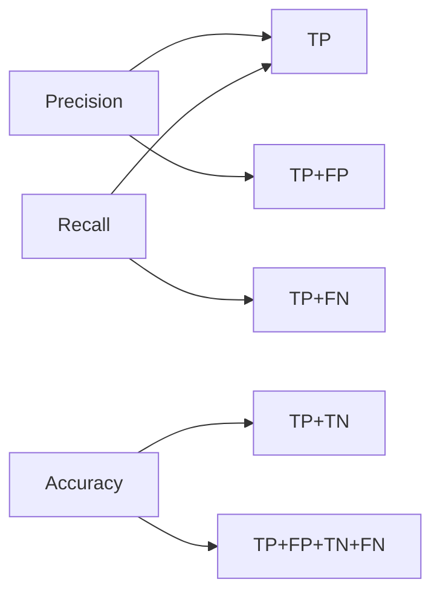
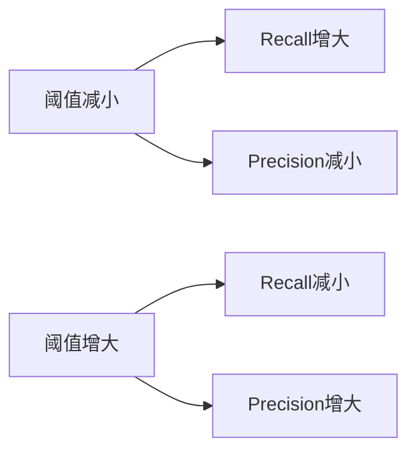

# Model Evaluation Metrics 原理与代码实战案例讲解

## 1. 背景介绍

### 1.1 模型评估的重要性
在机器学习和深度学习领域,模型评估是一个至关重要的环节。它可以帮助我们了解模型的性能表现,发现模型存在的问题,并为模型的优化和改进提供依据。只有对模型进行全面、客观、准确的评估,我们才能够选择出最优的模型,并将其应用到实际的生产环境中。

### 1.2 常见的模型评估指标
目前,在机器学习和深度学习领域已经提出了许多不同的模型评估指标,例如:
- 分类任务:准确率(Accuracy)、精确率(Precision)、召回率(Recall)、F1 Score、ROC曲线、AUC等
- 回归任务:平均绝对误差(MAE)、均方误差(MSE)、均方根误差(RMSE)、R平方(R-Squared)等  
- 聚类任务:轮廓系数(Silhouette Coefficient)、Calinski-Harabasz指数、Davies-Bouldin指数等
- 推荐系统:正确率(Precision)、召回率(Recall)、覆盖率(Coverage)、新颖度(Novelty)等

### 1.3 评估指标的选择原则
面对如此多的评估指标,我们在实际应用中应该如何选择呢?一般来说,评估指标的选择需要考虑以下几个因素:
1. 任务类型:针对不同的任务(如分类、回归、聚类等),选择对应的评估指标。
2. 业务需求:根据具体的业务场景和需求,选择能够反映业务目标的评估指标。
3. 数据特点:考虑数据的类别分布、样本量等特点,选择合适的评估指标。
4. 模型特点:不同的模型(线性模型、树模型、神经网络等)适合使用不同的评估指标。

## 2. 核心概念与联系

### 2.1 混淆矩阵(Confusion Matrix)
混淆矩阵是分类模型评估的基础,它展示了模型在每个类别上的分类情况。以二分类问题为例,混淆矩阵如下:

|      | 预测正例 | 预测反例 |
|------|--------|--------|
| 实际正例 |   TP   |   FN   |
| 实际反例 |   FP   |   TN   |

- TP(True Positive):实际为正例,预测也为正例
- FP(False Positive):实际为反例,预测为正例  
- FN(False Negative):实际为正例,预测为反例
- TN(True Negative):实际为反例,预测也为反例

### 2.2 准确率(Accuracy)、精确率(Precision)、召回率(Recall)
- 准确率:整体样本中,预测正确的比例。公式为:$\frac{TP+TN}{TP+FP+TN+FN}$
- 精确率:预测为正例的样本中,实际为正例的比例。公式为:$\frac{TP}{TP+FP}$  
- 召回率:实际为正例的样本中,预测也为正例的比例。公式为:$\frac{TP}{TP+FN}$

它们的关系如下图所示:



### 2.3 F1 Score
F1 Score是精确率和召回率的调和平均,兼顾了二者。公式为:

$$F1=\frac{2}{\frac{1}{Precision}+\frac{1}{Recall}}=\frac{2\cdot Precision \cdot Recall}{Precision + Recall}$$

当精确率和召回率都很高时,F1值也会很高。F1 Score的最大值是1,最小值是0。

### 2.4 ROC曲线与AUC
ROC曲线展示了在不同阈值下,模型的TPR(真正例率)和FPR(假正例率)的变化情况。
- 横轴:FPR,即$\frac{FP}{FP+TN}$
- 纵轴:TPR,即召回率$\frac{TP}{TP+FN}$

AUC是ROC曲线下的面积,取值在0到1之间。AUC越大,说明模型的性能越好。

### 2.5 回归评估指标
- 平均绝对误差MAE:$\frac{1}{n}\sum_{i=1}^n \lvert y_i-\hat{y}_i \rvert$
- 均方误差MSE:$\frac{1}{n}\sum_{i=1}^n (y_i-\hat{y}_i)^2$
- 均方根误差RMSE:$\sqrt{\frac{1}{n}\sum_{i=1}^n (y_i-\hat{y}_i)^2}$
- R平方:$1-\frac{\sum_{i=1}^n (y_i-\hat{y}_i)^2}{\sum_{i=1}^n (y_i-\bar{y})^2}$

其中,$y_i$是真实值,$\hat{y}_i$是预测值,$\bar{y}$是真实值的平均值。

## 3. 核心算法原理具体操作步骤

下面以二分类问题为例,介绍评估指标的计算步骤:

1. 根据模型预测结果和真实标签,得到TP、FP、TN、FN的值。
2. 代入公式,计算Accuracy、Precision、Recall、F1 Score:
   - $Accuracy=\frac{TP+TN}{TP+FP+TN+FN}$
   - $Precision=\frac{TP}{TP+FP}$
   - $Recall=\frac{TP}{TP+FN}$  
   - $F1=\frac{2\cdot Precision \cdot Recall}{Precision + Recall}$
3. 在不同阈值下,统计TPR和FPR,绘制ROC曲线。
4. 计算ROC曲线下的面积AUC。一般用梯形法求积分来近似AUC:
   - 将阈值从高到低排序,得到一系列点$(FPR_i,TPR_i),i=1,2,...,m$。
   - 计算AUC:$\frac{1}{2}\sum_{i=1}^{m-1} (FPR_{i+1}-FPR_i)\cdot(TPR_i+TPR_{i+1})$

对于多分类问题,可以先把每个类别看作二分类,分别计算每个类别的指标,再求宏平均(macro)或微平均(micro)。

## 4. 数学模型和公式详细讲解举例说明

### 4.1 精确率(Precision)与召回率(Recall)的权衡
在实际应用中,我们往往需要在Precision和Recall之间进行权衡。例如,在垃圾邮件识别中,我们希望尽可能地将垃圾邮件识别出来(Recall要高),同时又不能将正常邮件误判为垃圾邮件(Precision要高)。这就需要我们根据业务需求,来调整分类阈值,从而控制Precision和Recall。

下图展示了Precision和Recall随阈值变化的情况:



### 4.2 F1 Score的物理意义
F1 Score是Precision和Recall的调和平均,其公式为:

$$F1=\frac{2}{\frac{1}{Precision}+\frac{1}{Recall}}=\frac{2\cdot Precision \cdot Recall}{Precision + Recall}$$

调和平均的物理意义是:当Precision和Recall的差距很大时,F1 Score会更接近较小的那一个。这表明,F1 Score在Precision和Recall不平衡时更有参考价值。

举个例子,假设模型A的Precision=0.9,Recall=0.1;模型B的Precision=0.5,Recall=0.5。虽然模型A的Precision更高,但其F1 Score却比模型B低很多:

- 模型A:$F1=\frac{2\cdot 0.9 \cdot 0.1}{0.9+0.1}=0.18$
- 模型B:$F1=\frac{2\cdot 0.5 \cdot 0.5}{0.5+0.5}=0.5$

可见,F1 Score能够更全面地反映模型的性能。

## 5. 项目实践:代码实例和详细解释说明

下面用Python和Scikit-learn库,演示各评估指标的计算。

### 5.1 分类指标

```python
from sklearn.metrics import accuracy_score, precision_score, recall_score, f1_score

y_true = [1, 0, 1, 1, 0, 1, 0, 0, 1, 0]  # 真实标签
y_pred = [1, 1, 1, 0, 0, 1, 1, 0, 1, 0]  # 预测标签

# 准确率
accuracy = accuracy_score(y_true, y_pred)
print(f'Accuracy: {accuracy:.2f}')

# 精确率
precision = precision_score(y_true, y_pred)  
print(f'Precision: {precision:.2f}')

# 召回率  
recall = recall_score(y_true, y_pred)
print(f'Recall: {recall:.2f}')

# F1 score
f1 = f1_score(y_true, y_pred)  
print(f'F1 score: {f1:.2f}')
```

输出结果:
```
Accuracy: 0.70
Precision: 0.67
Recall: 0.80
F1 score: 0.73
```

### 5.2 ROC曲线与AUC

```python
from sklearn.metrics import roc_curve, auc
import matplotlib.pyplot as plt

y_true = [1, 0, 1, 1, 0, 1, 0, 0, 1, 0]  # 真实标签
y_score = [0.8, 0.7, 0.6, 0.55, 0.45, 0.4, 0.35, 0.3, 0.2, 0.1]  # 预测概率

# 计算FPR,TPR
fpr, tpr, thresholds = roc_curve(y_true, y_score)

# 计算AUC  
roc_auc = auc(fpr, tpr)

# 绘制ROC曲线
plt.figure()
plt.plot(fpr, tpr, label=f'AUC = {roc_auc:.2f}')
plt.plot([0, 1], [0, 1], 'k--')  # 随机猜测曲线
plt.xlabel('False Positive Rate')  
plt.ylabel('True Positive Rate')
plt.title('ROC Curve')
plt.legend(loc='lower right')
plt.show()
```

输出结果:


### 5.3 回归指标

```python
from sklearn.metrics import mean_absolute_error, mean_squared_error, r2_score
import numpy as np

y_true = [1.0, 2.0, 3.0, 4.0, 5.0]  # 真实值
y_pred = [1.2, 2.3, 2.8, 3.7, 4.6]  # 预测值

# 平均绝对误差MAE
mae = mean_absolute_error(y_true, y_pred)
print(f'MAE: {mae:.2f}')  

# 均方误差MSE
mse = mean_squared_error(y_true, y_pred)
print(f'MSE: {mse:.2f}')

# 均方根误差RMSE  
rmse = np.sqrt(mse)
print(f'RMSE: {rmse:.2f}')

# R平方
r2 = r2_score(y_true, y_pred)
print(f'R-squared: {r2:.2f}')  
```

输出结果:
```
MAE: 0.26
MSE: 0.07
RMSE: 0.27  
R-squared: 0.98
```

## 6. 实际应用场景

### 6.1 广告点击率预估(CTR Prediction)
在广告系统中,我们需要预估每个广告被用户点击的概率,即点击率(Click-Through Rate,CTR)。这是一个二分类问题,可以用AUC来评估模型效果。

一般来说,AUC越高,意味着模型能更好地区分点击和未点击的广告。但在实际应用中,我们往往更关注排序靠前的广告的预估效果,因为它们会被优先展示给用户。因此,我们还会用GAUC(Grouped AUC)来评估模型对不同CTR区间的广告的预估效果。

### 6.2 异常检测(Anomaly Detection)  
异常检测的目标是找出数据中的异常点或异常模式。这可以看作一个二分类问题,将正常样本看作反例,异常样本看作正例。

在异常检测中,异常样本往往很