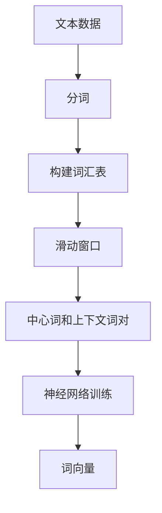
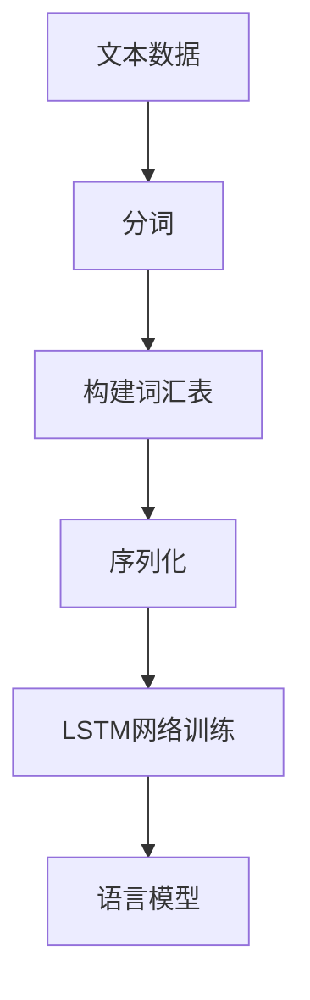

# NLP是人类和计算机沟通的桥梁

## 1.背景介绍

自然语言处理（NLP，Natural Language Processing）是人工智能和计算语言学的一个重要分支，旨在实现计算机对人类语言的理解、生成和互动。随着大数据和深度学习技术的迅猛发展，NLP在过去十年中取得了显著的进步，成为了人类与计算机沟通的关键桥梁。

### 1.1 自然语言处理的历史

NLP的历史可以追溯到20世纪50年代，当时的研究主要集中在机器翻译和语法分析上。随着计算能力的提升和算法的改进，NLP逐渐扩展到文本分类、情感分析、对话系统等多个领域。

### 1.2 现代NLP的驱动力

现代NLP的发展得益于以下几个关键因素：
- **大数据**：互联网和社交媒体的普及产生了海量的文本数据，为NLP模型的训练提供了丰富的资源。
- **深度学习**：深度神经网络，特别是卷积神经网络（CNN）和循环神经网络（RNN），在处理复杂的语言任务上表现出色。
- **计算能力**：GPU和TPU等硬件加速器的出现，使得大规模模型的训练成为可能。

## 2.核心概念与联系

### 2.1 词向量

词向量（Word Embedding）是NLP中的基础概念之一，它将词语映射到一个连续的向量空间中，使得语义相似的词在向量空间中距离较近。常见的词向量模型包括Word2Vec、GloVe和FastText。

### 2.2 语言模型

语言模型（Language Model）是NLP的核心组件之一，用于预测句子中词语的概率分布。经典的语言模型包括n-gram模型和基于神经网络的语言模型，如LSTM和Transformer。

### 2.3 句子表示

句子表示（Sentence Representation）是将整个句子映射到一个向量空间中，常用的方法包括平均词向量、RNN编码器和BERT等预训练模型。

### 2.4 语义分析

语义分析（Semantic Analysis）是理解文本含义的关键步骤，包括词义消歧、命名实体识别和关系抽取等任务。

## 3.核心算法原理具体操作步骤

### 3.1 词向量训练

词向量的训练通常采用无监督学习方法，通过上下文信息来学习词语的表示。以下是Word2Vec的Skip-gram模型的具体步骤：

1. **数据预处理**：将文本数据分词，并构建词汇表。
2. **滑动窗口**：在每个词的周围定义一个固定大小的窗口，收集中心词和上下文词对。
3. **模型训练**：使用神经网络训练模型，使得中心词和上下文词的向量在向量空间中接近。



### 3.2 语言模型训练

语言模型的训练通常采用有监督学习方法，通过大量的标注数据来学习词语的概率分布。以下是基于LSTM的语言模型的具体步骤：

1. **数据预处理**：将文本数据分词，并构建词汇表。
2. **序列化**：将文本数据转换为固定长度的序列。
3. **模型训练**：使用LSTM网络训练模型，预测序列中下一个词的概率分布。



## 4.数学模型和公式详细讲解举例说明

### 4.1 词向量模型

词向量模型的目标是最大化中心词和上下文词的共现概率。以Skip-gram模型为例，其目标函数为：

$$
J = \sum_{t=1}^{T} \sum_{-c \leq j \leq c, j \neq 0} \log P(w_{t+j} | w_t)
$$

其中，$w_t$表示中心词，$w_{t+j}$表示上下文词，$c$表示窗口大小。共现概率$P(w_{t+j} | w_t)$通过softmax函数计算：

$$
P(w_{t+j} | w_t) = \frac{\exp(v_{w_{t+j}} \cdot v_{w_t})}{\sum_{w \in V} \exp(v_w \cdot v_{w_t})}
$$

### 4.2 语言模型

语言模型的目标是最大化句子中词语的联合概率。以基于LSTM的语言模型为例，其目标函数为：

$$
J = \sum_{t=1}^{T} \log P(w_t | w_{1:t-1})
$$

其中，$w_t$表示第$t$个词，$w_{1:t-1}$表示前$t-1$个词。条件概率$P(w_t | w_{1:t-1})$通过LSTM网络计算：

$$
h_t = \text{LSTM}(w_{t-1}, h_{t-1})
$$

$$
P(w_t | w_{1:t-1}) = \text{softmax}(W h_t + b)
$$

## 5.项目实践：代码实例和详细解释说明

### 5.1 词向量训练

以下是使用Gensim库训练Word2Vec词向量的示例代码：

```python
from gensim.models import Word2Vec

# 加载文本数据
sentences = [["I", "love", "natural", "language", "processing"],
             ["NLP", "is", "fun", "and", "exciting"]]

# 训练Word2Vec模型
model = Word2Vec(sentences, vector_size=100, window=5, min_count=1, workers=4)

# 获取词向量
vector = model.wv['natural']
print(vector)
```

### 5.2 语言模型训练

以下是使用TensorFlow训练LSTM语言模型的示例代码：

```python
import tensorflow as tf
from tensorflow.keras.preprocessing.text import Tokenizer
from tensorflow.keras.preprocessing.sequence import pad_sequences
from tensorflow.keras.models import Sequential
from tensorflow.keras.layers import Embedding, LSTM, Dense

# 加载文本数据
sentences = ["I love natural language processing", "NLP is fun and exciting"]

# 分词和序列化
tokenizer = Tokenizer()
tokenizer.fit_on_texts(sentences)
sequences = tokenizer.texts_to_sequences(sentences)
padded_sequences = pad_sequences(sequences, padding='post')

# 构建LSTM模型
model = Sequential([
    Embedding(input_dim=100, output_dim=64, input_length=padded_sequences.shape[1]),
    LSTM(64, return_sequences=True),
    LSTM(64),
    Dense(100, activation='softmax')
])

# 编译和训练模型
model.compile(optimizer='adam', loss='sparse_categorical_crossentropy')
model.fit(padded_sequences, epochs=10)
```

## 6.实际应用场景

### 6.1 机器翻译

机器翻译是NLP的经典应用之一，通过将源语言文本翻译成目标语言文本。现代机器翻译系统通常采用基于Transformer的神经网络模型，如Google的Transformer和OpenAI的GPT。

### 6.2 情感分析

情感分析用于识别文本中的情感倾向，广泛应用于社交媒体监控、市场调研和客户反馈分析。常用的方法包括基于词典的方法和基于深度学习的方法。

### 6.3 对话系统

对话系统用于实现人机对话，广泛应用于客服机器人、智能助手和语音交互系统。现代对话系统通常采用基于Seq2Seq的神经网络模型，如Google的Dialogflow和Microsoft的LUIS。

## 7.工具和资源推荐

### 7.1 开源工具

- **NLTK**：Python的自然语言处理库，提供了丰富的文本处理工具和数据集。
- **SpaCy**：高效的自然语言处理库，支持多种语言的词法分析、句法分析和命名实体识别。
- **Gensim**：用于训练词向量和主题模型的Python库。

### 7.2 数据集

- **Wikipedia**：丰富的百科全书文本数据，适用于词向量和语言模型的训练。
- **IMDB**：电影评论数据集，广泛用于情感分析和文本分类任务。
- **SQuAD**：问答数据集，广泛用于机器阅读理解和问答系统的研究。

## 8.总结：未来发展趋势与挑战

### 8.1 未来发展趋势

- **多模态学习**：结合文本、图像和语音等多种模态的信息，提高模型的理解能力。
- **自监督学习**：通过自监督学习方法，利用海量无标注数据进行模型训练，减少对标注数据的依赖。
- **可解释性**：提高NLP模型的可解释性，使得模型的决策过程更加透明和可理解。

### 8.2 挑战

- **数据隐私**：在处理敏感数据时，如何保护用户隐私是一个重要的挑战。
- **跨语言迁移**：如何在多语言环境中实现模型的迁移和共享，仍然是一个难题。
- **鲁棒性**：提高模型在噪声数据和对抗样本下的鲁棒性，是NLP研究的重要方向。

## 9.附录：常见问题与解答

### 9.1 什么是词向量？

词向量是将词语映射到一个连续的向量空间中，使得语义相似的词在向量空间中距离较近的表示方法。

### 9.2 语言模型的作用是什么？

语言模型用于预测句子中词语的概率分布，是NLP的核心组件之一，广泛应用于机器翻译、文本生成和语音识别等任务。

### 9.3 如何选择合适的NLP工具？

选择NLP工具时，应根据具体任务的需求和工具的性能进行选择。NLTK适合教学和研究，SpaCy适合工业应用，Gensim适合词向量和主题模型的训练。

---

作者：禅与计算机程序设计艺术 / Zen and the Art of Computer Programming